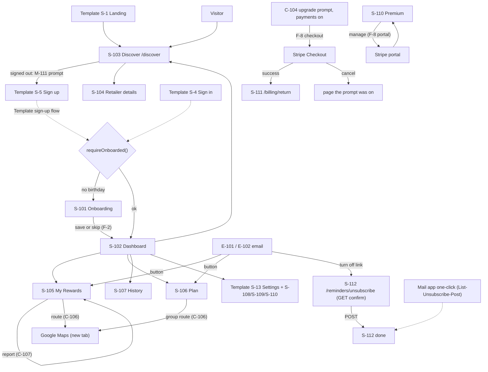

# The Birthday Run: Spec

Last updated: 2026-10-06 · Mode: app (built from the Template) · Status: §1 approved 2026-10-06 · §2 approved 2026-10-06 · §3 merged 2026-10-06

## 1. Brief
**In one sentence:** a web app that lists every free birthday reward from the loyalty programs you belong to, counts down how long each one lasts, and plans the route to pick them all up.

**Research verdict:** skipped. This is a rebuild of a working app (old repo: `The-Birthday-Run-Legacy`, archived), not a new idea. The old app's code is the source for every feature.

**Problem / goal:** the old app (Vite + Express + Prisma + Clerk) has known security holes (old tickets #150–#165) and a dead backend. Fixing it in place was estimated at 40–70 h, versus 32–50 h to rebuild on the Template, which already has the guards, RLS, backups and checks (#171). The goal is the same features, rebuilt securely, plus a complete premium tier (v2) that's built and tested but switched off until there are enough users to sell it.

**Users:**
| User | Needs to do | Account? |
| --- | --- | --- |
| Owner (the user) | Everything a premium user does; grant and revoke premium by script; edit the retailer list | Yes, premium by grant |
| Sisters | Premium features, for free | Yes, premium by grant |
| Anyone else | Sign up, pick programs, see rewards and countdowns, plan within the free limits, mark rewards redeemed | Yes, free (v1 features only) |
| Visitor (signed out) | Browse the retailer list | No |
| Paying user (v2, when switched on) | Pay through Stripe; premium unlocks automatically, and is removed if they cancel or payment fails | Yes |

**Versions:**
- **v1:** every old feature except those listed below as premium, available to everyone. Old features cut: reward proof-photo links (`proofUrl`), the unused redemption sources (`AUTO_CHECKIN`, `ADMIN`), and the dev API cost monitor (`apiMonitor`, `placesDebug`).
- **v2 premium:** the map and route, the Discover state filter, the higher plan limits, duplicating groups, real Smart Grouping (stores grouped by distance; the old one grouped by first letter), and birthday reminder emails. Premium comes from one of two sources, **granted** (by the owner's script) or **paid** (Stripe), and the app treats both the same way. Stripe is fully built and tested in test mode but switched off. Grants work from day one.

**Constraints:**
- **Budget: $0.** Free tiers only. No Google Maps: its terms forbid storing Places data, so every lookup is billed, and strangers could run up the bill. Instead: OpenFreeMap + MapLibre for the map, store locations imported from All The Places (CC0; Overture Places as backup), and an "Open in Google Maps" link for directions (no API key). Sources: RESEARCH.md.
- **Stack:** whatever the Template does (Supabase Auth, Supabase's typed client, no Prisma, no Clerk). The new repo is created from the Template on GitHub. The old repo is archived for reference.
- **Privacy:** store only the email, a display name, the birthday **month and day** (no year), the user's time zone (so "today" and reminder emails match their device), the user's own programs, plans, pickups, reminder setting and reward reports, and premium records (grants; for paid users, the Stripe customer ID and subscription status, never card details). Full list: DESIGN §3.
- **Legal/money:** Vercel Hobby is non-commercial only. Turning payments on means moving to Vercel Pro first (an owner decision when there are enough users).
- **Supabase:** both free project slots are in use (WishJar and thebirthdayrun). The restored `thebirthdayrun` project gets wiped and reused, so there's no slot for a staging project.

**Look and feel:** plain for now, built from the Template's components (shadcn/ui), with no old "childish" styling carried over. A modern redesign comes at the end of the project, page by page with the owner, from visuals they make.

**Time:** about 6 hrs/day, every day (≈42 hrs/week) from 2026-10-06. WishJar gets another equal 6 hrs/day, and the two run in parallel. No deadline: complete and secure over fast. Grace (Hermes) can build safe tickets overnight.

**Money:** none in v1 or while v2 is switched off. Later: a premium subscription through Stripe, turned on with Vercel Pro once the owner decides there are enough users.

**Data carried over:** only the 190 retailers, from the verified Neon backup (#163). They live in a CSV in the repo, loaded by an import script. Edits go through PRs. Users sign up again and re-create their plans.

**Done when:** success metrics 1–5 in §2.1 (the five points the owner set on 2026-10-06).

**Known risks:**
- **Store data coverage is unknown.** It isn't known how many of the 190 brands All The Places covers. Brands without store data still show, marked "no map pin" with a link to the brand's store finder. The first task is a coverage check.
- **Phone links hold few stops.** Google Maps links allow 3 waypoints plus the destination on a phone browser and 9 waypoints on desktop (RESEARCH.md), so longer runs are split into legs.
- **Shared free quotas.** WishJar and this app share one Resend account (owner's own; each app gets its own sending domain) and its free email quota, and every private repo shares GitHub's Actions minutes and artifact storage (limits: Template DESIGN §5.3). Accounts stay in the owner's name: no second accounts to get around free limits.
- **Pausing.** Supabase pauses a free project after a week with no activity, and a small app goes quiet between birthdays.
- **OpenFreeMap is donation-funded** with no service guarantee. MapLibre can switch tile hosts if needed.

**Open questions:**
- [ ] Premium price (v2): set when payments are switched on, not needed to build.

## 2. Requirements

Only what the app **adds** to the Template; Template features are referenced as "Template FR-n". Behaviour follows the old app's code (`The-Birthday-Run-Legacy`) unless a row says **(changed)**. Assumptions: **A-n**. Open points still with the owner: **Q-D**.

**Tags:** **[v1]** everyone · **[v2-premium]** premium only (granted or paid) · **[v2-payments]** Stripe-only parts, built and tested, off by a flag.

**Terms:** **Day 0** is the birthday (negative days are before it). A reward's **timing** (FR-1, FR-11) says which days it can be used. The user's **window** runs from the earliest day any of their enrolled rewards opens to the last day any closes, and never ends before day 30. A **cycle** runs from one window's start to the next. A **reward** is an enrolled retailer's birthday reward. **Premium** is the entitlement in FR-35.

### 2.1 Success metrics
Metrics 1–5 are §1's "done when" (all required). Metric 6 is reported, not a gate.

| # | Metric | Target | By | How measured |
| --- | --- | --- | --- | --- |
| 1 | **Every kept feature works for the owner and sisters** on thebirthdayrun.com. | 100% of v1 and v2-premium FRs | Final sign-off | Manual: the owner ticks a checklist with one line per FR (pass/fail, date) on production; each sister signs in and confirms premium shows. Automated: the app's e2e journey (onboarding → enroll → My Rewards → pickup → plan) passes once with `E2E_TARGET=deployed`. |
| 2 | **A stranger's account sees v1 features only.** | 0 premium features reachable | Final sign-off | Automated, in CI on every push: an e2e test signs up a fresh account and finds no premium control (map, state filter, Smart Grouping, duplicate, route links, reminder setting); an integration test calls every premium server action/route as that user and gets "not allowed" each time, and hits the free limits of FR-24/FR-25. |
| 3 | **Stripe test mode: a test payment turns premium on, cancelling turns it off.** | Both pass | v2 build complete | Automated integration test with signed Stripe test-mode events (or Stripe CLI / test clock): checkout completed → FR-35 true with no manual step; cancel → false; failed renewal → false. Runs in CI when test keys are present; skipped (reported, never faked) otherwise. |
| 4 | **Grant and revoke by script work.** | Both pass | v1 sign-off | Automated: integration test on local Supabase runs grant → FR-35 true, revoke → false (FR-36). Manual: owner runs it on production for their own account and both sisters'; noted in the sign-off. |
| 5 | **All the Template's security checks pass.** | Template metrics 3 and 4, covering the app's tables too | Every push; final sign-off | Template SPEC §2.1 metrics 3 (RLS test per user-data table, catalog check) and 4 (`npm audit`, gitleaks, header grade), plus NFR-2's tests. CI history. |
| 6 | **Store-data coverage** of the retailer list (§1 risk). | Measured (no target) | Before map work | FR-43's report: brands with ≥1 US store vs. missing, saved in RESEARCH.md. |

### 2.2 Functional
All priorities are **must**.

#### Retailers and Discover
| ID | Requirement | Acceptance | Priority |
| --- | --- | --- | --- |
| FR-1 | **[v1]** Retailers come from a CSV in the repo, loaded by an import script (no admin UI). Each has: a stable ID, unique name, category, description, reward description, timing (FR-11), last-checked date (FR-47), reward type (free item, discount, BOGO, points, free with purchase), purchase required (yes/no), purchase, membership and other requirements, logo, website, store-finder link, available states ("all" or state codes), and a "popular" mark (shown to signed-out visitors, FR-2). | Import on an empty database loads every row (190 at launch); re-running changes nothing; an edited row updates its retailer (matched by its stable ID column). A bad row (missing required field, unknown type, bad state code, timing that doesn't fit FR-11's types or a length outside 1–31 days, **A-1**) is rejected with its row number and nothing is half-imported. | must |
| FR-2 | **[v1]** Signed out, Discover shows only the **popular** retailers (marked in the CSV, FR-1); at the end of that list a sign-up prompt says how many more rewards there are. Signed in, Discover shows every retailer. | Each card shows name, logo (initials if missing or broken), category and reward. Signed out: no other retailer is in the page or reachable by URL or API (checked by test); the prompt shows the real count of the rest. (Changed: old showed a fixed set of 15 logos.) | must |
| FR-3 | **[v1]** Signed in, Discover can be filtered by category (all, food and drink, entertainment, retail, beauty) and searched by name. | Filters combine; clearing restores the list; no match → empty state. | must |
| FR-45 | **[v2-premium]** Discover can be filtered by how long a reward lasts, in exclusive buckets: birthday only (1 day), up to a week (2–7 days), longer (8+ days or the whole birth month); plus a separate "starts before the birthday" toggle (timing per FR-11). | Combines with FR-3 and FR-5. Free users see FR-39 in its place; the server ignores the filter for them. | must |
| FR-4 | **[v1]** A user can open a retailer's details. | Shows reward description; timing label from FR-11 (e.g. "birthday only", "7 days from your birthday", "all birth month", "starts 7 days before"); reward type with a one-line explanation; requirements when present; website link; add/remove when signed in (FR-8). | must |
| FR-5 | **[v2-premium]** Discover can be filtered to the user's state. | State comes from FR-30. Shows retailers marked "all", that state, or no state data, plus how many are hidden; "show all" clears it. Free users see FR-39 instead. (Changed: never auto-detects location on page load.) | must |

#### Profile and onboarding
| ID | Requirement | Acceptance | Priority |
| --- | --- | --- | --- |
| FR-6 | **[v1]** Before using signed-in pages, a new user gives their birthday as month and day. | A user with no birthday is sent to onboarding from every signed-in page except settings. Only real dates are accepted, Feb 29 included. | must |
| FR-7 | **[v1]** Onboarding then lets the user pick their programs (search, category filter) or skip. | One save enrolls the selection (FR-8); skip enrolls none. Either way onboarding is done, the user lands on the dashboard (FR-21) and isn't sent back. | must |
| FR-8 | **[v1]** A user can enroll in and unenroll from retailers at any time. | Change shows at once on Discover, My Rewards and Plan; enrolling twice has no effect. Unenrolling removes the retailer from the user's groups; its pickups stay in History. | must |
| FR-9 | **[v1]** A user can change their birthday in settings (other settings: Template FR-12 onward). | Window, countdowns and lists follow the new date on next load. Groups are kept; any whose pickup now falls outside the window are flagged until edited (FR-27). | must |

#### Birthday window and countdowns
| ID | Requirement | Acceptance | Priority |
| --- | --- | --- | --- |
| FR-10 | **[v1]** The app works out today's day number and whether it's in the window. | Unit tests: day 0; day 30 (in); day 31 (out, unless a reward is still open, otherwise planning next cycle); the day before the birthday (in only if a reward opens early); a window crossing New Year (birthday Dec 20, today Jan 5 → day 16, in; the old client got this wrong); Feb 29 in a non-leap year (day 0 is **Feb 28**; changed: old used Mar 1). "Today" is the date in the user's time zone, stored on the profile (detected at onboarding, editable in settings), so the server and reminder emails agree with the user's device. | must |
| FR-11 | **[v1]** Each reward has a status: available, expired or picked up. | Each retailer has one of three timing types: **from the birthday for N days** (1 = the birthday only, 7 = days 0–6; changed: old counted one day extra), **the whole birth month** (the 1st to the last day of the calendar month; Feb 29 birthdays use February), or **N days before to M days after** the birthday. Available inside its days, expired after, not yet open before. Unit tests per type, including a birth-month reward for a birthday on the 25th (ends on the 31st, not 30 days later; the old data got this wrong). Picked up = a pickup exists in the current cycle (FR-17). Outside the window nothing is expired. | must |
| FR-12 | **[v1]** In the window, My Rewards lists every available reward with its days left. | Expired and picked-up rewards are hidden. Each shows logo, reward description, timing label (FR-4) and days left, with the last day shown as such (changed: old showed blank). Urgency: under 4 days red, 4–10 yellow, over 10 green (NFR-6). | must |
| FR-13 | **[v1]** My Rewards can be searched by name and filtered to rewards expiring within 1, 7 or 14 days. | Filters combine; shows matches out of total; long lists load in pages. | must |
| FR-14 | **[v1]** My Rewards has a birthday header: days until the next birthday and one of four states (birthday today, birth month, later window day with rewards open, otherwise). | Each state has its own message (SPEC §3) and uses the display name when set. | must |
| FR-15 | **[v1]** Outside the window, My Rewards shows a "rewards open soon" message with the date the first one opens, with links to Discover and Plan instead of the list. | No reward list shows outside the window. | must |
| FR-16 | **[v1]** With no enrollments, My Rewards shows an empty state pointing to Discover and Plan. | In or out of the window. | must |

#### Pickups and history
| ID | Requirement | Acceptance | Priority |
| --- | --- | --- | --- |
| FR-17 | **[v1]** A user can mark an available reward picked up, with an optional note and location label. | Saved with today's date; the reward leaves My Rewards and Plan. One pickup per retailer per cycle; a second is refused (changed: old only refused the same day). The date defaults to today and can be set to an earlier day of the current window, never the future. Note and label: plain text, max 500 characters each (old limit). Expired or unenrolled rewards are refused. | must |
| FR-18 | **[v1]** A pickup can be undone right after marking it. | For 60 seconds (old value) the card offers undo, which deletes the pickup. | must |
| FR-19 | **[v1]** History lists all pickups by cycle ("<year> Birthday Run"), newest first. | A pickup belongs to the cycle (Terms) it falls in (Jan 5 with a Dec 20 birthday → the cycle that began before Dec 20). The upcoming cycle shows even if empty. Entries show retailer, date, note, label, including unenrolled retailers (changed: old hid them). None ever → empty state. | must |
| FR-20 | **[v1]** A user can delete a pickup, and edit its note and label. | Delete asks first; a current-cycle reward becomes available again if not expired. | must |

#### Dashboard
| ID | Requirement | Acceptance | Priority |
| --- | --- | --- | --- |
| FR-21 | **[v1]** The dashboard (replaces Template FR-19's placeholder) greets the user, links to Discover, My Rewards, Plan and History, and shows pickups this cycle and the last pickup date. | Count matches History's current cycle (changed: old used the calendar year). | must |

#### Plan
| ID | Requirement | Acceptance | Priority |
| --- | --- | --- | --- |
| FR-22 | **[v1]** Plan lists plannable rewards: in the window, enrolled ones neither expired nor picked up; outside it, all enrolled ones (next cycle). | Each shows days left (in window) and which groups it's in; search and a "hide grouped" filter work; picked-up rewards can't be selected. None → empty state. | must |
| FR-23 | **[v1]** A user can create a named group with a pickup date and time and add selected rewards, or add them to an existing group. | Name required, unique per user ignoring case. Pickup not in the past and inside the window being planned: in the window, now to its end; outside, the next window (changed: old picker skipped the current window). Rewards expiring before the pickup trigger a warning; saving is still allowed. | must |
| FR-24 | **[v1]** A free user can have at most **3 groups**; premium has no group limit. | At the limit, creating another is refused by the server and the UI shows FR-39. | must |
| FR-25 | **[v1]** A group holds at most **5 rewards** (free) or **10** (premium). | An add that would exceed the limit is refused whole, with the limit named. | must |
| FR-26 | **[v1]** A reward can be in several of the user's groups (e.g. plan A and plan B), at most once per group; only enrolled rewards can be added. | Adding a reward twice to the same group is refused. Marking it picked up (FR-17) removes it from every group. | must |
| FR-27 | **[v1]** A user can rename a group, change its pickup date/time, remove or reorder its rewards, and delete it. | Edits follow FR-23 (changed: old could edit only the time and reset the date). Reorder by drag and by keyboard; order survives reload. Delete asks first; its rewards become plannable. | must |
| FR-28 | **[v2-premium]** A group can be duplicated. | Copy is named "<name> (Copy)", made unique, same pickup, same rewards in the same order (allowed by FR-26). The copy counts toward FR-24's limit. Free users: no control, server refuses. | must |
| FR-29 | **[v2-premium]** Smart Grouping suggests groups by real distance between stores (changed: old grouped by first letter). | Uses plannable, ungrouped rewards with store data (FR-31); old thresholds kept: offered at ≥4 such rewards, groups of ≥2 up to the FR-25 limit, at most 4 groups. Suggestions are groupings only; applying asks for each group's pickup date and time (FR-23), defaulting to tomorrow at 10:00 inside the window being planned (changed: old set fixed 9/12/15/18 h that could fall outside it). User applies all or cancels; applying follows FR-23/FR-26. Rewards without store data are listed as left out. | must |

#### Location, map and route
| ID | Requirement | Acceptance | Priority |
| --- | --- | --- | --- |
| FR-30 | **[v2-premium]** The user sets a start location by browser location (after pressing a button) or a US ZIP code. | Denied or timed-out location → plain message and the ZIP option (changed: old silently used New York). Unknown ZIP → field error. FR-5's state comes from this. Storage: NFR-3. | must |
| FR-31 | **[v2-premium]** For each reward on the map, the app picks one store of that brand near the start, preferring stops close together. | Stores come from FR-43, within 20 miles (old radius, **A-4**). No store data or none in range → listed as "no map pin" with a link to the brand's store finder (website if none). | must |
| FR-32 | **[v2-premium]** My Rewards shows a map of the chosen rewards' stores and the start, a text list of the same stops in order, and "Open in Google Maps". | The user picks which available rewards to map (changed: no cap of 3, which only existed for Google's limits; defaults to the 10 most urgent). The list gives store name, address and straight-line distance from the previous stop, labelled as such. The map credits OpenStreetMap. Free users see FR-39. | must |
| FR-33 | **[v2-premium]** A group with ≥2 rewards shows its route like FR-32, in the group's order. | Order follows FR-27. | must |
| FR-34 | **[v2-premium]** Google Maps links respect §1's stop limits (Known risks), splitting longer routes into legs. | Each leg is its own numbered link starting at the previous leg's last stop; the phone or desktop limit is chosen by device. Unit tests: at the limit and one over. No Google API key. | must |

#### Premium entitlement
| ID | Requirement | Acceptance | Priority |
| --- | --- | --- | --- |
| FR-35 | **[v1]** A user is premium while they have an active grant **or** an active paid subscription; otherwise free. | Every premium check, server and UI, uses this one answer. Ending one source while the other is active keeps premium. New accounts are free. | must |
| FR-36 | **[v1]** The owner grants and revokes premium by email with a CLI script (`npm run grant-premium <email>` / revoke). | Grant → premium on the user's next request; revoke → off. Unknown email: error, no change. Repeat runs are harmless. Revoke doesn't touch a subscription. Needs server credentials; not callable from the app. | must |
| FR-37 | **[v2-payments]** With payments on, a free user subscribes through Stripe Checkout and manages or cancels through Stripe's customer portal. | Payment success → premium on automatically. Cancel or period end → off automatically; a failed renewal keeps premium while Stripe retries the card and ends it when Stripe gives up (cancelling keeps premium until the paid period ends, Stripe's default). Deleting an account with a subscription cancels it at Stripe first (extends Template FR for account deletion). Price: §1 open question. | must |
| FR-38 | **[v2-payments]** A flag keeps payments off until the owner turns them on. | Flag off: the server refuses to create checkout or portal sessions, even if called directly, and no checkout control shows. Grants work either way. | must |
| FR-39 | **[v1]** Free users see an upgrade prompt where a premium feature would be. | Payments off: "coming soon", no way to pay and no "ask the owner" (wording SPEC §3). Payments on: starts FR-37. Never shown to premium users. | must |
| FR-40 | **[v1]** When premium ends, nothing is deleted. | Groups and items over FR-24/FR-25 stay and can be edited or deleted, but nothing can be added until under the limit (**A-6**). Premium views switch to FR-39. | must |

#### Reminder emails
| ID | Requirement | Acceptance | Priority |
| --- | --- | --- | --- |
| FR-41 | **[v2-premium]** Premium users get birthday reminder emails about their window and expiring rewards. | Two kinds: one email **7 days before the birthday** ("plan your run"), and an **expiring** email when a reward has 3 days or fewer left, at most one every 3 days (**A-9**). Each lists only the user's enrolled, not-picked-up rewards, uses the Template email pipeline (Template FR-28/FR-29), and is sent at most once per reminder per cycle. Free users get none. | must |
| FR-42 | **[v2-premium]** Reminders can be turned off and on in settings, and every reminder has a one-click turn-off. | Once off, none are sent; the setting persists. (First non-transactional emails, so the Template's "no unsubscribe" scope no longer covers them.) | must |

#### Store data and imports
| ID | Requirement | Acceptance | Priority |
| --- | --- | --- | --- |
| FR-43 | **[v2-premium]** A script imports US store locations (name, address, coordinates) for the listed brands from All The Places **and** Overture Places (ATP covers ≈60% of brands: RESEARCH.md) and reports coverage. | Prints matched vs. missing brands (metric 6). Re-running replaces a brand's stores without duplicates; a source returning 0 stores for a brand keeps that brand's last good stores. No user data is sent to the source. | must |
| FR-46 | **[v1]** Before launch, every retailer's timing type, reward and requirements are checked against the brand's own site and its last-checked date set. | The import (FR-1) rejects a retailer with no timing type or no last-checked date. A source link per retailer is kept in the CSV. | must |
| FR-47 | **[v1]** Stale reward data is flagged automatically. | A monthly job lists retailers not re-checked in 6 months (**A-10**) and opens one GitHub issue for the owner with that list. Nothing changes in the app until the owner merges a CSV fix. | must |
| FR-48 | **[v1]** A signed-in user can report a reward as wrong (expired, different reward, wrong timing, store closed) by picking a reason (no free text, so nothing personal or planted reaches the automatic check). | One report per user per retailer per cycle; rate limited (Template rule 13). Reports are stored for the owner and trigger an automatic check of that brand's site (NFR-11), which opens a GitHub issue or a CSV-fix PR for the owner to review. The user sees "thanks, we'll check it". | must |
| FR-44 | **[v1]** Removing a retailer from the CSV retires it instead of deleting it; renaming keeps its identity. | A retired retailer disappears from Discover, My Rewards and Plan (its group items are removed), but its pickups stay in History (changed: the old database deleted them). Renames are matched by a stable ID column in the CSV, not by name. | must |

### 2.3 Non-functional
| ID | Requirement | Measure |
| --- | --- | --- |
| NFR-1 | Follows the Template's security rules (Template `CLAUDE.md`) for every table and server entry point the app adds, including export/delete coverage of app data. | Metric 5; Template FR-15/FR-16 tests cover every app user-data table. |
| NFR-2 | Premium is enforced on the server, not only hidden in the UI. Only the grant script (FR-36) and verified Stripe events (NFR-8) can change an entitlement. | Metric 2's tests; an RLS test shows a user can read but not write their own entitlement. |
| NFR-3 | Privacy (§1): no birth year anywhere. Location and ZIP are kept only in the user's browser; the server receives a rounded start point or ZIP only inside the request that needs it and never stores or logs it. Location is requested only on a user action. | Schema review: no year or location column. E2E: opening Discover or My Rewards triggers no location prompt. |
| NFR-4 | $0 running cost (§1): no Google Maps APIs or key; no paid map, geocoding or routing service; Stripe in test mode until the owner's go-ahead. | Code search finds no Google Maps JS/Places/Directions use; README stack table lists free tiers only (Template NFR-21). |
| NFR-5 | One shared implementation of FR-10/FR-11 is used by every page, server action and email (the old client and server disagreed). | Code review; FR-10's tests run against that module. |
| NFR-6 | Accessibility beyond Template NFR-23: urgency isn't shown by colour alone; the map always has its text list; reorder works by keyboard. | Automated a11y check: 0 serious/critical on Discover, My Rewards, Plan, History; keyboard-only run of reorder and pickup. |
| NFR-7 | If map tiles or store data are down, the stop list and Google Maps links still work and the rest of the page is unaffected. | E2E with tile requests blocked. |
| NFR-8 | Stripe webhooks need a valid signature, are safe to receive twice or out of order, and the browser's success redirect never grants premium by itself. | Integration tests: bad signature rejected; duplicate event → one change; a stale "active" after "canceled" doesn't restore premium. |
| NFR-9 | Reminder emails fit the free email quota shared with WishJar (§1, Template NFR-22). | Expected reminders per day, per FR-41: about 1 + up to 10 a year per premium user (A-9), fit Resend Free's daily limit with room for both apps. |
| NFR-11 | Reports (FR-48) are untrusted input to the automatic check: they carry only a fixed reason, and anything the checker reads on brand sites is treated as data, never as instructions; the check can only open an issue or PR, never change the database or merge; and nothing reaches users until the owner merges. | Test: the report endpoint rejects anything but a known reason; the issue text comes from a fixed template; the checker's only outputs are issue comments and PRs. |
| NFR-10 | The free Supabase project doesn't pause between birthdays (§1 risk), by a method allowed under Supabase's terms (chosen in DESIGN §5). | No pause in a 30-day check after launch. |

### 2.4 Out of scope
From §1:
- Cut old features: proof-photo links, auto-check-in and admin pickup sources, the API cost monitor and Places debug tools.
- Google Maps Platform; in-app turn-by-turn directions or travel times (directions are the Google Maps link).
- A retailer admin UI, or any admin panel.
- Moving old users, plans or pickups (only the retailers carry over).
- Birth year or anything age-based.
- Turning payments on, pricing, Vercel Pro (owner decides later).
- The redesign: a final-phase placeholder only.
- Everything in Template SPEC §2.4.

Found in the old code:
- Stripe free trials (old code counted "trialing" as premium but never set one up).
- Locking the map view to the user's state (old app did, via Google).
- Users outside the US: states, ZIPs and store data are US-only (**A-8**).
- Push or SMS reminders.
- **Later, not in this plan's build:** public pages for the popular brands (what you get, timing, how to claim; ends in the sign-up prompt) to be found by search, and a launch write-up shared on Reddit and similar places by the owner, posted openly as the owner's project and within each community's self-promotion rules. Listed in ROADMAP's "after launch".

### Assumptions
Each is a value or rule carried over or guessed; the value itself lives in the row that cites it.
- **A-1:** the timing lengths FR-1 accepts cover every real reward found by FR-46.
- **A-4:** the old app's store search radius (FR-31) still suits suburban users.
- **A-6:** keeping over-limit data editable but not growable (FR-40) is fair to users whose premium ends.
- **A-8:** users are in the US: states, ZIPs and store data are US-only.
- **A-9:** the expiring-email threshold and spacing in FR-41 are frequent enough to help and rare enough not to annoy.
- **A-10:** the re-check interval in FR-47 catches program changes before many users hit them.

### 2.5 Traceability
Each requirement → where it's shown (SPEC §3), decided (DESIGN) and built (BUILD). "n/a" rows have no screen by design.

| ID | Screens | DESIGN | BUILD |
| --- | --- | --- | --- |
| FR-1 | n/a (no UI) | D2, D3 | F-1 |
| FR-2 | S-103 | D2, D3, D4 | F-1, F-3 |
| FR-3 | S-103 | D3, D4 | F-3 |
| FR-4 | S-104 | D3, D4 | F-3 |
| FR-5 | S-103 | D3, D4 | F-3 |
| FR-6 | S-101 | D4 | F-2 |
| FR-7 | S-101 | D4 | F-2 |
| FR-8 | S-104 | D3, D4 | F-3 |
| FR-9 | S-108 | D4 | F-2 |
| FR-10 | S-101, S-108 | D4 | F-2 |
| FR-11 | n/a (no UI) | D4 | F-2 |
| FR-12 | C-103, S-105 | D4 | F-4 |
| FR-13 | S-105 | D4 | F-4 |
| FR-14 | S-105 | D4 | F-4 |
| FR-15 | S-105 | D4 | F-4 |
| FR-16 | S-105 | D4 | F-4 |
| FR-17 | C-109, S-105 | D4, D7 | F-5 |
| FR-18 | S-105 | D4, D7 | F-5 |
| FR-19 | S-107 | D4, D7 | F-5 |
| FR-20 | C-108, S-107 | D4, D7 | F-5 |
| FR-21 | S-102 | D4 | F-4 |
| FR-22 | S-106 | D6, D13 | F-6 |
| FR-23 | S-106 | D6, D13 | F-6 |
| FR-24 | S-106 | D6, D13 | F-6 |
| FR-25 | S-106 | D6, D13 | F-6 |
| FR-26 | S-106 | D6, D13 | F-6 |
| FR-27 | C-108, S-106 | D6, D13 | F-6 |
| FR-28 | S-106 | D6, D13 | F-6 |
| FR-29 | S-106 | D12 | F-11 |
| FR-30 | C-105 | D10, D11, D12 | F-10 |
| FR-31 | C-106 | D10, D11, D12 | F-10 |
| FR-32 | C-106, S-105 | D10, D11, D12 | F-10 |
| FR-33 | C-106, S-106 | D10, D11, D12 | F-10 |
| FR-34 | C-106 | D10, D11, D12 | F-10 |
| FR-35 | S-110 | D5 | F-7 |
| FR-36 | n/a (no UI) | D5 | F-7 |
| FR-37 | S-110, S-111 | D5, D8, D17 | F-8 |
| FR-38 | n/a (no UI) | D5, D8, D17 | F-8 |
| FR-39 | C-104 | D5 | F-7 |
| FR-40 | S-106 | D5, D6, D13 | F-6, F-7 |
| FR-41 | S-109 | D14, D15 | F-12 |
| FR-42 | S-109, S-112 | D14, D15 | F-12 |
| FR-43 | n/a (no UI) | D9, D10, D11 | F-9 |
| FR-44 | n/a (no UI) | D2, D3 | F-1 |
| FR-45 | S-103 | D3, D4 | F-3 |
| FR-46 | n/a (no UI) | D2, D3 | F-1, F-14 |
| FR-47 | n/a (no UI) | D14, D16 | F-13 |
| FR-48 | C-107, S-104, S-105 | D14, D16 | F-13 |
| NFR-1 | – | §4.1 | all (Template checklist) |
| NFR-2 | – | D5, §4.2 | F-7 |
| NFR-3 | – | D10, §4.3 | F-10 |
| NFR-4 | – | D9, D11, §5.1 | F-9, F-10, CI |
| NFR-5 | – | D4 | F-2 |
| NFR-6 | C-103, C-106, S-106 (§3.7) | D13 | F-4, F-6, F-10 |
| NFR-7 | – | D11 | F-10 |
| NFR-8 | – | D8 | F-8 |
| NFR-9 | – | D15, §5.1 | F-12 |
| NFR-10 | – | §5.2 | n/a (operations: DESIGN §5.2) |
| NFR-11 | – | D16, §4.2 | F-13 |


## 3. Screens

Only what the app adds to or changes in Template SPEC §3; Template screens, components and messages are cited as "Template S-n / C-n / M-n / API-n / E-n" and keep their behaviour. App IDs start at 101. Operations are named by feature (F-n, BUILD); access levels, redirects and guards: BUILD §0.2. Texts live only in §3.4. Most important screens: S-105 My Rewards (the reason to sign up), S-106 Plan, S-103 Discover (the first thing a visitor sees).

### 3.1 Flow map


### 3.2 Shared components

**C-101 App navigation** (all pages; extends Template C-1)
- Signed in: links Dashboard · Discover · My Rewards · Plan · History in a row under the header that wraps on narrow screens (no horizontal scroll); current page `aria-current="page"`. Settings stays in the Template account menu.
- Signed out: "Discover" next to Template C-1's Sign in / Sign up.
- Hidden on S-101 (onboarding has one job) and on Template S-9–S-11.
- Labels: M-101.

**C-102 Retailer card** (S-101, S-103)
- Logo (`alt` = retailer name) or, if missing or it fails to load, the name's initials on `--muted`; name (h3); category label (M-170); reward description; reward-type label (M-180).
- Whole card links to S-104 (signed out: popular ones only, FR-2).
- Signed in: toggle button M-103/M-104 (`aria-pressed`), F-3 `enroll`/`unenroll`; optimistic, reverts with the error inline on the card (M-5, M-7, BR-3).

**C-103 Days-left badge** (S-105, S-106, E-102; FR-12, NFR-6)
- Text first: M-120 (last day), M-121 (one day), M-122 (`{days}` days). Then an urgency word and icon, so colour is never the only cue: red + `alert-circle` + M-123; yellow + `clock` + M-124; green + `circle-check` + M-125. Bands: FR-12.
- Icon `aria-hidden`; the badge's accessible name is the two texts, e.g. "3 days left, ends soon".

**C-104 Upgrade prompt** (FR-39; every premium spot)
- A bordered inline card (never a modal) in the place the feature would be. Never rendered for premium users, and the server sends no premium data alongside it (BUILD §0.2).
- Heading M-130 with the spot's feature name (M-131…M-138). Body depends on the payments flag (F-7, F-8):
  - **Payments off:** M-139 ("coming soon"). No button, no link, no contact line.
  - **Payments on:** M-140, button M-141 → F-8 checkout ("Opening checkout…" M-142) → Stripe Checkout. Errors inline: BR-15, BR-16 (with M-143 → Stripe portal), M-5, M-7.
- Compact form (one line + button/text) for spots inside a dialog or list (Smart Grouping, item limit).

**C-105 Start location** (FR-30, NFR-3; premium only, inside C-106 and S-103's state filter)
- Button M-150 (asks the browser only when pressed) · divider "or" · field "ZIP code" (`inputmode="numeric"`, `autocomplete="postal-code"`) + M-151. Helper M-152.
- Pending: M-153. Denied or timed out: M-154 with the ZIP field focused. Unknown ZIP: BR-12 (field). Rate limited: M-5.
- Set: M-155 (`{place}` = the ZIP, or M-156 for browser location) with "Change" (M-157). Forgotten on reload (D10).

**C-106 Route view** (FR-31–FR-34, NFR-7; S-105, S-106)
- Needs C-105 first; until set, only C-105 shows.
- Order on the page: (1) map, (2) stop list, (3) "no map pin" list, (4) Google Maps links. (2)–(4) render on the server and work without the map.
- **Map:** loaded only for premium users after the stop list; numbered pins match the list numbers; start marked M-160; OpenStreetMap credit from the map config (D11). Wrapper `role="img"` with `aria-label` M-161; the list is the accessible version. Tiles fail: the map area shows M-162; everything else stays.
- **Stop list** (`<ol>`): number, retailer, store name, address, M-163 (distance from the previous stop, or from the start for stop 1).
- **No map pin** (heading M-164): retailer + M-165, linking to the store finder (website if none; new tab, `rel="noopener noreferrer"`). BR-13: every stop appears here, with BR-13's message above.
- **Google Maps links:** one link M-167 when the route fits the device's limit; otherwise one numbered link per leg, M-168 (FR-34). Open in a new tab.
- Loading: M-169 with list skeleton. Errors: M-5, M-7, BR-2.

**C-107 Report dialog** (FR-48, NFR-11)
- Trigger: M-190 (ghost button). Dialog title M-191 with retailer name; text M-192; required radio group of the four reasons (M-193–M-196); **no text field**; buttons "Send report" (M-197, pending "Sending…") and "Cancel".
- Success: dialog closes, toast BR-20; the trigger becomes disabled text M-198 for this cycle. Errors inside the dialog: BR-14, BR-3, M-5, M-7; nothing chosen: M-199.

**C-108 Confirm dialog** (FR-20, FR-27)
- shadcn `AlertDialog`: title and text per use (M-185/M-186, M-187/M-188), destructive confirm, "Cancel" focused first. Escape cancels.

**C-109 Pickup dialog** (FR-17)
- Title M-112 with retailer name. Fields: "Date" (date input, defaults to today, `min` = window start, `max` = today; FR-17), "Note (optional)", "Where (optional)" (M-113 helper), both plain text; limits: FR-17 (counter shows `{left}` M-114 near the limit). Button M-115 (pending "Saving…").
- Success: closes; the card collapses to a row M-116 with button "Undo" for FR-18's period, then leaves the list. Undo → toast BR-21. Errors in the dialog: BR-8 (date field), BR-9, BR-10, M-5, M-7; field errors M-117.

### 3.3 Screens
"Not allowed" for every app page: BUILD §0.2's level (signed out → Template S-4 with `next`; not onboarded → S-101). Loading on `(app)` pages: Template C-3 skeleton; `/discover` gets the same skeleton.

#### Template S-1 Landing (changed body) · FR-2
- Hero h1 `appConfig.name`, `appConfig.description`; primary "Get started" → Template S-5; secondary M-102 → S-103. Signed in: Template behaviour. No feature grid.

#### S-101 Onboarding (`/onboarding`) · FR-6, FR-7, FR-10
- **Who:** signed in, no birthday (onboarded users go to S-102).
- **Shows:** M-118 step label; h1 M-105.
  1. **Birthday:** text M-106; "Month" select and "Day" select (days follow the month; Feb 29 listed); no year field. Detected time zone shown as M-107 (changed in S-108); if detection fails, S-108's time-zone picker shows inline here and is required. Button "Continue" (M-108).
  2. **Programs:** h1 M-109; search "Search programs"; category tabs (M-170); list of C-102 as checkboxes (not toggles; saved together). Primary M-110 (`{count}` selected) or, with none selected, M-111b; secondary "Skip for now" (M-111c).
- **Main action:** F-2 `saveOnboarding` ("Saving…") → S-102.
- **States:** loading: skeleton list · empty search: M-171 · error: BR-18 (date), BR-19, M-5, M-7 above the button; going back keeps the birthday.

#### S-102 Dashboard (`/dashboard`, replaces Template S-12's body) · FR-21
- **Shows:** h1 as Template S-12 ("Welcome, {display_name}" / "Welcome"); stats card: M-126 (`{count}` pickups this cycle) and M-127 (`{date}` last pickup) or M-128 if none; four link cards (Discover, My Rewards, Plan, History) with one line each (M-129a–d). Template "Add your name in Settings" link kept.
- **States:** no pickups: M-128 · loading: C-3 · error: Template S-20.

#### S-103 Discover (`/discover`) · FR-2, FR-3, FR-5, FR-45
- **Who:** anyone. Data by role (D3).
- **Signed out shows:** h1 M-171a; text M-171b; popular C-102 cards (no toggle, no filters); at the end, card M-111 (`{count}` = the real number of other rewards) with "Sign up free" → Template S-5 (`next=/discover`) and "Sign in".
- **Signed in shows:** h1 M-171a; search "Search by name"; category tabs (M-170); premium filters row: state filter (FR-5: needs C-105; on → M-172 with `{state}`, `{hidden}` and "Show all" M-173) and duration select (M-174–M-177) and checkbox M-177a (FR-45). Free users see one C-104 (M-131) in place of both. Then the grid of C-102 with M-178 (`{shown}` of `{total}`).
- **Main action:** open S-104; toggle enrollment.
- **States:** no match: M-179 with "Clear filters" · loading: skeleton · error: Template S-20 · not allowed: none (public).

#### S-104 Retailer details (`/discover/[retailerId]`) · FR-4, FR-8, FR-48
- **Who:** anyone for popular retailers; signed in for all. Others (and retired, unknown IDs) → Template S-19.
- **Shows:** back link M-171c; logo; h1 name; category; reward description; timing label (M-181–M-184); reward type with its explanation (M-180); requirements list when present (M-189a purchase, M-189b membership, M-189c other); website link (new tab). Signed in: enroll toggle (C-102 button) and C-107 trigger. Signed out: M-111 compact with "Sign up free".
- **States:** error on toggle: inline (BR-3, M-5, M-7).

#### S-105 My Rewards (`/rewards`) · FR-12–FR-18, FR-32, FR-48
- **Shows, in order:**
  1. **Birthday header:** h1 for the FR-14 state (M-201–M-204, `{name}` variants when a display name is set) and the countdown M-205/M-206 (hidden on the birthday).
  2. **Outside the window** (FR-15): M-207 (`{date}`) with links "Browse Discover" and "Start planning" → S-103, S-106. Nothing below shows.
  3. **Filters:** search "Search rewards"; select "Ends within" (M-208a–d); M-178 count.
  4. **Reward list:** per card: logo, name, reward description, timing label, C-103, buttons M-115 (opens C-109), and a "More" menu with C-107. Loads in pages: "Show more" (M-209).
  5. **Route** (h2 M-210): premium: checklist of available rewards (defaults: FR-32) + C-106. Free: C-104 (M-132).
- **States:** no enrollments: M-211 with links to S-103 and S-106 (in or out of the window) · all picked up or expired: M-212 · no match: M-179 · loading: skeleton · error: Template S-20.

#### S-106 Plan (`/plan`) · FR-22–FR-29, FR-33, FR-40
- **Shows, in order:**
  1. h1 M-220; M-221 (which window is being planned, `{start}`–`{end}`).
  2. Over-limit notice (FR-40), when the user has more than the free limits: M-222.
  3. **Rewards to plan:** search; checkbox "Hide grouped" (M-223); rows with checkbox, name, C-103 (in window only), "In: {group names}" (M-224). Picked-up rewards show M-225 and can't be selected. Sticky bar when ≥1 selected: M-226 (`{count}`) + "Add to group" → dialog.
  4. **Add to group dialog:** tabs "New group" (name, date, time; M-227 warning lists rewards ending before the pickup, saving still allowed) / "Existing group" (radio list). Button M-228. Errors: BR-4 (+ C-104 M-133), BR-5 (+ C-104 compact M-134 for free users), BR-6, BR-7, BR-8, BR-3, M-5, M-7; API-4 for field errors.
  5. **Smart Grouping** (premium; FR-29): button M-229 when offered, else M-230 (`{needed}`). Dialog: suggested groups (stops listed), each with date and time defaulting per FR-29; left-out list M-231; "Apply all" (M-232) / "Cancel". Free: C-104 compact (M-135).
  6. **Groups** (h2 M-233): per group card: name (h3), M-234 pickup `{date}` `{time}`, M-235 flag if outside the window (FR-9), sortable item list (drag handle button M-236 for keyboard: Space to lift, arrows to move, Space to drop; @dnd-kit announcements M-237), remove-item button per row, menu: "Edit" (name/date/time form, same errors as above), "Duplicate" (premium only; free users get no control, FR-28), "Delete" (C-108 M-187/M-188). Route: premium and ≥2 rewards → collapsible C-106 "Show route" (M-238); free → C-104 (M-136) collapsed in the same place.
- **States:** nothing to plan: M-239 → S-103 · no groups: M-240 · group with no rewards: M-241 · reorder conflict: BR-17 inline on the card with "Refresh" · loading: skeleton · error: Template S-20.

#### S-107 History (`/history`) · FR-19, FR-20
- **Shows:** h1 M-250; one section per cycle, newest first, h2 M-251 (`{year}`), upcoming cycle included (M-252 when empty); entries: retailer, date, note, label (all as text), menu "Edit" (note + label, C-109 fields only) and "Delete" (C-108 M-185/M-186). Retired retailers keep their name.
- **States:** none ever: M-253 → S-105 · edit/delete errors: BR-11, M-5, M-7, M-117 · success: toast M-254 / M-255.

#### S-108 Settings › Birthday (`#birthday`, new card in Template S-13) · FR-9, FR-10
- Exempt from onboarding (BUILD §0.2). **Shows:** Month/Day selects (as S-101), "Time zone" searchable select of IANA names (current shown first), helper M-256, "Save".
- **Main action:** F-2 `updateBirthday` / `updateTimeZone` ("Saving…") → toast M-257. **States:** BR-18, BR-19, M-5, M-7.

#### S-109 Settings › Reminders (`#reminders`) · FR-41, FR-42
- **Premium:** switch "Birthday reminder emails" with M-258 helper; F-12 set reminders → toast M-259 / M-260. **Free:** C-104 (M-137). **States:** M-5, M-7.

#### S-110 Settings › Premium (`#premium`) · FR-35, FR-37
- Free: C-104 (M-138). Premium by grant: M-261. Paid: M-262 (`{date}` renews or M-263 ends), button M-143 → F-8 portal ("Opening…"). Errors: BR-15, M-5, M-7.

#### S-111 Payment return (`/billing/return`) · FR-37, NFR-8
- **Shows:** h1 M-264; M-265; "Check again" (reloads) and "Go to dashboard". Never turns premium on; once the server reports premium, the page shows M-266 instead. **States:** payments off: M-139 text.

#### S-112 Turn off reminders (`/reminders/unsubscribe?token=…`) · FR-42
- No sign-in needed (token, D15). Minimal Template C-1.
- **GET:** h1 M-270; M-271; button M-272 (form POST, F-12 unsubscribe). **After POST:** h1 M-273; M-274 with link "Settings" (signs in if needed). Invalid or expired token: the same done page (BUILD §0.2). Rate limited: M-5.

### 3.4 Message catalogue
Template M-, API-, E- texts apply unchanged. Placeholders in `{braces}` are filled as text. Plurals: one message per form where shown (`{days}` = 1 uses the singular ID). Dates: "Oct 6" style in the user's time zone; times "10:00 AM".

**Navigation and onboarding**
- M-101 (C-101): "Dashboard" · "Discover" · "My Rewards" · "Plan" · "History"
- M-102 (S-1): "Browse rewards"
- M-103 / M-104 (C-102 toggle): "Add" / "Added"
- M-105 (S-101 h1): "When's your birthday?"
- M-106: "We only need the month and day, never the year."
- M-107: "Time zone: {timeZone}. You can change it in Settings."
- M-108: "Continue"
- M-109 (S-101 h1, step 2): "Which programs are you in?"
- M-110: "Save {count} programs" · M-111b: "Choose programs to continue" (disabled) · M-111c: "Skip for now"
- M-118: "Step {step} of 2"
- M-111 (S-103 / S-104 sign-up prompt): "And {count} more birthday rewards. Sign up free to see them all and track your own."

**Rewards and pickups**
- M-112 (C-109 title): "Mark {retailer} picked up"
- M-113: "For example, the store or neighbourhood."
- M-114: "{left} characters left"
- M-115: "Mark picked up"
- M-116: "{retailer} picked up."
- M-117 (note or label over FR-17's limit): "Use {limit} characters or fewer."
- M-120: "Last day" · M-121: "1 day left" · M-122: "{days} days left"
- M-123: "Ends soon" · M-124: "Coming up" · M-125: "Plenty of time"
- M-126 (S-102): "{count} picked up this Birthday Run" · M-127: "Last pickup: {date}" · M-128: "No pickups yet this Birthday Run."
- M-129a–d (S-102 cards): "Find birthday rewards and add your programs." · "See what's open now and how long it lasts." · "Group pickups into runs." · "Everything you've picked up."
- M-201 (header, birthday): "Happy birthday, {name}" / "Happy birthday"
- M-202 (birth month): "Happy birth month, {name}" / "Happy birth month"
- M-203 (later window day, rewards open): "Your birthday's passed, but your rewards haven't."
- M-204 (otherwise): "Your birthday rewards"
- M-205: "{days} days until your birthday" · M-206: "1 day until your birthday" (before day 0 only)
- M-213: "{days} days left in your birthday window" · M-214: "Last day of your birthday window" (from day 0 to the window's end, instead of M-205/M-206)
- M-207 (FR-15): "Your rewards open on {date}. Add programs or plan your run now."
- M-208a–d: "Any time" · "Within 1 day" · "Within 7 days" · "Within 14 days"
- M-209: "Show more"
- M-210: "Route"
- M-211 (no enrollments): "You haven't added any programs yet. Find the ones you belong to in Discover, then plan your run."
- M-212: "Nothing left to pick up right now. Nice work."
- M-215 (default Smart Grouping name): "Run {n}"

**Discover and retailer details**
- M-170 (categories): "All" · "Food and drink" · "Entertainment" · "Retail" · "Beauty"
- M-171: "No programs match that search." · M-171a: "Discover" · M-171b: "Free birthday rewards from popular loyalty programs." · M-171c: "Back to Discover"
- M-172: "Showing rewards available in {state}. {hidden} hidden." · M-173: "Show all"
- M-174–M-177 (duration select): "Any length" · "Birthday only" · "Up to a week" · "Up to a month" · M-177a (checkbox beside it): "Can start before my birthday"
- M-178: "Showing {shown} of {total}"
- M-179: "Nothing matches these filters." with "Clear filters"
- M-180 (reward types; label: explanation): "Free item: something free, no purchase needed." · "Discount: money off your order." · "Buy one, get one: a second item free when you buy one." · "Points: bonus points added to your account." · "Free with purchase: free when you buy something else."
- M-181: "Birthday only" · M-182: "{days} days from your birthday" · M-183: "All birth month" · M-184: "From {before} days before to {after} days after your birthday" (`{after}` = 0: "From {before} days before to your birthday")
- M-189a: "Purchase: {text}" · M-189b: "Membership: {text}" · M-189c: "Also: {text}"

**Dialogs and reports**
- M-185 / M-186 (delete pickup): "Delete this pickup?" / "It's removed from your history. If the reward is still open, it shows in My Rewards again."
- M-187 / M-188 (delete group): "Delete {name}?" / "The group is deleted. Its rewards go back to your list to plan."
- M-190: "Report a problem"
- M-191: "What's wrong with {retailer}'s reward?"
- M-192: "Pick the closest reason. We'll check the brand's site."
- M-193: "It's expired or no longer offered" · M-194: "The reward is different" · M-195: "The timing is wrong" · M-196: "The store closed"
- M-197: "Send report" · M-198: "Reported" · M-199: "Choose a reason."

**Premium prompt (C-104)**
- M-130: "{feature} is part of Premium"
- M-131 Discover filters: "Filter by your state and reward length" · M-132: "The map and route" · M-133: "More than {limit} groups" · M-134: "Up to {limit} rewards per group" · M-135: "Smart Grouping" · M-136: "Group routes" · M-137: "Birthday reminder emails" · M-138: "Premium"
- M-139 (payments off): "Premium is coming soon. Everything else in the app stays free."
- M-140 (payments on): "Upgrade to unlock it. You can cancel any time from Settings."
- M-141: "Upgrade to Premium" · M-142: "Opening checkout…" · M-143: "Manage subscription"

**Location and route (C-105, C-106)**
- M-150: "Use my location" · M-151: "Use ZIP" · M-152: "Your location stays on this device and is forgotten when you reload."
- M-153: "Finding you…" · M-154: "We couldn't get your location. Enter a ZIP code instead."
- M-155: "Starting from {place}" · M-156: "your location" · M-157: "Change"
- M-160: "Start" · M-161: "Map of {count} stops. The same stops are listed below."
- M-162: "The map couldn't load. Your stops and directions below still work."
- M-163: "{distance} mi straight-line from the previous stop" (stop 1: "from your start")
- M-164: "No map pin" · M-165: "No store found nearby. Find a store"
- M-167: "Open in Google Maps" · M-168: "Leg {n} of {total}: open in Google Maps"
- M-169: "Finding stores near you…"

**Plan**
- M-220: "Plan your run" · M-221: "Planning for {start} to {end}"
- M-222 (FR-40): "You have more groups or rewards than the free plan allows. You can still edit and delete them, but you can't add more until you're under the limit."
- M-223: "Hide grouped" · M-224: "In: {groups}" · M-225: "Picked up"
- M-226: "{count} selected" · M-228: "Add to group"
- M-227: "These end before your pickup: {retailers}. You can still save."
- M-229: "Suggest groups" · M-230: "Smart Grouping needs at least {needed} rewards with store locations that aren't in a group yet."
- M-231: "Left out (no store location): {retailers}" · M-232: "Apply all"
- M-233: "Your groups" · M-234: "Pickup: {date} at {time}"
- M-235 (FR-9): "This pickup is outside your birthday window. Change the date."
- M-236: "Move {retailer}" (accessible name) · M-237 (announcements): "Picked up {retailer}. Position {pos} of {total}." · "{retailer} moved to position {pos} of {total}." · "{retailer} dropped at position {pos} of {total}." · "Move cancelled."
- M-238: "Show route"
- M-239: "Nothing to plan yet. Add programs in Discover." · M-240: "No groups yet. Select rewards above and add them to a group." · M-241: "No rewards in this group yet."

**History and settings**
- M-250: "History" · M-251: "{year} Birthday Run" · M-252: "Nothing picked up yet." · M-253: "No pickups yet. When you mark a reward picked up, it shows here."
- M-254: "Pickup saved." · M-255: "Pickup deleted."
- M-256: "Used to work out which day it is for you and when reminder emails go out."
- M-257: "Birthday saved."
- M-258: "One email a week before your birthday, and one when rewards are about to end."
- M-259 / M-260: "Reminders on." / "Reminders off."
- M-261: "You have Premium."
- M-262: "Premium renews on {date}." · M-263: "Premium ends on {date}."
- M-264: "Thanks" · M-265: "We're confirming your payment with Stripe. Premium turns on as soon as it's confirmed, usually within a minute." · M-266: "Premium is on."
- M-270: "Turn off reminder emails?" · M-271: "You'll stop getting birthday reminder emails. You can turn them back on in Settings." · M-272: "Turn off reminders"
- M-273: "Reminders are off" · M-274: "You won't get more reminder emails. Changed your mind? Turn them on in Settings."

**Error code (BUILD §0.3) → message.** Template codes map as Template §3.4 (rate limit M-5, unexpected M-7, signed out API-1, Zod API-4).
| Code | Message |
| --- | --- |
| BR-1 | "Add your birthday first." with link → S-101 |
| BR-2 | C-104 for that spot (M-130 + M-139 or M-140) |
| BR-3 | "That program is no longer listed." |
| BR-4 | "You've reached the free limit of {limit} groups." + C-104 (M-133) |
| BR-5 | "A group can hold up to {limit} rewards. Choose fewer or remove some first." (+ C-104 M-134 for free users) |
| BR-6 (field `name`) | "You already have a group with this name." |
| BR-7 | "That reward is already in this group, or it isn't one of your programs." |
| BR-8 (field) | "Choose a date and time between {start} and {end}." (pickups: date only) |
| BR-9 | "You've already picked this up this Birthday Run." |
| BR-10 | "This reward isn't open right now. It may have ended or not started yet." |
| BR-11 | "We couldn't find that. It may have been deleted. Refresh the page." |
| BR-12 (field `zip`) | "We don't recognise that ZIP code." |
| BR-13 | "We couldn't look up stores right now, so these stops have no map pin. Try again later." |
| BR-14 | "You've already reported this one. We're checking it." |
| BR-15 | "Premium isn't available yet." |
| BR-16 | "You already have Premium." + M-143 |
| BR-17 | "This group changed in another tab. Refresh to see the latest order." |
| BR-18 (field) | "Choose a real date." |
| BR-19 (field) | "Choose a time zone from the list." |
| BR-20 (toast) | "Thanks. We'll check it." |
| BR-21 (toast) | "Pickup undone." |

**Emails** (FR-41, FR-42). Template email layout and rules (Template §3.4: no app name in subjects). Every reminder adds the footer M-275 and the `List-Unsubscribe` headers (D15). Lists show retailer, reward description and M-120–M-122 / last day.
| ID | Template | Subject | Heading | Body and button |
| --- | --- | --- | --- | --- |
| E-101 | plan ahead (7 days before) | Your birthday is a week away | Plan your Birthday Run | "Your birthday is on {date}. Here's what you can pick up:" then the list. Button "Plan your run" → `{site}/plan`. |
| E-102 | expiring | "{count} birthday rewards end soon" / "1 birthday reward ends soon" | Don't miss these | "These rewards end in the next few days:" then the list with each one's last day. Button "See my rewards" → `{site}/rewards`. |
- M-275 (reminder footer): "You're getting this because birthday reminders are on. Turn off reminders" (link → S-112) " · Change in Settings" (link → `/settings#reminders`).

### 3.5 Wireframes (mobile, 360 px)
```
S-103 Discover (signed out)      S-105 My Rewards (in window)
┌────────────────────────────┐   ┌────────────────────────────┐
│ [logo] Name Discover [Sign]│   │ [logo] Name     [a@b ▾]    │
├────────────────────────────┤   │ Dash·Discover·Rewards·Plan…│
│ Discover                   │   ├────────────────────────────┤
│ Free birthday rewards...   │   │ Happy birth month, Sam     │
│ ┌────────────────────────┐ │   │ 12 days until your birthday│
│ │[SB] Starbucks          │ │   │ [Search rewards_____]      │
│ │Food and drink          │ │   │ Ends within [Any time ▾]   │
│ │Free drink on your bday │ │   │ Showing 8 of 8             │
│ └────────────────────────┘ │   │ ┌────────────────────────┐ │
│ ┌────────────────────────┐ │   │ │[SB] Starbucks          │ │
│ │ ... more popular cards │ │   │ │Free drink · Birthday   │ │
│ └────────────────────────┘ │   │ │! 3 days left, Ends soon│ │
│ ┌────────────────────────┐ │   │ │[Mark picked up]  [⋯]   │ │
│ │ And 175 more birthday  │ │   │ └────────────────────────┘ │
│ │ rewards. Sign up free..│ │   │ Route                      │
│ │ [Sign up free] Sign in │ │   │ ┌ C-104 ─────────────────┐ │
│ └────────────────────────┘ │   │ │The map and route is    │ │
└────────────────────────────┘   │ │part of Premium. M-139  │ │
                                 │ └────────────────────────┘ │
                                 └────────────────────────────┘
S-106 Plan: group card           C-106 Route view (premium)
┌────────────────────────────┐   ┌────────────────────────────┐
│ Weekend run          [⋯]   │   │ Starting from 94110 Change │
│ Pickup: Oct 12 at 10:00 AM │   │ ┌────────────────────────┐ │
│ [≡] 1 Starbucks        [x] │   │ │   map, pins 1–4        │ │
│ [≡] 2 Sephora          [x] │   │ └────────────────────────┘ │
│ [≡] 3 Panera           [x] │   │ 1 Starbucks · 12 Main St   │
│ ▸ Show route               │   │   0.8 mi straight-line ... │
└────────────────────────────┘   │ 2 Panera · 40 Oak Ave ...  │
                                 │ No map pin                 │
                                 │ Glossier: Find a store ↗   │
                                 │ Leg 1 of 2: open in G Maps↗│
                                 │ Leg 2 of 2: open in G Maps↗│
                                 └────────────────────────────┘
```
(Example names and numbers are illustrative only.)

### 3.6 Visual style
Template §3.6 unchanged: shadcn/ui defaults, neutral base, light and dark, `appConfig.brand` primary, system fonts, `lucide-react` icons. App additions:
- **Urgency colours (C-103):** shadcn-style tokens `--urgent`, `--soon`, `--relaxed` (each with a `-foreground`), defined in `globals.css` for light and dark, used only by C-103 and the route pins; contrast per §3.7.
- **Feel:** plain and adult. One primary button per screen (S-105: none outside dialogs; the per-card action is outline). No emoji in UI or emails.
- **Map:** OpenFreeMap's style as served (D11); pins use `--primary` with white numbers.

**Patterns to reject** (whole app): Template §3.6's list, plus the old app's look: gradients, bouncing or pulsing animation, emoji as icons or headings, rounded "pill" badges with shadows, exclamation-heavy copy. **Exception** to the Template list: deleting a pickup or a group uses C-108, because FR-20 and FR-27 require asking first.

**Redesign later revisits** (SPEC §1, with the owner's visuals): brand colours and a display font; card layout for Discover and My Rewards; the birthday header; the dashboard; logo treatment; map style and pins; email layout.

### 3.7 Accessibility
Template §3.7 applies (NFR-23). App additions (NFR-6, NFR-7):
- **Urgency:** C-103 always shows days-left text and the urgency word; the three colours and their foregrounds meet 4.5:1 in both themes.
- **Map:** the stop list, "no map pin" list and Google links are the content; the map is a supplement with `role="img"` and M-161, out of the tab order except MapLibre's own zoom controls. Pins are numbered to match the list.
- **Reorder:** each item's drag handle is a real button (M-236) operable by keyboard (D13); announcements M-237 go through a live region; a "remove" button stays available as a non-drag alternative.
- **Dialogs:** C-107, C-108, C-109 trap focus, return it to the trigger, close on Escape; C-107's reasons are a labelled `radiogroup`.
- **Location:** the browser prompt only appears after M-150 is pressed (NFR-3); the ZIP path never needs it.
- **Undo (C-109):** the undo row stays for FR-18's full period and is announced; it isn't a toast, so it isn't lost to auto-dismiss.
- **External links** (Google Maps, store finders, websites) say they open a new tab (icon with "opens in a new tab" visually hidden text).
- **Testing:** axe on S-103, S-105, S-106, S-107 (0 serious/critical, NFR-6); keyboard-only run of reorder and pickup; e2e with tiles blocked (NFR-7).
