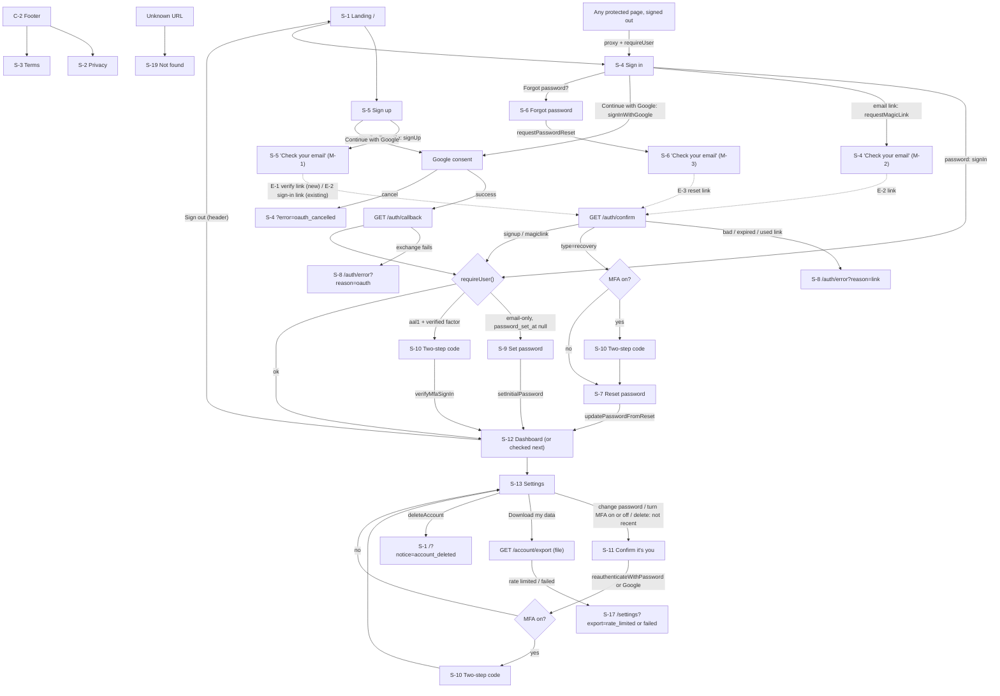

# Template: UX Spec

Last updated: 2026-09-26 · Status: draft (PM review applied) · Based on: 01-Project-Brief.md, 02-PRD.md, 03-RFC.md (D2–D24)

## Summary
Every app made from the Template opens with the same quiet, trustworthy shell: plain shadcn/ui components, the app's own name, logo and brand color from `appConfig`, light or dark to match the device, and forms that work one-handed on a 360 px phone. Signing up and signing in should feel short and predictable. Each screen does one thing, errors say what to do next in plain words, and no message ever hints at whether an email has an account (NFR-12). The screens that matter most are **Sign in (S-4)** and **Sign up (S-5)**, because they are the first thing every user of every app touches. **Settings (S-13)** comes next, because it holds the only irreversible action.

Scope: only the generic shell. App features, change email (FR-13, deferred), payments, teams, languages and admin screens are not designed here. Change email has no UI anywhere.

## Screen list
| ID | Screen | Route (RFC D17) | Who | FRs |
| --- | --- | --- | --- | --- |
| S-1 | Landing | `/` | anyone | FR-17, FR-24 |
| S-2 | Privacy policy | `/privacy` | anyone | FR-17, FR-24 |
| S-3 | Terms | `/terms` | anyone | FR-17, FR-24 |
| S-4 | Sign in | `/sign-in` | signed out | FR-3, FR-4, FR-5, FR-9, FR-18 |
| S-5 | Sign up | `/sign-up` | signed out | FR-1, FR-5, FR-18 |
| S-6 | Forgot password | `/forgot-password` | anyone | FR-7, FR-18 |
| S-7 | Reset password | `/reset-password` | recovery session | FR-8, FR-18 |
| S-8 | Auth error | `/auth/error` | anyone | FR-2, FR-4, FR-5, FR-8, FR-18 |
| S-9 | Set password | `/auth/set-password` | signed in, password not set | FR-1, FR-2 |
| S-10 | Two-step code | `/auth/mfa` | aal1 session with a verified factor | FR-58 |
| S-11 | Confirm it's you | `/auth/reauthenticate` | signed in | FR-56 |
| S-12 | Dashboard | `/dashboard` | signed in | FR-19, FR-12 |
| S-13 | Settings (page shell) | `/settings` | signed in | FR-19 |
| S-14 | Settings › Profile | `/settings#profile` | signed in | FR-12 |
| S-15 | Settings › Password | `/settings#password` | signed in | FR-14, FR-56 |
| S-16 | Settings › Two-step sign-in | `/settings#two-step` | signed in | FR-57, FR-59, FR-56 |
| S-17 | Settings › Your data | `/settings#your-data` | signed in | FR-15 |
| S-18 | Settings › Delete account | `/settings#delete-account` | signed in | FR-16, FR-56 |
| S-19 | Not found | `not-found.tsx` | anyone | FR-23 |
| S-20 | Error | `error.tsx`, `global-error.tsx` | anyone | FR-23 |

Shared parts: C-1 site header, C-2 site footer, C-3 feedback (toasts, inline alerts, pending buttons), C-4 Turnstile widget, C-5 password field. Route handlers `/auth/confirm`, `/auth/callback` and `/account/export` have no screen: they redirect or download (see the flow map). Emails E-1 to E-4 are at the end.

**Section anchors** (`#profile`, `#password`, `#two-step`, `#your-data`, `#delete-account`) are in-page ids for the settings nav only. They are never part of a `next` value.

## Flow map


**Redirect rules the screens rely on** (all from RFC D2, D9, D10, D17):
- Signed out on a protected page → `/sign-in?next=<path>`; after sign-in, back to `next` (checked by `safeRedirectPath()`, fallback `/dashboard`).
- Signed in on `/sign-in` or `/sign-up` → `/dashboard` (FR-18).
- `requireUser()` sends email-only users with `profiles.password_set_at` null to S-9, and aal1 users with a verified factor to S-10, before any protected page renders.
- `/auth/confirm` with `type=recovery` → S-7. Magic-link `next` travels in the `auth_next` cookie (D7).
- `next` carries through `/auth/mfa`, `/auth/set-password` and `/auth/reauthenticate`, always via `safeRedirectPath()`. Magic link, Google and re-auth keep it in the `auth_next` cookie (D24.8).
- An MFA user on a reset link passes S-10 before S-7: a reset never bypasses MFA (D24.5).

## Shared parts

### C-1 Site header
- **Public and signed-in pages:** logo (`appConfig.logo.svg`, `alt` = `appConfig.logo.alt`) and `appConfig.name`, linking to `/` when signed out and `/dashboard` when signed in.
  - Signed out, right side: "Sign in" (ghost button) and "Sign up" (primary button). On `/sign-in` and `/sign-up`, the button for the current page is hidden.
  - Signed in, right side: an account menu button that **always shows the signed-in email** (truncated with an ellipsis on narrow screens, full text in the menu and as the accessible name), so a user who was signed into someone else's account by a crafted link notices (D24.9). Menu: the display name (if set) and full email as a label, then "Dashboard", "Settings", separator, "Sign out" (a form button calling `signOut`, → `/`). All text only, never HTML.
- **Auth steps S-9, S-10, S-11:** logo and name only, with no menu, so the step can't be skipped by accident.
- Sticky on scroll. Content uses `scroll-padding-top` equal to the header height so focused fields are never hidden (WCAG 2.4.11).

### C-2 Site footer (every page)
- "© {year} {`appConfig.legal.entityName`}" · "Privacy" (`/privacy`) · "Terms" (`/terms`) · "Contact support" (`mailto:{appConfig.supportEmail}`) (FR-17).
- Theme control (FR-21, "could"): a small select, "Theme: System / Light / Dark", default System (next-themes; stored in the browser, not an auth token). Can be dropped if it costs time; system-following alone meets FR-21.
- Same order and position on every page, so help is always in the same place (WCAG 3.2.6).

### C-3 Feedback: pending, inline errors, toasts (FR-22)
- **Pending:** while a form is submitting, its submit button is disabled, shows a spinner and changes its label (for example "Signing in…"), and the form can't be submitted again. Other fields stay readable.
- **Field errors:** under the field, in `text-destructive`, linked with `aria-describedby`, with `aria-invalid="true"` on the field. Text comes from the shared Zod schema's `fieldErrors`.
- **Form errors** (`ActionResult.error`): a shadcn `Alert` (destructive) above the submit button, `role="alert"`. Focus moves to the first invalid field, or to the alert if there's no field error.
- **Toasts (Sonner):** for success confirmations only ("Name saved.") and for arrival notices after a redirect, which always come from `?notice=<value>` (D24.31): `account_deleted` → "Your account has been deleted.", `password_set` → "You're all set.", `password_changed` → "Password changed." Any other value is ignored. Position `top-center` so the phone keyboard doesn't cover them; auto-dismiss at Sonner's default. Errors are never toast-only: they stay inline until fixed.
- **"Check your email" panels** (M-1 to M-3) replace the form in place. Focus moves to the panel heading.
- **Page loading:** protected pages call `getUser()` on each request (D2). *Assumption:* a simple skeleton (header bar plus grey blocks) shows during navigation; whether that is a `loading.tsx` in `(app)` is left to the Detailed Design.

### C-4 Turnstile widget (D4)
- Sits directly above the submit button on S-4 (both methods), S-5, S-6 and S-11 (password path). Managed mode, `theme: auto`, normal size (300 px wide fits a 360 px screen with 16 px gutters).
- Usually it passes by itself. If it shows a challenge, the user completes it there.
- **Reset after every submit**, success or failure, because tokens are single-use (D4). The user never has to reload the page to try again.
- The submit button stays enabled even without a token. A missing or failed token returns M-6, so a widget that fails to load never leaves a keyboard or screen-reader user stuck without a message.
- Auth forms need JavaScript for Turnstile. With JS off, the form shows the plain line "Please turn on JavaScript to continue."

### C-5 Password field
- Label, input `type="password"`, and a "Show" / "Hide" toggle button (`aria-pressed`, 44 px target). Paste is always allowed.
- `autocomplete="current-password"` on S-4 and S-11, `autocomplete="new-password"` on S-7, S-9 and S-15.
- New-password fields show the hint "At least 12 characters. A short phrase is easy to remember." Errors: "Use at least 12 characters." / "That password is too long. Use a shorter one." (the limit is 72 UTF-8 bytes, D22 and D24.15, so the message doesn't state a character count).
- No "confirm password" field: the Show toggle and password managers cover typos, and a mistyped password can be reset by email. *Assumption, UX choice.*

## Exact messages (NFR-12 and shared errors)
These texts are fixed. `signUp`, `requestMagicLink`, `requestPasswordReset` and a failed `signIn` return the same text, the same `ActionResult` shape and the same HTTP status, after a minimum response time of about 500 ms (D24.10), whatever Supabase answered. `{email}` is the address the user typed, rendered as text.

**Which Supabase outcome shows which message** (the server maps; Supabase error text is never shown):

| Supabase outcome | `signUp` | `requestMagicLink` | `requestPasswordReset` | `signIn` |
| --- | --- | --- | --- | --- |
| Sent / success | M-1 | M-2 | M-3 | redirect |
| Email has no account (incl. 422 `otp_disabled`, D11) | M-1 (new account created) | M-2 | M-3 | M-4 |
| Existing, confirmed, unconfirmed or Google-only account | M-1 | M-2 | M-3 | M-4 if no password or wrong password |
| Supabase 60 s per-user resend rule, or its email-sending limit | M-1 | M-2 | M-3 | n/a |
| Our limiter (D3), per IP or per email | M-5 | M-5 | M-5 | M-5 |
| CAPTCHA token missing or rejected | M-6 | M-6 | M-6 | M-6 |
| Invalid email format (Zod, before any call) | field error | field error | field error | field error |
| Anything else (network, 5xx, limiter error: fail closed) | M-7 | M-7 | M-7 | M-7 |

M-5 and M-6 don't depend on whether the account exists: our limiter counts hashed keys for any email, and CAPTCHA is checked before any user lookup. Supabase's own per-IP limits (seen as Vercel's IPs, D3) map to M-5.

| ID | Where | Heading | Body |
| --- | --- | --- | --- |
| M-1 | S-5 after `signUp` | Check your email | "We've sent a link to {email}. Open it to continue. If you already have an account, the link signs you in instead." |
| M-2 | S-4 after `requestMagicLink` | Check your email | "If there's an account for {email}, we've sent it a sign-in link. The link works once." |
| M-3 | S-6 after `requestPasswordReset` | Check your email | "If there's an account for {email}, we've sent it a link to reset your password. The link works once." |
| M-4 | S-4 `signIn` failure (any reason: unknown email, wrong password, no password yet, Google-only) | none (form alert) | "Wrong email or password. Try again, or reset your password." ("reset your password" links to `/forgot-password`) |
| M-5 | Any rate-limited action (D3, exact text) | none (form alert) | "Too many attempts. Please try again in a few minutes." |
| M-6 | Missing or rejected Turnstile token | none (form alert) | "The security check didn't work. Please try again." |
| M-7 | Any unexpected error (NFR-9) | none (form alert) | "Something went wrong. Please try again." |

**Guard and edge-case messages** (defined in `docs/07-API-Spec.md`, same text here; D24.32):

| ID | Body | When |
| --- | --- | --- |
| API-1 | "Your session has ended. Please sign in again." | an action runs with no verified user |
| API-2 | "Enter the code from your authenticator app to continue." | aal1 session of an MFA user |
| API-3 | "Choose a password to finish setting up your account." | password not set yet |
| API-4 | "Please check the fields below." | any Zod failure (details inline per field) |
| API-5 | "Two-step sign-in is already on." | S-16 set-up when a factor exists |
| API-6 | "Your password is already set." | S-9 when `password_set_at` is set |
| API-7 | "Choose a password you haven't used for this account." | same password as before (field error) |

Panels M-1 to M-3 also show: "Didn't get it? Check your spam folder, or try again in a minute." and a "Try again" button, which brings back the form with the email filled in and a fresh Turnstile widget. The email never goes into a URL, which keeps it out of logs and Sentry (D15).

## Screens

### S-1 Landing (`/`) (FR-17, FR-24)
- **Purpose:** say what the app is and send people to sign up or sign in. Each app replaces the body.
- **Who:** anyone.
- **Shows (in order):** C-1; hero with `appConfig.name` (h1) and `appConfig.description`; buttons; C-2. No placeholder feature grid or marketing copy.
- **Main action:** "Get started" → S-5. Secondary: "Sign in" → S-4. When signed in, both are replaced by "Go to dashboard" → S-12.
- **States:**
  - `?notice=account_deleted` (from `deleteAccount`, D24.31): toast "Your account has been deleted." The param is a Zod enum; any other value is ignored.
  - Empty / error: none (static content).

### S-2 Privacy policy (`/privacy`) and S-3 Terms (`/terms`) (FR-17)
- **Purpose:** placeholder legal text each app fills in.
- **Who:** anyone.
- **Shows:** C-1; a warning banner at the top, "Placeholder text. Replace this page before launch.", in `muted` with a border (not dismissible); h1; "Last updated: {date}"; prose headings; C-2.
- **Privacy headings (placeholders):**
  - What we collect: email, display name, sign-in method, sign-in times.
  - Why we collect it.
  - Services that process it (D24.20): Supabase (database and sign-in), Vercel (hosting, incl. Web Analytics), Resend (email), Cloudflare Turnstile (bot protection), Sentry (error monitoring), Google (only if you sign in with Google).
  - How long we keep it. Must include: "When you delete your account, your data is removed from the app right away. Backup copies are kept for up to 30 days and then deleted automatically." (U1, D14)
  - Your choices: download your data and delete your account, linking to `/settings#your-data` and `/settings#delete-account`.
  - Contact: `appConfig.supportEmail`.
- **Terms headings (placeholders):** using the service, your account, acceptable use, ending your account, changes, contact.
- **States:** static; nothing else.

### S-4 Sign in (`/sign-in`) (FR-3, FR-4, FR-5, FR-9, FR-18)
- **Purpose:** get a returning user in by their usual method.
- **Who:** signed out. Signed in → `/dashboard`.
- **Shows (in order):**
  1. h1 "Sign in to {appConfig.name}".
  2. Optional alert from the query (below).
  3. "Continue with Google" (outline button with the Google "G" mark, following Google's button branding rules; *assumption: check the current guidelines when building*). Calls `signInWithGoogle`.
  4. Divider "or".
  5. Tabs "Password" | "Email link" (shadcn `Tabs`; default "Password"). Only the active tab renders its Turnstile widget.
     - Password tab: Email (`type="email"`, `autocomplete="email"`), Password (C-5) with a "Forgot password?" link beside the label → S-6, C-4, button "Sign in".
     - Email link tab: helper text "We'll email you a link that signs you in. No password needed." Email field, C-4, button "Email me a link".
  6. "New here? Create an account" → S-5 (keeps `next`).
- **Main actions:**
  - "Sign in" (`signIn`, pending "Signing in…") → `requireUser()` rules → S-9, S-10 or `next` / S-12.
  - "Email me a link" (`requestMagicLink`, pending "Sending…") → panel M-2.
  - "Continue with Google" (pending "Opening Google…") → Google → `/auth/callback`.
- **States:**
  - Empty: blank fields, no autofocus (so a phone keyboard doesn't cover the Google button and tabs on arrival).
  - Loading: C-3 pending.
  - Error: M-4, M-5, M-6 or M-7 as a form alert. Field errors: "Enter your email address." / "Enter a valid email address." / "Enter your password."
  - `?error=oauth_cancelled`: alert (neutral, not destructive) "Google sign-in was cancelled. You can try again or use another way to sign in."
  - Success: redirect (password, Google) or panel M-2 (email link).
  - Not allowed: signed in → `/dashboard`.

### S-5 Sign up (`/sign-up`) (FR-1, FR-5, FR-18)
- **Purpose:** start an account with an email only. The password comes after the email is verified (D10).
- **Who:** signed out. Signed in → `/dashboard`.
- **Shows (in order):** h1 "Create your account"; "Continue with Google" (`signInWithGoogle`); divider "or"; Email field; helper "We'll email you a link to confirm it's yours. You'll choose a password next."; C-4; button "Continue"; small print "By continuing, you agree to our Terms and Privacy Policy." (both links); "Already have an account? Sign in" → S-4.
- **Main action:** "Continue" (`signUp`, pending "Sending…") → panel M-1.
- **States:**
  - Empty: blank email.
  - Loading: C-3.
  - Error: field "Enter your email address." / "Enter a valid email address."; form alert M-5, M-6 or M-7. No error ever says the email is taken.
  - Success: panel M-1 (identical for new, existing, unconfirmed and Google-only emails).
  - Not allowed: signed in → `/dashboard`.

### S-6 Forgot password (`/forgot-password`) (FR-7)
- **Purpose:** request a reset link.
- **Who:** anyone. *Assumption:* signed-in users may use it too (FR-18 only redirects sign-in and sign-up).
- **Shows:** h1 "Reset your password"; text "Enter the email you sign in with and we'll send you a link to choose a new password."; Email; C-4; button "Send reset link"; "Back to sign in" → S-4.
- **Main action:** "Send reset link" (`requestPasswordReset`, pending "Sending…") → panel M-3.
- **States:** empty: blank email · loading: C-3 · error: field errors as S-5, form M-5, M-6 or M-7 · success: M-3 · not allowed: none.

### S-7 Reset password (`/reset-password`) (FR-8)
- **Purpose:** choose a new password from a valid reset link.
- **Who:** a user with a recovery session (arrived via `/auth/confirm?type=recovery`). MFA users pass S-10 first (D24.5). A Google-only user can use this path to add a password (D24.1).
- **Shows:** h1 "Choose a new password"; "For {email}" (text); New password (C-5); button "Save new password".
- **Main action:** "Save new password" (`updatePasswordFromReset`, pending "Saving…") → `/dashboard` with toast "Password changed. You've been signed out on your other devices." The old password stops working (FR-8), and other sessions are signed out (D24.4).
- **States:**
  - Error: C-5 field errors; M-5; M-7.
  - Not allowed (no recovery session: link opened twice, expired, or page opened directly): shows the S-8 content ("This link has expired or has already been used.") with the button "Send a new reset link" → S-6.

### S-8 Auth error (`/auth/error`) (FR-2, FR-4, FR-5, FR-8)
- **Purpose:** a dead end made friendly, for links and OAuth returns that failed.
- **Who:** anyone.
- **Variant is picked by `?reason=link|oauth|rate_limited`** (Zod enum, D24.27). Missing or unknown value → `link`.
- **`reason=rate_limited`:** h1 "Please wait a moment"; body M-5 "Too many attempts. Please try again in a few minutes."; button "Sign in" → S-4.
- **`reason=link`:** h1 "That link didn't work"; body "This link has expired or has already been used. Links from our emails work once." Then three ways on (buttons, stacked on mobile):
  - "Sign in" (primary) → S-4.
  - "Send a new reset link" → S-6.
  - "Create an account" → S-5, which re-sends a verification link for an unfinished sign-up (FR-2 "a way to request a new one").
- **`reason=oauth`** (a Google failure that isn't a cancel; cancels go to `/sign-in?error=oauth_cancelled`): h1 "Sign-in didn't finish"; body "Something went wrong while signing in with Google. Please try again."; button "Back to sign in" → S-4.
- **States:** static; no internal codes, no Supabase error text.

### S-9 Set password (`/auth/set-password`) (FR-1, FR-2)
- **Purpose:** the second half of email-first sign-up: the verified owner chooses the password.
- **Who:** signed in, email-only identity, `profiles.password_set_at` null (D10). Everyone else → `/dashboard`; signed out → `/sign-in`.
- **Shows:** C-1 (minimal); a step hint "Step 2 of 2"; h1 "Choose a password"; "Your email {email} is confirmed. Choose a password to finish setting up your account."; Password (C-5, new); button "Save password"; "Not you? Sign out" (form button, `signOut`).
- **Main action:** "Save password" (`setInitialPassword`, pending "Saving…") → `next` (checked) or `/dashboard`, toast "You're all set."
- **States:**
  - Empty: blank field.
  - Error: C-5 field errors; M-5; M-7.
  - Success: redirect.
  - Not allowed: as under Who. Protected pages and actions keep sending the user back here until a password is set.

### S-10 Two-step code (`/auth/mfa`) (FR-58)
- **Purpose:** finish sign-in with a code from the authenticator app.
- **Who:** an aal1 session whose user has a verified TOTP factor (after password, magic link, Google, a reset link or re-authentication). No session → `/sign-in`; already aal2 or no factor → `next` or `/dashboard`.
- **Shows:** C-1 (minimal); h1 "Enter your code"; "Open your authenticator app and enter the 6-digit code for {appConfig.name}."; one text input "6-digit code" (`inputmode="numeric"`, `autocomplete="one-time-code"`, `maxlength=6`, digits only, paste allowed; not six separate boxes); button "Verify"; help line "Lost your authenticator app? Contact support at {supportEmail}." (mailto); "Sign out" (form button).
- **Main action:** "Verify" (`verifyMfaSignIn`, pending "Checking…") → `next` or `/dashboard`.
- **States:**
  - Empty: blank code, autofocus (this page has one job).
  - Error: field "Enter the 6-digit code." (wrong length or non-digits); wrong code: form alert "That code didn't work. Check the app and try the newest code."; M-5 (D3: 5 tries per 5 min); M-7. The field is cleared and focused after a wrong code.
  - Success: redirect.
  - Not allowed: see Who.

### S-11 Confirm it's you (`/auth/reauthenticate?next=…`) (FR-56)
- **Purpose:** a fresh sign-in (within 10 minutes, D9) before changing the password, turning two-step sign-in on or off (D24.3) or deleting the account.
- **Who:** signed in. Signed out → `/sign-in`.
- **Shows:**
  - h1 "Confirm it's you"; text "For your security, sign in again before making this change."
  - **User with a password** (`profiles.password_set_at` not null, D24.1): Email shown read-only as text (no field); Password (C-5, current); C-4; button "Confirm"; "Forgot password?" → S-6.
  - **User without a password** (Google-only): button "Continue with Google"; note "You'll be sent to Google and straight back."
  - "Cancel" → `/settings`.
- **Main action:** "Confirm" (`reauthenticateWithPassword`, pending "Checking…") or "Continue with Google" → S-10 if MFA is on → `next` (checked, fallback `/settings`).
- **States:**
  - Error: wrong password: form alert "That password isn't right. Try again." (the user is already signed in, so no enumeration concern); M-5; M-6; M-7.
  - Success: redirect. The settings section the user came from now shows its form (S-15, S-16, S-18).
  - Not allowed: signed out → S-4.

### S-12 Dashboard (`/dashboard`) (FR-19, FR-12)
- **Purpose:** the signed-in home. Each app replaces the body.
- **Who:** signed in (`requireUser()`, all rules).
- **Shows:** C-1 with the account menu; h1 "Welcome, {display_name}", or "Welcome" if the name is empty; a card "This is your dashboard. Your app's main screen goes here." (placeholder, generic per NFR-24); if the name is empty, a small link "Add your name in Settings" → `/settings#profile`; C-2.
- **Main action:** none (placeholder). Settings is reachable from the menu.
- **States:**
  - Empty: the no-name variant above.
  - Loading: C-3 skeleton.
  - Error: S-20.
  - Not allowed: signed out → S-4 with `next=/dashboard`; aal1 with MFA → S-10; no password yet → S-9.
- `display_name` may come from Google metadata (D12) and is always rendered as text.

### S-13 Settings page shell (`/settings`) (FR-19)
- **Purpose:** one page with all account controls, in five sections.
- **Who:** signed in (same rules as S-12).
- **Layout:**
  - **Mobile:** h1 "Settings", then a row of in-page links (Profile · Password · Two-step sign-in · Your data · Delete account) that wraps; then the five sections as stacked cards.
  - **Desktop (≥ `md`):** a sticky left nav with the same links, and cards in a `max-w-3xl` column.
  - Each card has an h2 and its own form. One form's pending state doesn't block the others.
- **"Recent sign-in" gate** (used by S-15, S-16 turn-on and turn-off, S-18): when the page renders, the server reads the newest `amr` timestamp. If it is older than 10 minutes, the section shows the text "For your security, confirm it's you before changing this." and a button "Confirm it's you" → `/auth/reauthenticate?next=/settings`. Otherwise it shows the form. This gate is UX only: the action still runs `requireRecentSignIn()`. If the window runs out while the form is open, the action sends the user to S-11 and they re-enter the change afterwards.
- **States:** loading: C-3 skeleton · not allowed: as S-12.

### S-14 Settings › Profile (FR-12)
- **Shows:**
  - Email: shown read-only as text (from `auth.users.email`), no edit control. Below it: "To change your email, contact support." with "contact support" as a `mailto:{appConfig.supportEmail}` link (D24.26; FR-13 stays deferred).
  - Display name: label "Display name", input prefilled from `profiles.display_name`, `autocomplete="name"`, helper "Shown on your dashboard." Button "Save".
- **Main action:** "Save" (`updateDisplayName`, pending "Saving…") → toast "Name saved." The header menu and dashboard show the new name.
- **States:**
  - Empty: blank field if there is no name.
  - Error: "Enter a name." (empty after trimming, *assumption: the schema trims*); "Use 80 characters or fewer." (D12 check); M-5; M-7.
  - Success: toast.

### S-15 Settings › Password (FR-14, FR-56)
- **Shows:**
  - **Shown only when `profiles.password_set_at` is not null** (D24.1). Google-only users don't see this section or its nav link; they can add a password through "Forgot password" (S-6 → S-7).
  - The recent-sign-in gate (S-13), then New password (C-5, new) and a button "Change password". No "current password" field, because the gate already confirmed the user (D9).
- **Main action:** "Change password" (`changePassword`, pending "Saving…") → toast "Password changed. You've been signed out on your other devices." (D24.4). The field clears.
- **States:** gate (not recent) · error: C-5 field errors, M-5, M-7 · success: toast.

### S-16 Settings › Two-step sign-in (FR-57, FR-59, FR-56)
- **Off (no verified factor):**
  - Text: "Two-step sign-in is off. Turn it on to enter a code from an authenticator app each time you sign in."
  - If sign-in isn't recent: the S-13 gate ("Confirm it's you" → S-11 → back to `/settings`), because turning MFA on needs a recent sign-in (D24.3).
  - Otherwise: button "Set up two-step sign-in" (`startMfaEnrollment`, pending "Preparing…").
- **Setting up (inline in the card, not a modal):**
  1. "1. Scan this QR code with an authenticator app." QR image (the SVG data URI from `mfa.enroll`, D8) at about 180 px, on a white box so it scans in dark mode, with `alt="QR code for setting up two-step sign-in"`.
  2. On a phone: a link-styled button "Open in authenticator app" (the `otpauth://` URI from `startMfaEnrollment`'s `data`, D24.21–22), shown next to the QR code.
  3. "Can't scan it? Enter this key instead:" then the secret in monospace, grouped in fours, with a "Copy" button (toast "Key copied.").
  4. "2. Enter the 6-digit code the app shows." Code field as in S-10.
  5. Warning note: "If you lose your authenticator app, you'll need to contact support to get back into your account."
  6. Buttons: "Turn on" (`confirmMfaEnrollment`, pending "Checking…") and "Cancel" (hides the setup; the unfinished factor is cleaned up next time, D8).
- **On:**
  - Text: "Two-step sign-in is on. You'll enter a code from your authenticator app when you sign in."
  - Button "Turn off two-step sign-in" (outline). If sign-in isn't recent, the S-13 gate shows first. Otherwise it reveals a code field "Enter a current code to turn it off" and a destructive button "Turn off" (`disableMfa`, pending "Turning off…").
- **States:**
  - Error: "Enter the 6-digit code." / "That code didn't work. Check the app and try the newest code." / M-5 / M-7. If the recent-sign-in window ran out mid-setup, the action sends the user to S-11 and setup starts again. A setup error that can't be recovered: "Couldn't start setup. Please try again." (M-7 variant).
  - Success: toast "Two-step sign-in is on." / "Two-step sign-in is off."; the card switches state.

### S-17 Settings › Your data (FR-15)
- **Shows:** text "Download a copy of your account details and everything saved in {appConfig.name}, as a JSON file."; a link styled as a button, "Download my data", pointing to `GET /account/export` (plain `<a href>`, works without JS).
- **Main action:** the browser downloads `<app-slug>-data-<YYYY-MM-DD>.json` (D13). The page stays put.
- **States:**
  - Loading: none visible (a native download).
  - Error or rate limit (D24.19): the route handler never shows a bare error page. It redirects to `/settings?export=rate_limited` or `/settings?export=failed` (Zod-checked; other values ignored), and this card shows an inline alert: `rate_limited` → M-5, `failed` → "We couldn't prepare your download. Please try again." The page scrolls to `#your-data`.
  - Not allowed: signed out → `/sign-in?next=/settings`; aal1 with a factor → S-10.

### S-18 Settings › Delete account (FR-16, FR-56)
- **Shows:** card with a destructive border and h2 "Delete account"; text "This permanently deletes your account and everything in it. It can't be undone. Backup copies are deleted automatically within 30 days." and "Want a copy first? Download your data." (link to `#your-data`). Then the recent-sign-in gate (S-13), then:
  - Label "Type your email to confirm: {email}", input (`autocomplete="off"`, paste allowed).
  - Destructive button "Delete my account", enabled when the typed text matches (case-insensitive; a convenience only, the server checks again, D12).
- **Main action:** "Delete my account" (`deleteAccount`, pending "Deleting…") → signed out → `/?notice=account_deleted` (toast on S-1). No extra confirm dialog: typing the email is the confirmation.
- **States:** gate · error: "That doesn't match your email address." (field), M-5, M-7 · success: redirect.

### S-19 Not found (FR-23)
- **Shows:** C-1, h1 "Page not found", "We couldn't find that page. It may have moved, or the link may be wrong.", button "Go home" → `/`, C-2. HTTP 404.

### S-20 Error (FR-23)
- **`error.tsx`:** h1 "Something went wrong"; "Please try again. If it keeps happening, contact support." (mailto); buttons "Try again" (calls `reset()`) and "Go home" → `/`. Never shows a stack trace, error message, digest or Sentry event id.
- **`global-error.tsx`:** the same text in its own minimal `<html>` (no header or menu, because the layout itself failed).
- Details go to Sentry (D15) and server logs only.

## Emails (FR-28, as the user sees them)
One shared layout (`email-layout.tsx`): logo PNG, `appConfig.name`, a primary-color button, the plain URL below the button for clients that block buttons, and a footer with `supportEmail`. No expiry times are stated in the copy (not set in the RFC).

| ID | Template | Subject | Heading | Body and button |
| --- | --- | --- | --- | --- |
| E-1 | verify email (`confirmation`) | "Confirm your email" | Confirm your email | "Confirm this address to finish creating your {name} account. You'll choose a password next." Button "Confirm email". "If you didn't ask for this, you can ignore this email." |
| E-2 | magic link | "Your sign-in link" | Sign in to {name} | "Use this button to sign in. It works once." Button "Sign in". "If you didn't ask for this, you can ignore this email." (Works for both S-4 email links and sign-up with an existing email, per D10.) |
| E-3 | password reset (`recovery`) | "Reset your password" | Reset your password | "Choose a new password for your account." Button "Reset password". "If you didn't ask for this, your password hasn't changed and you can ignore this email." |
| E-4 | welcome | "Welcome" | Welcome to {name} | "Your account is ready." Button "Go to your dashboard" → `{site}/dashboard`. "Questions? Reply to {supportEmail}." |

Subjects are generic, with no app name, so `config.toml` holds no copy of `appConfig` values (D24.25, FR-26). The app name reaches the inbox through the sender name in `EMAIL_FROM` and the branded body. D10 notes that which template Supabase uses for a new `signInWithOtp` user still needs checking in week 1. The copy above works whichever of E-1 or E-2 is used.

## Wireframes (mobile, 360 px)

```
S-4 Sign in                         S-5 Sign up → M-1 panel
┌──────────────────────────────┐    ┌──────────────────────────────┐
│ [logo] AppName     [Sign up] │    │ [logo] AppName     [Sign in] │
├──────────────────────────────┤    ├──────────────────────────────┤
│ Sign in to AppName           │    │ Create your account          │
│ ┌──────────────────────────┐ │    │ ┌──────────────────────────┐ │
│ │ G  Continue with Google  │ │    │ │ G  Continue with Google  │ │
│ └──────────────────────────┘ │    │ └──────────────────────────┘ │
│ ─────────── or ───────────── │    │ ─────────── or ───────────── │
│ [ Password ][ Email link ]   │    │ Email                        │
│ Email                        │    │ [__________________________] │
│ [__________________________] │    │ We'll email you a link...    │
│ Password     Forgot password?│    │ ┌ Turnstile ──────────────┐  │
│ [______________________][Show]   │ └─────────────────────────┘  │
│ ┌ Turnstile ──────────────┐  │    │ [        Continue         ] │
│ └─────────────────────────┘  │    │ By continuing you agree to   │
│ ! Wrong email or password... │    │ Terms and Privacy Policy.    │
│ [         Sign in          ] │    │ Already have an account?     │
│ New here? Create an account  │    │ Sign in                      │
├──────────────────────────────┤    ├───────── after submit ───────┤
│ © Entity · Privacy · Terms · │    │ ✉ Check your email           │
│ Contact support · Theme ▾    │    │ We've sent a link to         │
└──────────────────────────────┘    │ a@b.com. Open it to continue.│
                                    │ If you already have an       │
                                    │ account, the link signs you  │
                                    │ in instead.                  │
                                    │ Didn't get it? Check spam... │
                                    │ [ Try again ]                │
                                    └──────────────────────────────┘

S-10 Two-step code                  S-11 Confirm it's you
┌──────────────────────────────┐    ┌──────────────────────────────┐
│ [logo] AppName               │    │ [logo] AppName               │
├──────────────────────────────┤    ├──────────────────────────────┤
│ Enter your code              │    │ Confirm it's you             │
│ Open your authenticator app  │    │ For your security, sign in   │
│ and enter the 6-digit code   │    │ again before making this     │
│ for AppName.                 │    │ change.                      │
│ 6-digit code                 │    │ Signed in as a@b.com         │
│ [ _ _ _ _ _ _              ] │    │ Password                     │
│ [          Verify          ] │    │ [______________________][Show]
│ Lost your authenticator app? │    │ ┌ Turnstile ──────────────┐  │
│ Contact support.             │    │ └─────────────────────────┘  │
│ Sign out                     │    │ [         Confirm          ] │
└──────────────────────────────┘    │ Forgot password?   Cancel    │
                                    │ (Google-only: [G Continue    │
                                    │  with Google] instead)       │
                                    └──────────────────────────────┘

S-13 Settings (mobile, scrolled)
┌──────────────────────────────┐
│ [logo] AppName [a@b.com ▾]   │
├──────────────────────────────┤
│ Settings                     │
│ Profile · Password · Two-step│
│ sign-in · Your data · Delete │
│ ┌ Profile ─────────────────┐ │
│ │ Email  a@b.com           │ │
│ │ To change your email,    │ │
│ │ contact support.         │ │
│ │ Display name             │ │
│ │ [Ella_______________]    │ │
│ │ [ Save ]                 │ │
│ └──────────────────────────┘ │
│ ┌ Password ────────────────┐ │
│ │ For your security,       │ │
│ │ confirm it's you before  │ │
│ │ changing this.           │ │
│ │ [ Confirm it's you ]     │ │
│ └──────────────────────────┘ │
│ ┌ Two-step sign-in ────────┐ │
│ │ Two-step sign-in is off. │ │
│ │ [ Confirm it's you ]     │ │
│ │ (then: Set up two-step   │ │
│ │  sign-in)                │ │
│ └──────────────────────────┘ │
│ ┌ Your data ───────────────┐ │
│ │ Download a copy... JSON  │ │
│ │ [ Download my data ]     │ │
│ └──────────────────────────┘ │
│ ┌ Delete account ─── (red) ┐ │
│ │ This permanently deletes │ │
│ │ ... can't be undone.     │ │
│ │ Type your email to       │ │
│ │ confirm: a@b.com         │ │
│ │ [________________]       │ │
│ │ [ Delete my account ]    │ │
│ └──────────────────────────┘ │
└──────────────────────────────┘
```

## Visual style
Plain shadcn/ui defaults (brief "Look and feel"), neutral base color, light and dark. Only the brand tokens change per app, from `appConfig.brand` via the nonce'd `<style>` in the root layout (D16).

| Token | Value | Use |
| --- | --- | --- |
| `--background`, `--foreground` | shadcn neutral default (light and `.dark`) | page |
| `--card`, `--card-foreground` | shadcn default | settings cards, auth card |
| `--muted`, `--muted-foreground` | shadcn default | helper text, placeholder banner |
| `--border`, `--input`, `--ring` | shadcn default | fields, focus ring |
| `--primary` | `appConfig.brand.primary` (dark: `primaryDark` if set) | primary buttons, links, email button, `theme_color` |
| `--primary-foreground` | `appConfig.brand.primaryForeground` (dark: `primaryForegroundDark` if set) | text on primary |
| `--destructive` | shadcn default | delete card, destructive buttons, errors |
| `--radius` | shadcn default | all shapes |

- **Feel:** calm, neutral, uncluttered. One primary action per screen, in the brand color. Everything else is outline or ghost.
- **Type:** system UI font stack (UX choice: no font files, so nothing to check against the CSP and no extra bytes). An app can add a font through `next/font` after the D5 style check. Body 16 px (`text-base`; inputs at 16 px also stop iOS zoom on focus). Page h1 `text-2xl font-semibold`, card h2 `text-lg font-semibold`, helper text `text-sm text-muted-foreground`.
- **Brand contrast check (D24.24, NFR-23):** a config unit test fails if `primary`/`primaryForeground`, or the dark pair when set, fall below 4.5:1. A rebrand that breaks AA is caught in CI, not by users.
- **Shapes and spacing:**
  - Page gutter 16 px (`px-4`) on mobile, 24 px from `sm`.
  - Auth screens (S-4 to S-11) are one centred column, `max-w-sm`, with no card border on mobile and a card from `sm`.
  - Settings `max-w-3xl`. Vertical rhythm `space-y-6` between cards, `space-y-4` inside a form.
  - Full-width buttons on auth screens on mobile.
  - No horizontal scroll at 360 px (FR-20); long emails wrap (`break-all` on the email text only).
- **Icons:** `lucide-react` (shadcn's default) for spinner, mail, eye/eye-off and warning. The Google "G" is a local SVG, since `img-src 'self'`.
- **Install (FR-25):** no custom install banner. The browser's own prompt is used, with name and colors from the manifest.

## Accessibility (NFR-23, WCAG 2.2 AA)
- **Contrast:** text 4.5:1, large text and UI parts 3:1, in both themes. shadcn neutral defaults pass. Brand colors are checked by the config contrast test (D24.24).
- **Targets:** buttons and inputs at least 44 px tall on touch layouts (shadcn `size="lg"` or `h-11` on auth screens). Every target is at least 24×24 px (2.5.8), including the Show toggle, the Copy button and footer links (padding added).
- **Keyboard:** everything works by keyboard in DOM order. A "Skip to content" link comes first. The account menu and tabs use Radix keyboard behaviour. Focus rings are always visible (`--ring`, never removed). The sticky header never covers focus (2.4.11).
- **Labels and errors:** every field has a visible `<label>` (no placeholder-only fields). Errors use text as well as color, `aria-invalid` and `aria-describedby`. Form alerts are `role="alert"`, and toasts are announced through Sonner's live region. Focus moves as described in C-3.
- **Accessible authentication (3.3.8):** paste allowed in every password and code field; correct `autocomplete` values so password managers and OS code autofill work; no "retype your email" or "confirm password" fields. The delete confirmation is the one deliberate exception (it is not a sign-in step).
- **Turnstile:** managed mode is non-interactive for most people. When it does challenge, Cloudflare's widget has its own accessible mode. M-6 always gives a text message.
- **Titles and language:** `<html lang="en">`. Each page title is "{Page} · {appConfig.name}" (FR-24), for example "Sign in · AppName". Headings go h1 → h2 in order, one h1 per page.
- **Motion and theme:** respect `prefers-reduced-motion` (no spinner spin, no toast slide). Follow `prefers-color-scheme` by default (FR-21).
- **Testing:** axe via `@axe-core/playwright` on every shell page, with 0 serious/critical issues. Keyboard-only runs of S-4 and S-5 (NFR-23). One manual pass with a screen reader (Orca on Fedora) over sign-up, sign-in and delete account before v1 sign-off (*assumption: manual check, not in the PRD measures*).

## Assumptions made here (UX choices, not requirements)
- Sign-out lands on `/` with no toast (the header change is the feedback).
- No "confirm password" field. Single-input 6-digit code. System font stack.
- Signed-in users may open `/forgot-password`.
- Skeletons while protected pages load; the Detailed Design decides whether it is a `loading.tsx`.
- The footer theme select is included because it is cheap, but it is optional (FR-21 "could").

## Resolved (RFC D24)
All ten questions from the first draft were answered by the PM on 2026-09-26 and are applied above:
- Same message and ~500 ms minimum on `signUp`, `requestMagicLink`, `requestPasswordReset` and failed `signIn`, incl. the 60 s resend rule → M-1 to M-7 and the outcome table (D24.10).
- "Has a password" = `profiles.password_set_at` not null; `mark_password_set()` also runs on reset and change; Google-only users don't see S-15 and add a password via S-6 (D24.1).
- MFA users pass S-10 before S-7 (D24.5).
- `next` carries through S-9, S-10 and S-11 (D24.8).
- S-8 uses `?reason=link|oauth|rate_limited` (D24.27).
- Export errors → `/settings?export=rate_limited|failed`, inline in S-17 (D24.19).
- Brand contrast unit test (D24.24).
- Profile email read-only with the "contact support" line (D24.26).
- "Open in authenticator app" `otpauth://` link in S-16 (D24.22); turning MFA on needs a recent sign-in (D24.3).
- Also applied: other devices signed out after a password change or reset (D24.4), the header always shows the signed-in email (D24.9), generic email subjects (D24.25), the 72-byte password limit (D24.15) and the privacy provider list (D24.20).
