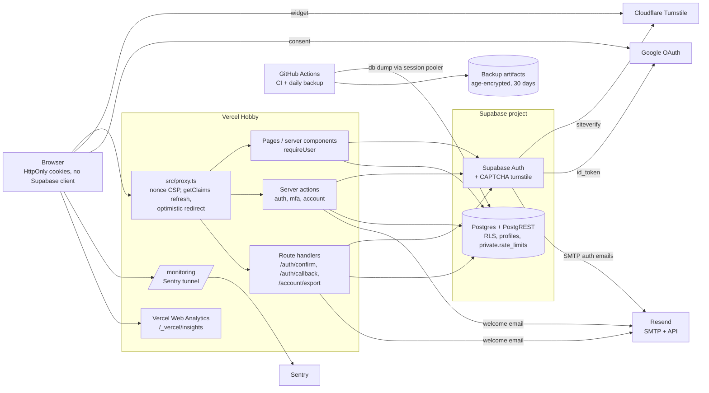
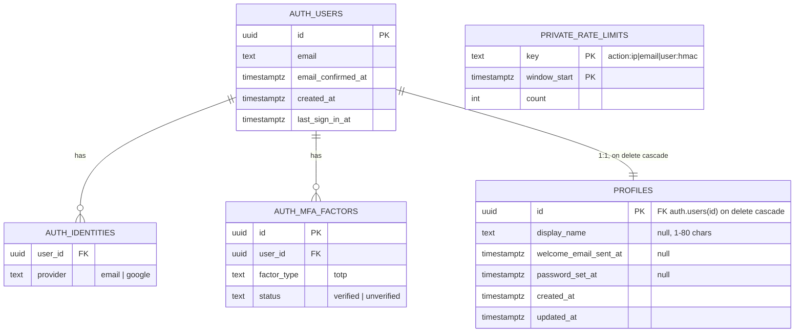

# Template: System Design

Last updated: 2026-09-26 · Mode: template · Based on: 01-Project-Brief.md, 02-PRD.md, 03-RFC.md, CLAUDE.md (rules 1–23)

## Overview
The Template is a Next.js 16 App Router app hosted on Vercel in which **every Supabase call happens on the server** (RFC D2, D21). The browser only talks to our own origin, plus Cloudflare (Turnstile widget) and Google (OAuth consent). `src/proxy.ts` sets a per-request CSP nonce and refreshes the session but never grants access. Pages, server actions and route handlers each call `requireUser()` / `requireRecentSignIn()`, and Postgres RLS (including a restrictive MFA policy) is the second wall. Supabase Auth handles identities, sessions, TOTP MFA and CAPTCHA (Turnstile). Supabase sends auth emails through Resend SMTP. The app sends only the welcome email. Errors go to Sentry through a same-origin tunnel, and page views go to Vercel Web Analytics. GitHub Actions runs CI against a local Supabase stack, and in each app's repo it also runs a daily age-encrypted backup. The Template itself is never deployed. A throwaway test app on `*.vercel.app` proves the deploy path and is deleted after v1 sign-off.

## Components

| Component | Responsibility | Tech |
| --- | --- | --- |
| Browser | Renders pages, holds HttpOnly `sb-*` cookies plus the short-lived HttpOnly `auth_next` (1 h) and, if needed, `auth_recovery` (15 min) cookies; runs the Turnstile widget and Vercel Analytics script; no tokens in JS storage | React 19, `next-themes`, `sonner` |
| `src/proxy.ts` | Nonce + CSP header on request and response; `supabase.auth.getClaims()` session refresh; redirect to `/sign-in?next=…` when no claims on a protected path. **Not a security check** (rule 3) | Next.js 16 proxy (Node runtime) |
| Pages / server components | Render; `(app)/layout.tsx` calls `requireUser()` (FR-9, FR-19) | App Router, dynamic rendering (nonce) |
| Server actions | All forms (D17): Zod → auth guard → rate limit → Supabase call → `ActionResult` | `src/server/actions/{auth,mfa,account}.ts` |
| Route handlers | Email-link verify, OAuth callback, data export | `src/app/auth/confirm`, `auth/callback`, `account/export` |
| Guards | `requireUser(options?)` (getUser + AAL + set-password gate; `{ allowPendingMfa?, allowPendingPassword? }`, both default false), `requireRecentSignIn()` (amr ≤ 10 min) | `src/server/auth/guards.ts` |
| Supabase clients | User client (publishable key, cookie options D21); admin client (secret key) used only by the rate limiter, `release_welcome_email(p_user_id)` and `deleteAccount` | `src/server/supabase/{server,admin}.ts` |
| Supabase Auth | Users, identities, sessions, TOTP factors, CAPTCHA check, auth emails, per-IP limits | Hosted GoTrue; local GoTrue v2.197.0 |
| Postgres | `public.profiles`, `private.rate_limits`, triggers and functions, RLS | Postgres 17 |
| Resend | SMTP for Supabase auth emails; API for the welcome email | Resend Free |
| Cloudflare Turnstile | Bot check on sign-up, sign-in, magic link, reset, re-auth | Via Supabase CAPTCHA (D4) |
| Sentry | Error events (errors only, no tracing/Replay), email alerts | `@sentry/nextjs` 11, tunnel `/monitoring` |
| Vercel Web Analytics | Page views (FR-32) | `@vercel/analytics`, same-origin |
| GitHub Actions | CI (`ci.yml`: checks, secrets, integration); backups (`backup.yml`, disabled in the Template, enabled per app) | Local Supabase via `supabase/setup-cli`, Playwright, gitleaks |
| Mailpit (local/CI only) | Catches all emails; e2e reads them via its API | Bundled with Supabase CLI |

## Data flow for the main journeys
Every server action runs in this order: **Zod parse → auth guard (except signed-out auth actions) → rate limit (fail closed) → Supabase call → plain `ActionResult`**. Errors are logged with `logError` (Sentry) and mapped by `toUserMessage` (rule 12).

1. **Email-first sign-up (FR-1, D10):** `/sign-up` form (email + Turnstile token) → `signUp` → rate limit (`signUp`: HMAC of IP and email) → `signInWithOtp({ shouldCreateUser: true, captchaToken })` → Supabase Auth checks the token with Cloudflare, creates an unconfirmed user **with no password** (or, for an existing email, sends a sign-in link) and sends the confirmation email via Resend SMTP → trigger `handle_new_user` inserts one `profiles` row → the page shows one identical message in every case, with a ~500 ms minimum response time (NFR-12, D24.10).
2. **Confirm → set password → dashboard (FR-2, FR-1):** user clicks `{{ .SiteURL }}/auth/confirm?token_hash=…&type=…` → route handler rate limit (IP 30/10 min) → Zod-checks params (`type` ∈ `signup | magiclink | recovery | email`) → `verifyOtp` → session cookies set (`Cache-Control: private, no-store`) → `claim_welcome_email()` → redirect to `safeRedirectPath(next)` → `requireUser()` sees `profiles.password_set_at` null and no `google` identity → `/auth/set-password` (page and action use `requireUser({ allowPendingPassword: true })`) → `setInitialPassword` (Zod: ≥ 12 characters, ≤ 72 UTF-8 bytes; rate limit) → `updateUser({ password })` → `mark_password_set()` (checks a password hash really exists) → `/dashboard`. Expired/used link → `/auth/error?reason=link` with a resend option.
3. **Welcome email (FR-30):** `/auth/confirm`, `/auth/callback` and `signIn` call `rpc('claim_welcome_email')` as the user (flips `welcome_email_sent_at` null → `now()` for `auth.uid()` only). If it returns true: render `welcome.tsx` → `send.ts` (Resend API in production, Mailpit locally/CI; `mailpit` refused when `VERCEL_ENV=production`). On failure the server calls `release_welcome_email(p_user_id)` with the **admin client** and the id from `getUser()` (never from input; D24.11), reports to Sentry, and the next sign-in retries.
4. **Sign in with password (FR-3):** form (email, password, Turnstile) → `signIn` → rate limit (IP 20/10 min, email 10/15 min) → `signInWithPassword({ captchaToken })` → one generic error for any failure, padded to ~500 ms → claim welcome → `requireUser()` on the target page (MFA step if needed) → dashboard or checked `next`.
5. **Magic link (FR-4, D11):** form → `requestMagicLink` → rate limit → `signInWithOtp({ shouldCreateUser: false })` → same message for sent / unknown (422) / Supabase 60 s rule, padded to ~500 ms → `next` kept in the HttpOnly `auth_next` cookie (1 h) → link → `/auth/confirm` → session → `safeRedirectPath`.
6. **Google (FR-5):** `signInWithGoogle` (rate limit IP 20/10 min; `next` in `auth_next`) → Supabase `/authorize` → Google consent → Supabase → `/auth/callback?code=…` (rate limit IP 30/10 min) → `exchangeCodeForSession` (PKCE) → automatic identity linking only onto a verified email (NFR-26) → claim welcome → dashboard. Cancel → `/sign-in?error=oauth_cancelled`.
7. **MFA step (FR-58):** after any first factor the session is `aal1`. `requireUser()` asks the Auth server (`getUser()` → `user.factors`). A verified factor with `aal1` redirects pages to `/auth/mfa` (carrying `next`) and makes actions/handlers refuse. `/auth/mfa` and `verifyMfaSignIn` use `requireUser({ allowPendingMfa: true })`; `verifyMfaSignIn` (rate limit 5/5 min per user) → `challengeAndVerify` → `aal2` session. Independently, the restrictive RLS policy `private.mfa_satisfied()` returns no rows to an `aal1` session of an MFA user.
8. **MFA on/off (FR-57, FR-59):** `startMfaEnrollment` (**`requireRecentSignIn()`**, rate limit 10/h per user) removes stale unverified factors → `mfa.enroll({ factorType: 'totp' })` → returns factor id, QR (data URI), secret and `otpauth://` URI as `ActionResult.data` → `confirmMfaEnrollment` (**`requireRecentSignIn()`**, code) → factor verified. Off: `requireRecentSignIn()` → fresh `challengeAndVerify` → `mfa.unenroll`.
9. **Re-authentication (FR-56, D9):** a sensitive action (`changePassword`, `deleteAccount`, `startMfaEnrollment`, `confirmMfaEnrollment`, `disableMfa`) calls `requireRecentSignIn()`; newest `amr[].timestamp` > 10 min → `/auth/reauthenticate?next=…` → users with `profiles.password_set_at` not null: `reauthenticateWithPassword` (Turnstile, rate limit) → fresh session; users without a password (Google-only): fresh OAuth round-trip → MFA users pass `/auth/mfa` again → back to `next` via `safeRedirectPath()`.
10. **Password reset (FR-7, FR-8):** `requestPasswordReset` (Turnstile, rate limit, generic message padded to ~500 ms) → Supabase recovery email → `/auth/confirm?type=recovery` → recovery session (aal1), detected by the `amr` method or, as the approved fallback, an HttpOnly `SameSite=Lax` 15-minute `auth_recovery` cookie → **MFA users pass `/auth/mfa` first** (reset never bypasses MFA) → `/reset-password` → `updatePasswordFromReset` → `updateUser({ password })` → `mark_password_set()` → `signOut({ scope: 'others' })` → recovery cookie cleared. Google-only users add a password this way.
11. **Change password (FR-14):** Password section shown only when `password_set_at` is not null → `changePassword` → `requireRecentSignIn()` → Zod → rate limit → `updateUser({ password })` → `mark_password_set()` → `signOut({ scope: 'others' })`.
12. **Data export (FR-15, D13):** `GET /account/export` → `requireUser()` (aal2 if MFA) → rate limit 5/hour → for each `USER_DATA_TABLES` entry (all in `public`), select with the **user's own client** (RLS applies) → JSON with `account` (id, email, created_at, email_confirmed_at, last_sign_in_at, providers, mfa_enabled) and `data` → download headers incl. `Cache-Control: private, no-store`. Never a bare error page: signed out → `/sign-in?next=/settings`; aal1 with a factor → `/auth/mfa`; limited or failed → `/settings?export=rate_limited|failed`.
13. **Delete account (FR-16, D12):** `deleteAccount` → `requireRecentSignIn()` → Zod: typed email equals `user.email` (case-insensitive) → rate limit → admin `auth.admin.deleteUser(user.id)` (id from `getUser()`, never from input) → `ON DELETE CASCADE` removes `profiles` and every registry row → `signOut({ scope: 'local' })` → `/?notice=account_deleted` (D24.31). Backups still hold the data up to 30 days.
14. **Every protected request (FR-9, FR-10):** proxy refreshes an expired access token with the refresh token (cookies rewritten) → page/action runs `requireUser()` → `getUser()` round-trip to Auth → deleted or signed-out users fail even if their JWT hasn't expired.
15. **Backup (FR-33, FR-34, D14):** `backup.yml` daily 03:17 UTC (+ manual) → `scripts/backup.sh` runs three `supabase db dump` passes (roles, schema, data incl. `auth`) over the session pooler (`SUPABASE_DB_URL` secret) → `tar czf` → `age` to the public recipient (`BACKUP_AGE_RECIPIENT` variable) → `upload-artifact` with `retention-days: 30`.
16. **Restore (FR-35):** Builder downloads the artifact → `age -d` with the offline private key → `tar x` → new Supabase project → `psql --single-transaction … roles.sql, schema.sql, SET session_replication_role = replica, data.sql` → compare row counts, sign in as a test user → record the date in `docs/decisions/` and README.
17. **Deploy (D19):** Builder runs `supabase db push` (expand-then-contract migration) from their machine → merges → Vercel builds (env parse, `check-bundle-secrets.sh` in CI) → promote. `supabase config push` sends auth settings (templates, SMTP, CAPTCHA) only with the filled-in `[remotes.production]` block.

## Data model
Exactly the RFC's core entities. Code-level entities (`USER_DATA_TABLES`/`NON_USER_DATA_TABLES`, `appConfig`, data export file, backup artifact) are not tables and are described after the diagram.

- `auth.users`, `auth.identities`, `auth.mfa_factors`: owned by Supabase Auth; the app never writes them directly (only through Auth APIs).
- `public.profiles`: `display_name` comes from Google's `full_name` at creation (trimmed to 80, untrusted, rendered as text), otherwise set by the user. `welcome_email_sent_at` and `password_set_at` are written only by security-definer functions. **`password_set_at is not null` is the one "has a password" signal** (D24.1), used by the set-password gate, the re-auth form and the settings Password section.
- User-data tables live in `public` (the exposed schema) so export can reach them with the user's client; the registry coverage test enforces this (D24.18).
- `private.rate_limits`: no relationship to users; every key part (IP, email, user id) is an **HMAC-SHA256 with `RATE_LIMIT_HMAC_SECRET`** (D24.13); rows older than 24 h are deleted by `rate_limit_hit`, which returns `true` when the request is allowed (D24.12).
- `USER_DATA_TABLES` / `NON_USER_DATA_TABLES` (`src/server/data/registry.ts`): today `public.profiles` (`ownerColumn: 'id'`) and `private.rate_limits` (reason: hashed keys, 24 h retention). Drives export, deletion checks and the RLS coverage test.
- `appConfig` (`src/config/app.ts`): `name`, `shortName`, `description`, `supportEmail`, `brand`, `logo`, `legal`. Not user data.
- Data export file: `format`, `version`, `exported_at`, `account`, `data`.
- Backup artifact: `backup-<date>.tar.gz.age` containing `roles.sql`, `schema.sql`, `data.sql`.

## Security

### Per table and function
| Table / resource | Read | Write | Enforced by |
| --- | --- | --- | --- |
| `public.profiles` | Owner only (`id = (select auth.uid())`), and only if `private.mfa_satisfied()` | Owner may update **only `display_name`** (column grant); insert by trigger only; delete by cascade only; no insert/delete policy | RLS on, deny by default; restrictive MFA policy for all to `authenticated`; `revoke update … grant update (display_name)`; `check` 1–80 chars; Zod in `updateDisplayName` |
| `private.rate_limits` | Nobody (no policies) | Only via `rate_limit_hit`, executable by `service_role` only | RLS on with no policies; EXECUTE revoked from `public`, `anon`, `authenticated`; `private` schema not exposed via the Data API (assumption: Supabase default exposes only `public`/`graphql_public`) |
| `auth.users`, `auth.identities`, `auth.mfa_factors` | Via Auth APIs for the signed-in user; admin API for `deleteAccount` only | Auth APIs only | Supabase Auth; `authenticated` gets no grant on `auth.mfa_factors` (read through `private.mfa_satisfied()`) |
| `handle_new_user()` trigger | – | Inserts one `profiles` row per new `auth.users` row | `security definer`, `set search_path = ''` |
| `claim_welcome_email()` | – | Sets `welcome_email_sent_at` null → `now()` for `auth.uid()` only; returns true if it changed | `security definer`, `set search_path = ''`, executable by `authenticated` |
| `mark_password_set()` | – | Sets `password_set_at` for `auth.uid()` only, **after checking a password hash really exists** (D24.1) | `security definer`, `set search_path = ''`, executable by `authenticated` |
| `release_welcome_email(p_user_id uuid)` | – | Sets `welcome_email_sent_at` back to null after a failed send | `security definer`, `set search_path = ''`, **`service_role` only**; called by the server with the id from `getUser()`, never from input (D24.11, rule 6) |
| `rate_limit_hit(p_key, p_max, p_window_seconds)` | – | Atomic upsert + 24 h cleanup; returns `true` = allowed, `false` = over limit | `security definer`, `search_path = ''`, `service_role` only; unit + DB test lock in the return direction (getting it backwards fails open) |
| `private.mfa_satisfied()` | Reads `auth.jwt()->>'aal'` and the caller's verified factors | – | `security definer`, `search_path = ''` |
| Storage | – | – | No bucket ships (NFR-15); rule 18 applies when an app adds one |

The catalog tests (D18) fail CI if any table in an app schema has RLS off, is missing from the registry, or (for user data) is outside `public` or lacks an RLS test, the restrictive MFA policy or a cascade path to `auth.users`, or if a service-role-only function is executable by `anon`/`authenticated`.

### Per operation
| Operation | Guard | Turnstile | Rate limit (D3) | Client |
| --- | --- | --- | --- | --- |
| `signUp` | signed out | yes (Supabase CAPTCHA) | IP 5/h, email 3/h | user (publishable) |
| `signIn` | signed out | yes | IP 20/10 min, email 10/15 min | user |
| `requestMagicLink` | signed out | yes | IP 10/h, email 3/h | user |
| `requestPasswordReset` | signed out | yes | IP 10/h, email 3/h | user |
| `signInWithGoogle` | signed out | no (OAuth; CAPTCHA skips id_token/PKCE grants) | IP 20/10 min | user |
| `updatePasswordFromReset` | recovery session (`amr` check or `auth_recovery` cookie), aal2 if MFA | no | user 5/h | user; then `mark_password_set()` and `signOut({ scope: 'others' })` |
| `setInitialPassword` | `requireUser({ allowPendingPassword: true })` | no | user 5/h | user; then `mark_password_set()` |
| `reauthenticateWithPassword` | `requireUser()` | yes | IP 20/10 min, user 5/15 min | user |
| `verifyMfaSignIn` | `requireUser({ allowPendingMfa: true })` | no | IP 30/15 min, user 5/5 min (+ Supabase 15/min/IP) | user |
| `startMfaEnrollment` | `requireRecentSignIn()` (D24.3) | no | user 10/h | user |
| `confirmMfaEnrollment` | `requireRecentSignIn()` (D24.3) | no | IP 30/15 min, user 5/5 min | user |
| `disableMfa` | `requireRecentSignIn()` + fresh code | no | IP 30/15 min, user 5/5 min | user |
| `updateDisplayName` | `requireUser()` | no | user 30/h | user (RLS + column grant) |
| `changePassword` | `requireRecentSignIn()`; only when `password_set_at` is not null | no | user 5/h | user; then `mark_password_set()` and `signOut({ scope: 'others' })` |
| `deleteAccount` | `requireRecentSignIn()` + typed email | no | user 5/h | **admin** (`deleteUser(user.id)` from `getUser()`) |
| `signOut` | none (no-op when signed out) | no | none | user |
| `GET /auth/confirm` | Zod on `token_hash`, `type` (signup / magiclink / recovery / email); `safeRedirectPath` | no | IP 30/10 min (+ Supabase verify 30/5 min/IP) | user |
| `GET /auth/callback` | Zod on `code`/error; `safeRedirectPath` | no | IP 30/10 min | user |
| `GET /account/export` | `requireUser()` | no | user 5/h | user (RLS) |
| `/monitoring` | none: **documented exception** to Zod + rate limit; forwards only to the configured DSN (D24.16) | no | none | – |
| Rate limiter, `release_welcome_email` | internal | – | – | **admin** (ids from `getUser()` or HMAC keys, never user-supplied; rule 6) |

`signUp`, `requestMagicLink`, `requestPasswordReset` and failed `signIn` return identical messages with a ~500 ms minimum response time (D24.10). All `next`/`redirectTo` values, including those carried through `/auth/mfa`, `/auth/set-password` and `/auth/reauthenticate`, go through `safeRedirectPath()` (NFR-8). Server actions also get Next.js's built-in Origin check.

### Trust boundaries
1. **Browser ↔ Vercel:** everything from the browser is untrusted (form data, params, cookies, `x-forwarded-for` is trusted only because Vercel overwrites it). Checked by Zod, guards, rate limits, CSP and security headers (D5).
2. **Vercel ↔ Supabase:** the server holds the user's JWT (from cookies) and, the secret key (three uses: rate limiter, `release_welcome_email`, `deleteAccount`). Supabase re-checks the JWT and RLS on every query, so a bug in a server action can't read another user's rows through the user client.
3. **Internet ↔ Supabase directly:** the publishable key and project URL are public, so anyone can call Auth and PostgREST directly. Only Supabase's CAPTCHA, its per-IP limits, RLS, grants and the restrictive MFA policy apply there. Our server-side rate limits and response padding do **not**.
4. **Third parties:** Resend (email content and recipient), Cloudflare (visitor browser signals), Google (OAuth), Sentry (scrubbed errors), Vercel (hosting, logs, analytics), GitHub (code, CI, encrypted backups, DB URL secret).

### Secrets
| Secret | Lives in | Used by |
| --- | --- | --- |
| `SUPABASE_SECRET_KEY` | `.env.local`, Vercel env | `src/server/supabase/admin.ts` only |
| `RESEND_API_KEY` | `.env.local`, Vercel env; pushed into Supabase SMTP config | welcome email; Supabase SMTP password |
| `TURNSTILE_SECRET_KEY` | `.env.local` on the Builder's machine; pushed into Supabase CAPTCHA config. **Not on Vercel** (D24.28) | Supabase CAPTCHA. An app that adds a public form using `verifyTurnstile()` then sets it on Vercel |
| `GOOGLE_CLIENT_ID`, `GOOGLE_CLIENT_SECRET` | `.env.local` on the Builder's machine; pushed into Supabase. **Not on Vercel** (D24.28) | Supabase Google provider via `config.toml` `env()` |
| `RATE_LIMIT_HMAC_SECRET` | `.env.local`, Vercel env (server-only) | HMAC-SHA256 of rate-limit keys (D24.13) |
| `SENTRY_AUTH_TOKEN` | Vercel env (optional locally) | source-map upload at build |
| `SUPABASE_DB_URL` | GitHub Actions secret (app repos) | `backup.yml` |
| age private key | Offline with the Builder | restore only |

The env schema has a separate `supabaseConfigEnv` part (Google and Turnstile secrets) that the Next build doesn't require, so those two never need to be on Vercel (D24.28).

Enforcement: `import "server-only"` on every `src/server/**` file; ESLint `no-restricted-imports` blocks `@/server/*` from `"use client"` files; `check-bundle-secrets.sh` scans the build for real secret values and `sb_secret_` / `"role":"service_role"`; env parse errors name variables, never values; `.env*` blocked by `.gitignore`, the pre-commit hook and `check-env-example.sh`; gitleaks in hooks and CI. A leaked key is rotated in its service (rule 8).

### Abuse protection
- Postgres fixed-window limiter keyed by HMAC-SHA256 of IP, email and user id; fail closed; identical "try again" message (D3, D24.13, NFR-10). **Accepted:** the per-email sign-in limit lets someone block a victim's *password* sign-in for 15 min; magic link and Google still work (D24.14).
- Turnstile via Supabase CAPTCHA on `/signup`, `/recover`, `/resend`, `/magiclink`, `/otp` and password `/token` grants (D4, NFR-11).
- Supabase built-in limits (per IP, see [free tiers](#free-tier-limits)) plus `auth.rate_limit.email_sent = 30`/hour to protect Resend quota.
- No enumeration: identical responses and a ~500 ms minimum response time for `signUp`, failed `signIn`, `requestMagicLink` and `requestPasswordReset`; Supabase's 60 s resend rule maps to the same message (NFR-12, D24.10).
- Email-first sign-up: no password can exist before the inbox owner verifies (D10, NFR-26).

## Threat model
Assets: **accounts** (sessions, passwords, MFA), **personal data** (emails, names, export files, backups), **the database**, **secrets**, **free-tier quotas** (Resend, Sentry, CI minutes), **the Template itself** (a flaw copies into every app).

| # | Asset | Threat (who, how) | STRIDE | Impact | What stops it | Refs |
| --- | --- | --- | --- | --- | --- | --- |
| T1 | Accounts | Bot guesses passwords, spread over many IPs | S | Takeover | Turnstile on password grants; per-email limit 10/15 min (accepted side effect: a 15-min password-sign-in lockout for the victim, other methods still work); 12-char minimum; optional MFA | NFR-10, 11; D22; D24.14; rules 13, 14 |
| T2 | Accounts | Attacker pre-registers the victim's email with a known password, or links Google to it | S | Takeover after the victim confirms | Email-first sign-up: no password until the inbox owner verifies; linking only onto verified emails | NFR-26; D10 |
| T3 | Accounts | Stolen session cookie (XSS) | S, I | Takeover | HttpOnly/Secure/SameSite=Lax cookies; no browser Supabase client; nonce CSP, `strict-dynamic`, no `unsafe-inline` scripts; no `dangerouslySetInnerHTML` on user content | NFR-7, 13, 14; rules 10, 16, 17 |
| T4 | Accounts | Signed-in attacker (stolen session or unlocked device) changes password, enrols their own MFA factor to lock the owner out, disables MFA or deletes account | S, E | Lockout, loss | `requireRecentSignIn()` (10 min amr) on password change, MFA enrol/confirm/disable and delete; typed-email confirmation; fresh TOTP code for disable; `secure_password_change` for direct API calls on sessions > 24 h; password change and reset sign out other sessions | FR-56, 57, 59; D9; D24.3, D24.4 |
| T5 | Accounts | MFA bypass: stop after first factor and call actions or PostgREST directly | E | MFA useless | `requireUser()` reads factors from the Auth server; restrictive RLS `private.mfa_satisfied()`; code attempts limited 5/5 min per user; the aal1 recovery session must pass `/auth/mfa` before `/reset-password` | FR-58; D2, D8; D24.5 |
| T6 | Accounts | Forgotten guard on a new action or page (developer error) | E | Data exposure | RLS is independent; signed-out refusal test calls every exported action and handler; review checklist; proxy is explicitly not trusted | NFR-3; rules 3, 4; D18 |
| T7 | Personal data | Signed-in user B reads, changes or deletes user A's rows | I, T | Breach | Deny-by-default RLS owner policies; column grant on `display_name`; RLS tests for B and anon; catalog coverage test | NFR-1, 2; rules 1, 2 |
| T8 | Personal data | Enumeration: learn whether an email has an account | I | Targeted phishing | Identical messages/status and ~500 ms padding on all four sensitive actions; HMAC-keyed rate limits | NFR-12; rule 15; D11; D24.10 |
| T9 | Personal data | Open redirect via `next` to a phishing page | S | Credential theft | `safeRedirectPath()` with unit tests for `//`, `/\`, schemes, encodings | NFR-8; rule 11 |
| T10 | Personal data | Personal data or tokens leak into Sentry, logs or error pages | I | Breach at a third party | `dataCollection` off; `beforeSend`/`beforeBreadcrumb` scrubber (cookies, headers, bodies, query strings, emails, JWT/`sb_` tokens); `toUserMessage` plain errors | NFR-9, 17; rules 12, 20 |
| T11 | Personal data | CSRF on state-changing requests | T | Unwanted changes | Server actions (POST + Origin check); only GETs are confirm/callback/export, which change nothing for another site to read (no CORS) | D13, D17 |
| T12 | Personal data | Backup artifacts stolen from GitHub | I | Full DB disclosure | age encryption to an offline key; 30-day expiry | D14; rule 21 |
| T13 | Database | Attacker calls `rate_limit_hit` to exhaust someone's email budget | D | Victim can't sign in | EXECUTE only for `service_role` | D3 |
| T14 | Database | SQL injection | T, I | Breach | Supabase client parameterisation; no string-built SQL (review checklist); `search_path = ''` on definer functions | checklist |
| T15 | Database | Bad migration or data corruption | T | Data loss | Forward-only, expand-then-contract migrations; pre-commit review flags edited migrations; daily backups with tested restore | NFR-18, 19; rules 21, 22 |
| T16 | Secrets | Service-role key reaches the browser or git | E | Full DB bypass | `server-only`, ESLint import rule, bundle scan for real values, env-example check, gitleaks | NFR-4, 5; rules 5–8 |
| T17 | Secrets | Malicious or typosquatted dependency | E, I | Anything the server can do | Few packages with stated reasons; lockfile; `npm audit`; Dependabot; review of `postinstall`; Actions pinned by SHA; gitleaks pinned + checksum; Vercel "Ignored Build Step" skips preview builds for `dependabot/*` branches, so un-reviewed dependency code never runs with preview env vars | NFR-20; rule 23; D24.17 |
| T18 | Quotas | Bots trigger emails (sign-up, reset, magic link) to burn Resend's 100/day | D | Real users get no emails | Turnstile, per-IP/email limits, Supabase 1 email/60 s per user, `email_sent = 30`/h; `release_welcome_email` is `service_role` only, so a user can't reset the flag to resend the welcome email | NFR-10, 11, 22; D24.11 |
| T19 | Availability | Flood of requests (each page is dynamic, each protected request does `getUser()`) | D | Hobby CPU limit hit, slow pages | Rate limits on auth actions; Supabase per-IP limits; per-app Vercel WAF rule (1 on Hobby) | D5, D3 |
| T20 | Clickjacking / framing | Site framed to trick clicks | T | Unwanted actions | `frame-ancestors 'none'`, `X-Frame-Options: DENY`, COOP | NFR-13 |
| T21 | Repudiation | User disputes a deletion or password change | R | Support dispute | Supabase Auth's own logs (not app-level audit); no app audit log in v1 (accepted: not required by PRD) | – |
| T22 | Accounts | Login CSRF: victim opens an `/auth/confirm` link for the attacker's account and is signed in as the attacker | S | Victim enters data into the attacker's account | Header always shows the signed-in email; **accepted residual risk for v1** | D24.9 |

**Residual risks (accepted in the RFC):**
- **Magic-link 422 via direct API** reveals whether an account exists, but only per solved Turnstile (D11).
- **Supabase per-IP limits see Vercel's egress IPs**, so they act as an app-wide ceiling (30 sign-in/sign-up per 5 min, MFA verify 15/min). Accepted for v1; `Sb-Forwarded-For` is the per-app fix (U3).
- **`style-src-attr 'unsafe-inline'`** (and, if the fallback is needed, `style-src 'unsafe-inline'`), mitigated by same-origin `img-src`/`font-src`/`connect-src` and no user input in styles (D5).
- **Previews share the production Supabase project** and preview env vars behind Vercel Authentication (U2): preview code runs against real data. Dependabot branches don't get preview builds (D24.17).
- **DB password in GitHub secrets** for backups (D14): a GitHub account compromise reaches the database.
- **Lost-authenticator support path** (D8): social engineering of the Builder is the weak point. Rule (D24.29, launch checklist + README): the Builder removes a factor only when the request comes from, or is confirmed by, the account's own email address.
- **Google may re-consent silently** during re-auth when the Google session is live (D9).
- **No leaked-password check** (Pro-only, D22); **no MFA recovery codes**; **no "sign out everywhere"** (PRD out of scope).
- **Stolen access token for direct API calls** stays valid until `jwt_expiry` (3600 s) even after sign-out; our server rejects it via `getUser()`, PostgREST does not (D2).
- **Supabase sends our server IP as Turnstile `remoteip`**: believed harmless, unverified (D4).
- **`/monitoring` tunnel abuse:** anyone can post events and burn Sentry's 5k errors/month; it forwards only to the configured DSN, Sentry's spike protection applies (D24.16).
- **Login CSRF via `/auth/confirm`** (T22), mitigated only by showing the signed-in email in the header (D24.9).
- **Per-email password-sign-in lockout** of up to 15 min by someone who knows the victim's email (D24.14).

## Privacy and legal
| Personal data | Why | Where | Who can see it | Kept for | Export / delete |
| --- | --- | --- | --- | --- | --- |
| Email address | Account identity, auth emails | `auth.users`; Resend (as recipient) | The user; Builder (Supabase dashboard) | Until account deletion; backups +30 days | Export `account.email`; deleted with auth user. Shown read-only in settings; changing it goes through support (FR-13 deferred, D24.26) |
| Password | Sign-in | `auth.users` (bcrypt hash, Supabase) | Nobody in plain text | Until deletion / change; backups +30 days | Not exported; deleted |
| Display name | Shown in app | `profiles.display_name` (optionally from Google `full_name`) | The user | Until deletion; backups +30 days | Exported in `data`; cascade delete |
| Sign-in providers, Google identity | Google sign-in | `auth.identities` | The user; Builder | Until deletion; backups +30 days | Export `account.providers` (no provider tokens); deleted |
| TOTP factor (secret) | MFA | `auth.mfa_factors` | Nobody after enrolment | Until disabled/deleted | Export `mfa_enabled` only; deleted |
| Timestamps (sign-up, confirmed, last sign-in, welcome sent, password set) | Flows (welcome once, set-password gate) | `auth.users`, `profiles` | The user; Builder | Until deletion; backups +30 days | Exported; deleted |
| HMAC-SHA256 of IP, email and user id in limiter keys | Rate limiting | `private.rate_limits` | Nobody (no policies); not reversible without `RATE_LIMIT_HMAC_SECRET` | ~24 h (deleted by later limiter calls); backups +30 days | Not exported (non-user-data registry) |
| IP addresses / user agents in Supabase `auth` tables (e.g. audit log, sessions) | Kept by Supabase Auth | `auth` schema | Builder | **Week-1 check** (D24.20): which `auth` tables keep IPs/user agents after `deleteUser` | Not exported; in backups up to 30 days |
| Session cookies (JWT, refresh token) | Staying signed in | Browser (HttpOnly); sessions in Supabase Auth | The user's browser | Session lifetime; other sessions ended on password change/reset | Cleared on sign-out; sessions removed on deletion |
| Error events | Debugging | Sentry | Builder | Sentry Developer 30-day lookback | Scrubbed of emails, tokens, cookies, headers, bodies, query strings, `user` (NFR-17) |
| Page views | Traffic (FR-32) | Vercel Web Analytics | Builder | Per Vercel (not in RFC) | Listed as a provider on the privacy placeholder (D24.20) |
| Browser signals for Turnstile | Bot check | Cloudflare | Cloudflare | Per Cloudflare (not in RFC) | Listed as a provider on the privacy placeholder |
| Email content + recipient | Delivering emails | Resend | Builder (Resend dashboard) | Per Resend (not in RFC) | Listed as a provider on the privacy placeholder |
| Export file | User's right to their data | User's device only (never emailed or stored) | The user | User's choice | – |
| Backups (all of the above in the DB) | Recovery | GitHub Actions artifacts, age-encrypted | Builder with the offline key | 30 days, auto-expiry | Deleted accounts disappear from backups within 30 days (FR-17 privacy placeholder says so) |

- **Minimisation (rule 19):** `profiles` holds only display name and timestamps; no avatars, phone numbers or IPs in app tables.
- **Terms, disclaimers, age, consent:** `/privacy` and `/terms` ship as visibly marked placeholders filled in per app (FR-17). The privacy placeholder lists the service providers (Supabase, Vercel incl. Web Analytics, Resend, Cloudflare Turnstile, Sentry, Google for sign-in) and the 30-day backup retention (D24.20). No cookie banner is designed here: the Template sets only functional cookies (`sb-*`, `auth_next`, `auth_recovery`); that Vercel Web Analytics sets no cookies is a **week-1 check** (D24.20). Age limits and consent are per-app decisions.
- **Account-data rights:** export (FR-15) and hard delete (FR-16) both driven by the registry, so a new user-data table fails CI until it's covered (NFR-16).

## How the NFRs are met
| NFR | How |
| --- | --- |
| NFR-1 | RLS enabled in the creating migration; catalog test finds 0 app-schema tables with RLS off (D18) |
| NFR-2 | `tests/rls` per registry table (user B and anon: select/update/delete); coverage test vs registry |
| NFR-3 | `requireUser()`/`requireRecentSignIn()` in every page, action and handler; signed-out refusal test over all exports |
| NFR-4 | `server-only`, ESLint import rule, bundle scan for real secret values, deliberate bad-import check once |
| NFR-5 | `.gitignore`, pre-commit hook, `check-env-example.sh` in hook and CI |
| NFR-6 | Zod schemas in `src/lib/validation/*` used by every action and handler; unit tests |
| NFR-7 | ESLint `react/no-danger`; review checklist |
| NFR-8 | `safeRedirectPath()` + unit tests |
| NFR-9 | `logError` → Sentry, `toUserMessage` plain text; `error.tsx`/`global-error.tsx` |
| NFR-10 | Postgres limiter (D3, D24.14 rows), HMAC keys, fail closed; test locks `rate_limit_hit` true = allowed; tests against local Supabase |
| NFR-11 | Supabase CAPTCHA (Turnstile) on all auth forms; tests without a token are rejected |
| NFR-12 | Identical messages/status and ~500 ms padding on `signUp`, failed `signIn`, `requestMagicLink`, `requestPasswordReset`; e2e enumeration checks |
| NFR-13 | Nonce CSP in `src/proxy.ts`, static headers in `next.config.ts`; e2e header check and CSP console listener; securityheaders.com on the throwaway app |
| NFR-14 | D21 cookie options; no browser client; e2e checks cookie flags and empty storage |
| NFR-15 | No bucket; rule 18 kept |
| NFR-16 | Registry-driven export and cascade delete; tests fail on a missing table |
| NFR-17 | `dataCollection` off + scrubber (unit-tested); manual Sentry UI check |
| NFR-18 | `backup.yml` + tested restore, date recorded |
| NFR-19 | Forward-only, expand-then-contract; review flags edited migrations; rollback test on the throwaway app |
| NFR-20 | Minimal packages (D1); `npm audit`, gitleaks, Dependabot in CI |
| NFR-21 | All services on free plans (see below) |
| NFR-22 | CI sends 0 real emails (Mailpit); deployed run sends 3 (4 with a manual magic-link check) |
| NFR-23 | shadcn/Radix accessible components; axe in e2e; keyboard-only sign-up/sign-in; config unit test for brand contrast ≥ 4.5:1 (D24.24) |
| NFR-24 | Search for app-specific wording in pre-commit review |
| NFR-25 | Podman socket + `DOCKER_HOST`, Docker fallback; `[storage] enabled = false` (D23) |
| NFR-26 | Email-first sign-up (D10); automated no-password test; manual Google-linking test on the throwaway app |

## Environments and deployment
| Env | Where | Supabase | Email | Turnstile | Notes |
| --- | --- | --- | --- | --- | --- |
| Local | Builder's Fedora 44 PC | `npx supabase start` (Podman or Docker), `127.0.0.1:54321`, DB `:54322` | Mailpit (`:54324`) | Dummy keys; needs internet for siteverify | `[storage] enabled = false` |
| CI | GitHub Actions (`ci.yml`) | Local stack via `supabase/setup-cli`, trimmed with `-x` | Mailpit; 0 real emails | Dummy keys in workflow `env` | `next build && next start` + Playwright (Chromium) |
| Preview | Vercel Preview | **Production project** (U2) | Resend | Real widget (preview host added) | Behind Vercel Authentication; `getSiteUrl()` (server-only, `src/server/site-url.ts`) falls back to `https://${VERCEL_BRANCH_URL}`; auth-email links point at production `site_url`; no builds for `dependabot/*` branches (Ignored Build Step) |
| Production | Vercel Production (`*.vercel.app` throwaway app for the Template; real apps later) | Hosted Free project | Resend SMTP + API | Real keys | Template itself is never deployed |

**Env vars (names only):** app (`.env.example`, D6 + D24.28): `NEXT_PUBLIC_SITE_URL`, `NEXT_PUBLIC_SUPABASE_URL`, `NEXT_PUBLIC_SUPABASE_PUBLISHABLE_KEY`, `SUPABASE_SECRET_KEY`, `RATE_LIMIT_HMAC_SECRET`, `NEXT_PUBLIC_TURNSTILE_SITE_KEY`, `EMAIL_TRANSPORT`, `RESEND_API_KEY`, `EMAIL_FROM`, `MAILPIT_URL`, `NEXT_PUBLIC_SENTRY_DSN`, `SENTRY_AUTH_TOKEN`, `SENTRY_ORG`, `SENTRY_PROJECT`. Builder's machine only, read by `supabase config push` (`supabaseConfigEnv`, **not set on Vercel**): `TURNSTILE_SECRET_KEY`, `GOOGLE_CLIENT_ID`, `GOOGLE_CLIENT_SECRET`. Scripts/CI only (also in `.env.example` and the README, placeholders only): `SUPABASE_DB_URL` (GitHub secret), `BACKUP_AGE_RECIPIENT` (GitHub variable), `E2E_TARGET`, `E2E_EMAIL`. Vercel system variables read by the app: `VERCEL_ENV`, `VERCEL_BRANCH_URL`.

## Failure modes and operations

### Failure modes
| Failure | Effect | Handling / what's logged |
| --- | --- | --- |
| Supabase Auth down | No sign-in; `requireUser()` fails, so protected pages refuse | Plain error page; `logError` → Sentry |
| Postgres down or paused | Rate limiter fails **closed**, so every limited action refuses; pages fail | Plain message; Sentry. Paused project: Builder resumes it in the dashboard |
| Resend down / quota hit | Auth emails fail inside Supabase (sign-up/reset can't complete); welcome email fails | Welcome claim released and retried at next sign-in; Sentry event. Auth email failures show in Supabase logs, not Sentry |
| Cloudflare Turnstile down | All auth forms except Google are blocked (fail closed) | Plain message; accepted (security over availability) |
| Google down | Google sign-in fails; re-auth for Google-only users impossible | `/sign-in?error=oauth_cancelled`-style plain message |
| Sentry down or quota used | Errors not recorded; app unaffected | Vercel runtime logs remain |
| Vercel down | App down | Nothing to do on Hobby |
| GitHub Actions down | A daily backup is skipped | Next run catches up; manual `workflow_dispatch` |
| `supabase config push` without `[remotes.production]` | Production SMTP cleared; auth emails stop | README step, launch checklist, review the push diff |

### Monitoring and alerts
- Sentry default issue alert emails the Builder (server and browser errors, via the `/monitoring` tunnel). Errors only; no tracing or Replay.
- Vercel runtime logs for detail that isn't sent to Sentry; Supabase dashboard logs for Auth/SMTP issues.
- Weekly manual glance (assumption, per app): Supabase project pause state, backup workflow status, GitHub Actions minutes and artifact storage, Resend usage.

### Backups
Daily at 03:17 UTC plus manual, three `supabase db dump` passes (roles, schema, data incl. `auth`), `tar` + `age` to a public recipient, uploaded as a GitHub Actions artifact in the **app's private repo** with `retention-days: 30`. Ships disabled (manual only) in the Template. Restore into a fresh project with `psql --single-transaction`, verify row counts and a test sign-in, record the date (FR-35). Storage objects are not covered because no bucket ships; an app adding one must add it (rule 21).

### Rollback
- **App:** Vercel Instant Rollback (Hobby: only the immediately previous production deployment; it keeps its original env vars; auto-assignment of production domains stays off until "Undo Rollback" or `vercel promote`). Then fix forward with a new commit.
- **Database:** never rolled back. Migrations are forward-only and expand-then-contract, applied by the Builder with `supabase db push` **before** promoting code that needs them, so the previous deploy still works (NFR-19, rule 22). A bad migration is fixed by a new migration; data loss is recovered from a backup.

### Free-tier limits
All from the RFC's sources (checked 2026-09-26).

| Service | Limit | Where it bites |
| --- | --- | --- |
| Supabase Free | 2 active projects; pauses after 1 week inactivity; no automatic backups | Throwaway app uses one slot; real apps must watch pausing (daily dump as "activity" is unverified) |
| Supabase Auth | Per IP: sign-up/sign-in 30 / 5 min, `/token` 150 / 5 min, verify 30 / 5 min, MFA 15 / min; 1 email per user per 60 s; `email_sent` set to 30/h | App-wide ceiling because of Vercel egress IPs |
| Resend Free | 3,000/month, 100/day, 3 domains; `onboarding@resend.dev` only sends to the account owner | Deployed e2e uses 3–4 emails per run |
| Cloudflare Turnstile Free | 20 widgets per account, 10 hostnames per widget | One widget per app: `localhost`, `*.vercel.app` host, domain |
| Sentry Developer | 5,000 errors/month, 1 user, 30-day lookback, email alerts | Error floods or tunnel abuse |
| Vercel Hobby | Non-commercial only; 4 CPU-hrs/month Active CPU; 50k Web Analytics events; WAF 1 rate-limit rule; rollback to previous deployment only | Every page is dynamic (nonce CSP) |
| GitHub Free (private) | 2,000 Actions min/month; 500 MB artifact storage shared by all private repos | CI ~10–12 min/push (unverified); backups ~60 min/month per app; reports only on failure, 7 days |

### Metrics collection (PRD)
| Metric | How collected |
| --- | --- |
| New app in < 1 hour | Builder's stopwatch run, start/end and README deviations in a `docs/decisions/` entry |
| Full e2e in CI | GitHub Actions history (e2e green on every push to `main` in the last week); deployed run's Playwright report linked in the sign-off note |
| RLS tests on every table | Catalog coverage test + RLS suite in the `integration` job |
| Security scan clean | `npm audit --audit-level=high` and gitleaks exit codes in CI; securityheaders.com result for the throwaway app saved in the sign-off note |

## Resolved (RFC D24)
The questions from the first draft were answered by the PM in RFC D24 and are applied above:
- Welcome flag: `release_welcome_email(p_user_id)` is `service_role` only (D24.11).
- "Has a password" = `profiles.password_set_at is not null`; `mark_password_set()` is called by `setInitialPassword`, `updatePasswordFromReset` and `changePassword` (D24.1).
- Rate-limit keys use HMAC-SHA256 with `RATE_LIMIT_HMAC_SECRET` (D24.13); extra limiter rows and the accepted per-email lockout (D24.14).
- `auth` tables keeping IPs/user agents after deletion, and Vercel Analytics cookies: week-1 checks; privacy placeholder lists providers (D24.20).
- Env vars added; Google and Turnstile secrets not on Vercel (D24.28).
- `/monitoring` is an accepted exception (D24.16); login CSRF accepted with the signed-in email in the header (D24.9).
- Dependabot branches get no preview builds (D24.17).
- `/auth/confirm` types: `signup | magiclink | recovery | email` (D24.7).
- Lost-authenticator rule: only on a request from or confirmed by the account's own email (D24.29).
- Also applied: MFA enrolment needs a recent sign-in, password change/reset signs out other sessions (D24.3, D24.4); padding on all four enumeration-sensitive actions (D24.10); user-data tables in `public` (D24.18); `getSiteUrl()` server-only (D24.23).
