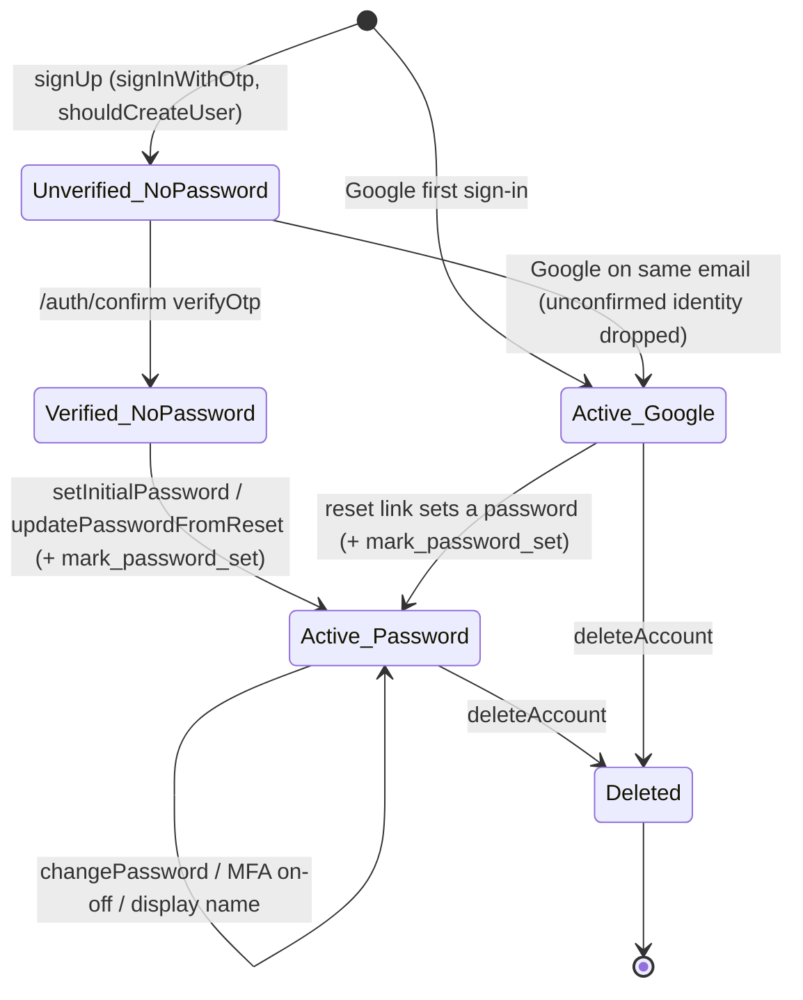
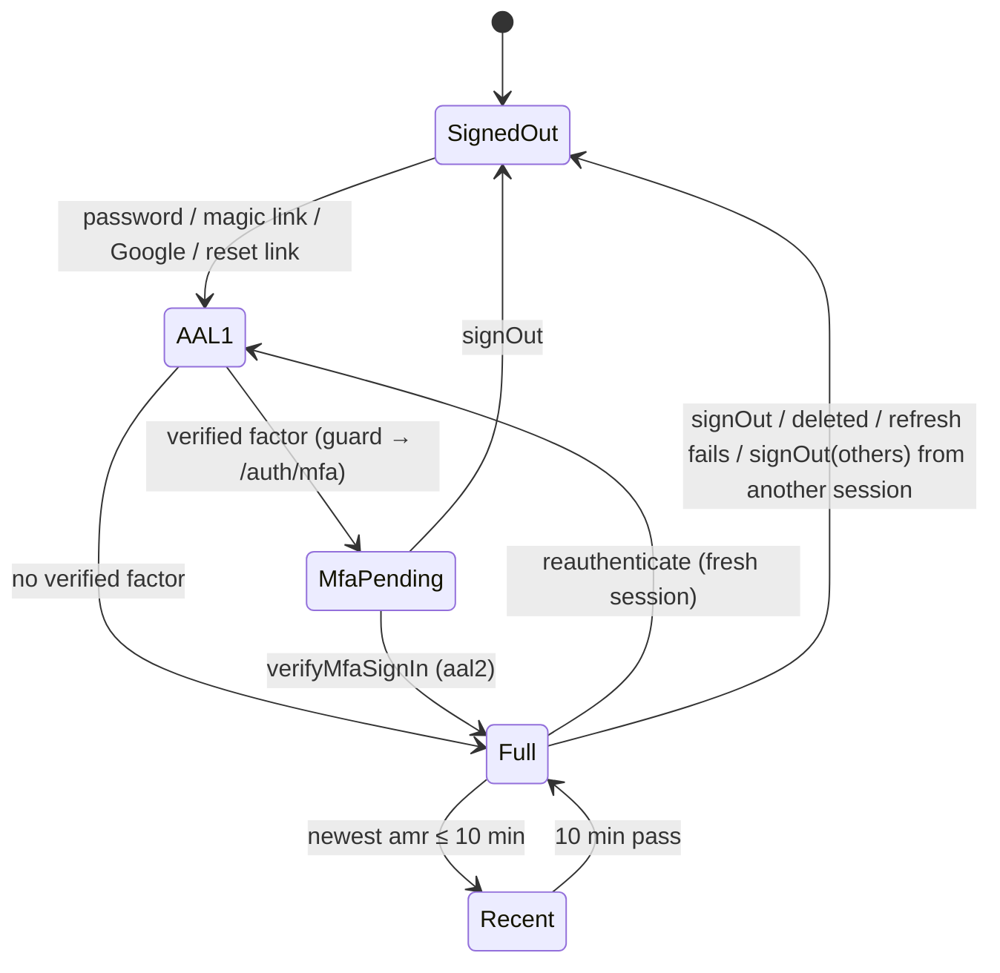
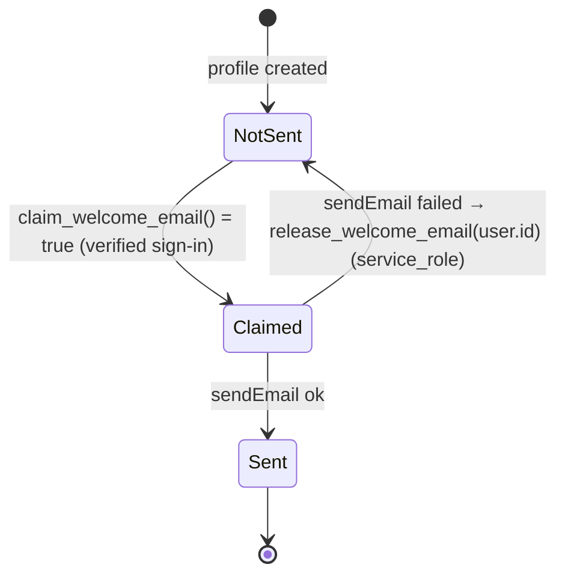

# Template: Detailed Design

Last updated: 2026-09-26 · Status: draft, revised after the PM consistency review (RFC D24) · Based on: 01-Project-Brief.md, 02-PRD.md, 03-RFC.md (D1–D24), 04-UX-Spec.md, 05-System-Design.md, 07-API-Spec.md, CLAUDE.md, `.claude/security-checklist.md`

How each part of the Template works, module by module, in enough detail to build it phase by phase.
- Names are fixed by the RFC: folders from D20, operations from D17, entities from "Core entities", and resolutions from D24.
- Screens use the UX spec's IDs (S-1 to S-20, C-1 to C-5, messages M-1 to M-7, emails E-1 to E-4).
- Exact inputs, outputs and message keys belong to the API spec (`07-API-Spec.md`). This document refers to them by name instead of repeating them.

Conventions:
- **Refuse** means an action returns `{ ok: false, error: M.<KEY> }`, where `ActionResult<T = void>` is D17 plus `data?: T` (D24 #21).
- **Redirect** means Next `redirect()`.
- **Verify (week 1)** marks something not confirmed yet. It gets checked against the real stack before the code relies on it, and the answer is recorded in `docs/decisions/`.
- Rule numbers follow the PRD/RFC numbering (CLAUDE.md rules 1–23).

---

## 1. Code structure (D20)

```
src/
  proxy.ts                         # nonce + CSP, session refresh, x-pathname, optimistic redirects
  instrumentation.ts               # Sentry server/edge init + onRequestError
  instrumentation-client.ts        # Sentry browser init
  app/
    layout.tsx                     # nonce, ThemeProvider, brand <style>, Toaster, Analytics, C-1/C-2
    globals.css, not-found.tsx, error.tsx, global-error.tsx
    manifest.ts, robots.ts, sitemap.ts, opengraph-image.tsx, icon.tsx, apple-icon.tsx
    (public)/page.tsx, (public)/privacy/page.tsx, (public)/terms/page.tsx             # S-1, S-2, S-3
    (auth)/sign-in, sign-up, forgot-password, reset-password (page.tsx each)          # S-4..S-7
    auth/error/page.tsx, auth/mfa/page.tsx, auth/set-password/page.tsx,
    auth/reauthenticate/page.tsx                                                      # S-8..S-11
    auth/confirm/route.ts, auth/callback/route.ts
    (app)/layout.tsx, (app)/loading.tsx (C-3 skeleton), (app)/dashboard/page.tsx,
    (app)/settings/page.tsx                                                           # S-12, S-13..S-18
    account/export/route.ts
  components/ui/                   # shadcn (generated)
  components/layout/               # site-header (C-1), site-footer (C-2), theme-provider
  components/auth/                 # forms, google-button, password-field (C-5), turnstile.tsx (C-4)
  components/settings/             # profile, password, two-step, your-data, delete-account sections
  config/app.ts, config/schema.ts
  emails/                          # verify-email, magic-link, reset-password, welcome + components/email-layout
  lib/                             # isomorphic, no secrets
    env/schema.ts, env/public.ts
    security/safe-redirect.ts
    validation/auth.ts, validation/account.ts
    messages.ts                    # message catalogue M.* (07-API-Spec §1.5)
    observability/scrub.ts
    types/database.types.ts (generated), utils.ts
  server/                          # every file starts with: import "server-only"
    env.ts, site-url.ts (getSiteUrl, D24 #23)
    supabase/server.ts, supabase/admin.ts
    auth/guards.ts
    actions/auth.ts, actions/mfa.ts, actions/account.ts
    security/rate-limit.ts, security/turnstile.ts, security/csp.ts
    email/send.ts, email/welcome.ts
    data/registry.ts, data/export.ts
    errors.ts
supabase/config.toml, supabase/migrations/, supabase/templates/ (generated, committed)
tests/unit/, tests/rls/, tests/e2e/
scripts/check-env-example.sh (exists), check-bundle-secrets.sh, email-build.mjs, backup.sh,
        check-supabase-env.ts
sentry.server.config.ts, sentry.edge.config.ts, next.config.ts, vercel.json (Ignored Build Step, D24 #17)
.github/workflows/ci.yml, backup.yml; .github/dependabot.yml
public/brand/logo.svg, public/brand/logo.png
```

Additions beyond the D20 tree:
- `src/lib/messages.ts` (the API spec's assumption).
- `(app)/loading.tsx` (the UX spec left it to this document).
- `scripts/check-supabase-env.ts` (§3.4).
- `vercel.json` (§7).

**Import boundaries (enforced):**
- `import "server-only"` at the top of every `src/server/**` file.
- ESLint `no-restricted-imports` blocks `@/server/*` in files containing `"use client"` (D20).
- A per-file override lets only `src/server/security/rate-limit.ts`, `src/server/email/welcome.ts` and `src/server/actions/account.ts` import `@/server/supabase/admin` (rule 6), which makes every service-role use visible.
- `react/no-danger` is an error (rule 10).

**npm scripts** (these fill the CLAUDE.md "Commands" section, FR-47):
- `dev`, `build`, `start`, `lint`, `format`, `format:check`;
- `typecheck`: `tsc --noEmit`;
- `test`: the Vitest `unit` project;
- `test:rls`: the Vitest `rls` project;
- `test:e2e`: Playwright;
- `email:build`;
- `db:start`, `db:stop`, `db:reset`: `npx supabase start|stop|db reset`;
- `db:types`: the D19 gen-types command;
- `check:env`, `check:bundle`, `check:supabase-env`.

---

## 2. Database (FR-11, FR-30, FR-1, FR-58, NFR-1, NFR-2, NFR-10, NFR-16)

Three forward-only migrations run in order. Each table enables RLS and adds its policies in the migration that creates it (rule 1). A migration is never edited after it has been applied anywhere (NFR-19).

**User-data tables live in `public`**, the schema PostgREST exposes, so export can reach them (D24 #18). The catalog test enforces this (§9).

### 2.1 Migration 1: `private` schema and shared functions

```sql
create schema if not exists private;
revoke all on schema private from public, anon, authenticated;
-- USAGE only so RLS policies can call private.mfa_satisfied(); `private` is not an exposed PostgREST schema.
grant usage on schema private to authenticated;

-- D8: aal2 in the verified JWT, or no verified factor.
create function private.mfa_satisfied()
returns boolean
language sql stable security definer
set search_path = ''
as $$
  select coalesce((auth.jwt() ->> 'aal') = 'aal2', false)
      or not exists (
           select 1 from auth.mfa_factors f
           where f.user_id = (select auth.uid()) and f.status = 'verified'
         );
$$;
revoke all on function private.mfa_satisfied() from public, anon, authenticated;
grant execute on function private.mfa_satisfied() to authenticated;

-- Generic updated_at trigger (D12/D17), reusable by app tables (07-API-Spec §6).
create function public.set_updated_at()
returns trigger
language plpgsql security invoker
set search_path = ''
as $$
begin
  new.updated_at := now();
  return new;
end $$;
revoke all on function public.set_updated_at() from public, anon, authenticated;
```

### 2.2 Migration 2: `public.profiles` (FR-11, FR-12, FR-30, FR-1)

| Column | Type | Null | Default | Notes |
| --- | --- | --- | --- | --- |
| `id` | `uuid` | no | – | PK, `references auth.users(id) on delete cascade` |
| `display_name` | `text` | yes | `null` | `check (char_length(display_name) between 1 and 80)`; the only column users can write |
| `welcome_email_sent_at` | `timestamptz` | yes | `null` | Welcome claim (FR-30) |
| `password_set_at` | `timestamptz` | yes | `null` | **The "has a password" signal** (D24 #1) |
| `created_at` | `timestamptz` | no | `now()` | |
| `updated_at` | `timestamptz` | no | `now()` | Set by `set_updated_at` |

**Indexes:** only the PK.

**RLS in plain words:**
- A signed-in user reads and updates only their own row, and only its `display_name` column.
- Nobody inserts or deletes through the API: the trigger inserts and the cascade deletes.
- A user with a verified factor needs aal2 for any access (restrictive policy).
- `anon` gets no privileges.

```sql
create table public.profiles (
  id                    uuid primary key references auth.users (id) on delete cascade,
  display_name          text check (char_length(display_name) between 1 and 80),
  welcome_email_sent_at timestamptz,
  password_set_at       timestamptz,
  created_at            timestamptz not null default now(),
  updated_at            timestamptz not null default now()
);
alter table public.profiles enable row level security;

revoke all on table public.profiles from public, anon, authenticated;   -- undo Supabase default grants
grant select on table public.profiles to authenticated;
grant update (display_name) on table public.profiles to authenticated;

create policy profiles_select_own on public.profiles
  for select to authenticated using (id = (select auth.uid()));

create policy profiles_update_own on public.profiles
  for update to authenticated
  using (id = (select auth.uid())) with check (id = (select auth.uid()));

create policy profiles_mfa_required on public.profiles
  as restrictive for all to authenticated
  using ((select private.mfa_satisfied()));

create trigger profiles_set_updated_at
  before update on public.profiles
  for each row execute function public.set_updated_at();

-- FR-11: exactly one row per new auth user. The name is taken only from Google metadata
-- (email sign-ups could set full_name themselves through the API; 07-API-Spec §6).
create function public.handle_new_user()
returns trigger
language plpgsql security definer
set search_path = ''
as $$
begin
  insert into public.profiles (id, display_name)
  values (
    new.id,
    case when new.raw_app_meta_data ->> 'provider' = 'google'
         then nullif(left(btrim(new.raw_user_meta_data ->> 'full_name'), 80), '')
    end
  );
  return new;
end $$;
revoke all on function public.handle_new_user() from public, anon, authenticated;

create trigger on_auth_user_created
  after insert on auth.users
  for each row execute function public.handle_new_user();
```

The insert has no `on conflict`. If it fails, the auth user creation fails too, so "exactly one row" holds. Linking an identity doesn't insert into `auth.users`, so it never creates a second row.

**Welcome and password functions:**

```sql
-- FR-30: atomic at-most-once claim for the caller; also requires a confirmed email.
create function public.claim_welcome_email()
returns boolean
language plpgsql security definer
set search_path = ''
as $$
begin
  update public.profiles p
     set welcome_email_sent_at = now()
   where p.id = (select auth.uid())
     and p.welcome_email_sent_at is null
     and exists (select 1 from auth.users u
                  where u.id = p.id and u.email_confirmed_at is not null);
  return found;
end $$;
revoke all on function public.claim_welcome_email() from public, anon;
grant execute on function public.claim_welcome_email() to authenticated;

-- FR-30 retry (D24 #11): service_role only. The server passes the id from getUser(), never from input.
create function public.release_welcome_email(p_user_id uuid)
returns void
language plpgsql security definer
set search_path = ''
as $$
begin
  update public.profiles set welcome_email_sent_at = null where id = p_user_id;
end $$;
revoke all on function public.release_welcome_email(uuid) from public, anon, authenticated;
grant execute on function public.release_welcome_email(uuid) to service_role;

-- D10 / D24 #1: records a password only if auth.users really holds a password hash.
-- Called by setInitialPassword, updatePasswordFromReset and changePassword.
create function public.mark_password_set()
returns boolean
language plpgsql security definer
set search_path = ''
as $$
begin
  update public.profiles p
     set password_set_at = coalesce(p.password_set_at, now())
   where p.id = (select auth.uid())
     and exists (select 1 from auth.users u
                  where u.id = p.id and coalesce(u.encrypted_password, '') <> '');
  return found;
end $$;
revoke all on function public.mark_password_set() from public, anon;
grant execute on function public.mark_password_set() to authenticated;
```

- `claim_welcome_email` runs as definer and bypasses the restrictive policy, so `signIn` can claim while the session is aal1.
- Verify (week 1): an email-first user without a password has an empty or null `encrypted_password` on GoTrue v2.197.0, and a non-empty one after `updateUser({ password })`.

### 2.3 Migration 3: `private.rate_limits` and `public.rate_limit_hit` (D3, D24 #12–14; NFR-10)

| Column | Type | Null | Default | Notes |
| --- | --- | --- | --- | --- |
| `key` | `text` | no | – | `"<action>:<ip|email|user>:<hmac-sha256 hex>"` (D24 #13) |
| `window_start` | `timestamptz` | no | – | Start of the fixed window, aligned to the epoch |
| `count` | `int` | no | `0` | Hits in this window |

**PK:** `(key, window_start)`. **Index:** `(window_start)` for the 24 h clean-up.
**RLS:** on, **no policies**, and no grants to `anon` or `authenticated`. It is reachable only through the definer function, which only `service_role` can execute.

```sql
create table private.rate_limits (
  key          text        not null,
  window_start timestamptz not null,
  count        int         not null default 0,
  primary key (key, window_start)
);
alter table private.rate_limits enable row level security;
revoke all on table private.rate_limits from public, anon, authenticated;
create index rate_limits_window_start_idx on private.rate_limits (window_start);

-- Returns TRUE when the request is ALLOWED (count after this hit <= p_max), FALSE when over the limit (D24 #12).
create function public.rate_limit_hit(p_key text, p_max int, p_window_seconds int)
returns boolean
language plpgsql volatile security definer
set search_path = ''
as $$
declare
  v_window timestamptz;
  v_count  int;
begin
  if p_key is null or char_length(p_key) not between 1 and 200
     or p_max < 1 or p_window_seconds not between 1 and 86400 then
    raise exception using errcode = '22023', message = 'rate_limit_hit: invalid arguments';
  end if;
  v_window := to_timestamp(floor(extract(epoch from now()) / p_window_seconds) * p_window_seconds);

  insert into private.rate_limits as r (key, window_start, count)
  values (p_key, v_window, 1)
  on conflict (key, window_start) do update set count = r.count + 1
  returning r.count into v_count;

  delete from private.rate_limits where window_start < now() - interval '24 hours';
  return v_count <= p_max;
end $$;
revoke all on function public.rate_limit_hit(text, int, int) from public, anon, authenticated;
grant execute on function public.rate_limit_hit(text, int, int) to service_role;
```

- The upsert is one statement, so concurrent hits on the same key serialise on the row lock.
- The window is fixed, so up to 2× `p_max` can get through across a window boundary. That's accepted with D3.

### 2.4 Generated types (FR-43)
- `npm run db:types` after every migration.
- CI regenerates the types and fails on a diff (§8).

### 2.5 `supabase/config.toml` (auth settings that matter)
| Key | Value | Why |
| --- | --- | --- |
| `[auth] site_url` | `http://127.0.0.1:3000` (production value in `[remotes.production]`) | Email link base (D7) |
| `[auth] additional_redirect_urls` | `http://127.0.0.1:3000/**`, `http://localhost:3000/**` | OAuth `redirectTo` allow-list |
| `[auth] jwt_expiry` | `3600` | D2 |
| `[auth] enable_signup` / `enable_manual_linking` | `true` / `false` | D11, D10 |
| `[auth] minimum_password_length` | `12` | D22 |
| `[auth.email] enable_confirmations`, `secure_password_change` | `true`, `true` | FR-2, D9 |
| `[auth.email.template.confirmation]` | `subject = "Confirm your email"`, `content_path = "./supabase/templates/confirmation.html"` | D7; **generic subject, no app name** (D24 #25) |
| `[auth.email.template.magic_link]` | `subject = "Your sign-in link"` | same |
| `[auth.email.template.recovery]` | `subject = "Reset your password"` | same |
| `[auth.captcha]` | `enabled = true`, `provider = "turnstile"`, `secret = "env(TURNSTILE_SECRET_KEY)"` | D4 |
| `[auth.external.google]` | `enabled = true`, `client_id = "env(GOOGLE_CLIENT_ID)"`, `secret = "env(GOOGLE_CLIENT_SECRET)"` | FR-5 |
| `[auth.mfa.totp]` | `enroll_enabled = true`, `verify_enabled = true` | D8 |
| `[auth.rate_limit] email_sent` | `30` | D3 |
| `[storage] enabled` | `false` | D23 |
| `[remotes.production]` | shipped commented out | D7 |

Verify (week 1):
- How the CLI resolves `env(...)` (which env files it reads).
- Whether `supabase start` fails when Google is enabled with empty credentials. If it does, CI sets non-secret dummy values, like the Turnstile dummy keys.

---

## 3. Core modules

### 3.1 Proxy: `src/proxy.ts` (D2, D5; FR-9, FR-10, NFR-13)
1. `nonce = btoa(crypto.randomUUID())`; `csp = buildCsp({ nonce, dev, supabaseUrl })` (§3.8).
2. Copy the request headers and **overwrite** `x-nonce`, `x-pathname` (`pathname + search`) and `content-security-policy`. Overwriting stops a client from injecting its own values.
3. `response = NextResponse.next({ request: { headers } })`.
4. Create the Supabase server client with the D21 cookie options (shared with §3.3).
   - `setAll` writes to `request.cookies` and rebuilds the response (Supabase's documented pattern).
   - Call `auth.getClaims()`. This refreshes the session (FR-10).
5. **Optimistic redirect only:**
   - no claims on a path under `/dashboard`, `/settings`, `/account`, `/auth/set-password`, `/auth/reauthenticate` or `/auth/mfa` → `302 /sign-in?next=<encoded path+search>`;
   - otherwise nothing.
6. Set `Content-Security-Policy` on the response. Add `Cache-Control: private, no-store` when cookies were set or the response is a redirect.

**Matcher:** everything except `_next/static`, `_next/image`, `monitoring`, `favicon.ico`, `icon*`, `apple-icon*`, `manifest.webmanifest`, `robots.txt`, `sitemap.xml`, `opengraph-image*`, and prefetch requests (the `missing` headers from the Next docs).

If `getClaims()` throws, the proxy logs to Sentry and lets the request through. The page guard is what fails closed.

### 3.2 Guards: `src/server/auth/guards.ts` (D2, D9, D10, D24 #2, #3, #30; FR-9, FR-56, FR-58, NFR-3)

```ts
type GuardFailure = 'signed_out' | 'mfa_required' | 'password_required' | 'reauth_required';
class GuardError extends Error { code: GuardFailure }

requireUser(options?: { allowPendingMfa?: boolean; allowPendingPassword?: boolean })   // both default false
  : Promise<{ supabase; user; claims }>
requireRecentSignIn(): Promise<{ supabase; user; claims }>
isRecentSignIn(amr: { timestamp: number }[] | undefined, nowMs: number): boolean          // pure; injected clock (D24 #30)
withRefusals<T>(fn: () => Promise<T>): Promise<T>   // runs fn in "refuse" mode (AsyncLocalStorage)
```

`requireUser` and `requireRecentSignIn` are wrapped in React `cache()`, so there's one Auth round-trip per request.

**`requireUser` steps:**
1. `supabase = await createClient()`.
2. `getUser()`. No user, an error, or `email_confirmed_at` null → `signed_out`.
3. `getClaims()`. None → `signed_out`.
4. **MFA:** `hasVerifiedFactor` comes from `user.factors`, as returned by the Auth server, never the cookie. If `claims.aal !== 'aal2' && hasVerifiedFactor && !allowPendingMfa` → `mfa_required`.
5. **Password step (D10, D24 #1):** skipped when `allowPendingPassword` or `allowPendingMfa` is set.
   - It applies when every `user.identities[].provider` is `email`.
   - It reads `profiles.password_set_at` with the user client. Null → `password_required`.
   - A query error or a missing row is logged and handled as a generic failure (fail closed).
6. Return `{ supabase, user, claims }`.

**`requireRecentSignIn`:** `requireUser()`, then `isRecentSignIn(claims.amr, Date.now())`. That is true when the newest `amr[].timestamp` (seconds) is ≤ 600 s old. Empty or missing `amr` → false → `reauth_required`.

**Failure handling:**
- Pages run in the default **redirect mode**.
- `runAction` (§3.7) runs actions inside `withRefusals`, where the guard throws `GuardError` instead of redirecting.
- If a developer forgets `runAction`, the guard still redirects, so it fails safe.

| Code | Redirect mode (pages) | Refuse mode (actions) |
| --- | --- | --- |
| `signed_out` | `/sign-in?next=<x-pathname>` | `M.SESSION_ENDED` |
| `mfa_required` | `/auth/mfa?next=<x-pathname>` | `M.MFA_REQUIRED` |
| `password_required` | `/auth/set-password?next=<x-pathname>` | `M.PASSWORD_NOT_SET` |
| `reauth_required` | `/auth/reauthenticate?next=<x-pathname>` | `redirect('/auth/reauthenticate?next=/settings')`, where `next` is a constant (07-API-Spec §1.1) |

Every `next` goes through `safeRedirectPath()` (D24 #8).

**Layout vs page:** `(app)/layout.tsx` calls `requireUser()`, but layouts don't re-run on client navigation. So each page and action calls its guard itself. A grep-based unit test checks every protected `page.tsx` (§9).

| Page (screen) | Guard |
| --- | --- |
| `/dashboard` (S-12), `/settings` (S-13) | `requireUser()` |
| `/auth/set-password` (S-9) | `requireUser({ allowPendingPassword: true })`, then `/dashboard` if `password_set_at` is set or the user has a non-email identity |
| `/auth/mfa` (S-10) | `requireUser({ allowPendingMfa: true })`, then `safeRedirectPath(next)` if already aal2 or no verified factor |
| `/auth/reauthenticate` (S-11) | `requireUser()` |
| `/reset-password` (S-7) | `requireUser()` plus the recovery check (§4.7) |

### 3.3 Supabase clients (D21, D6)
- **`src/server/supabase/server.ts` `createClient()`:**
  - `createServerClient<Database>(url, publishableKey, { cookies: { getAll, setAll }, cookieOptions })`.
  - `setAll` is wrapped in try/catch, because Server Components can't set cookies.
  - `cookieOptions = { httpOnly: true, secure: isSecureCookie(), sameSite: 'lax', path: '/' }`.
  - `isSecureCookie()` is false **only** for an `http:` site URL whose host isn't `localhost`, `127.0.0.1` or `[::1]`. Chromium treats localhost as a secure context.
  - The proxy uses the same options through a shared function.
- **`src/server/supabase/admin.ts` `getAdminClient()`:**
  - Uses the secret key with `persistSession: false`, `autoRefreshToken: false`, `detectSessionInUrl: false`.
  - It has exactly three users: the rate limiter RPC, `release_welcome_email(p_user_id)`, and `deleteAccount` → `auth.admin.deleteUser`.
- **No browser client** (D21). A unit test greps `src/` for `createBrowserClient` and fails on any match.

### 3.4 Env: schemas, parser, public, bundle scan (D6, D24 #28; FR-52, NFR-4, NFR-5)
**`src/lib/env/schema.ts`** holds pure Zod schemas and no values, in three parts.

- **`publicEnvSchema`:**
  - `NEXT_PUBLIC_SITE_URL`: `z.url()`, required when `VERCEL_ENV === 'production'`.
  - `NEXT_PUBLIC_SUPABASE_URL`: `z.url()`.
  - `NEXT_PUBLIC_SUPABASE_PUBLISHABLE_KEY`: non-empty.
  - `NEXT_PUBLIC_TURNSTILE_SITE_KEY`: non-empty.
  - `NEXT_PUBLIC_SENTRY_DSN`: `z.url()`, optional locally and required in production.
- **`serverEnvSchema`** (required by the Next build and at runtime) = public plus:
  - `SUPABASE_SECRET_KEY`;
  - `RATE_LIMIT_HMAC_SECRET` (≥ 32 characters);
  - `EMAIL_TRANSPORT` (`resend` | `mailpit`; `mailpit` is refused when `VERCEL_ENV=production`);
  - `RESEND_API_KEY` (required when the transport is `resend`);
  - `EMAIL_FROM`;
  - `MAILPIT_URL` (required when the transport is `mailpit`);
  - `SENTRY_AUTH_TOKEN`, `SENTRY_ORG`, `SENTRY_PROJECT` (optional);
  - `TURNSTILE_SECRET_KEY` **optional** here. It's read only by `verifyTurnstile()`, which fails closed without it.
- **`supabaseConfigEnvSchema`**, **not** required by the Next build:
  - `TURNSTILE_SECRET_KEY`, `GOOGLE_CLIENT_ID`, `GOOGLE_CLIENT_SECRET`, `RESEND_API_KEY` (the SMTP password).
  - These are read only by `config.toml` `env()` on the Builder's machine.
  - `GOOGLE_CLIENT_SECRET` and `TURNSTILE_SECRET_KEY` are **not set on Vercel** (D24 #28).

**Validation and errors:**
- `formatEnvError(error)` prints `"Missing or invalid environment variables: A, B"` from `issue.path` only, never values or Zod message text (FR-52).
- Verify (week 1): whether local CLI 2.118 issues `sb_publishable_…` and `sb_secret_…` keys. If it does, tighten those two rules to `startsWith`.
- **`src/server/env.ts`** parses `serverEnvSchema` once and exports a frozen `env`.
- **`src/lib/env/public.ts`** references each `NEXT_PUBLIC_*` literally, then parses.
- **`next.config.ts`** parses `serverEnvSchema` at config load and throws `formatEnvError` on failure (FR-52).
- **`scripts/check-supabase-env.ts`** (run by Node 24's built-in type stripping; `npm run check:supabase-env`) parses `supabaseConfigEnvSchema` from the environment. The README's `supabase config push` step runs it first, and so does the CI `integration` job before `supabase start`.

**`scripts/check-bundle-secrets.sh`** (after `next build`):
1. For each of `SUPABASE_SECRET_KEY`, `RESEND_API_KEY`, `TURNSTILE_SECRET_KEY`, `SENTRY_AUTH_TOKEN` and `RATE_LIMIT_HMAC_SECRET` that has ≥ 8 characters, run `grep -rlF` over `.next/static` and `.next/server/**/*.html`.
2. Also search for `sb_secret_|"role":"service_role"`.
3. A hit prints the file path and variable name only, then exits 1.
4. A missing `.next/static` exits 2.
5. The one-off deliberate bad import (NFR-4) is recorded in its PR.

**`.env.example`** is written line by line by hand (rule 8), with placeholders only. The existing check allows only empty, `<…>`, localhost URLs, `true|false|development|test|production` and short numbers.

```
# Public. Canonical site URL; on Vercel Preview it falls back to the branch URL.
NEXT_PUBLIC_SITE_URL=http://localhost:3000
# Public. Supabase API URL (local default).
NEXT_PUBLIC_SUPABASE_URL=http://127.0.0.1:54321
# Public. Supabase publishable key (sb_publishable_...).
NEXT_PUBLIC_SUPABASE_PUBLISHABLE_KEY=<your-supabase-publishable-key>
# SECRET. Supabase secret key (sb_secret_...). Server only; bypasses RLS.
SUPABASE_SECRET_KEY=
# SECRET. HMAC key for rate-limit keys. Generate with: openssl rand -hex 32
RATE_LIMIT_HMAC_SECRET=
# Public. Cloudflare Turnstile site key.
NEXT_PUBLIC_TURNSTILE_SITE_KEY=<your-turnstile-site-key>
# SECRET. Turnstile secret. Read by supabase config push (not set on Vercel).
TURNSTILE_SECRET_KEY=
# Server. "resend" or "mailpit" (mailpit is refused in production).
EMAIL_TRANSPORT=<resend-or-mailpit>
# SECRET. Resend API key (welcome email; also Supabase SMTP password).
RESEND_API_KEY=
# Server. Sender, e.g. "App <address@your-domain>".
EMAIL_FROM=<your-from-address>
# Server. Local Mailpit URL.
MAILPIT_URL=http://127.0.0.1:54324
# Public. Sentry DSN.
NEXT_PUBLIC_SENTRY_DSN=<your-sentry-dsn>
# SECRET. Sentry auth token for source-map upload (Vercel only).
SENTRY_AUTH_TOKEN=
# Server. Sentry org and project slugs.
SENTRY_ORG=<your-sentry-org>
SENTRY_PROJECT=<your-sentry-project>
# SECRET. Google OAuth client. Read by supabase config push (not set on Vercel).
GOOGLE_CLIENT_ID=<your-google-client-id>
GOOGLE_CLIENT_SECRET=
# Scripts/CI only. Session-pooler DB URL for backups (a GitHub secret in the app repo).
SUPABASE_DB_URL=
# Scripts/CI only. age public key for backups (a GitHub repo variable).
BACKUP_AGE_RECIPIENT=
# Tests only. Empty means local; set to "deployed" for the deployed e2e run.
E2E_TARGET=
# Tests only. Resend account owner's address, for the deployed e2e run.
E2E_EMAIL=
```

`E2E_TARGET` ships empty (meaning local), because the placeholder check would reject `local` (see the reply to the PM).

### 3.5 Rate limiter: `src/server/security/rate-limit.ts` (D3, D24 #12–14; NFR-10, NFR-12)

`LIMITS` = the D3 table plus the D24 #14 rows:
- `startMfaEnrollment` 10 / hour (user);
- `signInWithGoogle` 20 / 10 min (IP);
- `authConfirm` and `authCallback` 30 / 10 min (IP);
- `signOut` has no limit.

`rateLimit(action, { email?, userId? }): Promise<boolean>` (true = allowed):
1. Build the keys: `"<action>:ip:" + hmac(clientIp())`, `"<action>:email:" + hmac(email.trim().toLowerCase())`, `"<action>:user:" + hmac(userId)`.
   - `hmac = createHmac('sha256', env.RATE_LIMIT_HMAC_SECRET).update(v).digest('hex')` (D24 #13).
2. `clientIp()` is the first `x-forwarded-for` value (Vercel overwrites it), otherwise `'unknown'`.
   - Locally and in CI, all requests share `'unknown'`; tests reset the table (§9).
   - Off Vercel the header can be spoofed. That's documented as a constraint.
3. Call `rate_limit_hit` once per key through the admin client, **IP key first**, stopping at the first `false`. `allowed = data === true`, so anything else counts as limited.
4. **Fail closed:** an RPC error is logged (no key contents) and returns `false`.
   - The caller shows `M.GENERIC` for a limiter error and `M.RATE_LIMITED` for a limit (07-API-Spec §1.4).
5. Rotating `RATE_LIMIT_HMAC_SECRET` resets all counters. That's acceptable; the README notes it.

**Order in every action:** Zod → guard → rate limit → Supabase call. `deleteAccount` runs the guard before Zod (D12).

**Response padding:** `padToMinimum(start, 500)` (in `errors.ts`) on `signUp`, `requestMagicLink`, `requestPasswordReset` and a failed `signIn` (D24 #10).

### 3.6 Turnstile, C-4 (D4; NFR-11)
**`src/components/auth/turnstile.tsx`** (client component):
- Loads `…/turnstile/v0/api.js?render=explicit` once, with the request nonce.
- Calls `turnstile.render(el, { sitekey, action, theme: 'auto' })` in managed mode. The widget writes its default hidden `cf-turnstile-response` input.
- **Resets after every submit result.**
- The submit button **stays enabled** without a token (UX C-4). A missing token comes back as M-6.
- It's used on S-4 (the active tab only), S-5, S-6 and S-11 (password path).

**Server side:**
- Each action maps `cf-turnstile-response` to `turnstileToken` before Zod (07-API-Spec §1.3). The token must be non-empty and ≤ 2048 characters.
- The token is passed as `options.captchaToken`. The action never calls siteverify.
- Supabase `captcha_failed` → `M.CAPTCHA_FAILED`.

**`src/server/security/turnstile.ts` `verifyTurnstile(token, { remoteIp?, expectedAction? })`:**
- For non-auth forms that apps add later.
- Siteverify POST with a 5 s timeout. It checks `success` and, when given, `action`.
- **Fails closed**, including when `TURNSTILE_SECRET_KEY` is unset.
- Unit-tested with a mocked `fetch`. No Template form uses it.

### 3.7 Action shape, messages and errors: `src/server/errors.ts`, `src/lib/messages.ts` (D17, D24 #21; NFR-9)
- `ActionResult<T = void> = { ok: true; message?: string; data?: T } | { ok: false; error: string; fieldErrors?: Record<string, string[]> }`.
- `runAction(fn)`:
  - runs `fn` inside `withRefusals` (§3.2);
  - maps `GuardError` → refusal;
  - re-throws Next redirect errors;
  - maps anything else to `logError` + `M.GENERIC`.
- `logError(error, { op, userId? })` sends to Sentry (scrubbed, §3.15) plus a scrubbed `console.error`. It never logs passwords, tokens or raw emails.
- `toUserMessage(code)` maps Supabase `AuthError.code` to an `M.*` key. Unknown codes → `M.GENERIC`, logged.
- `M` in `src/lib/messages.ts` holds every user-facing string. Tests assert against it.
- Zod object schemas are `.strict()`. Next's internal `$ACTION_*` keys are stripped first.

### 3.8 CSP builder: `src/server/security/csp.ts` (D5; NFR-13)
- `STYLE_POLICY: 'split' | 'unsafe-inline' = 'split'`. Changing it requires a `docs/decisions/` entry.
- `buildCsp({ nonce, dev, supabaseUrl })` builds exactly the D5 policy. `{SUPABASE_URL}` is `new URL(supabaseUrl).origin`.
- `dev` adds `'unsafe-eval'` to `script-src` only.
- **Split rule:** `style-src-elem 'self' 'nonce-{N}'; style-src-attr 'unsafe-inline'`.
- **Fallback:** `style-src 'self' 'unsafe-inline'`, used only if the week-1 check (Sonner, `next/font`, next-themes) finds un-nonced `<style>` tags that can't be fixed.
- Script rules never depend on `STYLE_POLICY`.
- Static headers go in `next.config.ts` exactly as D5 lists them.
- The root layout reads `x-nonce`, passes it to next-themes, Turnstile and the brand `<style>`, and throws if it's missing.

### 3.9 Safe redirects: `src/lib/security/safe-redirect.ts` (D17; NFR-8)
`safeRedirectPath(input: unknown, fallback = '/dashboard')`:
1. Non-string input, or more than 2048 characters → fallback.
2. Decode up to 3 rounds. A decode error → fallback.
3. The decoded value must:
   - start with exactly one `/`;
   - not start with `//` or `/\`;
   - contain no `\`, control characters or leading whitespace;
   - not match a scheme (`^[a-z][a-z0-9+.-]*:`).
4. Final check: `new URL(v, 'http://x.invalid').origin === 'http://x.invalid'`.
5. Paths under `/auth/`, `/sign-in` and `/sign-up` fall back, which prevents loops. The exceptions are `/auth/set-password` and `/auth/mfa`.
6. Return the original value.

Settings section anchors (`#…`) are never used as `next` (UX).

### 3.10 Validation schemas (NFR-6)
These follow `07-API-Spec.md` §1.3, with these D24/UX differences:
- `passwordSchema`: `.min(12)` characters, plus a refine that `new TextEncoder().encode(v).length <= 72` (D24 #15). The message key is the API's max-length message.
- **No `confirmPassword` field.** The UX spec (C-5) drops it, so `newPasswordSchema = z.object({ password: passwordSchema })`.
- Sign-in and re-auth passwords: `min(1)` and the same 72-byte cap.
- `displayNameSchema`:
  - trim, 1–80 **code points** (`[...s].length`, which matches `char_length`);
  - `/^[^\p{Cc}]+$/u` rejects control characters.
- Search params:
  - `/auth/confirm` `{ token_hash (1–512), type: z.enum(['signup','magiclink','recovery','email']) }` (D24 #7);
  - `/auth/callback` `{ code?, error?, error_description? }`;
  - `/auth/error` `reason: z.enum(['link','oauth','rate_limited']).catch('link')` (D24 #27);
  - `/sign-in` `error: z.enum(['oauth_cancelled']).optional()`;
  - `/settings` `export: z.enum(['rate_limited','failed']).optional()`;
  - `/` `account: z.enum(['deleted']).optional()`.

### 3.11 Config, site URL, contrast (D16, D24 #23, #24; FR-26, FR-27, FR-51, NFR-23)
- **`src/config/schema.ts`:**
  - `name` (1–60), `shortName` (1–12), `description` (1–200), `supportEmail`;
  - `brand` hex `/^#[0-9a-f]{6}$/i` (`primary`, `primaryForeground`, `primaryDark?`, `primaryForegroundDark?`);
  - `logo { svg, png, alt }`, `legal { entityName }`.
- **`src/config/app.ts`:** `appConfig = appConfigSchema.parse({...})`. The placeholders are clearly marked (`'Template App'`, `support@example.com`, `'<Your legal entity>'`) (FR-27).
- **Contrast test (D24 #24)** in `tests/unit/config.test.ts`:
  - WCAG relative luminance, requiring ≥ 4.5:1 for `primary`/`primaryForeground`;
  - also for `primaryDark`/`primaryForegroundDark` when set;
  - failure messages name the pair.
- **`src/server/site-url.ts` `getSiteUrl()`** (server-only):
  - `NEXT_PUBLIC_SITE_URL`, else `https://${VERCEL_BRANCH_URL}` on Preview, else it throws;
  - no trailing slash.
  - Client components get absolute URLs as props.

### 3.12 Registry and export: `src/server/data/*` (D12, D13, D24 #18, #19; FR-15, FR-16, NFR-16)
```ts
export const USER_DATA_TABLES = [{ schema: 'public', table: 'profiles', ownerColumn: 'id' }] as const;
export const NON_USER_DATA_TABLES = [{ schema: 'private', table: 'rate_limits', reason: 'hashed keys, 24 h retention' }] as const;
```
The `USER_DATA_TABLES` type restricts `schema` to `'public'` (D24 #18).

`buildExport(supabase, user)`:
1. `account` holds `id`, `email`, `created_at`, `email_confirmed_at`, `last_sign_in_at`, `providers` (distinct `user.identities[].provider`) and `mfa_enabled` (a verified factor exists).
2. For each registry entry: `supabase.from(table).select('*').eq(ownerColumn, user.id)` with the **user client** (RLS applies).
   - Any error aborts the whole export. A partial file is never sent.
   - An empty table gives `[]`.
3. Returns the D13 object (`format`, `version: 1`, `exported_at`, `app: appConfig.name`).
4. Never included: tokens, factor secrets, `identity_data`, password hashes.

### 3.13 Email pipeline (D7, D24 #25; FR-28, FR-29, FR-30)
**Templates (E-1 to E-4):**
- `EmailLayout` has the logo PNG (`{{ .SiteURL }}/brand/logo.png`), `appConfig.name`, a brand-colour button, the plain URL, and `supportEmail` in the footer.
- Auth templates set `PreviewProps` to Go placeholders (`{{ .SiteURL }}`, `{{ .TokenHash }}`) with a fixed `type`: `signup` (verify-email), `magiclink`, `recovery`.
- Link: `{{ .SiteURL }}/auth/confirm?token_hash={{ .TokenHash }}&type=<type>`.
- Email **bodies** may use the app name. It's inlined at build from `appConfig`, and the generated files are excluded from the FR-26 grep.
- **Subjects** are the generic strings in `config.toml` (§2.5). The sender name comes from `EMAIL_FROM`.

**`npm run email:build`:**
1. `email export` into a git-ignored `.email-out/`.
   - Verify (week 1): the react-email 6.11 CLI flags, whether it uses `PreviewProps`, and whether it escapes `{{ }}`.
2. `scripts/email-build.mjs`:
   - maps the output to `supabase/templates/{confirmation,magic_link,recovery}.html`;
   - exits 1 unless each file contains a literal `{{ .TokenHash }}` and `{{ .SiteURL }}`;
   - adds a "generated, do not edit" comment.
3. CI checks `git diff --exit-code supabase/templates`.

Verify (week 1), from D10:
- Which template GoTrue uses for a **new** user created by `signInWithOtp({ shouldCreateUser: true })` (expected: `confirmation`), and for an **existing** user (expected: `magic_link`).
- That each baked-in `type` verifies. This decides whether `email` is needed in the `/auth/confirm` allow-list (D24 #7).

**Transport: `src/server/email/send.ts` `sendEmail({ to, subject, html, text })` → `{ ok }`, never throws:**
- `resend`: `emails.send({ from: EMAIL_FROM, … })`. A non-null `error` counts as a failure.
- `mailpit`: `POST {MAILPIT_URL}/api/v1/send` with `{ From, To: [{ Email }], Subject, HTML, Text }` and a 5 s timeout.
  - Verify (week 1): the endpoint is enabled in the CLI container, and the payload field names. Fallback per D7: `smtp_port`.
- The recipient is never logged.

**Welcome: `src/server/email/welcome.ts` `sendWelcomeIfFirst(supabase, user)`:**
1. `supabase.rpc('claim_welcome_email')` with the user client. On an error: log and return (nothing was claimed).
2. If not `true`, return.
3. Render `welcome.tsx` (HTML and `plainText`). Subject: `Welcome to ${appConfig.name}` (app-sent, so not in `config.toml`).
4. On a send failure: `getAdminClient().rpc('release_welcome_email', { p_user_id: user.id })`, with the id from `getUser()` (D24 #11). Then `logError`.
5. Awaited before the redirect. A welcome failure never fails the sign-in.

Callers: `/auth/confirm` (every type, 07-API-Spec §5), `/auth/callback`, and `signIn`.

### 3.14 Shell, branding, SEO (D16; FR-17, FR-20–FR-26)
**Root layout:**
- `<style nonce>` with `:root{--primary;--primary-foreground}` plus `.dark` overrides. The values are Zod-validated hex, so CSS can't be injected.
- `ThemeProvider`: `attribute="class"`, `defaultTheme="system"`, with the nonce.
- `<Toaster position="top-center" />`, `<Analytics />`.
- The C-2 theme select is optional (FR-21 "could").

**C-1 header:** the signed-in account menu always shows the signed-in **email** (as text), because D24 #9 relies on it against login CSRF. `display_name` appears as the menu label when set.

**C-2 footer:** privacy, terms, `mailto:supportEmail`, © `legal.entityName`.

**Legal pages (S-2, S-3):**
- A non-dismissible "Placeholder text" banner.
- The privacy placeholder lists the service providers: Supabase, Vercel (including Web Analytics), Resend, Cloudflare Turnstile, Sentry, and Google for sign-in.
- It also states the 30-day backup retention (D24 #20, FR-17).

**Metadata routes (07-API-Spec §5):**
- `manifest.ts` (name, short_name, theme_color, 192/512 icons).
- `robots.ts`:
  - production: `Allow: /`, `Disallow: /dashboard, /settings, /auth/, /account/`, plus the sitemap;
  - non-production `VERCEL_ENV`: `Disallow: /`.
- `sitemap.ts`: `/`, `/privacy`, `/terms`.
- `opengraph-image.tsx` (1200×630), `icon.tsx`, `apple-icon.tsx`.
- Protected and auth pages set `robots: { index: false }`.
- Titles are `"{Page} · {appConfig.name}"`.

### 3.15 Sentry: scrubber and setup (D15; FR-31, NFR-17)
**Init** (`instrumentation-client.ts`, `sentry.server.config.ts`, `sentry.edge.config.ts`):
- `sendDefaultPii: false`;
- `dataCollection: { userInfo: false, cookies: false, httpHeaders: false, httpBodies: [], urlQueryParams: false }`;
- `tracesSampleRate: 0`, no Replay;
- `beforeSend` / `beforeSendTransaction: scrubEvent`, `beforeBreadcrumb: scrubBreadcrumb`.

`instrumentation.ts` exports `onRequestError = Sentry.captureRequestError`. `withSentryConfig` uses `tunnelRoute: '/monitoring'`.

**`src/lib/observability/scrub.ts`** (pure):
- `redactString`: replaces email-shaped text, JWTs (`eyJ…​.…​.…`), `sb_(secret|publishable)_…`, `re_…` keys, and `token_hash|code|access_token|refresh_token=` values.
- `stripQuery` drops `?…` and `#…`.
- `scrubEvent`:
  - deletes `user`;
  - deletes `request.cookies`, `headers`, `data`, `query_string`, and strips the query from `request.url`;
  - redacts `message`, `exception.values[].value` and `logentry`;
  - deep-redacts `extra`, `contexts` and `tags` (depth ≤ 6, cycles guarded);
  - strips queries from breadcrumb URLs.
- `scrubBreadcrumb`: strips queries from URL fields, redacts `message`, drops `data.body`.
- On an internal error either function returns `null`, which drops the event.

**`/monitoring`** is a documented exception to "Zod + rate limit" (D24 #16). It forwards only to the configured DSN.

### 3.16 Backups and restore (D14; FR-33–FR-35, NFR-18)
**`scripts/backup.sh`** (`set -euo pipefail`, `umask 077`):
1. Requires `SUPABASE_DB_URL` and `BACKUP_AGE_RECIPIENT`. If one is missing, it exits naming the variable.
2. Works in a `mktemp -d` directory with a `trap` that deletes it on exit.
3. Runs the three D14 `npx supabase db dump --db-url …` passes (`--role-only`, schema, `--data-only --use-copy -x storage.buckets_vectors -x storage.vector_indexes`).
4. `tar czf - … | age -r "$BACKUP_AGE_RECIPIENT" -o "${OUT_DIR:-.}/backup-$(date -u +%F).tar.gz.age"`. The plaintext never leaves the temp directory.
5. Prints only the output file name and size.

**`.github/workflows/backup.yml`:**
- `workflow_dispatch` only in the Template. The app enables `cron: '17 3 * * *'`.
- `permissions: contents: read`, `timeout-minutes: 15`.
- Steps: SHA-pinned checkout → setup-node → `npm ci --ignore-scripts` → `apt-get install age` → the script (secret `SUPABASE_DB_URL`, variable `BACKUP_AGE_RECIPIENT`) → `upload-artifact` with `retention-days: 30`, `if-no-files-found: error`.
- Failed scheduled runs email the owner through GitHub's default notification. That's an assumption, and the README says to check the setting.

**Restore** (README, FR-35):
1. Create a new project.
2. `age -d -i <key> … | tar xz`.
3. Run the D14 `psql --single-transaction …` command.
4. Compare row counts on the source and the restored project. Apps add a line per registry table.
   ```sql
   select 'auth.users', count(*) from auth.users
   union all select 'auth.identities', count(*) from auth.identities
   union all select 'auth.mfa_factors', count(*) from auth.mfa_factors
   union all select 'public.profiles', count(*) from public.profiles;
   ```
5. Sign in as the test user.
6. Record the date in `docs/decisions/` and the README.

---

## 4. Features and flows

Signed-out auth actions: Zod → rate limit (IP, then email) → Supabase call with `captchaToken` → fixed message → padding (§3.5).
Signed-in actions: `runAction` → Zod → guard → rate limit → Supabase call → revalidate/redirect.
The operation contracts are in `07-API-Spec.md` §2–5.

### 4.1 Sign-up, email first (FR-1, FR-2, FR-11, NFR-11, NFR-12, NFR-26; D10) · S-5 → E-1/E-2 → `/auth/confirm` → S-9 → S-12
**`signUp`:**
1. Zod `{ email, turnstileToken }`.
2. `rateLimit('signUp', { email })`.
3. `signInWithOtp({ email, options: { shouldCreateUser: true, captchaToken, emailRedirectTo: getSiteUrl() + '/auth/confirm' } })`.
4. Every outcome except `captcha_failed` gives `{ ok: true, message: M.SIGNUP_SENT }` (the UX panel M-1). That covers a new email, an existing one, an unconfirmed one, a Google-only one, Supabase's 60 s rule, a Supabase 429, and any other Supabase error (logged).
5. `padToMinimum(500)`.

**What's saved:** GoTrue creates an unconfirmed `auth.users` row with **no password**, and `handle_new_user` adds one `profiles` row.

**Edge cases:**
- Repeated sign-ups: any link works, and there's never a password to take over.
- A user who never verifies: a harmless row. Clean-up is out of scope (D10).
- An existing Google account: the user gets a sign-in link.
- Cross-device links work: `/auth/confirm` needs no PKCE verifier.

### 4.2 `/auth/confirm` (FR-2, FR-4, FR-8, FR-30; D7, D24 #6, #7, #14)
1. `rateLimit('authConfirm')` (IP, 30 / 10 min). If limited: `303 /auth/error?reason=rate_limited`.
2. Zod the query. On failure: `303 /auth/error?reason=link`.
3. `verifyOtp({ token_hash, type })`. On error (expired, used, invalid): `303 /auth/error?reason=link` (S-8).
4. `sendWelcomeIfFirst()` (§3.13).
5. Redirect:
   - `type=recovery`:
     - set `auth_recovery=1` only if the week-1 check shows `amr` doesn't record `recovery` (the fallback);
     - the cookie is `HttpOnly; Secure (§3.3); SameSite=Lax; Path=/; Max-Age=900`;
     - then `303 /reset-password`.
   - Otherwise: read and delete `auth_next`, then `303 safeRedirectPath(auth_next)`. The destination's guard then sends the user to S-9 or S-10 as needed.
6. `Cache-Control: private, no-store`.

**`auth_next` cookie** (D24 #8):
- `HttpOnly; Secure; SameSite=Lax; Path=/auth; Max-Age=3600`.
- Set by `requestMagicLink` and `signInWithGoogle`, including Google re-auth.
- Re-checked with `safeRedirectPath` when read.
- A link opened in a different browser means there's no cookie → `/dashboard`.

**Login CSRF** (a victim opens a link for the attacker's account) is an accepted residual risk. The mitigation is that C-1 always shows the signed-in email (D24 #9).

### 4.3 Set initial password (FR-1; D10, D22) · S-9
- **Page:** guard as in §3.2. It shows "Step 2 of 2", the confirmed email, a new-password field (C-5), and "Not you? Sign out".
- **`setInitialPassword`:**
  1. Zod `{ password, next? }`.
  2. `requireUser({ allowPendingPassword: true })`. If `password_set_at` is already set: `M.PASSWORD_ALREADY_SET`.
  3. Rate limit.
  4. `updateUser({ password })`. `weak_password` and `same_password` become field errors.
  5. `rpc('mark_password_set')`. If it returns `false`: log it, `M.GENERIC` (a retry works).
  6. `redirect(withNotice(safeRedirectPath(next), 'password_set'))`: S-12 (or the `next` page) shows the toast "You're all set." (D24.31; `withNotice` adds `?notice=` to a same-site path).
- **Edge case:** a user who leaves without setting a password is sent back here by every guard until they do, or until they use "Forgot password" (§4.7 also marks the password as set).

### 4.4 Password sign-in (FR-3, FR-9, FR-30, FR-58, NFR-12) · S-4
**`signIn`:**
1. Zod `{ email, password, turnstileToken, next? }`.
2. `rateLimit('signIn', { email })`.
3. `signInWithPassword({ email, password, options: { captchaToken } })`.
4. Any failure except `captcha_failed` → `padToMinimum(500)` → `M.SIGN_IN_FAILED` (M-4). That covers an unknown email, a wrong password, an unconfirmed account, no password yet, and a Google-only account.
5. On success: `sendWelcomeIfFirst()`, then:
   - a verified factor → `redirect('/auth/mfa?next=' + safeRedirectPath(next))`;
   - otherwise → `redirect(safeRedirectPath(next))`.

**Edge case:** the per-email limit lets someone block a victim's *password* sign-in for 15 min. That's accepted (D24 #14); magic link and Google still work.

### 4.5 Magic link (FR-4, NFR-12; D11) · S-4 "Email link" tab → M-2 → E-2
**`requestMagicLink`:**
1. Zod.
2. Rate limit.
3. Set `auth_next` if `next` is present.
4. `signInWithOtp({ shouldCreateUser: false, captchaToken, emailRedirectTo })`.
5. Every outcome except `captcha_failed` → `M.MAGIC_LINK_SENT`: sent, 422 `otp_disabled`, 60 s rule, other errors (logged).
6. Padding.

The link goes through §4.2 and works once. Residual risk: the 422 through the direct API, one Turnstile per try (D11).

### 4.6 Google (FR-5, FR-30, FR-56, NFR-26) · S-4/S-5/S-11 → `/auth/callback`
**`signInWithGoogle`:**
1. Zod `{ next? }`.
2. `rateLimit('signInWithGoogle')` (IP, 20 / 10 min).
3. Set `auth_next`.
4. `signInWithOAuth({ provider: 'google', options: { redirectTo: getSiteUrl() + '/auth/callback', skipBrowserRedirect: true } })`.
5. `redirect(data.url)`. If there's no URL: `M.GENERIC`.

**`/auth/callback`:**
1. `rateLimit('authCallback')` (IP). If limited: `303 /auth/error?reason=rate_limited`.
2. Zod.
3. `error` present or `code` missing → `303 /sign-in?error=oauth_cancelled`. This always happens, re-auth included (D24 #8).
4. `exchangeCodeForSession(code)`. On failure → `303 /auth/error?reason=oauth` (logged).
5. `sendWelcomeIfFirst()`, then read and delete `auth_next`, then `303 safeRedirectPath(auth_next)`.
6. `Cache-Control: private, no-store`.

**Linking:** automatic, onto verified emails only. An unconfirmed email-first identity is dropped by Supabase, and it has no password anyway (D10). New Google users get `display_name` from `full_name`.

### 4.7 Password reset (FR-7, FR-8, NFR-12; D24 #4, #5, #6) · S-6 → M-3 → E-3 → S-10 if MFA → S-7
**`requestPasswordReset`:**
1. Zod.
2. Rate limit.
3. `resetPasswordForEmail(email, { captchaToken, redirectTo: getSiteUrl() + '/auth/confirm' })`.
4. Every outcome except `captcha_failed` → `M.RESET_SENT`.
5. Padding.

Signed-in users may use it (UX assumption). Google-only users add a password this way (D24 #1).

**Recovery check** (`isRecoverySession(claims, cookies, now)` in `guards.ts`):
- Primary: `claims.amr` has a `method === 'recovery'` entry with a timestamp ≤ 15 min old.
- Fallback, only if the week-1 check fails: the `auth_recovery` cookie is present.
- Verify (week 1): the `amr` method GoTrue v2.197.0 records for `verifyOtp({ type: 'recovery' })`.

**S-7 `/reset-password`:** `requireUser()`, so MFA users pass S-10 first, which is intended (D24 #5). Then the recovery check:
- If it fails, the page renders the S-8 link-expired content with "Send a new reset link" (UX).
- Otherwise it shows the new-password form.

**`updatePasswordFromReset`:**
1. Zod.
2. `requireUser()` plus the recovery check. If the check fails: `M.RESET_LINK_NEEDED`.
3. Rate limit.
4. `updateUser({ password })`.
5. `rpc('mark_password_set')`.
6. `signOut({ scope: 'others' })`, with errors logged but not shown (D24 #4).
7. Clear `auth_recovery`.
8. `redirect('/dashboard?notice=password_changed')`, which shows the toast "Password changed." (D24.31).

### 4.8 Sign-out (FR-6) · C-1 menu, S-9, S-10
**`signOut`:**
1. Zod `{}`. No guard and no limit.
2. `signOut({ scope: 'local' })`. Errors are logged, and the cookies are cleared regardless.
3. `redirect('/')`.

### 4.9 Re-authentication (FR-56; D9, D24 #1, #8) · S-11
**Page:** `requireUser()`, then:
- `password_set_at` not null → the password form: the email shown read-only, C-5, C-4, "Forgot password?";
- null (Google-only) → "Continue with Google" (`signInWithGoogle` with `next`, carried in `auth_next`).

**`reauthenticateWithPassword`:**
1. Zod.
2. `requireUser()`.
3. `rateLimit('reauthenticateWithPassword', { userId })`.
4. `signInWithPassword({ email: user.email, password, options: { captchaToken } })`. The email comes from `getUser()`.
5. On failure: `M.WRONG_PASSWORD`.
6. On success:
   - a verified factor → `/auth/mfa?next=…`;
   - otherwise → `safeRedirectPath(next, '/settings')`.

**Settings gate (S-13):**
- The page computes `isRecentSignIn(claims.amr, Date.now())`.
- S-15, S-16 (enable, confirm and turn-off) and S-18 render their forms only when it's recent. Otherwise they show "Confirm it's you" → `/auth/reauthenticate?next=/settings`.
- The actions check again anyway.

### 4.10 MFA (FR-57, FR-58, FR-59; D8, D24 #3, #22, #29) · S-16, S-10
**`startMfaEnrollment`:**
1. `requireRecentSignIn()` (D24 #3).
2. `rateLimit('startMfaEnrollment', { userId })` (10 / hour).
3. A verified factor in `user.factors` → `M.MFA_ALREADY_ON`.
4. `mfa.unenroll` every unverified TOTP factor.
5. `mfa.enroll({ factorType: 'totp', friendlyName: 'Authenticator' })`.
6. Return `{ ok: true, data: { factorId, qrCode, secret, uri } }`, where `uri` is the `otpauth://` URI (D24 #21, #22).
7. The values are never logged.

**S-16 renders:**
- the QR as `` on a white box;
- the secret grouped in fours with Copy;
- **"Open in authenticator app"** as `<a href={uri}>`.
- This link is safe only because `uri` comes from Supabase's response, never from input. The `otpauth:` scheme is not a navigation `next`, so `safeRedirectPath` doesn't apply.

**`confirmMfaEnrollment`:**
1. Zod `{ factorId: uuid, code }`.
2. `requireRecentSignIn()`.
3. Rate limit (5 / 5 min per user).
4. `factorId` must be one of this user's **unverified** TOTP factors. Otherwise `M.MFA_CODE_WRONG`.
5. `challengeAndVerify`, which gives aal2.
6. `M.MFA_ON`, `revalidatePath('/settings')`.

**`verifyMfaSignIn`** (S-10):
1. Zod `{ code, next? }`.
2. `requireUser({ allowPendingMfa: true })`.
3. Rate limit.
4. Take the single verified factor (none → `redirect(safeRedirectPath(next))`).
5. `challengeAndVerify`.
6. Wrong code → `M.MFA_CODE_WRONG`. Success → `redirect(safeRedirectPath(next))`.

**`disableMfa`:**
1. Zod `{ code }`.
2. `requireRecentSignIn()`.
3. Rate limit.
4. A fresh `challengeAndVerify` with the verified factor.
5. `mfa.unenroll`.
6. `M.MFA_OFF`.

**Enforcement:** the guard (§3.2) plus the restrictive RLS policy (§2.2).

**Lost authenticator (D24 #29):** the Builder deletes the factor (dashboard or `auth.admin.mfa.deleteFactor`) only when the request comes from, or is confirmed by, the account's own email address. This goes in the README and `docs/LAUNCH_CHECKLIST.md`.

**Edge case:** enrolling in two tabs at once means the second start removes the first factor, so the first tab's confirm gets `MFA_CODE_WRONG`.

### 4.11 App shell pages (FR-17–FR-25) · S-1 to S-4, S-8, S-12, S-19, S-20
- `/sign-in` and `/sign-up` call `getUser()` and redirect a user to `/dashboard` (FR-18).
- S-1 shows the toast "Your account has been deleted." for `?notice=account_deleted` (D24.31; the other values are `password_set` and `password_changed`).
- S-8 shows one of two fixed texts, selected by `reason` (`link` | `oauth`).
- S-12: "Welcome, {display_name}" (as text) or "Welcome", plus the "Add your name" link.
- S-19 `not-found.tsx` returns 404. S-20 `error.tsx`/`global-error.tsx` show no digest or message and report to Sentry.
- `(app)/loading.tsx` is the C-3 skeleton.

**Forms (C-3, FR-22):**
- `useActionState` + `useFormStatus` give the pending label and disabled button.
- `error` goes to an inline `role="alert"`; `fieldErrors` go under their fields with `aria-describedby`/`aria-invalid`.
- Toasts are for success only.

**Mobile (FR-20):** one column up to `md`. E2E checks for no horizontal scroll at 360 px.

### 4.12 Account settings (FR-12, FR-14, FR-15, FR-16; D12, D13, D24 #1, #4, #19, #26) · S-13 to S-18
**S-14 Profile:**
- The email is read-only, with "To change your email, contact support" and the `mailto:` link (D24 #26).
- **`updateDisplayName`:**
  1. Zod.
  2. `requireUser()`.
  3. Rate limit.
  4. `from('profiles').update({ display_name }).eq('id', user.id).select('id')`. Not exactly one row → `M.GENERIC` (logged).
  5. `M.NAME_SAVED`, then `revalidatePath('/settings')` and `revalidatePath('/dashboard')`.

**S-15 Password:**
- Shown only when `password_set_at` is not null. Google-only users see "You sign in with Google…" and no form (D24 #1).
- **`changePassword`:**
  1. Zod.
  2. `requireRecentSignIn()`.
  3. Rate limit.
  4. `updateUser({ password })` (`same_password` → `M.PASSWORD_SAME`).
  5. `rpc('mark_password_set')`.
  6. `signOut({ scope: 'others' })` (D24 #4).
  7. `M.PASSWORD_CHANGED`.

**S-17 Your data, `GET /account/export`** (a plain `<a href download>`, no prefetch):
1. `withRefusals(() => requireUser())`, with failures mapped to redirects (D24 #19):
   - signed out → `303 /sign-in?next=/settings`;
   - `mfa_required` → `303 /auth/mfa?next=/settings`;
   - `password_required` → `303 /auth/set-password`.
2. Rate limited → `303 /settings?export=rate_limited`. `buildExport` error → `303 /settings?export=failed` (logged). S-17 shows M-5 or M-7 inline.
3. `200` with the D13 headers. The filename is `<slug(appConfig.name)>-data-<YYYY-MM-DD>.json`.

**S-18 Delete account, `deleteAccount`** (D12 order):
1. `requireRecentSignIn()`.
2. Zod `{ email }`, compared case-insensitively with `user.email`. On a mismatch: `fieldErrors.email = [M.DELETE_EMAIL_MISMATCH]`.
3. Rate limit.
4. `getAdminClient().auth.admin.deleteUser(user.id)`. On an error: `M.GENERIC`, and nothing is deleted.
5. The cascade removes the registry rows.
6. `signOut({ scope: 'local' })` (errors ignored).
7. `redirect('/?notice=account_deleted')`.

**Deletion edge cases:**
- Another open tab fails `getUser()` on its next request, so it's treated as `signed_out`.
- `private.rate_limits` rows (HMAC keys) expire within 24 h.
- Backups keep the data up to 30 days.
- Verify (week 1): which `auth` tables keep IPs or user agents after `deleteUser` (for example the audit log), and that Vercel Web Analytics sets no cookies (D24 #20).

### 4.13 Deferred: change email (FR-13)
Later, only if there's time after v1. It will need:
- a fifth template;
- `secure_email_change`;
- `requireRecentSignIn`;
- `/auth/confirm` handling for its link type.

Until then, S-14 points users to support.

---

## 5. State machines

**Account (FR-1, FR-2, FR-5, FR-16; D10)**


**Session assurance (FR-56, FR-58; D2, D8, D9)**


**Welcome claim (FR-30)**


**TOTP factor (FR-57, FR-59)**

```mermaid
stateDiagram-v2
  [*] --> None
  None --> Unverified: startMfaEnrollment (recent sign-in; stale unverified removed)
  Unverified --> Verified: confirmMfaEnrollment (recent sign-in + code)
  Unverified --> None: next startMfaEnrollment
  Verified --> None: disableMfa (recent + fresh code) / Builder deletes (support path)
```


---

## 6. Edge cases and error handling (cross-cutting)

| Situation | Behaviour |
| --- | --- |
| Supabase Auth unreachable | Guards fail closed (sign-in page or `M.SESSION_ENDED`); the proxy passes the request through; logged |
| Limiter RPC error | Fail closed, `M.GENERIC`, logged (§3.5) |
| Turnstile script blocked, or offline locally | Submit gives M-6. Local dev needs internet (D4); the README says so |
| Refresh token revoked (e.g. `signOut(others)` from another device) | `getUser()` fails → `signed_out` |
| Double submit | Pending state blocks it. Idempotent functions (claim, `mark_password_set`) or the rate limit cover the rest |
| Off-site or looping `next` | `safeRedirectPath` falls back (§3.9) |
| Forged `x-pathname` / `x-nonce` | Overwritten by the proxy |
| Google `full_name` contains HTML or is long | Trimmed to 80, stored and rendered as text |
| Supabase project paused | Generic errors; launch checklist item (D19) |
| Build without env vars | Fails naming the variables (FR-52) |
| `/monitoring` abuse | Accepted residual risk; Sentry spike protection (D24 #16) |
| Login CSRF via `/auth/confirm` | Accepted; header shows the signed-in email (D24 #9) |
| `RATE_LIMIT_HMAC_SECRET` rotated | Counters reset; acceptable |

---

## 7. Deployment, migrations, rollback (D19, D24 #17; FR-36, FR-45, FR-54, NFR-19)
- **Migrations:** the Builder runs `npx supabase link` then `npx supabase db push`, **before** promoting the code that needs them. Changes are expand-then-contract.
- **Auth config:** `npm run check:supabase-env` → `npx supabase config push` with `[remotes.production]` filled in. Without that block, production SMTP is cleared (D7).
- **Vercel env:** every `serverEnvSchema` variable. **Not** `GOOGLE_CLIENT_SECRET` or `TURNSTILE_SECRET_KEY` (D24 #28).
- **`vercel.json`:** `"ignoreCommand": "bash -c '[[ \"$VERCEL_GIT_COMMIT_REF\" == dependabot/* ]]'"`. Exit 0 means "skip the build", so previews of `dependabot/*` branches never build with preview env (D24 #17).
  - Verify (week 1): the `ignoreCommand` exit-code meaning and the `VERCEL_GIT_COMMIT_REF` value on a real Dependabot PR.
- **Rollback (FR-36):** Vercel Instant Rollback to the previous production deployment, then fix forward. The database is never rolled back.
- **Builder-applied settings** (README checklist, FR-45):
  - the Supabase redirect allow-list, including `https://*-<vercel-scope>.vercel.app/**`;
  - Turnstile hostnames;
  - the Google OAuth redirect URI `https://<project-ref>.supabase.co/auth/v1/callback`.
  - The Template never changes these itself (CLAUDE.md "ask before").

---

## 8. CI and repo automation (D18; FR-40–FR-43)

**`.github/workflows/ci.yml`:**
- `on: push` and `pull_request`, with `paths-ignore: ['docs/**', '**/*.md']`.
- `concurrency` with cancel-in-progress, `permissions: contents: read`, actions pinned by SHA, Node from `.nvmrc`.
- Workflow `env` holds non-secret values only:
  - local URLs;
  - the Turnstile dummy keys (D4);
  - `EMAIL_TRANSPORT=mailpit`, `MAILPIT_URL`, `EMAIL_FROM=CI <ci@localhost>`;
  - Google dummy values if the §2.5 check needs them.
- `RATE_LIMIT_HMAC_SECRET` is generated per run (`openssl rand -hex 32`, masked, into `$GITHUB_ENV`).

| Job | Steps | Timeout |
| --- | --- | --- |
| `checks` | `npm ci` → `check-env-example.sh` → lint → format check → typecheck → unit tests → `npm audit --audit-level=high` → `email:build` + `git diff --exit-code supabase/templates` | 10 min |
| `secrets` | checkout `fetch-depth: 0` → gitleaks 8.30.1 tarball + checksums from the release → `sha256sum --check --ignore-missing` → `gitleaks git --redact --no-banner --exit-code 1 .` | 5 min |
| `integration` | `npm ci` → `supabase/setup-cli@v1` (version from `package.json`) → `check:supabase-env` → `supabase start -x studio,imgproxy,realtime,storage-api,edge-runtime,logflare,vector,supavisor,postgres-meta` → keys from `supabase status -o env` into `$GITHUB_ENV` (each `::add-mask::`) → `supabase db reset` → `db:types` + `git diff --exit-code src/lib/types/database.types.ts` → `test:rls` → `next build` → `check-bundle-secrets.sh` → `next start` + wait → Playwright Chromium → report on failure only, 7 days | 25 min |

- **Dependabot:** `npm` and `github-actions`, weekly, with minor and patch grouped (FR-41). Previews are skipped through `vercel.json`.
- **Hooks (FR-42):** unchanged. `playwright/.manual-link` and `.email-out/` are git-ignored. One deliberately bad staged change is shown to be blocked (recorded in its PR).

---

## 9. Testing plan

**Infrastructure:**
- **Vitest projects:**
  - `unit` (`tests/unit`, node environment, `server-only` mocked);
  - `rls` (`tests/rls`, local Supabase; `globalSetup` truncates `private.rate_limits` through `postgres` on `127.0.0.1:54322`).
- **RLS fixtures:**
  - users A and B made with `auth.admin.createUser({ email_confirm: true, password })`, then `mark_password_set` called;
  - clients on the publishable key;
  - a small RFC 6238 helper, `tests/rls/totp.ts`.
- **Signed-out harness** (`tests/rls/signed-out.test.ts`):
  - mocks `next/headers` (empty cookies, `x-pathname`) and `next/cache`;
  - calls every export of `src/server/actions/*` with an empty `FormData`;
  - expects `{ ok: false }` or a Next redirect.
- **E2E:**
  - Playwright against `next start`;
  - `beforeEach` truncates `rate_limits` (local only);
  - the mailbox adapter is `mailpit` (API search + message) or `manual` (polls `playwright/.manual-link` for 5 min);
  - the password has 16 characters;
  - `E2E_TARGET=deployed` switches `baseURL` and the mailbox.

| FR/NFR | Type | What it checks |
| --- | --- | --- |
| FR-1 | e2e, rls, unit | Same M-1 for new and existing emails; an unconfirmed account has no usable password (`signInWithPassword` fails; `encrypted_password` empty); schema rejects a missing token |
| FR-2 | e2e | Mailpit link → S-9 → dashboard; reused link → S-8 (`reason=link`); protected page before verifying → sign-in |
| FR-3 | e2e, unit | Right credentials → `next` or dashboard; wrong password and unknown email give identical M-4 |
| FR-4 | e2e | Existing email: signs in once; unknown email: same M-2, no Mailpit message, no `auth.users` row; reuse → S-8 |
| FR-5 | manual, e2e | Google sign-in on the throwaway app (profile with name); e2e: `/auth/callback?error=access_denied` → `oauth_cancelled` alert |
| FR-6 | e2e | `sb-*` cookies gone; `/dashboard` → `/sign-in?next=%2Fdashboard` |
| FR-7 | e2e | Same M-3 for existing and unknown emails; a Mailpit message only for the existing one |
| FR-8 | e2e, unit | New password works, old fails; reused link → S-8; `/reset-password` without recovery → expired content; other session signed out after the reset; `isRecoverySession` unit tests |
| FR-9 | e2e, unit | Each protected route redirects with `next` and returns there after sign-in; grep test: every protected page calls a guard |
| FR-10 | e2e | Expired access token with a valid refresh token (cookie rebuilt in the test; verify the cookie format in week 1) → the next navigation works and the cookie is rewritten |
| FR-11 | rls, manual | One profile after admin create and after `signInWithOtp` create; none insertable by users; Google row manual |
| FR-12 | e2e, unit, rls | Name shown on S-12/S-14; empty/81-character/control-character input gives field errors; B can't update A; A can't update the other columns |
| FR-13 | – | Deferred |
| FR-14 | e2e | Stale session → gate; after re-auth the change works, old password fails, other session signed out; Google-only users see no form |
| FR-15 | e2e, unit | JSON has every registry key and the `account` fields, no token/`identity_data` keys; limited → `/settings?export=rate_limited` alert; signed out → sign-in with `next=/settings` |
| FR-16 | e2e, rls | Wrong email refused; right email deletes the user and profile, sign-in fails; B unchanged |
| FR-17 | e2e | Footer links + `mailto:` on every page; placeholder banner; privacy lists providers + 30 days |
| FR-18 | e2e | Signed-in `/sign-in` and `/sign-up` → `/dashboard` |
| FR-19 | e2e | Dashboard and settings protected; placeholder only |
| FR-20 | e2e | No horizontal scroll at 360 px on every shell page |
| FR-21 | e2e | Light and dark `colorScheme` render; axe contrast passes in both |
| FR-22 | e2e | Pending label, disabled button; inline alert or toast after each action |
| FR-23 | e2e | Unknown URL → 404; forced error (test-only route, `NODE_ENV=test`) → S-20 without stack or digest |
| FR-24 | e2e | Titles and descriptions; sitemap has only public paths; robots per §3.14; OG image 200 `image/png` |
| FR-25 | e2e, manual | Manifest has config name and colour; install prompt on a phone |
| FR-26 | unit | Grep: `appConfig.name`, `supportEmail` and brand hex values don't appear outside `src/config/app.ts` (generated templates and tests excluded); `config.toml` subjects contain no config value |
| FR-27 | manual | README points at every placeholder |
| FR-28 | unit, manual | Render snapshots contain name, logo URL, colour and support email; one webmail + one phone app |
| FR-29 | e2e, manual | Branded auth emails in Mailpit; deployed run through Resend |
| FR-30 | e2e, rls | Exactly one welcome email; `claim_welcome_email` true once, then false, false when unconfirmed; `release_welcome_email` not executable by `authenticated` |
| FR-31 | manual | Server and browser test errors in Sentry; alert email arrives |
| FR-32 | manual | Page views in Vercel Web Analytics |
| FR-33–35, FR-55, NFR-18 | manual | Backup produces the three files; restore into a fresh project; counts match; test user signs in; date recorded |
| FR-36, NFR-19 | manual, review | Rollback on the throwaway app works against the forward-migrated DB; review flags edited migrations |
| FR-37 | CI | Lint, format, typecheck |
| FR-38 | unit | Schemas (incl. 72-byte cap), `safeRedirectPath`, config + contrast, env (incl. `supabaseConfigEnv` split), CSP, scrubber, rate-limit keys (HMAC), Turnstile helper, `isRecentSignIn` |
| FR-39 | e2e | Sign up → verify → welcome → set password → sign out → sign in → reset → MFA on → sign in with code → MFA off → export → delete |
| FR-40–43 | CI | Jobs per §8; Dependabot PR opens; types diff clean |
| FR-44, FR-45, FR-53, FR-54, NFR-25 | manual | Fresh Fedora run (Podman first); timed metric-1 run; deployed e2e once |
| FR-46 | unit | Every `.env.example` key has a README entry |
| FR-47–50 | review | Docs checked at sign-off |
| FR-51 | unit | Same grep as FR-26 |
| FR-52 | unit | `formatEnvError` names variables and never contains a value |
| FR-56 | unit, manual | `isRecentSignIn` with an injected clock (9 min pass, 11 min fail, empty fail); manual: wait 11 min, the gate shows and the action redirects to S-11 (D24 #30) |
| FR-57 | e2e | Enroll after re-auth (QR, key and `otpauth:` link present), code accepted; start without recent sign-in → S-11 |
| FR-58 | e2e, rls | MFA user after the first factor → S-10; aal1 actions refused (`M.MFA_REQUIRED`); aal1 reads 0 profile rows; wrong code message; 6th wrong code in 5 min → M-5 |
| FR-59 | e2e | Disable needs recent sign-in + code; then sign-in asks no code |
| NFR-1 | rls (catalog) | 0 tables with RLS off in app schemas (anything not on the Supabase-managed list: `auth, storage, realtime, _realtime, extensions, graphql, graphql_public, vault, pgsodium, pgsodium_masks, net, supabase_functions, supabase_migrations, cron, pgbouncer, _analytics, pg_catalog, information_schema, pg_toast`) |
| NFR-2 | rls | Every `USER_DATA_TABLES` entry has `tests/rls/<schema>.<table>.test.ts` covering B and anon × select/update/delete; each entry is in `public` (D24 #18) |
| NFR-3 | rls, unit | Signed-out harness over all actions; export and route handlers signed out never return data; grep `getSession(` in `src/server` = 0 |
| NFR-4 | CI, one-off | Bundle scan passes; deliberate bad import fails the build |
| NFR-5 | CI | `check-env-example.sh`; `git ls-files '.env*'` = `.env.example` only |
| NFR-6 | unit | Invalid input per schema gives plain messages; `.strict()` rejects unknown keys |
| NFR-7 | lint | `react/no-danger`; grep `dangerouslySetInnerHTML` = 0 |
| NFR-8 | unit | `https://x`, `//x`, `/\x`, `javascript:`, `%2F%2Fx`, `%252F%252Fx`, `/%5Cx`, tab/space prefixes → fallback; `/settings?tab=1` kept |
| NFR-9 | e2e, unit | Forced error shows generic text; `toUserMessage` only returns `M.*` |
| NFR-10 | unit, rls, e2e | `rate_limit_hit` true = allowed (DB test: max 2 → true, true, false; unit test: `allowed = data === true`, RPC error → refused); each action past its limit → M-5 and no extra Mailpit messages; D24 #14 rows present in `LIMITS` |
| NFR-11 | rls, e2e | Each auth action without a token refused by Zod (M-6); with a rejected token → `captcha_failed` (verify which Cloudflare dummy pair always fails) |
| NFR-12 | e2e | Identical status, message and ≥ 500 ms for existing and unknown emails on sign-in failure, sign-up, magic link and reset |
| NFR-13 | e2e, unit | Every route: CSP (no `'unsafe-inline'` in `script-src`, nonce differs per request), HSTS, `frame-ancestors 'none'`, Referrer-Policy, Permissions-Policy; 0 CSP console violations; `buildCsp` tests for both `STYLE_POLICY` values; securityheaders.com A (manual) |
| NFR-14 | e2e | `sb-*`, `auth_next`, `auth_recovery` cookies are HttpOnly, `Lax`, `Secure`; no `sb-`/JWT values in `localStorage`/`sessionStorage` |
| NFR-15 | review | No bucket |
| NFR-16 | e2e, rls | Export has every registry key; after deletion every registry table has 0 rows for the user |
| NFR-17 | unit, manual | `scrubEvent` removes email, JWT, cookie, body and query; Sentry UI check |
| NFR-20 | CI | `npm audit`, gitleaks, Dependabot |
| NFR-21, NFR-22 | review, manual | Free plans; deployed run sends 3 (or 4) real emails, recorded; CI sends 0 |
| NFR-23 | e2e, unit, manual | axe 0 serious/critical per shell page; keyboard-only S-4/S-5; brand contrast ≥ 4.5:1 (D24 #24); screen-reader pass (UX) |
| NFR-24 | unit | Grep `gift`/`registry` (word, case-insensitive) outside `README.md`/`docs/` = 0 |
| NFR-26 | rls, manual | No usable password on an unconfirmed account (automated); Google linking on the throwaway app (manual) |

**Catalog queries** (`tests/rls/catalog.test.ts`):
- the restrictive MFA policy per registry table (`pg_policies`, `permissive='RESTRICTIVE'`, `qual like '%mfa_satisfied%'`);
- a cascade FK path to `auth.users` (recursive CTE over `pg_constraint`, `confdeltype='c'`);
- `has_function_privilege` is false for `anon`/`authenticated` on `rate_limit_hit(text,integer,integer)` and `release_welcome_email(uuid)`, and false for `anon` on `claim_welcome_email()` and `mark_password_set()`;
- every `prosecdef` function in app schemas has `search_path=""`;
- no `anon` table privileges on app tables;
- no user-data table outside `public`.

### Week-1 verification steps
1. Nonce CSP with Sonner, `next/font` and next-themes (D5): if it fails, the fallback plus a decision record.
2. Mailpit `/api/v1/send` availability and payload (D7).
3. The `signInWithOtp` template and `type` for new and existing users, and whether `email` stays in the allow-list (D10, D24 #7).
4. Podman with the Supabase CLI (D23).
5. `amr` `recovery` method; otherwise switch to the `auth_recovery` cookie (D24 #6).
6. `encrypted_password` before and after a password is set (§2.2).
7. `config.toml` `env()` resolution; empty Google credentials in CI (§2.5).
8. react-email 6.11 `email export` flags and placeholder escaping (§3.13).
9. Local key formats (§3.4).
10. The Turnstile always-fail dummy pair (NFR-11 row).
11. The `@supabase/ssr` cookie format for the FR-10 test.
12. `auth` tables keeping IPs/user agents after `deleteUser`; Vercel Analytics cookies (D24 #20).
13. Vercel `ignoreCommand` semantics on a Dependabot branch (§7).
14. Still unverified per the RFC: asymmetric JWT keys default, Turnstile `remoteip`, dump-as-activity, CI minutes, `config push` diff display.

---

## 10. Resolved (RFC D24)
All questions from the first draft were answered by the PM on 2026-09-26:
- **Missing docs:** 04, 05 and 07 now exist; the screen and API references are updated.
- **`ActionResult<T>` with `data`:** D24 #21.
- **HMAC rate-limit keys:** HMAC-SHA256 for all keys (D24 #13).
- **Sign out other sessions after a password change:** D24 #4.
- **Recent sign-in for MFA enrollment:** D24 #3.
- **`mark_password_set` in three actions, with a hash check:** D24 #1.
- **Extra rate-limit rows, and the per-email lockout accepted:** D24 #14.
- **`type=email` kept, pending week 1:** D24 #7.
- **"Has a password" = `password_set_at`:** D24 #1.
- **Recovery `amr` check, with the approved cookie fallback:** D24 #6.
- **Generic email subjects:** D24 #25.
- **72-byte password cap:** D24 #15.
- **User-data tables in `public`:** D24 #18.
- **Export redirects instead of bare errors:** D24 #19.
- **Rule numbering:** PM edits to CLAUDE.md are pending, as noted in the RFC.
- **Privacy placeholder lists the providers:** D24 #20.
- **FR-56 test by injected clock plus a manual check:** D24 #30.
- **Also applied:**
  - #2 guard options;
  - #8 `next` carry-through;
  - #9 login CSRF accepted;
  - #10 padding on all four actions;
  - #11 service-role `release_welcome_email`;
  - #12 `true` = allowed;
  - #16 `/monitoring` exception;
  - #17 Dependabot previews skipped;
  - #22 `otpauth` link;
  - #23 `src/server/site-url.ts`;
  - #24 contrast test;
  - #26 read-only email with the support hint;
  - #27 `/auth/error` reason enum;
  - #28 env split and new variables;
  - #29 lost-authenticator rule.
