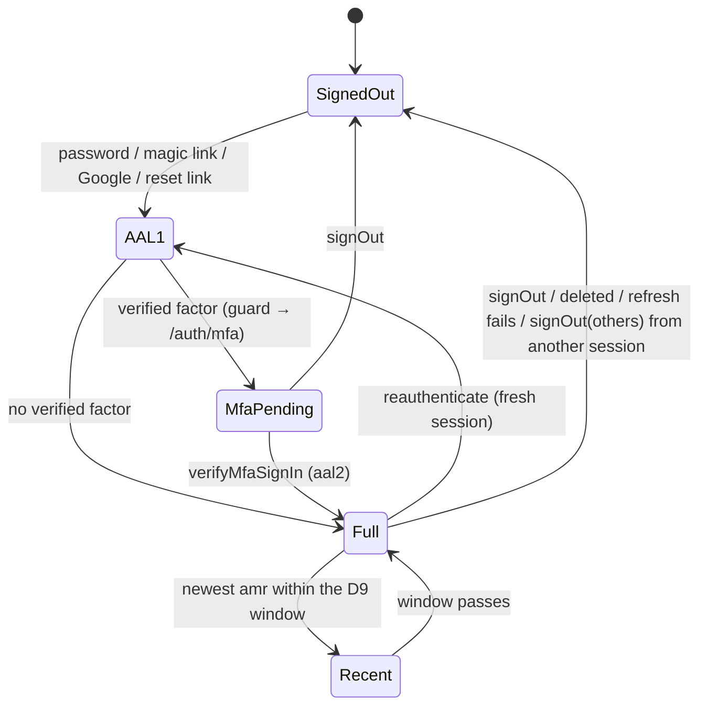
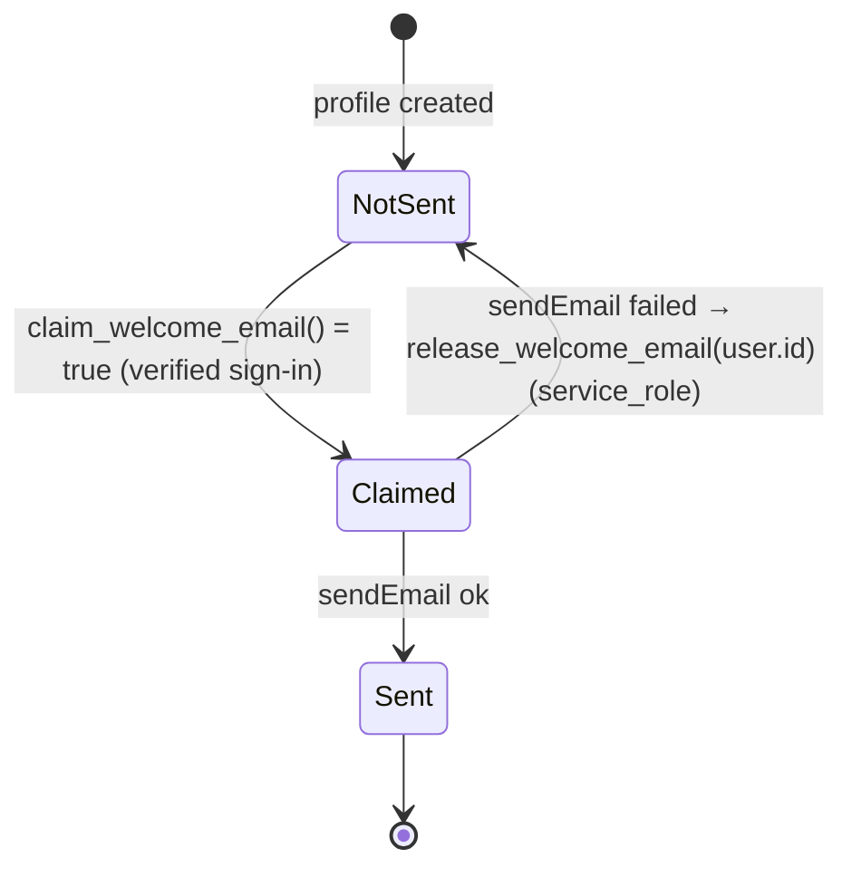
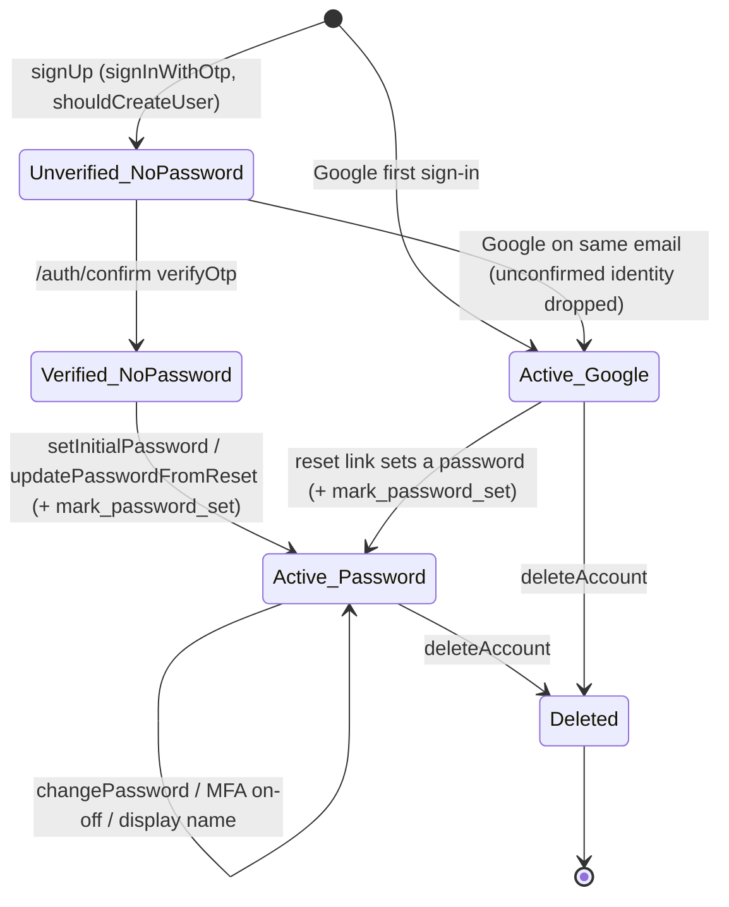

# Template: Build

Last updated: 2026-09-28 · Status: §0 approved 2026-09-26 (restructured from the detailed design and API spec on 2026-09-28; no decisions changed)

## 0. Conventions

Shared by every feature. Decisions: DESIGN §1; fields: DESIGN §3; user-facing text: SPEC §3.4.

### 0.1 Folder structure
D20 plus the D24 additions; screen IDs: SPEC §3.

```
src/
  proxy.ts                         # nonce + CSP, session refresh, x-pathname, optimistic redirects
  instrumentation.ts               # Sentry server/edge init + onRequestError
  instrumentation-client.ts        # Sentry browser init
  app/
    layout.tsx                     # nonce, ThemeProvider, brand <style>, Toaster, Analytics, C-1/C-2
    globals.css, not-found.tsx, error.tsx, global-error.tsx
    manifest.ts, robots.ts, sitemap.ts, opengraph-image.tsx, icon.tsx, apple-icon.tsx
    (public)/page.tsx, (public)/privacy/page.tsx, (public)/terms/page.tsx             # S-1, S-2, S-3
    (auth)/sign-in, sign-up, forgot-password, reset-password (page.tsx each)          # S-4..S-7
    auth/error/page.tsx, auth/mfa/page.tsx, auth/set-password/page.tsx,
    auth/reauthenticate/page.tsx                                                      # S-8..S-11
    auth/confirm/route.ts, auth/callback/route.ts
    (app)/layout.tsx (requireUser), (app)/loading.tsx (C-3 skeleton),
    (app)/dashboard/page.tsx, (app)/settings/page.tsx                                 # S-12, S-13..S-18
    account/export/route.ts
    monitoring/route.ts            # Sentry tunnel, our DSN only (F-4)
  components/ui/                   # shadcn (generated)
  components/layout/               # site-header (C-1), site-footer (C-2), theme-provider
  components/auth/                 # forms, google-button, password-field (C-5), turnstile.tsx (C-4)
  components/settings/             # profile, password, two-step, your-data, delete-account sections
  config/app.ts, config/schema.ts
  emails/                          # verify-email, magic-link, reset-password, welcome + components/email-layout
  lib/                             # isomorphic, no secrets
    env/schema.ts, env/public-schema.ts, env/public.ts
    security/safe-redirect.ts
    validation/auth.ts, validation/account.ts   # §0.5
    validation/form.ts             # formInput, parseForm (§0.2 action input)
    action-result.ts               # ActionResult (§0.2)
    messages.ts                    # M.* (§0.3)
    observability/scrub.ts, observability/sentry-options.ts
    types/database.types.ts (generated), utils.ts (shadcn cn)
  server/                          # every file starts with: import "server-only"
    env.ts, site-url.ts (getSiteUrl)
    supabase/server.ts (user client, cookie options §0.7), supabase/admin.ts (secret key)
    auth/guards.ts
    actions/auth.ts, actions/mfa.ts, actions/account.ts
    security/rate-limit.ts, security/turnstile.ts, security/csp.ts
    email/send.ts, email/welcome.ts
    data/registry.ts, data/export.ts
    errors.ts                      # §0.8
    run-action.ts                  # runAction (§0.2)
    observability/sentry-tunnel.ts # F-4
supabase/config.toml, supabase/migrations/, supabase/templates/ (generated, committed)
tests/unit/, tests/rls/, tests/e2e/
scripts/check-env-example.sh (exists), check-bundle-secrets.ts, email-build.mjs, backup.sh,
        check-supabase-env.ts
sentry.server.config.ts, sentry.edge.config.ts, next.config.ts, vercel.json (Ignored Build Step, D24.17)
.github/workflows/ci.yml, secrets.yml, backup.yml; .github/dependabot.yml
public/brand/logo.svg, public/brand/logo.png
```

**Import boundaries (enforced):**
- `import "server-only"` at the top of every `src/server/**` file.
- ESLint `no-restricted-imports` blocks `@/server/*` in files containing `"use client"` (D20).
- Only `security/rate-limit.ts`, `email/welcome.ts` and `actions/account.ts` may import `@/server/supabase/admin` (per-file ESLint override, rule 6).
- `react/no-danger` is an error (rule 10).

**npm scripts** (CLAUDE.md "Commands", FR-47): `dev`, `build`, `start`, `lint`, `format`, `format:check`; `typecheck` (`next typegen && tsc --noEmit`: the route types such as `LayoutProps` must exist first); `test` (Vitest `unit`); `test:rls` (Vitest `rls`); `test:e2e` (Playwright); `email:build`; `db:start`, `db:stop`, `db:reset` (`npx supabase start|stop|db reset`); `db:types` (the gen-types command, CI section); `check:env`, `check:bundle`, `check:supabase-env`.

### 0.2 Operation shape

**Server action result (D17 + D24.21):**
```ts
type ActionResult<T = void> =
  | { ok: true; message?: string; data?: T }
  | { ok: false; error: string; fieldErrors?: Record<string, string[]> };

type Action<T = void> = (prev: ActionResult<T> | null, formData: FormData) => Promise<ActionResult<T>>;
```
- Every action is a `"use server"` export working with `useActionState` and without JS.
- `error` and `message` hold only §0.3 codes; `fieldErrors` entries are catalogue texts (the §0.5 schemas use `msg()`). Raw Supabase/Postgres errors go to `logError()` only (rule 12, NFR-9).
- Input: `Object.fromEntries(formData)` minus Next's `$ACTION_*` keys, with `cf-turnstile-response` renamed `turnstileToken`, parsed by a `.strict()` schema.
- **Zod failure:** `{ ok: false, error: API-4, fieldErrors: z.flattenError(err).fieldErrors }`. **Exception:** a missing or invalid `turnstileToken` returns `{ ok: false, error: M-6 }` as a form alert, not a field error.
- Flows end with `redirect()`; input-derived targets go through `safeRedirectPath()` (D17, D24.8).
- **`runAction(op, fn)`** (`src/server/run-action.ts`, not `errors.ts`: the proxy imports that, and `runAction` needs the guards and the Supabase client) wraps signed-in actions: refuse mode (`withRefusals`), guard failure → its refusal (below), Next redirects re-thrown, anything else → `logError` + M-7.

**Order in every action:** Zod → guard → rate limit → Supabase call → side effects → result or redirect. Signed-out actions skip the guard; `deleteAccount` runs its guard first (D12). Zod first means a missing Turnstile token is refused before anything else (D4) and malformed requests spend no rate-limit budget.

**Access levels** (checked on the server, NFR-3; proxy redirects never count; module F-2):

| Level | Meaning | Checked by |
| --- | --- | --- |
| `public` | anyone, no session | none |
| `signed-out` | for signed-out visitors; a signed-in caller isn't refused | none (Turnstile, rate limit) |
| `aal1-pending` | verified user, `aal1`, with a **verified** TOTP factor in `user.factors` (from the Auth server) | `requireUser({ allowPendingMfa: true })` |
| `password-unset` | verified user whose only identity is `email` and who has no password (D24.1); MFA satisfied | `requireUser({ allowPendingPassword: true })` |
| `user` | verified user (`getUser()`, email confirmed); `aal2` **or** no verified factor; not `password-unset` | `requireUser()` |
| `recovery` | `user` plus a recovery marker (D24.6) | `requireUser()` + `isRecoverySession()` |
| `recent` | `user`, newest `amr[].timestamp` within the D9 window | `requireRecentSignIn()` |
| `service_role` | only the server's secret-key client (`src/server/supabase/admin.ts`) | Postgres `EXECUTE` grants |

**Guard failures** (pages redirect, actions refuse; without `runAction` the guard still redirects, failing safe; `x-pathname`: §0.7):

| Guard code | Page (redirect mode) | Action (refuse mode) |
| --- | --- | --- |
| `signed_out` | `/sign-in?next=<x-pathname>` | `{ ok: false, error: API-1 }` |
| `mfa_required` | `/auth/mfa?next=<x-pathname>` | `{ ok: false, error: API-2 }` |
| `password_required` | `/auth/set-password?next=<x-pathname>` | `{ ok: false, error: API-3 }` |
| `reauth_required` | `/auth/reauthenticate?next=<x-pathname>` | `redirect('/auth/reauthenticate?next=/settings')`; this `next` is a constant, never input |

**Page access** (each page calls its own guard; layouts don't re-run on client navigation):

| Route | Level |
| --- | --- |
| `/`, `/privacy`, `/terms`, `/auth/error` | `public` |
| `/sign-in`, `/sign-up` | `public`; a signed-in user is redirected to `/dashboard` (FR-18) |
| `/forgot-password` | `public` (signed-in users may use it) |
| `/dashboard`, `/settings`, `/auth/reauthenticate` | `user` |
| `/auth/set-password` | `password-unset` (others go to `/dashboard`) |
| `/auth/mfa` | `aal1-pending` (others go to `safeRedirectPath(next)`) |
| `/reset-password` | `recovery` (without a marker, the page shows the S-8 expired-link content) |

**Route handlers:** Zod-check `searchParams`, send no-store (§0.7), and never show a bare error page: failures `303`-redirect to a page showing the message.

**URL parameter enums** (Zod-parsed; texts SPEC §3.4):

| Parameter | Values | Unknown / missing | Set by |
| --- | --- | --- | --- |
| `?notice=` on the target page (D24.31) | `account_deleted` (on `/`), `password_set`, `password_changed` | ignored | `deleteAccount`, `setInitialPassword`, `updatePasswordFromReset`, via `withNotice()` (§0.7) |
| `/auth/error?reason=` (D24.27) | `link`, `oauth`, `rate_limited` | `link` (`.catch('link')`) | `/auth/confirm`, `/auth/callback` |
| `/sign-in?error=` (D24.8) | `oauth_cancelled` | optional | `/auth/callback` |
| `/settings?export=` (D24.19) | `rate_limited`, `failed` | optional | `GET /account/export` |

### 0.3 Error codes
Errors are keyed **directly by message ID**, the same keys as the catalogue in `src/lib/messages.ts` (D20). Texts: SPEC §3.4.

| ID | Meaning |
| --- | --- |
| M-1 | `signUp`, every non-validation outcome |
| M-2 | `requestMagicLink`, same |
| M-3 | `requestPasswordReset`, same |
| M-4 | any credential-type `signIn` failure |
| M-5 | our limiter, or Supabase's 429 where not masked |
| M-6 | Turnstile token missing (Zod) or rejected by Supabase |
| M-7 | unexpected or limiter error |
| M-13 | `updatePasswordFromReset` with no recovery marker |
| M-14 | wrong or foreign TOTP code / factor |
| M-15 | `startMfaEnrollment` can't start |
| M-19 | `reauthenticateWithPassword` failure |
| M-23 | `changePassword` with no password (D24.1) |
| M-24 | `deleteAccount` email mismatch (`fieldErrors.email`) |
| M-41 | `setInitialPassword` when Supabase asks to re-authenticate an older session (`reauthentication_needed`, `secure_password_change`, D9): use the reset link |
| API-1 | guard `signed_out` |
| API-2 | guard `mfa_required` |
| API-3 | guard `password_required` |
| API-4 | any Zod failure (details in `fieldErrors`) |
| API-5 | `startMfaEnrollment` with a verified factor |
| API-6 | `setInitialPassword` when a password exists |
| API-7 | Supabase `same_password`, as `fieldErrors.password` |
| M-16, M-17, M-21, M-22 | success `message`s (toasts) |
| M-29–M-37 | `fieldErrors` entries from the §0.5 schemas |

**Supabase errors** (`toUserMessage`; unknown → M-7, logged): `captcha_failed` → M-6; `same_password` → API-7 on `password`; `weak_password` → M-32 on `password`; others per feature.

### 0.4 Rate limits
The only place limit values appear. `rateLimit(action, { email?, userId? })` → `{ ok: true }` or `{ ok: false, error: 'M-5' | 'M-7' }`, in `src/server/security/rate-limit.ts` (D3).

| Operation | Per IP | Per email / user |
| --- | --- | --- |
| `signIn` | 20 / 10 min | 10 / 15 min (email) |
| `signUp` | 5 / hour | 3 / hour (email) |
| `requestMagicLink` | 10 / hour | 3 / hour (email) |
| `requestPasswordReset` | 10 / hour | 3 / hour (email) |
| `verifyMfaSignIn`, `confirmMfaEnrollment`, `disableMfa` (a separate key each) | 30 / 15 min | 5 / 5 min (user) |
| `startMfaEnrollment` | – | 10 / hour (user) |
| `reauthenticateWithPassword` | 20 / 10 min | 5 / 15 min (user) |
| `signInWithGoogle` | 20 / 10 min | – |
| `changePassword`, `updatePasswordFromReset`, `setInitialPassword` | – | 5 / hour (user) |
| `GET /account/export` | – | 5 / hour (user) |
| `deleteAccount` | – | 5 / hour (user) |
| `updateDisplayName` | – | 30 / hour (user) |
| `GET /auth/confirm` (`authConfirm`), `GET /auth/callback` (`authCallback`), a separate key each | 30 / 10 min | – |

Unlimited: `signOut` (D24.14), `/monitoring` (D24.16). Accepted: the per-email `signIn` lockout (D24.14) and, because windows are fixed, up to 2× the limit across a window boundary (D3).

- **Keys (D24.13):** `"<action>:ip:" + hmac(ip)`, `"<action>:email:" + hmac(email.trim().toLowerCase())`, `"<action>:user:" + hmac(userId)`, where `hmac` = HMAC-SHA256 (hex) keyed with `RATE_LIMIT_HMAC_SECRET` (§0.6). Rotating the secret resets all counters (acceptable; README).
- **IP:** the first `x-forwarded-for` value (Vercel overwrites it), else `'unknown'` (locally and in CI all requests share it; tests reset the table). Spoofable off Vercel: a documented constraint.
- **Checking:** one `rate_limit_hit` call per key, **IP key first**, stopping at the first `false`; `allowed = data === true`, so anything else counts as limited. Every call counts.
- **Results:** limited → M-5 (route handlers: their redirect, §0.2). **Fail closed:** an RPC error is logged without key contents and refused with M-7.

### 0.5 Shared schemas
`src/lib/validation/{auth,account}.ts`, used by forms and actions. `msg(id)` returns the catalogue text for a message ID (`src/lib/messages.ts`, texts in SPEC §3.4).

```ts
import { z } from "zod";

// D22 + D24.15: characters minimum, UTF-8 BYTES maximum (bcrypt). Values from D22.
const PASSWORD_MIN_CHARS = /* D22 */;
const PASSWORD_MAX_BYTES = /* D22 */;
const withinBytes = (p: string) => new TextEncoder().encode(p).length <= PASSWORD_MAX_BYTES;

export const emailSchema = z.string().trim().toLowerCase()
  .min(1, msg("M-29")).max(254, msg("M-30")).pipe(z.email(msg("M-30")));

export const passwordSchema = z.string()                       // new passwords
  .min(PASSWORD_MIN_CHARS, msg("M-32")).refine(withinBytes, msg("M-33"));

export const currentPasswordSchema = z.string()                // signIn, reauthenticateWithPassword
  .min(1, msg("M-31")).refine(withinBytes, msg("M-33"));

export const newPasswordSchema = z.object({ password: passwordSchema });   // no confirm field (C-5)

export const turnstileTokenSchema = z.string().min(1).max(2048);           // failure → M-6 form alert (§0.2)

export const nextSchema = z.string().max(2048).optional();                 // never rejected; always through safeRedirectPath()

export const totpCodeSchema = z.string().trim().regex(/^\d{6}$/, msg("M-34"));

// Length limits = the profiles.display_name check (DESIGN §3), counted in code points ([...s].length, matching char_length); no control characters.
const DISPLAY_NAME_MAX = /* DESIGN §3 */;
export const displayNameSchema = z.string().trim()
  .refine(s => [...s].length >= 1, msg("M-35"))
  .refine(s => [...s].length <= DISPLAY_NAME_MAX, msg("M-36"))
  .refine(s => /^[^\p{Cc}]+$/u.test(s), msg("M-37"));
```
Operation-specific schemas live in their features.

### 0.6 Env vars
Names only, never values. Kinds: **public** (bundle-safe), **secret**, **server** (server-only, not secret), **scripts-only**, **tests-only**. Parts (D6, D24.28): `publicEnv`, `serverEnv` (Next build + runtime); `supabaseConfigEnv` (only `check:supabase-env`, before `config push` and in CI). Rules and `.env.example` lines: F-2.

| Name | Kind | Part | Purpose | Read by |
| --- | --- | --- | --- | --- |
| `NEXT_PUBLIC_SITE_URL` | public | publicEnv | canonical site URL (FR-26) | `getSiteUrl()`; on Vercel Preview falls back to `VERCEL_BRANCH_URL` (D24.23) |
| `NEXT_PUBLIC_SUPABASE_URL` | public | publicEnv | Supabase API URL | Supabase clients, CSP builder |
| `NEXT_PUBLIC_SUPABASE_PUBLISHABLE_KEY` | public | publicEnv | `sb_publishable_…` (legacy anon key deprecated by end of 2026) | Supabase clients |
| `NEXT_PUBLIC_TURNSTILE_SITE_KEY` | public | publicEnv | Turnstile widget | C-4 widget |
| `NEXT_PUBLIC_SENTRY_DSN` | public | publicEnv | Sentry DSN | Sentry init |
| `SUPABASE_SECRET_KEY` | secret | serverEnv | secret key (`sb_secret_…`), bypasses RLS | only `src/server/supabase/admin.ts` |
| `RATE_LIMIT_HMAC_SECRET` | secret | serverEnv | HMAC key for rate-limit keys (D24.13) | `rate-limit.ts` |
| `EMAIL_TRANSPORT` | server | serverEnv | `resend` or `mailpit` (refused in production) | `email/send.ts` |
| `RESEND_API_KEY` | secret | serverEnv (+ supabaseConfigEnv as SMTP password) | welcome email; Supabase SMTP password | `email/send.ts`; `config.toml` `env()` |
| `EMAIL_FROM` | server | serverEnv | sender; supplies the sender name (D24.25) | `email/send.ts` |
| `MAILPIT_URL` | server | serverEnv | local Mailpit URL | `email/send.ts` (mailpit transport) |
| `SENTRY_AUTH_TOKEN` | secret | serverEnv (build, optional) | source-map upload (Vercel only) | Sentry build plugin |
| `SENTRY_ORG`, `SENTRY_PROJECT` | server | serverEnv (build, optional) | org/project slugs | Sentry build plugin |
| `TURNSTILE_SECRET_KEY` | secret | supabaseConfigEnv | Supabase CAPTCHA secret; also `verifyTurnstile()` (fails closed without it) | `config.toml` `env()`; **not set on Vercel** (D24.28) |
| `GOOGLE_CLIENT_ID`, `GOOGLE_CLIENT_SECRET` | secret | supabaseConfigEnv | Google provider | `config.toml` `env()`; **not set on Vercel** (D24.28) |
| `SUPABASE_DB_URL` | secret, scripts-only | – | session-pooler DB URL (a GitHub secret in app repos) | `scripts/backup.sh` |
| `BACKUP_AGE_RECIPIENT` | scripts-only (a public key) | – | age recipient (a GitHub repo variable) | `scripts/backup.sh` |
| `E2E_TARGET` | tests-only | – | empty = local; `deployed` for the deployed run | Playwright config |
| `E2E_EMAIL` | tests-only | – | the Resend owner's address for the deployed run (D7) | Playwright mailbox |

- Set by Vercel, not in `.env.example`: `VERCEL_ENV`, `VERCEL_BRANCH_URL`, `VERCEL_GIT_COMMIT_REF`.
- Turnstile dummy keys: CI workflow `env` and README only (D4; CI section).
- Every row: a hand-written placeholder `.env.example` line (rule 8) and a README entry (FR-46).

### 0.7 Cookies and cross-cutting mechanisms

**Cookies:**

| Cookie | Set by | Flags | Lifetime | Content |
| --- | --- | --- | --- | --- |
| Supabase session `sb-*` | `@supabase/ssr` server client (D21) | `HttpOnly; Secure*; SameSite=Lax; Path=/` | Supabase's | session |
| PKCE verifier `sb-*-code-verifier` | `signInWithGoogle` (via `@supabase/ssr`) | same | Supabase's | verifier |
| `auth_next` | `requestMagicLink`, `signInWithGoogle` (sign-in and re-auth) | `HttpOnly; Secure*; SameSite=Lax; Path=/auth` | D24.8 (`Max-Age` in seconds) | `safeRedirectPath(next)`; read, re-checked and deleted by `/auth/confirm` and `/auth/callback` |
| `auth_recovery` (D24.6; week-1 check 5, decisions/0014) | `/auth/confirm` for `type=recovery` | `HttpOnly; Secure*; SameSite=Lax; Path=/` | D24.6 window | HMAC-SHA256 (keyed with a server secret) over the user id and issue time, checked against the D24.6 window; never a bare marker (anyone holding a session could set one); deleted by `updatePasswordFromReset` |

\* `isSecureCookie()`: `Secure` except for an `http:` site URL whose host isn't `localhost`, `127.0.0.1` or `[::1]` (Chromium treats those as secure contexts). The session cookie options object is `{ httpOnly: true, secure: isSecureCookie(), sameSite: 'lax', path: '/' }`, shared by the proxy and `createClient()`.

**`Cache-Control: private, no-store`** on every route handler response, on proxy responses that set cookies or redirect, and on the export download (D5; Supabase's cached `Set-Cookie` warning).

**Proxy request headers:** it **overwrites** `x-nonce`, `x-pathname` (`pathname + search`) and `content-security-policy` so clients can't inject them; the layout reads `x-nonce` (throws if missing), guards `x-pathname`.

**Helpers several features use:**
- `padToMinimum(start, ms)` (`src/server/errors.ts`): the D24.10 minimum response time.
- `withNotice(path, value)`: adds `?notice=<value>` (§0.2) to a same-site path.
- `logError(error, { op, userId?, sentryEveryMs? })`: Sentry (scrubbed, D15) plus a scrubbed `console.error`; never logs passwords, tokens, raw emails or email recipients.
- `sendWelcomeIfFirst(supabase, user)` (F-5): called by `/auth/confirm`, `/auth/callback`, `signIn`; awaited before the redirect; never fails the sign-in.

### 0.8 Where logic lives
Each rule sits in one **deep module** (small interface, logic hidden). Actions, route handlers and pages stay **thin**: check auth, validate, call the module, save or return. Modules: `src/server/<area>/<name>.ts` (server-only) or `src/lib/<area>/<name>.ts` (pure).

| Module | File | Interface | Feature |
| --- | --- | --- | --- |
| Guards | `src/server/auth/guards.ts` | `requireUser`, `requireRecentSignIn`, `isRecentSignIn(amr, nowMs)`, `isRecoverySession`, `withRefusals` | F-2 |
| Rate limit | `src/server/security/rate-limit.ts` | `rateLimit` → `{ ok } \| { ok: false, error: M-5 \| M-7 }`, `LIMITS` | F-2 |
| CSP | `src/server/security/csp.ts` | `buildCsp({ nonce, dev, supabaseUrl })`, `STYLE_POLICY` | F-2 |
| Turnstile | `src/server/security/turnstile.ts` | `verifyTurnstile(token, { remoteIp?, expectedAction? })` | F-2 |
| Safe redirect | `src/lib/security/safe-redirect.ts` | `safeRedirectPath(input, fallback)` | F-2 |
| Errors and messages | `src/server/errors.ts`, `src/server/run-action.ts`, `src/lib/messages.ts` | `logError`, `toUserMessage`, `padToMinimum`, `M`; `runAction(op, fn)` | F-2 |
| Env | `src/lib/env/schema.ts`, `src/lib/env/public-schema.ts`, `src/server/env.ts`, `src/lib/env/public.ts` | schemas, `env`, `formatEnvError` | F-2 |
| Supabase clients | `src/server/supabase/server.ts`, `admin.ts` | `createClient()`, `getAdminClient()` | F-2 |
| Config and site URL | `src/config/schema.ts`, `src/config/app.ts`, `src/server/site-url.ts` | `appConfig`, `getSiteUrl()` | F-3 |
| Scrubber | `src/lib/observability/scrub.ts` | `scrubEvent`, `scrubBreadcrumb` | F-4 |
| Sentry tunnel | `src/server/observability/sentry-tunnel.ts` | `tunnelEnvelope(request, { dsn })` | F-4 |
| Email | `src/server/email/send.ts`, `welcome.ts` | `sendEmail({ to, subject, html, text }) → { ok }` (never throws), `sendWelcomeIfFirst` | F-5 |
| Registry, export | `src/server/data/registry.ts`, `export.ts` | registry lists; `buildExport(supabase, user)` | F-1, F-11 |

**Rules:**
- **Deletion test:** a module earns its place if deleting it would push complexity into every caller; if complexity would vanish, it's a pass-through: don't create it.
- **Testable by design:** modules take dependencies as arguments and return results instead of quietly changing things (`isRecentSignIn` takes the clock, `buildExport` the client).
- **Swappable layers only where two things plug in:** the email transport (`resend`/`mailpit`) and the e2e mailbox (`mailpit`/`manual`). One version, no layer.

**Dependencies and how tests handle them** (D18):

| Dependency | Kind | In tests |
| --- | --- | --- |
| Pure logic (schemas, redirects, CSP, scrubber, config, env, keys, `isRecentSignIn`) | in-process | Vitest `unit` (node, `server-only` mocked), called directly |
| Next.js internals (`next/headers`, `next/cache`) | in-process | mocked in the signed-out harness (empty cookies, `x-pathname`) |
| Supabase (Postgres, Auth, PostgREST) and Mailpit | local stand-in | the local stack: `rls` project, users A and B on the publishable key, `postgres` client for catalog queries, `private.rate_limits` truncated |
| Own other services | owned remote | none in the Template |
| Resend | external | `mailpit` transport locally and in CI; real only in the deployed run |
| Cloudflare Turnstile | external | dummy keys (real siteverify, needs internet); `verifyTurnstile` with mocked `fetch` |
| Sentry | external | scrubber unit-tested; delivery manual |
| Google OAuth | external | manual on the throwaway app; e2e: cancel path only |
| Vercel Web Analytics | external | manual |

## F-1 Database foundations · FR-11, FR-43, NFR-1, NFR-2 · screens none · decisions D3, D4, D7, D8, D9, D10, D11, D12, D19, D22, D23, D24.1, D24.11–13, D24.18

### Data
Four forward-only migrations in `supabase/migrations/`, run in order. Each table enables RLS and adds its policies in the migration that creates it (rule 1); a migration is never edited once applied anywhere (NFR-19). User-data tables live in `public` (D24.18). Fields and RLS in words: DESIGN §3. Every `security definer` function sets `search_path = ''`, uses qualified names and revokes `public`/`anon` (catalog tests check the grants).

**Migration 1: `private` schema and shared functions**
```sql
create schema if not exists private;
revoke all on schema private from public, anon, authenticated;
-- USAGE only so RLS policies can call private.mfa_satisfied(); `private` is not an exposed PostgREST schema.
grant usage on schema private to authenticated;

-- D8: aal2 in the verified JWT, or no verified factor.
create function private.mfa_satisfied()
returns boolean
language sql stable security definer
set search_path = ''
as $$
  select coalesce((auth.jwt() ->> 'aal') = 'aal2', false)
      or not exists (
           select 1 from auth.mfa_factors f
           where f.user_id = (select auth.uid()) and f.status = 'verified'
         );
$$;
revoke all on function private.mfa_satisfied() from public, anon, authenticated;
grant execute on function private.mfa_satisfied() to authenticated;

-- Generic updated_at trigger (D12/D17), reusable by app tables.
create function public.set_updated_at()
returns trigger
language plpgsql security invoker
set search_path = ''
as $$
begin
  new.updated_at := now();
  return new;
end $$;
revoke all on function public.set_updated_at() from public, anon, authenticated;
```

**Migration 2: `public.profiles`** (DESIGN §3)
```sql
create table public.profiles (
  id                    uuid primary key references auth.users (id) on delete cascade,
  display_name          text check (char_length(display_name) between 1 and 80),
  welcome_email_sent_at timestamptz,
  password_set_at       timestamptz,
  created_at            timestamptz not null default now(),
  updated_at            timestamptz not null default now()
);
alter table public.profiles enable row level security;

revoke all on table public.profiles from public, anon, authenticated;   -- undo Supabase default grants
grant select on table public.profiles to authenticated;
grant update (display_name) on table public.profiles to authenticated;

create policy profiles_select_own on public.profiles
  for select to authenticated using (id = (select auth.uid()));

create policy profiles_update_own on public.profiles
  for update to authenticated
  using (id = (select auth.uid())) with check (id = (select auth.uid()));

-- D8: every user-data table carries this restrictive policy.
create policy profiles_mfa_required on public.profiles
  as restrictive for all to authenticated
  using ((select private.mfa_satisfied()));

create trigger profiles_set_updated_at
  before update on public.profiles
  for each row execute function public.set_updated_at();

-- FR-11: exactly one row per new auth user. The name is taken only from Google metadata
-- (email sign-ups could set full_name themselves through the API).
create function public.handle_new_user()
returns trigger
language plpgsql security definer
set search_path = ''
as $$
begin
  insert into public.profiles (id, display_name)
  values (
    new.id,
    case when new.raw_app_meta_data ->> 'provider' = 'google'
         then nullif(left(btrim(new.raw_user_meta_data ->> 'full_name'), 80), '')
    end
  );
  return new;
end $$;
revoke all on function public.handle_new_user() from public, anon, authenticated;

create trigger on_auth_user_created
  after insert on auth.users
  for each row execute function public.handle_new_user();

-- FR-30: atomic at-most-once claim for the caller; also requires a confirmed email.
create function public.claim_welcome_email()
returns boolean
language plpgsql security definer
set search_path = ''
as $$
begin
  update public.profiles p
     set welcome_email_sent_at = now()
   where p.id = (select auth.uid())
     and p.welcome_email_sent_at is null
     and exists (select 1 from auth.users u
                  where u.id = p.id and u.email_confirmed_at is not null);
  return found;
end $$;
revoke all on function public.claim_welcome_email() from public, anon;
grant execute on function public.claim_welcome_email() to authenticated;

-- FR-30 retry (D24.11): service_role only. The server passes the id from getUser(), never from input.
create function public.release_welcome_email(p_user_id uuid)
returns void
language plpgsql security definer
set search_path = ''
as $$
begin
  update public.profiles set welcome_email_sent_at = null where id = p_user_id;
end $$;
revoke all on function public.release_welcome_email(uuid) from public, anon, authenticated;
grant execute on function public.release_welcome_email(uuid) to service_role;

-- D10 / D24.1: records a password only if auth.users really holds a password hash; keeps the first time.
create function public.mark_password_set()
returns boolean
language plpgsql security definer
set search_path = ''
as $$
begin
  update public.profiles p
     set password_set_at = coalesce(p.password_set_at, now())
   where p.id = (select auth.uid())
     and exists (select 1 from auth.users u
                  where u.id = p.id and coalesce(u.encrypted_password, '') <> '');
  return found;
end $$;
revoke all on function public.mark_password_set() from public, anon;
grant execute on function public.mark_password_set() to authenticated;
```
- The profile insert has no `on conflict`: if it fails, the auth user creation fails too, so "exactly one row" holds. Identity linking inserts no `auth.users` row, so never a second profile.
- `claim_welcome_email` runs as definer and bypasses the restrictive policy, so `signIn` can claim while the session is aal1.
- Week-1 check 6 (answered, decision 0008): GoTrue v2.197.0 gives a new OTP user a random hash; migration 4 clears it on email confirmation, so the hash is empty until `updateUser({ password })`.

**Migration 3: `private.rate_limits` and `public.rate_limit_hit`** (DESIGN §3; key format BUILD §0.4)
```sql
create table private.rate_limits (
  key          text        not null,
  window_start timestamptz not null,
  count        int         not null default 0,
  primary key (key, window_start)
);
alter table private.rate_limits enable row level security;
revoke all on table private.rate_limits from public, anon, authenticated;
create index rate_limits_window_start_idx on private.rate_limits (window_start);

-- Returns TRUE when the request is ALLOWED (count after this hit <= p_max), FALSE when over the limit (D24.12).
create function public.rate_limit_hit(p_key text, p_max int, p_window_seconds int)
returns boolean
language plpgsql volatile security definer
set search_path = ''
as $$
declare
  v_window timestamptz;
  v_count  int;
begin
  if p_key is null or p_max is null or p_window_seconds is null
     or char_length(p_key) not between 1 and 200
     or p_max < 1 or p_window_seconds not between 1 and 86400 then
    raise exception using errcode = '22023', message = 'rate_limit_hit: invalid arguments';
  end if;
  v_window := to_timestamp(floor(extract(epoch from now()) / p_window_seconds) * p_window_seconds);

  insert into private.rate_limits as r (key, window_start, count)
  values (p_key, v_window, 1)
  on conflict (key, window_start) do update set count = r.count + 1
  returning r.count into v_count;

  delete from private.rate_limits where window_start < now() - interval '24 hours';
  return v_count <= p_max;
end $$;
revoke all on function public.rate_limit_hit(text, int, int) from public, anon, authenticated;
grant execute on function public.rate_limit_hit(text, int, int) to service_role;
```
The upsert is one statement, so concurrent hits on a key serialise on the row lock. An invalid-argument error makes the caller fail closed (§0.4).

**Migration 4: drop a password set before email confirmation** (D10, T2, NFR-26; decision 0008)
GoTrue's own `/auth/v1/signup` stays reachable (email sign-ups must stay on for D10's `signInWithOtp`), so a direct caller can pre-register someone's email with a password; GoTrue also stores a random hash for every new OTP user. When an email is confirmed through a confirmation email Supabase sent, the password hash is cleared, so only the verified owner sets one (`/auth/set-password`) and `mark_password_set` (D24.1) sees an empty hash until then. Admin-confirmed users (`email_confirm: true`, no email sent) keep theirs.
```sql
create function private.drop_password_on_email_confirmation()
returns trigger
language plpgsql security definer
set search_path = ''
as $$
begin
  if old.email_confirmed_at is null and new.email_confirmed_at is not null
     and old.confirmation_sent_at is not null then
    new.encrypted_password := '';
  end if;
  return new;
end $$;
revoke all on function private.drop_password_on_email_confirmation() from public, anon, authenticated;

create trigger drop_password_on_email_confirmation
  before update of email_confirmed_at on auth.users
  for each row execute function private.drop_password_on_email_confirmation();
```

**Generated types (FR-43):** `npm run db:types` = `npx supabase gen types typescript --local > src/lib/types/database.types.ts`, run after every migration; CI fails on a diff (CI section).

**`supabase/config.toml`** (auth settings that matter; the rest stays CLI default)
```toml
[auth]
site_url = "http://127.0.0.1:3000"                  # email link base (D7); production value in [remotes.production]
additional_redirect_urls = ["http://127.0.0.1:3000/**", "http://localhost:3000/**"]   # OAuth redirectTo allow-list
jwt_expiry = 3600                                   # D2
enable_signup = true                                # D11 (needed by D10)
enable_manual_linking = false                       # D10
minimum_password_length = 12                        # D22

[auth.email]
enable_confirmations = true                         # FR-2
secure_password_change = true                       # D9

[auth.email.template.confirmation]
subject = "<E-1 subject>"                           # literal from SPEC §3.4; generic, no app name (D24.25)
content_path = "./supabase/templates/confirmation.html"

[auth.email.template.magic_link]
subject = "<E-2 subject>"
content_path = "./supabase/templates/magic_link.html"

[auth.email.template.recovery]
subject = "<E-3 subject>"
content_path = "./supabase/templates/recovery.html"

[auth.captcha]                                      # D4
enabled = true
provider = "turnstile"
secret = "env(TURNSTILE_SECRET_KEY)"

[auth.external.google]                              # FR-5
enabled = true
client_id = "env(GOOGLE_CLIENT_ID)"
secret = "env(GOOGLE_CLIENT_SECRET)"

[auth.mfa.totp]                                     # D8
enroll_enabled = true
verify_enabled = true

[auth.rate_limit]
email_sent = 30                                     # per hour (D3)

[storage]
enabled = false                                     # D23; no bucket ships

# Production (D7). Ships commented out: the CLI rejects placeholder project IDs; the README step fills it in.
# Pushing without it clears production SMTP (the CLI sends an empty host).
# [remotes.production]
# project_id = "<your-project-ref>"
# [remotes.production.auth]
# site_url = "<your-site-url>"
# additional_redirect_urls = ["<your-site-url>/**"]
# [remotes.production.auth.email.smtp]
# enabled = true
# host = "smtp.resend.com"
# port = 465
# user = "resend"
# pass = "env(RESEND_API_KEY)"
# admin_email = "<sender address>"
# sender_name = "<sender name>"
```
- **Local mail:** the CLI's `[local_smtp]` catcher is Mailpit (image `axllent/mailpit`, UI and API on port 54324; the old `[inbucket]` key is deprecated). Local SMTP to Resend stays off; all auth and welcome emails land in Mailpit.
- Week-1 checks: how the CLI resolves `env(...)` (which env files it reads); whether `supabase start` fails with Google enabled and empty credentials (if so, CI sets non-secret dummy values, like the Turnstile dummy keys).

**Registry** (`src/server/data/registry.ts`; DESIGN §3):
```ts
export const USER_DATA_TABLES = [{ schema: 'public', table: 'profiles', ownerColumn: 'id' }] as const;
export const NON_USER_DATA_TABLES = [{ schema: 'private', table: 'rate_limits', reason: 'hashed keys, 24 h retention' }] as const;
```
The `USER_DATA_TABLES` entry type restricts `schema` to `'public'` (D24.18).

### Operations
All are DB functions (D17); SQL above.

| Function | Who | Input | Returns | Errors | Side effects |
| --- | --- | --- | --- | --- | --- |
| `private.mfa_satisfied()` | policies (as `authenticated`) | – | `boolean` | – | none |
| `rate_limit_hit(p_key, p_max, p_window_seconds)` | `service_role` (F-2 `rateLimit`) | key 1–200 chars, max ≥ 1, window 1–86400 s | `true` = allowed (D24.12) | `22023` on bad args | upsert + 24 h clean-up |
| `claim_welcome_email()` | `authenticated` (F-5) | – | `true` only if this call claimed | – | sets `welcome_email_sent_at` |
| `release_welcome_email(p_user_id)` | `service_role` (F-5) | id from `getUser()` | void | – | clears the claim |
| `mark_password_set()` | `authenticated` (F-6, F-8, F-11) | – | `true` when recorded | – | sets `password_set_at` once, only with a hash (D24.1) |
| `handle_new_user` / `set_updated_at` | triggers | – | – | insert failure aborts user creation | one profile / fresh `updated_at` |

### States and edge cases
- Google `full_name` with HTML or over 80 chars: trimmed to 80, stored and rendered as text only.
- Double submit: `claim_welcome_email` and `mark_password_set` are idempotent.
- `RATE_LIMIT_HMAC_SECRET` rotated: old keys stop matching; rows expire within the D3 retention.
- New user-data table (apps): same migration adds RLS, the `…_mfa_required` restrictive policy, a cascade chain to `auth.users`, a registry entry and `tests/rls/<schema>.<table>.test.ts` (D12); the coverage test fails otherwise.

### Tests
Vitest `rls` project (local Supabase). Fixtures: users A and B via `auth.admin.createUser({ email_confirm: true, password })`, then `mark_password_set`; clients on the publishable key; `tests/rls/totp.ts` (RFC 6238 helper); `globalSetup` truncates `private.rate_limits` through `postgres` on `127.0.0.1:54322`. Catalog tests use the `postgres` client (`tests/rls/catalog.test.ts`). App schemas = every schema not on the Supabase-managed list: `auth, storage, realtime, _realtime, extensions, graphql, graphql_public, vault, pgsodium, pgsodium_masks, net, supabase_functions, supabase_migrations, cron, pgbouncer, _analytics, pg_catalog, information_schema, pg_toast`.

| What | Type | Through | Proves |
| --- | --- | --- | --- |
| RLS on for every app-schema table | RLS (catalog) | `pg_class` via `postgres` | NFR-1: 0 tables with RLS off |
| Registry completeness: every app table in exactly one list; every `USER_DATA_TABLES` entry has `tests/rls/<schema>.<table>.test.ts` and is in `public` | RLS (catalog) | registry + `pg_tables` + test-file listing | NFR-2, metric 3, D24.18 |
| Restrictive MFA policy per registry table | RLS (catalog) | `pg_policies` (`permissive='RESTRICTIVE'`, `qual like '%mfa_satisfied%'`) | D8 |
| Cascade path to `auth.users` per registry table | RLS (catalog) | recursive CTE over `pg_constraint` (`confdeltype='c'`) | D12 |
| Function grants | RLS (catalog) | `has_function_privilege`: false for `anon`/`authenticated` on `rate_limit_hit(text,integer,integer)` and `release_welcome_email(uuid)`; false for `anon` on `claim_welcome_email()`, `mark_password_set()` | D3, D24.11 |
| Every `prosecdef` function in app schemas has `search_path=""`; no `anon` table privileges on app tables | RLS (catalog) | `pg_proc`, `information_schema.role_table_grants` | rule 6 hygiene |
| `profiles`: B and anon can't select, update or delete A's row; A can't update other columns; nobody inserts | RLS | `tests/rls/public.profiles.test.ts`, PostgREST as A/B/anon | NFR-2, FR-12 |
| MFA user's aal1 session reads 0 profile rows | RLS | user client after password sign-in, before TOTP | D8, FR-58 |
| One profile after admin create and after `signInWithOtp` create; Google row with name | RLS, manual | `auth.admin.createUser`, `signInWithOtp`; Google on the throwaway app | FR-11 |
| A direct `/signup` with a password, then the owner confirms through the real email: the attacker's password no longer signs in; D10's own flow (OTP sign-up → link → no hash → owner sets a password → signs in) still works | RLS | `tests/rls/signup.test.ts`, Mailpit | D10, T2, NFR-26 (decision 0008) |
| `rate_limit_hit` true = allowed: max 2 → true, true, false | RLS | `rpc('rate_limit_hit')` as `service_role` | D24.12 |
| `claim_welcome_email` true once, then false; false when unconfirmed; `release_welcome_email` not executable by `authenticated` | RLS | `rpc` as A / unconfirmed user | FR-30 |
| Types match the schema | CI | `db:types` + `git diff --exit-code` | FR-43 |

## F-2 Security core · FR-9, FR-10, FR-52, NFR-3–NFR-14 · screens C-4 · decisions D2, D3, D4, D5, D6, D9, D17, D21, D24.2, D24.6, D24.8, D24.13, D24.14, D24.28, D24.30

### Modules
Interfaces: BUILD §0.8. Access levels, guard failures and the action order: §0.2. Cookies and headers: §0.7. Limits: §0.4. Env names: §0.6.

#### Proxy `src/proxy.ts` (FR-9, FR-10, NFR-13)
1. `nonce = btoa(crypto.randomUUID())`; `csp = buildCsp({ nonce, dev, supabaseUrl })`.
2. Copy the request headers and **overwrite** `x-nonce`, `x-pathname` (`pathname + search`), `content-security-policy`.
3. `response = NextResponse.next({ request: { headers } })`.
4. Supabase server client with the §0.7 cookie options (shared function with `createClient()`); `setAll` writes to `request.cookies` and rebuilds the response (Supabase's documented pattern). `auth.getClaims()` refreshes the session (FR-10).
5. **Optimistic redirect only:** no claims on a path under `/dashboard`, `/settings`, `/auth/set-password`, `/auth/reauthenticate` or `/auth/mfa` (not `/account`: `/account/export` redirects signed-out callers to `/sign-in?next=/settings` itself, F-11) → `302 /sign-in?next=<encoded path+search>`; otherwise nothing. Never grants access (D2).
6. Set `Content-Security-Policy` on the response; add `Cache-Control: private, no-store` when cookies were set or the response redirects.
- `getClaims()` throws → `logError` (Sentry) and let the request through; the page guard fails closed.
- Matcher (the `missing` form from the Next CSP docs):
```ts
export const config = {
  matcher: [{
    source: '/((?!_next/static/|icon/|(?:_next/image|monitoring|apple-icon|manifest\\.webmanifest|robots\\.txt|sitemap\\.xml|opengraph-image)$).*)',
    missing: [
      { type: 'header', key: 'next-router-prefetch' },
      { type: 'header', key: 'purpose', value: 'prefetch' },
    ],
  }],
};
```

#### CSP builder `src/server/security/csp.ts` (NFR-13)
```ts
// Changing STYLE_POLICY needs a decisions/ entry (D5 fallback). Script rules never depend on it.
export const STYLE_POLICY: 'split' | 'unsafe-inline' = 'split';
// Sonner's self-inserted stylesheet, empty then filled (decisions/0011); the unit test recomputes it.
export const SONNER_STYLE_HASH = 'sha256-…'; export const EMPTY_STYLE_HASH = 'sha256-47DEQpj8HBSa+/TImW+5JCeuQeRkm5NMpJWZG3hSuFU=';

export function buildCsp({ nonce, dev, supabaseUrl }: { nonce: string; dev: boolean; supabaseUrl: string }) {
  const supabase = new URL(supabaseUrl).origin;
  const styles = STYLE_POLICY === 'split'
    ? [`style-src-elem 'self' 'nonce-${nonce}' '${SONNER_STYLE_HASH}' '${EMPTY_STYLE_HASH}'`, `style-src-attr 'unsafe-inline'`]
    : [`style-src 'self' 'unsafe-inline'`];
  return [
    `default-src 'self'`,
    `script-src 'self' 'nonce-${nonce}' 'strict-dynamic' https://challenges.cloudflare.com${dev ? " 'unsafe-eval'" : ''}`,
    ...styles,
    `img-src 'self' data: blob:`,
    `font-src 'self'`,
    `connect-src 'self'`,
    `frame-src https://challenges.cloudflare.com`,
    `form-action 'self' ${supabase} https://accounts.google.com`,
    `frame-ancestors 'none'`, `base-uri 'self'`, `object-src 'none'`, `manifest-src 'self'`, `worker-src 'self'`,
    `upgrade-insecure-requests`,
  ].join('; ');
}
```
- `'unsafe-eval'` (dev only) is for React in development. The Cloudflare host in `script-src` is the CSP2 fallback for Turnstile.
- `form-action` lists Supabase and Google because Chrome applies it to redirects after a form POST (the Google button before hydration); the e2e no-violations step checks it.
- Week-1 check 1 passed (decisions 0010, 0011): `next/font` and next-themes need nothing extra; Sonner's un-nonced stylesheet is allowed by its exact hash, not `'unsafe-inline'`.

**Static headers** (`next.config.ts` `headers()`, `source: '/:path*'`):
```ts
[
  { key: 'Strict-Transport-Security', value: 'max-age=63072000; includeSubDomains' },   // preload: per-app domain decision
  { key: 'X-Content-Type-Options', value: 'nosniff' },
  { key: 'Referrer-Policy', value: 'strict-origin-when-cross-origin' },
  { key: 'Permissions-Policy', value: 'camera=(), microphone=(), geolocation=(), payment=(), usb=(), browsing-topics=()' },
  { key: 'X-Frame-Options', value: 'DENY' },
  { key: 'Cross-Origin-Opener-Policy', value: 'same-origin' },
]
```
The root layout's use of `x-nonce` is in F-3. Its first line (read it, throw if missing) ships with the proxy (#8), because without it every page is prerendered and Next's scripts carry no nonce, so the CSP blocks them (decision 0010).

#### Guards `src/server/auth/guards.ts` (FR-9, NFR-3; D2, D24.2)
```ts
type GuardFailure = 'signed_out' | 'mfa_required' | 'password_required' | 'reauth_required';
class GuardError extends Error { code: GuardFailure }

requireUser(options?: { allowPendingMfa?: boolean; allowPendingPassword?: boolean })   // both default false
  : Promise<{ supabase; user; claims }>
requireRecentSignIn(): Promise<{ supabase; user; claims }>
isRecentSignIn(amr: { timestamp: number }[] | undefined, nowMs: number): boolean          // pure; injected clock (D24.30)
isRecoverySession(claims, nowMs): boolean
withRefusals<T>(fn: () => Promise<T>): Promise<T>   // runs fn in "refuse" mode (AsyncLocalStorage)
```
`requireUser` and `requireRecentSignIn` are wrapped in React `cache()` (one Auth round-trip per request per level), keyed on the two flags, since `cache()` compares arguments by identity.

**`requireUser` steps:**
1. `supabase = await createClient()`.
2. `getUser()`: no user, an error, or `email_confirmed_at` null → `signed_out`.
3. `getClaims()`: none → `signed_out`.
4. MFA: `hasVerifiedFactor` from `user.factors` (Auth server, never the cookie). `claims.aal !== 'aal2' && hasVerifiedFactor && !allowPendingMfa` → `mfa_required`.
5. Password step (D10, D24.1), skipped when either allow option is set: applies when every `user.identities[].provider` is `email`; reads `profiles.password_set_at` with the user client; null → `password_required`. A query error or missing row is logged and fails closed (generic failure).
6. Return `{ supabase, user, claims }`.

**`requireRecentSignIn`:** `requireUser()`, then `isRecentSignIn(claims.amr, Date.now())`, else `reauth_required`.
**`isRecentSignIn`:** true when the newest `amr[].timestamp` (seconds) is within the D9 window; empty or missing `amr` → false.
**`isRecoverySession(claims, nowMs, signedMarkerValid)`:** `claims.amr` has a `method === 'recovery'` entry within the D24.6 window, **or** the signed `auth_recovery` marker verified for this user (`src/server/auth/recovery.ts`; week-1 check 5: GoTrue records a reset as `otp`, decisions/0014). Never an unsigned cookie. Used by F-8 through `isRecoverySessionNow(userId, claims)`.
**Modes:** pages run in redirect mode (targets §0.2, `next` from `x-pathname` through `safeRedirectPath()`); `runAction` runs actions in `withRefusals`, where the guard throws `GuardError`. Without `runAction` the guard still redirects (fails safe). `(app)/layout.tsx` also calls `requireUser()`, but each page calls its own guard (§0.2 page table), because layouts don't re-run on client navigation.

#### Supabase clients (FR-10, NFR-14; D21)
- `src/server/supabase/server.ts` `createClient()`: `createServerClient<Database>(url, publishableKey, { cookies: { getAll, setAll }, cookieOptions })` with the §0.7 options object; `setAll` wrapped in try/catch (Server Components can't set cookies).
- `src/server/supabase/admin.ts` `getAdminClient()`: secret key, `auth: { persistSession: false, autoRefreshToken: false, detectSessionInUrl: false }`. Exactly three users: the limiter RPC, `release_welcome_email` (F-5), `deleteAccount` → `auth.admin.deleteUser` (F-11); the ESLint override (§0.1) enforces it.
- No browser client (D21).

#### Rate limit `src/server/security/rate-limit.ts` (NFR-10; D3, D24.13)
- **Who:** server code only · **Input:** `rateLimit(action: keyof typeof LIMITS, { email?, userId? })` (a blank email counts as missing) · **Returns:** `Promise<{ ok: true } | { ok: false; error: 'M-5' | 'M-7' }>`: limited → M-5; an RPC error or a missing email/user ID the limit needs → logged without key contents (Sentry at most every 5 min), M-7. A boolean couldn't tell the two apart, so callers return it as-is (`if (!limit.ok) return limit`, §0.2) · **Errors:** none thrown · **Limit:** `LIMITS` = every §0.4 row (route handlers as `authConfirm`, `authCallback`, the export as `accountExport`).
- `hmac = (v) => createHmac('sha256', env.RATE_LIMIT_HMAC_SECRET).update(v).digest('hex')`; keys, IP source and check order exactly as §0.4, via `getAdminClient().rpc('rate_limit_hit', { p_key, p_max, p_window_seconds })`.

#### Turnstile (NFR-11; D4)
- **Widget C-4** `src/components/auth/turnstile.tsx` (client): loads `https://challenges.cloudflare.com/turnstile/v0/api.js?render=explicit` once with the request nonce; `turnstile.render(el, { sitekey, action, theme: 'auto' })` in managed mode, which writes the hidden `cf-turnstile-response` input; resets after every submit result (prop `formState`: the `useActionState` state object itself, new after every submit); the submit button stays enabled without a token (a missing token comes back as M-6). Used on S-4 (active tab only), S-5, S-6, S-11 (password path).
- **Actions** rename `cf-turnstile-response` → `turnstileToken` (§0.2), pass it as `options.captchaToken`, never call siteverify; `captcha_failed` → M-6 (§0.3).
- **`verifyTurnstile(token, { remoteIp?, expectedAction?, expectedHostname? })`** (`src/server/security/turnstile.ts`; non-auth app forms only, unused in the Template): reads `process.env.TURNSTILE_SECRET_KEY` lazily; unset → logs a clear "add it to serverEnvSchema" error and returns false. Empty or > 2048-char token → false without a call. Siteverify POST, 5 s timeout; needs a 2xx reply with `success`, and, when given, a matching `action` and `hostname` (Cloudflare's advice: a token solved on another site with the same key is refused). Fails closed on every error.

#### Safe redirect `src/lib/security/safe-redirect.ts` (NFR-8)
`safeRedirectPath(input: unknown, fallback = '/dashboard')`:
1. Non-string, or > 2048 chars → fallback.
2. Decode up to 3 rounds; a decode error → fallback.
3. The decoded value must start with exactly one `/`, not `//` or `/\`; contain no `\`, control characters or leading whitespace; not match `^[a-z][a-z0-9+.-]*:`.
4. `new URL(v, 'http://x.invalid').origin === 'http://x.invalid'`.
5. Paths under `/auth/`, `/sign-in`, `/sign-up` fall back (no loops), except the step pages `/auth/set-password`, `/auth/mfa` and `/auth/reauthenticate` (so an MFA step in between keeps the way back to re-auth).
6. Return the original value. Settings anchors (`#…`) are never used as `next`.

#### Errors and messages `src/server/errors.ts`, `src/lib/messages.ts` (NFR-9)
- `runAction(op, fn)` (`src/server/run-action.ts`): `withRefusals(fn)`; `GuardError` → its §0.2 refusal; Next redirect errors re-thrown (`unstable_rethrow`); anything else → `logError` (tagged `op`) + M-7. Its own module so the proxy, which imports `errors.ts`, doesn't bundle the guards.
- `logError(error, { op, userId?, sentryEveryMs? })`: `Sentry.captureException` tagged with `op` (scrubbed, F-4) + `console.error` of the scrubbed text; never throws; `sentryEveryMs` sends that `op` to Sentry at most once per window per instance (errors that repeat on every request during an outage, e.g. the proxy's `getClaims`: 5 min), the console line every time; never passwords, tokens, raw emails or recipients. `userId` goes in the console line only, never to Sentry (D15 drops `user`).
- `toUserMessage(code)`: Supabase `AuthError.code` → a §0.3 ID; unknown → M-7, logged.
- `padToMinimum(start, ms)` awaits the remainder of the D24.10 minimum. `withNotice(path, value)` appends `?notice=` (§0.2 enum) to a same-site path.
- `M` (`src/lib/messages.ts`) holds every user-facing string, keyed as §0.3 (texts SPEC §3.4); tests assert against it. Action input schemas are `.strict()` after stripping `$ACTION_*` keys.

#### Env (FR-52, NFR-4, NFR-5; D6, D24.28)
**`src/lib/env/schema.ts`** (pure, no values), parts as §0.6. `publicEnvSchema`, `formatEnvError` and the shared helpers live in **`src/lib/env/public-schema.ts`** (re-exported here), so `public.ts` never pulls the server/secret schemas into browser files; a unit test walks `public.ts`'s import graph for server variable names (pre-push note on #3, done in #9):
- `publicEnvSchema`: `NEXT_PUBLIC_SITE_URL` `z.url()`, no trailing slash, required when `VERCEL_ENV === 'production'`, optional otherwise (Preview falls back, F-3; local defaults to `http://localhost:3000`); `NEXT_PUBLIC_SUPABASE_URL` `z.url()`; `NEXT_PUBLIC_SUPABASE_PUBLISHABLE_KEY` non-empty; `NEXT_PUBLIC_TURNSTILE_SITE_KEY` non-empty; `NEXT_PUBLIC_SENTRY_DSN` `z.url()`, optional unless production (empty turns Sentry off).
- `serverEnvSchema` = public plus: `SUPABASE_SECRET_KEY` non-empty; `RATE_LIMIT_HMAC_SECRET` ≥ 32 chars; `EMAIL_TRANSPORT` `z.enum(['resend','mailpit'])`, `mailpit` refused when `VERCEL_ENV=production`; `RESEND_API_KEY` required when `resend`; `EMAIL_FROM` `Name <addr>` or `addr`; `MAILPIT_URL` `z.url()`, required when `mailpit`; `SENTRY_AUTH_TOKEN`, `SENTRY_ORG`, `SENTRY_PROJECT` optional.
- `supabaseConfigEnvSchema`: `TURNSTILE_SECRET_KEY`, `GOOGLE_CLIENT_ID`, `GOOGLE_CLIENT_SECRET`, `RESEND_API_KEY` (SMTP password), each non-empty.
- Tests-only (Playwright config): `E2E_TARGET` `z.enum(['local','deployed'])`, empty = `local`; `E2E_EMAIL` email, required when `deployed`.
- Key formats: `startsWith('sb_publishable_')` / `startsWith('sb_secret_')` (week-1 check 9: the local CLI 2.118 issues `sb_` keys; decision 0006).
- `formatEnvError(error)` → `"Missing or invalid environment variables: A, B"` from `issue.path` only, never values or Zod message text.

**Consumers:** `src/server/env.ts` parses `serverEnvSchema` once and exports a frozen `env`; `src/lib/env/public.ts` references each `NEXT_PUBLIC_*` literally, then parses; `next.config.ts` parses `serverEnvSchema` at config load and throws `formatEnvError`; `scripts/check-supabase-env.ts` (Node 24 type stripping, `npm run check:supabase-env`) parses `supabaseConfigEnvSchema`, run by the README `config push` step and by CI before `supabase start`.

**`.env.example`** (written by hand, placeholders only, rule 8):
```
# Public. Canonical site URL; on Vercel Preview it falls back to the branch URL.
NEXT_PUBLIC_SITE_URL=http://localhost:3000
# Public. Supabase API URL (local default).
NEXT_PUBLIC_SUPABASE_URL=http://127.0.0.1:54321
# Public. Supabase publishable key (sb_publishable_...).
NEXT_PUBLIC_SUPABASE_PUBLISHABLE_KEY=<your-supabase-publishable-key>
# SECRET. Supabase secret key (sb_secret_...). Server only; bypasses RLS.
SUPABASE_SECRET_KEY=
# SECRET. HMAC key for rate-limit keys. Generate with: openssl rand -hex 32
RATE_LIMIT_HMAC_SECRET=
# Public. Cloudflare Turnstile site key.
NEXT_PUBLIC_TURNSTILE_SITE_KEY=<your-turnstile-site-key>
# SECRET. Turnstile secret. Read by supabase config push (not set on Vercel).
TURNSTILE_SECRET_KEY=
# Server. "resend" or "mailpit" (mailpit is refused in production).
EMAIL_TRANSPORT=<resend-or-mailpit>
# SECRET. Resend API key (welcome email; also Supabase SMTP password).
RESEND_API_KEY=
# Server. Sender, e.g. "App <address@your-domain>".
EMAIL_FROM=<your-from-address>
# Server. Local Mailpit URL.
MAILPIT_URL=http://127.0.0.1:54324
# Public. Sentry DSN.
NEXT_PUBLIC_SENTRY_DSN=<your-sentry-dsn>
# SECRET. Sentry auth token for source-map upload (Vercel only).
SENTRY_AUTH_TOKEN=
# Server. Sentry org and project slugs.
SENTRY_ORG=<your-sentry-org>
SENTRY_PROJECT=<your-sentry-project>
# SECRET. Google OAuth client. Read by supabase config push (not set on Vercel).
GOOGLE_CLIENT_ID=<your-google-client-id>
GOOGLE_CLIENT_SECRET=
# Scripts/CI only. Session-pooler DB URL for backups (a GitHub secret in the app repo).
SUPABASE_DB_URL=
# Scripts/CI only. age public key for backups (a GitHub repo variable).
BACKUP_AGE_RECIPIENT=
# Tests only. Empty means local; set to "deployed" for the deployed e2e run.
E2E_TARGET=
# Tests only. Resend account owner's address, for the deployed e2e run.
E2E_EMAIL=
```
`E2E_TARGET` ships empty (= local) because `scripts/check-env-example.sh` rejects `local`; it allows only empty, `<…>`, localhost URLs, `true|false|development|test|production` and short numbers.

**`scripts/check-bundle-secrets.ts`** (after `next build`; `npm run check:bundle`, Node 24 type stripping):
1. Values loaded as Next loads them (`@next/env`: process env, then the `.env*` files). For each of `SUPABASE_SECRET_KEY`, `RESEND_API_KEY`, `TURNSTILE_SECRET_KEY`, `SENTRY_AUTH_TOKEN`, `RATE_LIMIT_HMAC_SECRET`, `GOOGLE_CLIENT_SECRET`, `SUPABASE_DB_URL` with ≥ 8 chars: search every file under `.next/static/**` and the prerendered `.next/server/**/*.{html,rsc,body}` (RSC payloads and segments carry props; `.body` is static route-handler output).
2. Also search for `sb_secret_` followed by 16+ key characters (the bare prefix is in the env schema itself) and a `service_role` JWT (the base64url forms of `"role":"service_role"` at all three alignments; the plain JSON never appears in an encoded key).
3. A hit prints the file path and variable name only, exit 1. Missing or empty `.next` output → exit 2. The summary lists which secrets were checked and which weren't set (CI must set them for the value checks to run).
- One-off (NFR-4): a client component importing `@/server/env` fails the build; recorded in its PR.

### Flow
Every action: §0.2 order. Every protected page: its guard first. Every route handler: Zod the query, guard if protected, rate limit, `no-store`, `303` on failure.

### States and edge cases

| Situation | Behaviour |
| --- | --- |
| Supabase Auth unreachable | Guards fail closed (sign-in redirect or API-1); the proxy passes the request through; logged |
| Limiter RPC error | Fail closed, M-7, logged |
| Turnstile script blocked, or offline locally | Submit gives M-6; local dev needs internet (D4, README) |
| Refresh token revoked (e.g. `signOut(others)` elsewhere) | `getUser()` fails → `signed_out` |
| Off-site or looping `next` | `safeRedirectPath` falls back |
| Forged `x-pathname` / `x-nonce` / `content-security-policy` | Overwritten by the proxy |
| Supabase project paused | Generic errors (M-7); launch checklist item (D19) |
| Build without env vars | Fails naming the variables (FR-52) |
| `RATE_LIMIT_HMAC_SECRET` rotated | Counters reset; acceptable (README) |
| Off Vercel | `x-forwarded-for` spoofable (documented constraint, §0.4) |

### Tests
| What | Type | Through | Proves |
| --- | --- | --- | --- |
| Every export of `src/server/actions/*` with empty `FormData` and no cookies (mocked `next/headers`: empty cookies, `x-pathname`; `next/cache`) → `{ ok: false }` or redirect; every route handler signed out returns no data | RLS (harness) | `tests/rls/signed-out.test.ts`; HTTP to each handler | NFR-3, D17 |
| Every protected `page.tsx` calls a guard; `getSession(` in `src/server` = 0; `createBrowserClient` in `src/` = 0 | unit (grep) | source files | NFR-3, D21 |
| Each protected route redirects with `next` and returns there after sign-in | e2e | S-12, S-13 via browser | FR-9 |
| Expired access token + valid refresh token → next navigation works, cookie rewritten (cookie format: week-1 check 11) | e2e | browser with rebuilt cookie | FR-10 |
| `isRecentSignIn`: window − 1 min passes, window + 1 min fails, empty fails; `isRecoverySession` cases | unit | `isRecentSignIn`, `isRecoverySession` with injected clock | D9, D24.30, D24.6 |
| `buildCsp` for both `STYLE_POLICY` values; dev adds `'unsafe-eval'` only to `script-src`; Supabase origin in `form-action` | unit | `buildCsp` | NFR-13 |
| Every route: CSP without `'unsafe-inline'` in `script-src`, nonce differs per request; HSTS; `frame-ancestors 'none'`; Referrer-Policy; Permissions-Policy; 0 CSP console violations on the journey | e2e | responses + console listener | NFR-13 |
| securityheaders.com grade A on the throwaway app | manual | deployed URL | metric 4 |
| `sb-*`, `auth_next`, `auth_recovery` cookies HttpOnly, `Lax`, `Secure`; no `sb-`/JWT values in `localStorage`/`sessionStorage` | e2e | browser context | NFR-14 |
| Rate-limit keys are HMACs; `allowed = data === true`; RPC error → refused; `LIMITS` has every §0.4 row incl. D24.14 | unit | `rateLimit` with mocked admin client | NFR-10, D24.12–14 |
| Each §0.4 operation past its limit → M-5 and no extra Mailpit messages | e2e | each operation's form/route | NFR-10 |
| Each auth action without a token → M-6 (Zod); with a rejected token → `captcha_failed` → M-6 (week-1: which dummy pair always fails) | RLS, e2e | the auth actions | NFR-11 |
| `verifyTurnstile`: success, wrong action, `success:false`, timeout, unset secret → false | unit | `verifyTurnstile` with mocked `fetch` | NFR-11, rule 14 |
| `https://x`, `//x`, `/\x`, `javascript:`, `%2F%2Fx`, `%252F%252Fx`, `/%5Cx`, tab/space prefixes → fallback; `/settings?tab=1` kept; `/auth/*` loops fall back | unit | `safeRedirectPath` | NFR-8 |
| Invalid input per §0.5 schema → plain field errors; `.strict()` rejects unknown keys; 72-byte cap | unit | §0.5 schemas | NFR-6, FR-38 |
| Forced error shows generic text only; `toUserMessage` returns only §0.3 IDs | e2e, unit | S-20; `toUserMessage` | NFR-9 |
| Env schemas (incl. `supabaseConfigEnv` split, conditional requireds, `mailpit` refused in production); `formatEnvError` names variables, never values | unit | schemas, `formatEnvError` | FR-52 |
| Bundle scan passes; deliberate bad import fails the build (one-off) | CI | `check:bundle`, `next build` | NFR-4 |
| `check-env-example.sh`; `git ls-files '.env*'` = `.env.example` only | CI | scripts | NFR-5 |

## F-3 Config, branding and app shell · FR-17, FR-18 (redirect), FR-19, FR-20–FR-27, FR-51, NFR-23, NFR-24 · screens S-1, S-2, S-3, S-12, S-19, S-20, C-1, C-2, C-3 · decisions D5, D16, D24.9, D24.20, D24.23, D24.24, D24.31

### Modules
#### Config `src/config/schema.ts`, `src/config/app.ts` (FR-26, FR-27, FR-51)
- `appConfigSchema`: fields and limits as DESIGN §3 (`appConfig`); `brand` values `/^#[0-9a-f]{6}$/i`; text values can't contain `{{` or `}}` (they're inlined into the auth emails, which GoTrue parses as Go templates).
- `appConfig = appConfigSchema.parse({...})`, validated at import. Placeholders clearly marked (FR-27): name `'Template App'`, `supportEmail` `support@example.com`, `legal.entityName` `'<Your legal entity>'`.
- Logo files `public/brand/logo.svg`, `public/brand/logo.png` are the only brand assets outside the file.

#### Site URL `src/server/site-url.ts` (D24.23)
`getSiteUrl()` (server-only): `NEXT_PUBLIC_SITE_URL`, else `https://${VERCEL_BRANCH_URL}` when `VERCEL_ENV === 'preview'`, else throws; no trailing slash. Client components get absolute URLs as props.

#### Root layout `src/app/layout.tsx`
- Reads `(await headers()).get('x-nonce')` (F-2 proxy); **throws if missing**; passes it to next-themes, the Turnstile loader (C-4), the brand `<style>` and any `<Script>`.
- Brand CSS (`components/layout/brand-style.tsx`), overriding `globals.css` whatever order they load in (doubled selectors); values are validated hex, re-checked before writing, so no CSS injection. Omitted on router prefetches, which have no nonce:
```tsx
<style nonce={nonce}>{`:root:root{--primary:${brand.primary};--primary-foreground:${brand.primaryForeground}}` +
  (brand.primaryDark ? `:root.dark{--primary:${brand.primaryDark};--primary-foreground:${brand.primaryForegroundDark}}` : '')}</style>
```
- `ThemeProvider` (`attribute="class"`, `defaultTheme="system"`, `nonce`) (FR-21); C-2 theme select optional (FR-21 "could").
- `<Toaster position="top-center" />` (Sonner) and `<Analytics />` (F-4).
- `metadata`: title template `"{Page} · {appConfig.name}"`, description from `appConfig`; page titles per SPEC §3; protected and auth pages set `robots: { index: false }` (FR-24).

#### Shell components
- **C-1 header** (`components/layout/site-header.tsx`; the path-aware part in `header-nav.tsx`, a client component): signed-in account menu (`modal={false}`: Radix's modal scroll lock injects an un-nonced `<style>` the CSP blocks; any future modal Radix component needs the same, or `get-nonce`'s `setNonce`) always shows the signed-in **email** as text (D24.9 login-CSRF mitigation); `display_name` as the menu label when set; "Sign out" is a form button calling `signOut` (F-7). All text, never HTML.
- **C-2 footer**: privacy, terms, `mailto:` `supportEmail`, © `legal.entityName` (FR-17).
- **C-3 feedback** (FR-22): `useActionState` + `useFormStatus` give the pending label and disabled button; `error` → inline `role="alert"`; `fieldErrors` under their fields with `aria-describedby`/`aria-invalid`; toasts for success `message`s only. Notice toast: any page parses `?notice=` with the §0.2 enum and toasts its text (SPEC §3.4); unknown values ignored.
- **Mobile** (FR-20): one column up to `md`.

#### Pages
- **S-1 `/`** (`public`): `appConfig.name`/`description`; signed-in variant per SPEC §3; `account_deleted` notice via C-3.
- **S-2 `/privacy`, S-3 `/terms`** (`public`): non-dismissible placeholder banner (SPEC §3). The privacy placeholder lists the providers (Supabase, Vercel incl. Web Analytics, Resend, Cloudflare Turnstile, Sentry, Google for sign-in) and the D14 backup retention (D24.20, FR-17).
- **S-12 `/dashboard`** (`user`, `requireUser()`): greeting with `display_name` as text, or without it plus the "add your name" link to `/settings#profile`; generic placeholder only (NFR-24).
- **`(app)/layout.tsx`** calls `requireUser()`; **`(app)/loading.tsx`** is the C-3 skeleton.
- **`/sign-in`, `/sign-up`**: `getUser()`; a user → `redirect('/dashboard')` (FR-18; forms in F-6/F-7).
- **S-19 `not-found.tsx`**: HTTP 404. **S-20 `error.tsx` / `global-error.tsx`**: generic text only, no digest or message; report to Sentry (F-4).

#### Metadata routes (FR-24, FR-25, FR-26)
All `public` `GET`s, no input, from `appConfig` and `getSiteUrl()`; excluded from the proxy matcher (F-2).

| File → route | Output |
| --- | --- |
| `manifest.ts` → `/manifest.webmanifest` | `name`, `short_name` (`shortName`), `description`, `start_url: "/"`, `display: "standalone"`, `theme_color: brand.primary`, icons 192 and 512 px |
| `robots.ts` → `/robots.txt` | `VERCEL_ENV === 'production'`: `User-agent: *`, `Allow: /`, `Disallow: /dashboard`, `/settings`, `/auth/`, `/account/`, `Sitemap: <site>/sitemap.xml`; otherwise `Disallow: /` |
| `sitemap.ts` → `/sitemap.xml` | absolute URLs for `/`, `/privacy`, `/terms` only |
| `opengraph-image.tsx` → `/opengraph-image` | `next/og`, PNG 1200×630: name, description, brand colours |
| `icon.tsx`, `apple-icon.tsx` | PNG icons in the brand colours |

### States and edge cases
- Missing `x-nonce` (proxy skipped by a matcher change): the layout throws → S-20, never a page without CSP nonce.
- Brand colour not hex: `appConfig` import fails at build.
- Login CSRF via `/auth/confirm`: accepted (DESIGN §4); C-1's visible email is the mitigation.

### Tests
| What | Type | Through | Proves |
| --- | --- | --- | --- |
| `appConfig.name`, `description`, `supportEmail`, `legal.entityName` and brand hex values don't appear outside `src/config/app.ts` (logos in `public/brand/`, generated templates and tests excluded; `supabase/config.toml` is scanned whole) | unit (grep) | `tests/unit/source-grep.test.ts` | FR-26, FR-51 |
| Contrast ≥ 4.5:1 (WCAG relative luminance) for `primary`/`primaryForeground` and the dark pair when set; failure names the pair | unit | `tests/unit/config.test.ts` on `appConfigSchema`/`appConfig` | D24.24, NFR-23 |
| Schema rejects bad hex and out-of-range lengths | unit | `appConfigSchema` | D16 |
| `getSiteUrl`: env value; Preview fallback; throws otherwise; no trailing slash | unit | `getSiteUrl` | D24.23 |
| Footer links + `mailto:` on every page; placeholder banner; privacy lists providers + retention | e2e | S-1–S-3 | FR-17 |
| Signed-in `/sign-in` and `/sign-up` → `/dashboard` | e2e | S-4, S-5 | FR-18 |
| Dashboard and settings protected; dashboard placeholder only | e2e | S-12, S-13 | FR-19 |
| No horizontal scroll at 360 px on every shell page | e2e | each page | FR-20 |
| Light and dark `colorScheme` render; axe contrast passes in both | e2e | each page | FR-21 |
| Pending label, disabled button; inline alert or toast after each action | e2e | C-3 on each form | FR-22 |
| Unknown URL → 404; forced error (test-only route, `NODE_ENV=test`) → S-20 without stack or digest | e2e | S-19, S-20 | FR-23, NFR-9 |
| Titles and descriptions; sitemap public paths only; robots per env; OG image 200 `image/png` | e2e | metadata routes | FR-24 |
| Manifest has config name and colour; install prompt on a phone | e2e, manual | `/manifest.webmanifest` | FR-25 |
| README points at every placeholder | manual | README | FR-27 |
| axe 0 serious/critical per shell page; keyboard-only S-4/S-5; screen-reader pass | e2e, manual | `@axe-core/playwright` | NFR-23 |
| `gift`/`gifts` (word, case-insensitive) in the source tree = 0; not `registry`, which is D12's user-data registry name (changed in #9) | unit (grep) | `tests/unit/source-grep.test.ts` | NFR-24 |

## F-4 Monitoring and analytics · FR-31, FR-32, NFR-17 · screens S-20 · decisions D15, D24.16

### Modules
#### Sentry setup (FR-31)
- Files: `src/instrumentation.ts` (loads `sentry.server.config.ts` / `sentry.edge.config.ts` per runtime; `export const onRequestError = Sentry.captureRequestError`), `src/instrumentation-client.ts`, `sentry.server.config.ts`, `sentry.edge.config.ts`, `src/app/global-error.tsx` (and `error.tsx`, F-3) calling `Sentry.captureException`. All three inits pass the one options object in `src/lib/observability/sentry-options.ts`.
- `next.config.ts`: `withSentryConfig` from **`@sentry/nextjs/config`** (Sentry 11 no longer exports it from the root; decisions/0012) with `{ widenClientFileUpload: true, telemetry: false, suppressOnRouterTransitionStartWarning: true }` and **no `tunnelRoute`** (its rewrite relays to any sentry.io project; our own route instead, below); source maps upload, then are deleted from the build, only when `SENTRY_AUTH_TOKEN` is set (Vercel).
- Every `Sentry.init` (Sentry 11 has no `sendDefaultPii`; `dataCollection` replaced it, decisions/0012):
```ts
{
  dsn: publicEnv.NEXT_PUBLIC_SENTRY_DSN,  // empty → Sentry off (local)
  dataCollection: {
    userInfo: false, cookies: false, httpHeaders: false, httpBodies: [], urlQueryParams: false,
    stackFrameVariables: false, databaseQueryData: false,           // also on by default in 11
    graphQL: { document: false, variables: false }, genAI: { inputs: false, outputs: false }, queues: false,
  },
  // no tracesSampleRate at all: even 0 turns span recording on (Sentry checks != null); no Replay
  // Sentry 11 warns beforeSendTransaction is ignored with streamed spans, but still runs it on transaction events; tracing needs beforeSendSpan first (decisions/0018)
  beforeSend: scrubEvent,
  beforeSendTransaction: scrubEvent,
  beforeBreadcrumb: scrubBreadcrumb,
}
```
- Sentry 11 fallback: 10.75.x with the same settings (D1). Not needed: 11.1.0 builds (decisions/0012).

#### Scrubber `src/lib/observability/scrub.ts` (NFR-17; pure)
- `redactString`: replaces email-shaped text (also `%40`), JWTs (`eyJ….….…`), `sb_(secret|publishable)_…`, `re_…` keys, and the values after `token_hash|access_token|refresh_token|token|password|secret|api[_-]key|otp` written as `=`, `%3D`, `:` or JSON (`"name":"…"`); `code` only in query form (`code=`), since a JSON `code` is usually an error code.
- `stripQuery`: drops `?…` and `#…`.
- Deep redaction (`extra`, `contexts`, `tags`, `logentry`, breadcrumb `data`): `redactString` on every string, depth ≤ 6, cycles guarded; values under keys matching `pass(word)|secret|token|cookie|authorization|api[_-]key|private[_-]key|service[_-]role|otp` become `[redacted]` whatever they look like (a refresh token has no shape); keys themselves go through `redactString` (a map keyed by email).
- `scrubEvent`: deletes `user`; keeps only `url` (query stripped, path redacted) and `method` of `request` (so `cookies`, `headers`, `data`, `query_string`, `env` go); strips the query from `transaction` and redacts it; redacts `message`, `exception.values[].value`, `mechanism.data`, `logentry`; deletes stack-frame `vars` in exceptions and threads; deep-redacts `extra`, `contexts`, `tags`; runs every event breadcrumb through `scrubBreadcrumb`'s rules.
- `scrubBreadcrumb`: strips queries from the `url`, `from` and `to` fields, redacts `message`, drops `data.body` and any `data` field named like `query`/`fragment` (Sentry 11 keeps them apart from `url`), deep-redacts the rest of `data`.
- Internal error in either → return `null` (drops the event).

#### `/monitoring` tunnel (`POST`, `src/app/monitoring/route.ts` → `tunnelEnvelope`, decisions/0012)
- **Who:** `public` (the browser SDK, `tunnel: '/monitoring'` in `instrumentation-client.ts` only). Excluded from the proxy matcher (F-2).
- **Input:** the body, read up to 1 MiB (`content-length` over it, or more bytes streamed → 413); the envelope's first line is JSON with a `dsn` string (Zod, else 400). That DSN's host, public key and project ID must equal `NEXT_PUBLIC_SENTRY_DSN`'s (else 403). No DSN configured → 404.
- **Forwards** only the body, to `https://<our host>/api/<our project>/envelope/` built from **our** DSN (never the request's), `redirect: 'error'`, 10 s timeout. No cookies, headers or visitor IP go on. Returns an empty body with Sentry's status plus `x-sentry-rate-limits` / `retry-after`, so the SDK backs off; unreachable → 502, logged by error name only (not `logError`, which would report to Sentry).
- **No rate limit:** documented exception (D24.16); quota abuse by our own project's DSN (it's public) is accepted (spike protection, plan cap: DESIGN §5).

#### Web Analytics (FR-32)
`<Analytics />` from `@vercel/analytics/next` in the root layout (F-3). `/_vercel/insights/*` is same-origin and injected by the nonce'd bundle, so `'strict-dynamic'` covers it. No other analytics.

### States and edge cases
- `/monitoring` abuse: only our project can be reached; floods of our own DSN are the accepted residual risk (D24.16).
- Scrubber bug: the event is dropped, never sent raw.

### Tests
| What | Type | Through | Proves |
| --- | --- | --- | --- |
| `scrubEvent` removes email, JWT, cookie, body, headers and query; `scrubBreadcrumb` strips URLs; internal error → `null` | unit | `scrubEvent`, `scrubBreadcrumb` | NFR-17 |
| Tunnel forwards only our DSN's envelopes, to the URL from our DSN, body only; other DSNs 403, bad header 400, over 1 MiB 413, no DSN 404, unreachable 502; rate-limit headers relayed | unit | `tunnelEnvelope` | D24.16, NFR-17 |
| Test error during a request carrying an email, token, cookie and body shows none of them in Sentry | manual | Sentry UI | NFR-17 |
| Server and browser test errors reach Sentry; alert email arrives | manual | throwaway app | FR-31 |
| Page views appear in Vercel Web Analytics | manual | Vercel dashboard | FR-32 |

## F-5 Email pipeline · FR-28, FR-29, FR-30 · screens E-1, E-2, E-3, E-4 · decisions D7, D16, D24.11, D24.25

### Modules
#### Templates `src/emails/` (FR-28)
- Files: `verify-email.tsx` (E-1), `magic-link.tsx` (E-2), `reset-password.tsx` (E-3), `welcome.tsx` (E-4), `components/email-layout.tsx`. Components and `render()` from `react-email` (D1).
- `EmailLayout`: logo PNG `{{ .SiteURL }}/brand/logo.png` (welcome: `getSiteUrl()` + `/brand/logo.png`), `appConfig.name`, a brand-colour button, the plain URL, `supportEmail` footer. Copy: SPEC §3.4 (E-1–E-4).
- Auth templates take no props and write the Go placeholders directly, with a fixed `type`: `signup` (verify-email), `magiclink`, `recovery` (the CLI export ignores `PreviewProps`: week-1 check 8, decisions/0013). Link: `{{ .SiteURL }}/auth/confirm?token_hash={{ .TokenHash }}&type=<type>`.
- Bodies may use the app name (inlined at build from `appConfig`; generated files are excluded from the FR-26 grep). Auth subjects live in `config.toml` (F-1); the sender name comes from `EMAIL_FROM`.

#### `npm run email:build` (FR-28, FR-29)
1. `email export --dir src/emails --outDir .email-out` (react-email's `email` binary) into git-ignored `.email-out/`.
2. `scripts/email-build.mjs` maps the output to `supabase/templates/{confirmation,magic_link,recovery}.html`; exits 1, writing nothing, unless each file has the exact link `href="{{ .SiteURL }}/auth/confirm?token_hash={{ .TokenHash }}&amp;type=<its type>"`; adds a "generated, do not edit" comment **after** the doctype (anything before it puts Outlook in quirks mode). The files are committed.
3. CI: `git diff --exit-code supabase/templates` (CI section).
- Rebrand = config edit → `email:build` → `config push` (README).
- Week-1 checks 3 and 8 done (decisions/0013): output stable, placeholders survive; a new `signInWithOtp` user gets `confirmation` (`type=signup`), an existing one `magic_link`; each baked-in `type` verifies, so `/auth/confirm` doesn't take `email`. Checked end to end by `tests/rls/auth-emails.test.ts`.

#### Transport `src/server/email/send.ts`
- **Who:** server only · **Input:** `sendEmail({ to, subject, html, text, replyTo? })` · **Returns:** `{ ok: boolean }`, **never throws**; Resend times out after 10 s (the welcome email is awaited before a sign-in redirect) · **Errors:** logged via `logError` without the recipient.
- `EMAIL_TRANSPORT=resend`: `resend.emails.send({ from: env.EMAIL_FROM, to, subject, html, text })`; a non-null `error` = failure.
- `EMAIL_TRANSPORT=mailpit`: `POST {MAILPIT_URL}/api/v1/send` with `{ From: { Name?, Email }, To: [{ Email }], Subject, HTML, Text }` (`From` parsed from `EMAIL_FROM`), 5 s timeout. Week-1 check 2 passed: enabled in the CLI container (decisions/0013).
- Senders: deployed throwaway app `App <onboarding@resend.dev>` (FR-27 placeholder; delivers only to the Resend owner, D7); CI: the CI workflow `env` ("CI, deployment and migrations").

#### Welcome `src/server/email/welcome.ts` (FR-30)
`sendWelcomeIfFirst(supabase, user)` · **Who:** called by `/auth/confirm` (every type, F-6), `/auth/callback` (F-7), `signIn` (F-7) with the verified user · **Returns:** `Promise<void>`; never fails the sign-in; awaited before the redirect.
0. No `user.email` → return before claiming (the claim is once per account).
1. `supabase.rpc('claim_welcome_email')` (user client). Error → log, return (nothing claimed).
2. Not `true` → return.
3. Render `welcome.tsx` to HTML and plain text; subject: E-4 (SPEC §3.4). `sendEmail` to `user.email` with `replyTo: supportEmail` (E-4 says "Reply to {supportEmail}").
4. `{ ok: false }` → `getAdminClient().rpc('release_welcome_email', { p_user_id: user.id })` (id from `getUser()`, D24.11), then `logError`; a thrown release is caught too (never fails the sign-in).

### States and edge cases

- Two sign-ins at once: only one claim succeeds (atomic update).
- Release fails too: logged; that user gets no welcome email (at most once, accepted in D7).
- Unverified user: the claim returns false (F-1).

### Tests
| What | Type | Through | Proves |
| --- | --- | --- | --- |
| Render snapshots contain the name, logo URL, brand colour and support email | unit | `render()` of each template | FR-28 |
| Readable in one webmail and one phone mail app | manual | real inboxes | FR-28 |
| `email:build` output contains `{{ .TokenHash }}` and `{{ .SiteURL }}`; templates in sync | CI | `email:build` + `git diff --exit-code supabase/templates` | FR-29, D7 |
| Branded auth emails arrive in Mailpit, each link's `type` verifies; deployed run through Resend | rls, e2e, manual | `tests/rls/auth-emails.test.ts`; sign-up/reset flows + mailbox adapter | FR-29 |
| Exactly one welcome email across repeated sign-ins | e2e | FR-39 journey + Mailpit | FR-30 |
| Send failure releases the claim and logs without the recipient | unit | `sendWelcomeIfFirst` with a mock `sendEmail` and mocked clients | FR-30, D24.11 |
| `sendEmail` returns `{ ok: false }` on Resend error or Mailpit timeout, never throws | unit | `sendEmail` with mocked Resend / `fetch` | D7 |
| Deployed run sends 3 (4 with the manual magic-link check) real emails, recorded; CI sends 0 | manual, review | deployed e2e run | NFR-22 |

## F-6 Sign-up and set password · FR-1, FR-2, NFR-26 · screens S-5, S-9, S-8 · decisions D4, D7, D10, D22, D24.1, D24.7, D24.10, D24.31

### Data
None new. Uses `auth.users` and `profiles` (DESIGN §3; migration, `handle_new_user` and `mark_password_set()` (0004 P1): F-1).

### Operations
Order for signed-out auth actions (here, F-7, F-8): Zod → rate limit (IP, then email) → Supabase call with `captchaToken` → fixed message → `padToMinimum` (§0.7, D24.10). Supabase `captcha_failed` → M-6 in every one (§0.3).

#### `signUp` (server action, `actions/auth.ts`)
- Who: `signed-out` · Input: `z.object({ email: emailSchema, turnstileToken: turnstileTokenSchema }).strict()` (email and Turnstile only, D10) · Returns: `{ ok: true, message: M-1 }` · Errors: API-4 (field errors), M-6, M-5 (our limiter), M-7 (limiter error) · Limit: §0.4 row `signUp` · Side effects: new email → unconfirmed `auth.users` row with **no password**, `handle_new_user` inserts its `profiles` row (F-1), Supabase sends E-1; existing email → E-2. No redirect, no `next`.
- Call: `signInWithOtp({ email, options: { shouldCreateUser: true, captchaToken, emailRedirectTo: getSiteUrl() + '/auth/confirm' } })`. Never calls siteverify (D4).

#### `GET /auth/confirm` (route handler, `src/app/auth/confirm/route.ts`)
- Who: `public` (the link is the credential) · Query: `z.object({ token_hash: z.string().min(1).max(512), type: z.enum(["signup", "magiclink", "recovery"]) })` (D24.7; `email` not needed: week-1 check 3, decisions/0013). `next` is never read from the query, only from `auth_next` · Returns: `303` redirect · Errors: `/auth/error?reason=link|rate_limited` (§0.2) · Limit: §0.4 row `GET /auth/confirm` (`authConfirm`) · Side effects: session set; welcome claim (F-5 `sendWelcomeIfFirst`) for **every** type; `auth_recovery` (0004 P9); reads and deletes `auth_next`. `Cache-Control` per §0.7.
- Shared: F-7 (magic link) and F-8 (recovery) links land here too.

#### `setInitialPassword` (server action, `actions/auth.ts`)
- Who: `password-unset`, `requireUser({ allowPendingPassword: true })` (F-2) · Input: `newPasswordSchema.extend({ next: nextSchema }).strict()` · Returns: redirect to `withNotice(safeRedirectPath(next), 'password_set')` (default `/dashboard`; a step page as `next` → `/dashboard`, or the notice would be lost; §0.2, §0.7) · Errors: API-6 (password already set), API-4, API-7 on `password`, `weak_password` → `password` field error, M-41 (`reauthentication_needed`: a session older than ~24 h, D9; the reset link gives a fresh one), M-5, M-7 (also when the password saves but `mark_password_set` fails or returns `false`; logged; a retry works) · Limit: §0.4 row `setInitialPassword` · Side effects: password stored; `profiles.password_set_at` recorded by `mark_password_set()` (F-1, 0004 P1).

#### `/auth/set-password` page (S-9)
- Guard: `requireUser({ allowPendingPassword: true })`, then `redirect('/dashboard')` if `password_set_at` is set or the user has a non-email identity. Page content: SPEC §3 S-9 (C-5 new-password field, sign-out via F-7 `signOut`).

### Flow
**`signUp`** (S-5 → M-1 → E-1/E-2)
1. Zod `{ email, turnstileToken }` (missing token → M-6, §0.2).
2. `rateLimit('signUp', { email })`.
3. `signInWithOtp(…)` as above.
4. Every outcome except `captcha_failed` → `{ ok: true, message: M-1 }`: a new email, an existing one (confirmed or unconfirmed, password or Google-only), Supabase's per-user resend rule (D3), Supabase's 429, any other Supabase error (logged).
5. `padToMinimum` (D24.10).

**`/auth/confirm`** (E-1/E-2/E-3 link → S-9, S-10, S-7 or `next`)
1. `rateLimit('authConfirm')` (IP). Limited → `303 /auth/error?reason=rate_limited`.
2. Zod the query. Failure → `303 /auth/error?reason=link`.
3. `verifyOtp({ token_hash, type })`. Error (expired, used, invalid) → `303 /auth/error?reason=link` (S-8; logged when unexpected).
4. `sendWelcomeIfFirst(supabase, user)` (F-5), awaited.
5. Redirect:
   - `type=recovery`: set the signed `auth_recovery` marker (§0.7; week-1 check 5 showed `amr` lacks `recovery`, decisions/0014), then `303 /reset-password` (F-8).
   - Otherwise: read and delete `auth_next`, `303 safeRedirectPath(auth_next)` (default `/dashboard`; no cookie, e.g. another browser → `/dashboard`). The destination's `requireUser()` sends `password-unset` users to S-9 and MFA users to S-10 (FR-2).
6. `Cache-Control: private, no-store` (§0.7).

**`setInitialPassword`** (S-9)
1. Zod `{ password, next? }`.
2. `requireUser({ allowPendingPassword: true })`. `password_set_at` already set → API-6.
3. `rateLimit('setInitialPassword', { userId })`.
4. `updateUser({ password })`. `weak_password`, `same_password` → field errors (§0.3).
5. `rpc('mark_password_set')`. `false` or error → log, M-7.
6. `redirect(withNotice(safeRedirectPath(next), 'password_set'))`: S-12 (or `next`) shows the `password_set` notice (D24.31).

### States and edge cases
Account (FR-1, FR-2, FR-5, FR-16; D10):

- Repeated sign-ups: any link works; there is never a password to take over (NFR-26).
- A user who never verifies: a harmless row; clean-up out of scope (D10).
- Existing Google account on sign-up: the user gets a sign-in link.
- Cross-device links work: `/auth/confirm` needs no PKCE verifier.
- A verified user who leaves S-9 without a password is sent back by every guard until they set one, or use "Forgot password" (F-8 also calls `mark_password_set`).
- Linking: automatic, onto verified emails only; Supabase drops an unconfirmed email identity, which has no password anyway (D10).
- Login CSRF via `/auth/confirm` (victim opens a link for the attacker's account): accepted (D24.9); C-1 always shows the signed-in email.
- Double submit: the pending state blocks it; `mark_password_set` is idempotent (0004 P1).

### Tests
| What | Type | Through | Proves |
| --- | --- | --- | --- |
| New and existing email get the same M-1, status and ≥ padding | e2e | S-5 screen / `signUp` action | FR-1, NFR-12 |
| Unconfirmed account has no usable password: `signInWithPassword` fails, `encrypted_password` empty | RLS | `signInWithOtp({ shouldCreateUser: true })` on the local stack, then `signInWithPassword` (publishable key); `auth.users` via `postgres` | FR-1, NFR-26 (automated half) |
| Input schema rejects a missing Turnstile token (M-6) | unit | `signUp` input schema | FR-1, NFR-11 |
| Mailpit link → S-9 → set password → dashboard | e2e | E-1 link → `/auth/confirm` route → S-9 screen | FR-1, FR-2 |
| Reused link → S-8 (`reason=link`) | e2e | `/auth/confirm` route | FR-2 |
| Protected page before verifying → sign-in | e2e | S-12 screen | FR-2 |
| Google sign-in on the same email as an unverified password account can't use the attacker's password | manual (throwaway app, PM-accepted) | S-4 Google button | NFR-26 |

## F-7 Sign-in and sign-out · FR-3, FR-4, FR-5, FR-6, FR-18 · screens S-4, S-8 · decisions D4, D11, D17, D24.8, D24.10, D24.14, D24.27

### Data
None new. Uses `profiles` (DESIGN §3, migration F-1); cookies `auth_next`, PKCE verifier (§0.7).

### Operations
#### `signIn` (server action)
- Who: `signed-out` · Input: `z.object({ email: emailSchema, password: currentPasswordSchema, turnstileToken: turnstileTokenSchema, next: nextSchema }).strict()` (no minimum length at sign-in) · Returns: redirect · Errors: M-4 (every credential-type failure: `invalid_credentials`, `email_not_confirmed`, no password, unknown email, Google-only), M-6, M-5 (ours or Supabase's 429), API-4, M-7 · Limit: §0.4 row `signIn` · Side effects: session cookies; welcome claim (F-5).
- Call: `signInWithPassword({ email, password, options: { captchaToken } })`.

#### `requestMagicLink` (server action)
- Who: `signed-out` · Input: `z.object({ email: emailSchema, turnstileToken: turnstileTokenSchema, next: nextSchema }).strict()` · Returns: `{ ok: true, message: M-2 }` · Errors: API-4, M-6, M-5 (ours), M-7 (limiter error) · Limit: §0.4 row `requestMagicLink` · Side effects: sets `auth_next` if `next`; E-2 to existing users only; **never creates an account** (D11).
- Call: `signInWithOtp({ email, options: { shouldCreateUser: false, captchaToken, emailRedirectTo: getSiteUrl() + '/auth/confirm' } })`. The link is handled by F-6 `/auth/confirm`.

#### `signInWithGoogle` (server action)
- Who: `public` (sign-in, sign-up on S-4/S-5, Google re-auth on S-11, F-9) · Input: `z.object({ next: nextSchema }).strict()` · Returns: `redirect(data.url)` · Errors: M-5, M-7 (no URL) · Limit: §0.4 row `signInWithGoogle` · Turnstile: no (D4) · Side effects: PKCE verifier cookie, `auth_next`.
- Call: `signInWithOAuth({ provider: 'google', options: { redirectTo: getSiteUrl() + '/auth/callback', skipBrowserRedirect: true } })`.

#### `GET /auth/callback` (route handler, `src/app/auth/callback/route.ts`)
- Who: `public` · Query: `z.object({ code: z.string().min(1).max(512).optional(), error: z.string().max(200).optional(), error_description: z.string().max(1000).optional() })` · Returns: `303` · Errors: `/sign-in?error=oauth_cancelled`, `/auth/error?reason=oauth|rate_limited` (§0.2) · Limit: §0.4 row `GET /auth/callback` (`authCallback`) · Side effects: session; welcome claim (a Google sign-up's first sign-in, FR-30); reads and deletes `auth_next`. `Cache-Control` per §0.7.

#### `signOut` (server action)
- Who: no guard (D24.2); works in any state incl. S-9, S-10; a no-op when signed out · Input: `z.object({}).strict()` · Returns: `redirect('/')`, no notice · Errors: none shown (Supabase errors logged) · Limit: none (§0.4) · Side effects: `signOut({ scope: 'local' })` (this device only); session cookies cleared regardless.

#### `/sign-in`, `/sign-up`, `/auth/error` pages
- S-4, S-5: `public`; `getUser()` → a signed-in user is redirected to `/dashboard` (FR-18, §0.2). S-4 parses `error` (`/sign-in?error=`, §0.2).
- S-8 `/auth/error`: `public`; parses `reason` (§0.2, `.catch('link')`) and shows one of three messages; `rate_limited` shows M-5 (D24.27). Texts: SPEC §3.4.

### Flow
**`signIn`** (S-4 Password tab)
1. Zod `{ email, password, turnstileToken, next? }`.
2. `rateLimit('signIn', { email })`.
3. `signInWithPassword(…)`.
4. Any failure except `captcha_failed` → `padToMinimum` → M-4.
5. Success: `sendWelcomeIfFirst()` (F-5), then a verified factor → `redirect('/auth/mfa?next=' + safeRedirectPath(next))`; otherwise `redirect(safeRedirectPath(next))`.

**`requestMagicLink`** (S-4 Email link tab → M-2 → E-2 → F-6 `/auth/confirm`)
1. Zod. 2. Rate limit. 3. Set `auth_next` if `next` is present. 4. `signInWithOtp(…)`.
5. Every outcome except `captcha_failed` → M-2: sent, 422 `otp_disabled` ("Signups not allowed for otp"), the per-user resend rule (D3) or 429, other errors (logged).
6. `padToMinimum`.
The link works once (F-6).

**`signInWithGoogle` → `/auth/callback`** (S-4/S-5/S-11)
1. Zod `{ next? }`. 2. `rateLimit('signInWithGoogle')` (IP). 3. Set `auth_next`. 4. `signInWithOAuth(…)`. 5. `redirect(data.url)`; no URL → M-7.

Callback:
1. `rateLimit('authCallback')` (IP). Limited → `303 /auth/error?reason=rate_limited`.
2. Zod.
3. `error` set or `code` missing → `303 /sign-in?error=oauth_cancelled`, always, re-auth included (D24.8).
4. `exchangeCodeForSession(code)`. Failure → `303 /auth/error?reason=oauth` (logged).
5. `sendWelcomeIfFirst()`, read and delete `auth_next`, `303 safeRedirectPath(auth_next)`. MFA users are diverted by the destination's guard.
6. `Cache-Control: private, no-store`.

**`signOut`** (C-1 menu, S-9, S-10): Zod `{}` → `signOut({ scope: 'local' })` (errors logged, cookies cleared) → `redirect('/')`.

### States and edge cases
Session states: F-9.
- The per-email `signIn` limit lets someone block a victim's *password* sign-in for one window: accepted (D24.14); magic link and Google still work.
- Magic-link residual risk: the 422 is visible through the direct API, one Turnstile per try (D11, DESIGN §4).
- New Google users get `display_name` from `full_name` (F-1 `handle_new_user`, 0004 P3).
- A magic link or Google return in another browser has no `auth_next` → `/dashboard`.
- `auth_next` is cleared by the callback on every path and by an empty `next`, so an abandoned flow can't steer a later sign-in; it's only set once the request passed the CAPTCHA.
- A signed-in user back on S-4 with `?error=oauth_cancelled` (a cancelled Google re-auth) goes to S-11 to try again, not to the dashboard.
- Known limit: Google re-auth doesn't check the same Google account comes back; choosing another account in Google's chooser switches the session to it (no access beyond what that account already has). Enforcing it needs signed state across the OAuth round-trip: a later hardening.
- Supabase Auth unreachable: guards fail closed; logged (F-2).

### Tests
| What | Type | Through | Proves |
| --- | --- | --- | --- |
| Right credentials → `next` or dashboard | e2e | S-4 screen / `signIn` action | FR-3 |
| Wrong password and unknown email give identical M-4, status and ≥ padding | e2e | `signIn` action | FR-3, NFR-12 |
| Password input rules (required, byte cap, no minimum) | unit | `signIn` input schema | FR-3 |
| Existing email signs in once by link; reuse → S-8 | e2e | S-4 Email link tab → E-2 → `/auth/confirm` | FR-4 |
| Unknown email: same M-2 and ≥ padding, no Mailpit message, no `auth.users` row | e2e | `requestMagicLink` action | FR-4, NFR-12, D11 |
| Google sign-in lands on dashboard, profile has the name | manual (throwaway app) | S-4 Google button | FR-5 |
| `/auth/callback?error=access_denied` → S-4 `oauth_cancelled` alert | e2e | `/auth/callback` route | FR-5 |
| After sign-out `sb-*` cookies are gone; `/dashboard` → `/sign-in?next=%2Fdashboard` | e2e | C-1 menu / `signOut` action | FR-6 |
| Signed-in `/sign-in` and `/sign-up` → `/dashboard` | e2e | S-4, S-5 screens | FR-18 |

## F-8 Password reset · FR-7, FR-8 · screens S-6, S-7, S-8, S-10 · decisions D24.1, D24.4, D24.5, D24.6, D24.10, D24.31

### Data
None new. Uses `profiles.password_set_at` (DESIGN §3, migration F-1); cookie `auth_recovery` (§0.7, 0004 P9).

### Operations
#### `requestPasswordReset` (server action)
- Who: `signed-out` (signed-in callers allowed, S-6) · Input: `z.object({ email: emailSchema, turnstileToken: turnstileTokenSchema }).strict()` · Returns: `{ ok: true, message: M-3 }` · Errors: API-4, M-6, M-5 (ours), M-7 (limiter error) · Limit: §0.4 row `requestPasswordReset` · Side effects: E-3 to existing accounts only; also how a Google-only user adds a password (D24.1).
- Call: `resetPasswordForEmail(email, { captchaToken, redirectTo: getSiteUrl() + '/auth/confirm' })`. The link goes through F-6 `/auth/confirm` (`type=recovery`).

#### `isRecoverySession(claims, now)` (F-2 guards module, `recovery` level)
- Primary: `claims.amr` **contains** an entry with `method === 'recovery'` whose timestamp is within the D24.6 window ("contains", not "is newest", because the MFA step adds a later entry, D24.5).
- Or, since week-1 check 5 showed `amr` records a reset as `otp`: the signed `auth_recovery` marker (§0.7), verified for this user, within the window (decisions/0014).

#### `updatePasswordFromReset` (server action)
- Who: `recovery` (`requireUser({ allowPendingPassword: true })` + `isRecoverySession`) · Input: `newPasswordSchema.strict()` · Returns: `redirect('/dashboard?notice=password_changed')` (§0.2) · Errors: M-13 when there is no recovery marker (0004 P4), API-7 / field errors, M-5, M-7, guard refusals (§0.2) · Limit: §0.4 row `updatePasswordFromReset` · Side effects: old password stops working; `mark_password_set()` (F-1); other sessions signed out (D24.4); `auth_recovery` deleted.

#### `/reset-password` page (S-7)
- `requireUser({ allowPendingPassword: true })` (MFA users still pass S-10 first, D24.5; a `password-unset` user may set their first password here: the way out F-6's edge case and M-41 point to), then `isRecoverySession`. Fails → renders the S-8 link-expired content with its new-reset-link action (SPEC §3 S-7). Otherwise the new-password form (C-5).

### Flow
**`requestPasswordReset`** (S-6 → M-3 → E-3)
1. Zod. 2. `rateLimit('requestPasswordReset', { email })`. 3. `resetPasswordForEmail(…)`.
4. Every outcome except `captcha_failed` → M-3, incl. the per-user resend rule (D3, D24.10).
5. `padToMinimum`.

**Link** → F-6 `/auth/confirm` (`type=recovery`) → `/reset-password` → S-10 if MFA → S-7.

**`updatePasswordFromReset`** (S-7)
1. Zod.
2. `requireUser()` plus `isRecoverySession`. No marker → M-13 (0004 P4).
3. `rateLimit('updatePasswordFromReset', { userId })`.
4. `updateUser({ password })`.
5. `rpc('mark_password_set')` (D24.1).
6. `signOut({ scope: 'others' })`; errors logged, not shown (D24.4).
7. Delete `auth_recovery`.
8. `redirect('/dashboard?notice=password_changed')` (D24.31).

### States and edge cases
- Recovery session is aal1: a reset never bypasses MFA (D24.5).
- Link reused or expired → S-8 (`reason=link`, F-6).
- `/reset-password` opened without a marker (or after the D24.6 window) → expired content.
- Another device's session is signed out; its next request fails `getUser()` → `signed_out` (F-2).

### Tests
| What | Type | Through | Proves |
| --- | --- | --- | --- |
| Same M-3, status and ≥ padding for existing and unknown emails; a Mailpit message only for the existing one | e2e | S-6 screen / `requestPasswordReset` action | FR-7, NFR-12 |
| New password works, old one fails | e2e | E-3 link → S-7 / `updatePasswordFromReset` | FR-8 |
| Reused link → S-8 | e2e | `/auth/confirm` route | FR-8 |
| `/reset-password` without recovery → expired content | e2e | S-7 screen | FR-8, D24.6 |
| Another session is signed out after the reset | e2e | `updatePasswordFromReset` action | FR-8, D24.4 |
| `amr` recovery entry within window → true; outside window, missing, or only other methods → false; no unsigned cookie ever counts | unit | `isRecoverySession` (injected `now`) | FR-8, D24.6 |

## F-9 Re-authentication · FR-56 · screens S-11, S-13 · decisions D9, D24.1, D24.8, D24.30

### Data
None new. Uses `profiles.password_set_at` (DESIGN §3, migration F-1). Window check: F-2 `requireRecentSignIn`, `isRecentSignIn`.

### Operations
#### `/auth/reauthenticate` page (S-11)
- Who: `user` (`requireUser()`). `password_set_at` not null → password form (email read-only, C-5, C-4, forgot-password link); null (Google-only) → Google button calling F-7 `signInWithGoogle` with `next` (carried in `auth_next`). The Google path (a fresh OAuth round-trip) came with `signInWithGoogle` in #14.

#### `reauthenticateWithPassword` (server action)
- Who: `user` · Input: `z.object({ password: currentPasswordSchema, turnstileToken: turnstileTokenSchema, next: nextSchema }).strict()` · Returns: redirect · Errors: M-19, M-6, M-5, API-1, API-2, API-4, M-7 · Limit: §0.4 row `reauthenticateWithPassword` · Turnstile: yes (D4, D9) · Side effects: a fresh session (new `amr` timestamp).
- Call: `signInWithPassword({ email: user.email, password, options: { captchaToken } })`; the email comes from `getUser()`, never from input.

### Flow
**Sensitive action while not recent** (`changePassword`, `deleteAccount`, `startMfaEnrollment`, `confirmMfaEnrollment`, `disableMfa`): guard `reauth_required` → `/auth/reauthenticate?next=/settings` (§0.2). S-13 also shows the re-auth prompt instead of the forms (F-11).

**`reauthenticateWithPassword`** (S-11)
1. Zod.
2. `requireUser()`.
3. `rateLimit('reauthenticateWithPassword', { userId })`.
4. `signInWithPassword(…)`.
5. Failure → M-19.
6. Success: a verified factor → `/auth/mfa?next=<safeRedirectPath(next)>` (the new session is aal1); otherwise `safeRedirectPath(next, '/settings')`.

**Google path:** `signInWithGoogle({ next })` → Google → F-7 `/auth/callback` → S-10 if MFA → `next`. A cancel always returns to `/sign-in?error=oauth_cancelled` (D24.8). Google may re-consent silently (D9).

### States and edge cases
Session assurance (FR-56, FR-58; D2, D8, D9):

- The actions re-check the window even when S-13 showed the form (it can expire in between).

### Tests
| What | Type | Through | Proves |
| --- | --- | --- | --- |
| Window boundary: 9 min pass, 11 min fail, empty `amr` fail (the F-2 unit test, injected clock) | unit | `isRecentSignIn(amr, nowMs)` | FR-56, D24.30 |
| Wait 11 min: the S-13 gate shows and a sensitive action redirects to S-11 | manual | S-13 screen / `changePassword` action | FR-56, D24.30 |
| Re-auth by password returns to `next` (MFA users via S-10) | e2e (inside the FR-14 and FR-57 tests) | S-11 screen / `reauthenticateWithPassword` | FR-56 |

## F-10 Two-step sign-in (MFA) · FR-57, FR-58, FR-59 · screens S-10, S-16 · decisions D8, D24.3, D24.21, D24.22, D24.29

### Data
None new. Uses `auth.mfa_factors` through Supabase's MFA API and `user.factors` (DESIGN §3); enforcement: F-2 guard + F-1 restrictive policy (`private.mfa_satisfied()`).

### Operations
#### `startMfaEnrollment` (server action, `actions/mfa.ts`)
- Who: `recent` (D24.3) · Input: `z.object({}).strict()` · Returns: `ActionResult<{ factorId: string; qrCode: string /* data:image/svg+xml… */; secret: string; uri: string /* otpauth://… */ }>` · Errors: API-5, M-15, M-5, the re-auth redirect (§0.2) · Limit: §0.4 row `startMfaEnrollment` · Side effects: stale unverified TOTP factors removed; one new unverified factor. Values never logged.

#### `confirmMfaEnrollment` (server action)
- Who: `recent` · Input: `z.object({ factorId: z.uuid(), code: totpCodeSchema }).strict()` · Returns: `{ ok: true, message: M-16 }` · Errors: M-14 (`fieldErrors.code`), API-4, M-5, M-7, the re-auth redirect · Limit: §0.4 row `confirmMfaEnrollment` · Ownership: `factorId` must be an **unverified TOTP factor in this user's `user.factors`** (from `getUser()`), else M-14; Supabase also scopes factors to the caller (rule 6) · Side effects: factor verified; session becomes aal2; `revalidatePath('/settings')`.

#### `verifyMfaSignIn` (server action)
- Who: `aal1-pending`, `requireUser({ allowPendingMfa: true })` · Input: `z.object({ code: totpCodeSchema, next: nextSchema }).strict()` (the factor is the single verified TOTP factor from `user.factors`, never input) · Returns: `redirect(safeRedirectPath(next))` · Errors: M-14, API-4, M-5, API-1, M-7 · Limit: §0.4 row `verifyMfaSignIn` (Supabase's fixed per-IP MFA limit also applies, D3) · Side effects: aal2.

#### `disableMfa` (server action)
- Who: `recent` (aal2 for an MFA user) · Input: `z.object({ code: totpCodeSchema }).strict()` · Returns: `{ ok: true, message: M-17 }` · Errors: M-14, API-4, M-5, M-7, the re-auth redirect · Limit: §0.4 row `disableMfa` · Side effects: factor removed.

#### `/auth/mfa` page (S-10)
- `requireUser({ allowPendingMfa: true })`, then `safeRedirectPath(next)` if already aal2 or no verified factor. Code form; sign-out via F-7.

### Flow
**`startMfaEnrollment`** (S-16 set-up)
1. `requireRecentSignIn()` (D24.3).
2. `rateLimit('startMfaEnrollment', { userId })`.
3. A verified factor in `user.factors` → API-5.
4. `mfa.unenroll` every unverified TOTP factor.
5. `mfa.enroll({ factorType: 'totp', friendlyName: 'Authenticator' })`. Failure → M-15.
6. Return `{ ok: true, data: { factorId, qrCode, secret, uri } }` (D24.21, D24.22).

S-16 renders (D24.22): the QR as `` on a white box (allowed by CSP `img-src data:`, F-2); the secret grouped in fours with Copy; the D24.22 link as `<a href={uri}>`. Safe only because `uri` comes from Supabase's response, never input; `otpauth:` is not a navigation `next`, so `safeRedirectPath` doesn't apply. One verified factor in the UI.

**`confirmMfaEnrollment`**: 1. Zod `{ factorId, code }`. 2. `requireRecentSignIn()`. 3. Rate limit. 4. Ownership check (else M-14). 5. `mfa.challengeAndVerify({ factorId, code })` → aal2. 6. M-16, `revalidatePath('/settings')`.

**`verifyMfaSignIn`** (S-10, after any first factor)
1. Zod `{ code, next? }`.
2. `requireUser({ allowPendingMfa: true })`.
3. Rate limit.
4. Take the single verified factor (none, or caller already aal2 → `redirect(safeRedirectPath(next))`).
5. `mfa.challengeAndVerify`.
6. Wrong code → M-14. Success → `redirect(safeRedirectPath(next))`.

**`disableMfa`** (S-16)
1. Zod `{ code }`. 2. `requireRecentSignIn()`. 3. Rate limit.
4. Take the verified factor from `user.factors`; a fresh `mfa.challengeAndVerify` with the code (Supabase requires aal2 to unenroll).
5. `mfa.unenroll({ factorId })`.
6. M-17.

**Lost authenticator (support path, no action):** the Builder deletes the factor in the Supabase dashboard (Auth → Users) or with `auth.admin.mfa.deleteFactor`, only when the request comes from, or is confirmed by, the account's own email (D24.29). README (CI section) and LAUNCH-CHECKLIST.

### States and edge cases
TOTP factor (FR-57, FR-59):

```mermaid
stateDiagram-v2
  [*] --> None
  None --> Unverified: startMfaEnrollment (recent sign-in; stale unverified removed)
  Unverified --> Verified: confirmMfaEnrollment (recent sign-in + code)
  Unverified --> None: next startMfaEnrollment
  Verified --> None: disableMfa (recent + fresh code) / Builder deletes (support path)
```

- Enrolling in two tabs: the second start removes the first factor, so the first tab's confirm gets M-14.
- An aal1 session of an MFA user: every action refuses with API-2, and RLS returns no rows (F-1).

### Tests
| What | Type | Through | Proves |
| --- | --- | --- | --- |
| Enroll after re-auth: QR, key and `otpauth:` link present; code accepted | e2e | S-16 screen / `startMfaEnrollment`, `confirmMfaEnrollment` | FR-57 |
| Start without a recent sign-in → S-11 | e2e | S-16 / `startMfaEnrollment` | FR-57, D24.3 |
| MFA user after the first factor → S-10 | e2e | S-4 → S-10 screen | FR-58 |
| aal1 actions refused with API-2 | e2e | any signed-in action (e.g. `updateDisplayName`) on an aal1 session | FR-58 |
| aal1 session reads 0 own `profiles` rows | RLS | `profiles` select on the publishable key (TOTP helper `tests/rls/totp.ts`) | FR-58, D8 |
| Wrong code → M-14; 6th wrong code within the window → M-5 | e2e | S-10 / `verifyMfaSignIn` | FR-58, NFR-10 |
| Disable needs a recent sign-in and a code; afterwards sign-in asks no code | e2e | S-16 / `disableMfa` | FR-59 |

## F-11 Account settings · FR-12, FR-14, FR-15, FR-16, FR-19 · screens S-12, S-13, S-14, S-15, S-16, S-17, S-18 · decisions D9, D12, D13, D24.1, D24.4, D24.18, D24.19, D24.26, D24.31

### Data
None new. Uses `profiles` and the registry (DESIGN §3, migration F-1; `src/server/data/registry.ts`). Owns the **data export file** format (below; DESIGN §3 points here).

**Export file (D13):**
```ts
type AccountDataExport = {
  format: "account-data-export";
  version: 1;
  exported_at: string;                   // ISO 8601
  app: string;                           // appConfig.name
  account: {
    id: string;
    email: string;
    created_at: string;
    email_confirmed_at: string | null;
    last_sign_in_at: string | null;
    providers: string[];                 // distinct user.identities[].provider, e.g. ["email", "google"]
    mfa_enabled: boolean;                // a verified factor exists
  };
  data: Record<string, Record<string, unknown>[]>;  // "<schema>.<table>" for EVERY registry table, [] if empty
};
// Template: data = { "public.profiles": [ { id, display_name, welcome_email_sent_at, password_set_at, created_at, updated_at } ] }
```
**Never included:** tokens, factor secrets, identity provider tokens, `identity_data`, password hashes, other users' rows.

**Export headers (`200`):**
- `Content-Type: application/json; charset=utf-8`
- `Content-Disposition: attachment; filename="<app-slug>-data-<YYYY-MM-DD>.json"` (slug = `appConfig.name` lowercased and hyphenated; assumption)
- `Cache-Control: private, no-store`
- `X-Content-Type-Options: nosniff`

### Operations
#### `/settings` page (S-13) and `/dashboard` (S-12)
- Who: `user` (`requireUser()`), each page calling it itself. S-12 and C-1 read `profiles.display_name` in a server component through the user client (RLS), not an action; rendered as text.
- S-13 computes `isRecentSignIn(claims.amr, Date.now())` (F-2). S-15, S-16 (enable, confirm, turn off) and S-18 render their forms only when recent; otherwise the re-auth prompt → `/auth/reauthenticate?next=/settings` (F-9). The actions check again anyway.
- S-14: email read-only with the contact-support `mailto:` (D24.26; FR-13 deferred, F-13).
- S-15: shown only when `password_set_at` is not null; Google-only users see the S-15 Google-only note (SPEC §3) and no form (D24.1).
- S-17: parses `?export=` (§0.2) and shows M-5 (`rate_limited`) or M-25 (`failed`) inline under the card. The download is a plain `<a href>`, never a prefetching `<Link>` (a prefetch would spend the limit), and without the `download` attribute: the route's `Content-Disposition` makes the file, and with `download` a browser would save an error redirect's page instead of showing it.

#### `updateDisplayName` (server action, `actions/account.ts`)
- Who: `user` · Input: `z.object({ displayName: displayNameSchema }).strict()` · Returns: `{ ok: true, message: M-21 }` · Errors: API-4 (field errors), M-5, API-1, API-2, API-3, M-7 · Limit: §0.4 row `updateDisplayName` · Side effects: `profiles.display_name` updated via the user client (RLS); `revalidatePath('/settings')`, `revalidatePath('/dashboard')`. The name can't be cleared back to null.

#### `changePassword` (server action)
- Who: `recent`, with a password (`password_set_at` not null, else M-23) · Input: `newPasswordSchema.strict()` (no current-password field, D9) · Returns: `{ ok: true, message: M-22 }` · Errors: API-7 / field errors, M-23, M-5, M-7, the re-auth redirect · Limit: §0.4 row `changePassword` · Side effects: `mark_password_set()` (F-1); other sessions signed out (D24.4).

#### `GET /account/export` (route handler, `src/app/account/export/route.ts`)
- Who: `user`; aal2 through `requireUser()`, no FR-56 re-auth (D13) · Input: none · Returns: `200` JSON (format and headers above) · Errors: `303` redirects only, never data or a bare error (D24.19; `?export=` values §0.2) · Limit: §0.4 row `GET /account/export` · Module: `buildExport(supabase, user)` in `src/server/data/export.ts` (§0.8).

| Case | `303` to |
| --- | --- |
| signed out | `/sign-in?next=/settings` |
| aal1 with a factor (`mfa_required`) | `/auth/mfa?next=/settings` |
| `password-unset` | `/auth/set-password` |
| rate limited | `/settings?export=rate_limited` |
| any error | `/settings?export=failed` (logged) |

#### `deleteAccount` (server action)
- Who: `recent` · Input: `z.object({ email: emailSchema }).strict()` (typed to confirm) · Returns: `redirect('/?notice=account_deleted')` (D24.31, §0.2) · Errors: M-24 (`fieldErrors.email`), API-4, M-5, M-7 (nothing deleted), the re-auth redirect · Limit: §0.4 row `deleteAccount` · Side effects: auth user deleted with the secret-key client (`getAdminClient()`, F-2; one of the three permitted importers, §0.1), id from `getUser()`, never input (rule 6); cascade removes every `USER_DATA_TABLES` row; session cookies cleared.

### Flow
**`updateDisplayName`** (S-14)
1. Zod. 2. `requireUser()`. 3. `rateLimit('updateDisplayName', { userId })`.
4. `from('profiles').update({ display_name }).eq('id', user.id).select('id')`. Not exactly one row → M-7 (logged).
5. M-21, `revalidatePath('/settings')`, `revalidatePath('/dashboard')`.

**`changePassword`** (S-15)
1. Zod. 2. `requireRecentSignIn()`; `password_set_at` null → M-23. 3. Rate limit.
4. `updateUser({ password })` (`same_password` → API-7 on `password`).
5. `rpc('mark_password_set')`.
6. `signOut({ scope: 'others' })` (D24.4).
7. M-22.

**`GET /account/export`** (S-17)
1. `withRefusals(() => requireUser())`; each guard failure → its redirect in the table above.
2. `rateLimit('accountExport', { userId })`; limited → `303 /settings?export=rate_limited`.
3. `buildExport(supabase, user)`:
   1. `account`: `id`, `email`, `created_at`, `email_confirmed_at`, `last_sign_in_at`, `providers` (distinct `user.identities[].provider`), `mfa_enabled` (a verified factor exists).
   2. For each `USER_DATA_TABLES` entry (all in `public`, D24.18): `supabase.from(table).select('*').eq(ownerColumn, user.id)` with the **user client** (RLS applies; no service role). Any error aborts the whole export (never a partial file); an empty table gives `[]`.
   3. Returns the object with `format`, `version: 1`, `exported_at`, `app: appConfig.name`.
4. Error → `303 /settings?export=failed` (logged).
5. `200` with the headers above.

**`deleteAccount`** (S-18, D12 order: guard first)
1. `requireRecentSignIn()`.
2. Zod `{ email }`, compared case-insensitively with `user.email`. Mismatch → `fieldErrors.email = [M-24]`.
3. `rateLimit('deleteAccount', { userId })`.
4. `getAdminClient().auth.admin.deleteUser(user.id)`. Error → M-7, nothing deleted.
5. The `on delete cascade` chain removes the registry rows.
6. `signOut({ scope: 'local' })` (errors ignored; cookies cleared).
7. `redirect('/?notice=account_deleted')`: S-1 shows the notice (D24.31).

### States and edge cases
Account states: F-6.
- Deletion, other open tab: its next request fails `getUser()` → `signed_out`.
- `private.rate_limits` rows (HMAC keys) expire within the D3 retention.
- Backups keep the deleted data up to the D14 retention (FR-17 privacy placeholder).
- Week 1: which `auth` tables (e.g. the audit log) keep IPs or user agents after `deleteUser`; Vercel Web Analytics sets no cookies (D24.20; CI week-1 list, DESIGN §4).
- `changePassword` signs out other devices; their next request → `signed_out`.
- Export prefetch: prevented by the plain `<a>`.
- Double submit: pending state blocks it; the rate limit covers the rest.

### Tests
| What | Type | Through | Proves |
| --- | --- | --- | --- |
| Saved name shows on S-12 and S-14 | e2e | S-14 screen / `updateDisplayName` | FR-12 |
| Empty, 81-character and control-character names give field errors | unit | `updateDisplayName` input schema | FR-12, NFR-6 |
| B can't update A's profile; A can't update columns other than `display_name` | RLS | `profiles` update on the publishable key | FR-12 |
| Stale session → gate; after re-auth the change works, old password fails, other session signed out | e2e | S-15 / `changePassword` | FR-14, FR-56, D24.4 |
| Google-only user sees no password form | e2e | S-15 screen | FR-14, D24.1 |
| JSON has every registry key and the `account` fields; no token or `identity_data` keys | e2e, unit | `/account/export` route; `buildExport` | FR-15, NFR-16 |
| Rate limited → `/settings?export=rate_limited` alert | e2e | `/account/export` route | FR-15, D24.19 |
| Signed out → sign-in with `next=/settings` | e2e | `/account/export` route | FR-15, NFR-3 |
| Wrong email refused (M-24) | e2e | S-18 / `deleteAccount` | FR-16 |
| Right email deletes the user and profile; sign-in then fails; B unchanged | e2e, RLS | S-18 / `deleteAccount`; registry tables via `postgres` | FR-16 |
| After deletion every registry table has 0 rows for the user | RLS | `deleteAccount` path (`auth.admin.deleteUser`) + catalog query | NFR-16 |

## F-12 Backups and restore · FR-33, FR-34, FR-35, FR-55, NFR-18 · decisions D14, U1

### Data
None in the DB. Owns the **backup artifact** (DESIGN §3 points here): `backup-<YYYY-MM-DD>.tar.gz.age` (`date -u +%F`), an age-encrypted `tar.gz` holding `roles.sql`, `schema.sql`, `data.sql`. Env: `SUPABASE_DB_URL` (GitHub secret, session pooler), `BACKUP_AGE_RECIPIENT` (repo variable) (§0.6).

### Operations
#### `scripts/backup.sh`
`set -euo pipefail`, `umask 077`.
1. Requires `SUPABASE_DB_URL` and `BACKUP_AGE_RECIPIENT`; a missing one exits naming the variable.
2. Works in a `mktemp -d` directory with a `trap` that deletes it on exit; plaintext never leaves it.
3. Three dump passes:
   ```bash
   npx supabase db dump --db-url "$SUPABASE_DB_URL" --role-only -f roles.sql
   npx supabase db dump --db-url "$SUPABASE_DB_URL" -f schema.sql
   npx supabase db dump --db-url "$SUPABASE_DB_URL" --data-only --use-copy -x storage.buckets_vectors -x storage.vector_indexes -f data.sql
   ```
   The data dump includes `auth` data (D14).
4. `tar czf - … | age -r "$BACKUP_AGE_RECIPIENT" -o "${OUT_DIR:-.}/backup-$(date -u +%F).tar.gz.age"`.
5. Prints only the output file name and size.

#### `.github/workflows/backup.yml`
- Triggers: `workflow_dispatch` only in the Template; each app enables `schedule` with `cron: '17 3 * * *'`.
- `permissions: contents: read`, `timeout-minutes: 15`.
- Steps: SHA-pinned checkout → setup-node → `npm ci --ignore-scripts` → `apt-get install age` → `scripts/backup.sh` (env: secret `SUPABASE_DB_URL`, variable `BACKUP_AGE_RECIPIENT`) → `actions/upload-artifact` with `retention-days: 30`, `if-no-files-found: error`.
- Failed scheduled runs email the owner through GitHub's default notification (assumption; the README says to check the setting).

### Flow
**Restore (README, FR-35, FR-55)**
1. Create a new Supabase project.
2. Download the artifact; `age -d -i <key> … | tar xz` with the offline private key.
3. Run:
   ```bash
   psql --single-transaction --variable ON_ERROR_STOP=1 --file roles.sql --file schema.sql --command 'SET session_replication_role = replica' --file data.sql --dbname "$NEW_DB_URL"
   ```
4. Compare row counts on source and restored project (apps add a line per registry table):
   ```sql
   select 'auth.users', count(*) from auth.users
   union all select 'auth.identities', count(*) from auth.identities
   union all select 'auth.mfa_factors', count(*) from auth.mfa_factors
   union all select 'public.profiles', count(*) from public.profiles;
   ```
5. Sign in as the test user.
6. Record the date in `docs/decisions/` and the README (NFR-18).

### States and edge cases
- Storage objects aren't covered: no bucket ships (rule 21 once an app adds one).
- Artifact expiry is automatic (`retention-days: 30`).
- Whether the daily dump counts as Supabase activity against pausing: unverified (DESIGN §5, launch checklist).
- `age` comes from Fedora's and Ubuntu's repos: installed in week-1 setup and on the runner (step above).

### Tests
| What | Type | Through | Proves |
| --- | --- | --- | --- |
| Backup produces the artifact with the three files | manual | `scripts/backup.sh`; one run of `backup.yml` in the throwaway app's repo | FR-33, FR-34 |
| Restore into a fresh project: counts match, the test user signs in, date recorded | manual | README restore steps | FR-35, FR-55, NFR-18 |

## F-13 Change email (deferred) · FR-13 · screen S-14 · decisions D24.26

Later, only if there's time after v1 (not specified until picked up). It will need:
- a `changeEmail` action, `recent` (`requireRecentSignIn`);
- both addresses confirming by link (`secure_email_change`);
- a fifth email template (FR-28);
- `/auth/confirm` handling its link type (`type=email_change`).

Until then S-14 shows the email read-only with the contact-support `mailto:` (D24.26); the Builder changes it in Supabase (SPEC §2.4).

## CI, deployment and migrations

Decisions: D18 (tests, CI), D19 (deploy, migrations, rollback), D23 (Podman), D24.17 (Dependabot previews). Quotas: DESIGN §5.

### CI workflow: `.github/workflows/ci.yml` (+ `secrets.yml`)
- `on: push` only, every branch (FR-40); no `pull_request` trigger, since a PR shows its branch's push runs and a second trigger would run each commit twice (decision 0009). `ci.yml` has `paths-ignore: ['docs/**', '**/*.md']`; `secrets.yml` has none and also scans tags, so every push reaches gitleaks.
- `concurrency`: on a branch a newer push cancels the older run; on `main` each push has its own group (`github.sha`), so no run is cancelled or dropped from the queue (0009). `permissions: contents: read`; every action pinned by commit SHA; Node from `.nvmrc`.
- Workflow `env`, non-secret values only:
  - local URLs;
  - Turnstile dummy keys (D4): site key `1x00000000000000000000AA` (always passes), secret `1x0000000000000000000000000000000AA`, token `XXXX.DUMMY.TOKEN.XXXX`. Test secrets reject real tokens. They live here and in the README, **not** `.env.example` (the placeholder check would flag them);
  - `EMAIL_TRANSPORT=mailpit`, `MAILPIT_URL`, `EMAIL_FROM=CI <ci@example.com>` (the env schema's email check needs a dotted domain, so not `localhost`; `example.com` is reserved and never delivers);
  - `integration` only: dummy `TURNSTILE_SECRET_KEY` (the always-pass test secret), `GOOGLE_CLIENT_ID`, `GOOGLE_CLIENT_SECRET`, `RESEND_API_KEY`, because `config.toml` `env()` would otherwise pass literal text to Auth (decision 0007);
  - `checks` only: placeholder `sb_publishable_…` / `sb_secret_…` keys, because `next typegen` loads `next.config.ts`, which validates the env (no Supabase runs in that job).
- `RATE_LIMIT_HMAC_SECRET` generated per job: `openssl rand -hex 32`, masked, into `$GITHUB_ENV`.
- The Supabase CLI is the npm devDependency (`npx supabase`), so `package-lock.json` pins its version; no `supabase/setup-cli` action.
- Steps that arrive with later features: `email:build` + its diff (F-5); `next start`, Playwright and the failure report (the first e2e test).

| Job | Steps | Timeout |
| --- | --- | --- |
| `checks` | `npm ci` → `scripts/check-env-example.sh` → lint → format check → typecheck → unit tests → `npm audit --audit-level=high` → `npm run email:build` + `git diff --exit-code supabase/templates` | 10 min |
| `secrets` (in `secrets.yml`) | checkout `fetch-depth: 0` → gitleaks 8.30.1 tarball checked against the SHA-256 pinned in the workflow (0009; bump version and hash together by hand) → `gitleaks git --redact --no-banner --exit-code 1 .` | 5 min |
| `integration` | `npm ci` → `npm run check:supabase-env` → `supabase start -x studio,imgproxy,realtime,storage-api,edge-runtime,logflare,vector,supavisor,postgres-meta` → keys from `supabase status -o env` into `$GITHUB_ENV` (fails if either is empty, 0009; each `::add-mask::`) → `supabase db reset` → `npm run db:types` + `git diff --exit-code src/lib/types/database.types.ts` → `test:rls` → `next build` → `scripts/check-bundle-secrets.ts` (F-2) → `next start` + wait → Playwright Chromium → report uploaded on failure only, 7-day retention | 25 min |

Any failing step fails the run (FR-40). Small artifacts keep the shared artifact storage free for backups (D14).

### Dependabot, hooks, `vercel.json`
- **`.github/dependabot.yml`:** ecosystems `npm` and `github-actions`, weekly, minor and patch updates grouped (FR-41). Major versions of `@types/node` (tied to Node, `.nvmrc`) and `eslint` (`eslint-plugin-react`, bundled by `eslint-config-next`, crashes under ESLint 10) are ignored; other majors arrive one PR each (0009).
- **Hooks (FR-42):** pre-commit and pre-push hooks and the review skills unchanged. `playwright/.manual-link` and `.email-out/` are git-ignored. One deliberately bad staged change is shown blocked, and the one-off deliberate bad import (client component importing `@/server/env`, NFR-4, F-2) is shown failing the build; each recorded in its PR.
- **`vercel.json`** (Ignored Build Step, D24.17): exit 0 = skip the build, so `dependabot/*` branches never build with preview env vars.
  ```json
  { "ignoreCommand": "bash -c '[[ \"$VERCEL_GIT_COMMIT_REF\" == dependabot/* ]]'" }
  ```

### Deployment (Vercel Hobby)
- **Vercel Production env:** every `serverEnvSchema` variable (§0.6); **not** `GOOGLE_CLIENT_SECRET` or `TURNSTILE_SECRET_KEY` (D24.28). Previews: U2 (DESIGN §1).
- **Builder-applied settings** (README checklist, FR-45; the Template never changes them itself, CLAUDE.md "ask before"):
  - Supabase redirect allow-list, incl. the preview entry `https://*-<vercel-scope>.vercel.app/**`;
  - Turnstile widget hostnames (D4);
  - Google OAuth redirect URI `https://<project-ref>.supabase.co/auth/v1/callback`.
- **Hosted auth config:** fill in the `[remotes.production]` block in `supabase/config.toml` (shipped commented out; contents F-1: `project_id`, `site_url`, redirect URLs, Resend SMTP, sender), then `npm run check:supabase-env` → `npx supabase config push`. Review the push diff. **Pushing without the block clears production SMTP** (D7).
- **Deploy order:** migrations first (below) → merge → Vercel builds → promote.

### Migrations workflow
- Forward-only files in `supabase/migrations` (rule 22; F-1 writes them). Never edit a committed migration (pre-commit review flags it, NFR-19).
- Expand-then-contract, so the previous deploy keeps working against the new schema.
- The Builder applies them from their machine, **before** promoting code that needs them:
  ```bash
  npx supabase link --project-ref …
  npx supabase db push
  ```
- Types after every migration: `npm run db:types` (`npx supabase gen types typescript --local > src/lib/types/database.types.ts`, F-1); CI fails on a diff.
- Locally: `npm run db:reset` re-applies all migrations.

### Rollback runbook (FR-36)
1. Vercel Instant Rollback to the **immediately previous** production deployment (Hobby's limit). It runs with its **original** env vars.
2. Production-domain auto-assignment stays off until "Undo Rollback" or `vercel promote`.
3. Fix forward with a new commit, then undo the rollback / promote.
4. Never roll back the database: a bad migration is fixed by a new migration; lost data is recovered from a backup (F-12).

### Test suites
Individual tests are in each feature's Tests table.

| Suite | Command | Where | Setup |
| --- | --- | --- | --- |
| Unit | `npm test` (Vitest project `unit`) | `tests/unit` | node environment, `server-only` mocked |
| RLS / DB | `npm run test:rls` (Vitest project `rls`) | `tests/rls` | local Supabase (`npm run db:start`); `globalSetup` truncates `private.rate_limits` via `postgres` on `127.0.0.1:54322`; users A and B made with `auth.admin.createUser({ email_confirm: true, password })`, then `mark_password_set`; clients on the publishable key; RFC 6238 helper `tests/rls/totp.ts`; catalog tests `tests/rls/catalog.test.ts` (F-1) |
| Signed-out refusal | part of `test:rls` | `tests/rls/signed-out.test.ts` | owned by F-2: mocks `next/headers` (empty cookies, `x-pathname`) and `next/cache`, calls every export of `src/server/actions/*` with an empty `FormData`, expects `{ ok: false }` or a Next redirect, and with well-formed input (`VALID`), expects API-1 from the guard; `signed-out`-level actions are listed in `SIGNED_OUT_LEVEL` and covered by their own tests; HTTP tests on every route handler signed out (NFR-3) |
| E2E | `npm run test:e2e` (Playwright, Chromium in CI) | `tests/e2e` | against `next build && next start`, local Supabase, dummy Turnstile keys, Mailpit; `beforeEach` truncates `rate_limits` (local only); test password 16 characters |
| Manual | checklists | sign-off note | Google, Sentry, Web Analytics, email clients, backup/restore, rollback, metric 1 |

**E2E journey (FR-39, metric 2):** sign up → verify → welcome → set password → sign out → sign in → reset → MFA on → sign in with code → MFA off → export → delete. The suite also runs the header and CSP-console checks (NFR-13) and cookie/storage checks (NFR-14) from F-2, axe (NFR-23) and no horizontal scroll at 360 px (FR-20) from F-3, and the enumeration checks (NFR-12) from F-6–F-8.

**Mailbox adapter** (the e2e seam, §0.8):
- `mailpit` (local, CI): `GET /api/v1/search?query=to:"…"`, then `GET /api/v1/message/{id}`. Mailpit is the CLI's `[local_smtp]` catcher (image `axllent/mailpit`, UI port 54324; F-1 `config.toml`).
- `manual` (deployed run): waits up to 15 min for the Builder to paste each link into the git-ignored `playwright/.manual-link`, until it holds a whole URL (decisions/0015).
- **Deployed run:** `E2E_TARGET=deployed` switches `baseURL` and the mailbox to `manual`; signs up with `E2E_EMAIL` = the Resend account owner's address (the test sender only reaches the owner, D7); deletes the account at the end so the address can be reused. Real emails per run: D7.

| What | Type | Through | Proves |
| --- | --- | --- | --- |
| Lint, format check, typecheck pass | CI | `checks` job | FR-37 |
| Unit suite covers pure logic (tests per feature) | unit | `npm test` | FR-38 |
| Full journey passes locally, in CI and once deployed | e2e | `npm run test:e2e` (± `E2E_TARGET=deployed`) | FR-39, metric 2 |
| Every job runs and fails the run on error; Dependabot PR opens; types diff clean | CI | `ci.yml`, `dependabot.yml` | FR-40–FR-43 |
| Rollback on the throwaway app works against the forward-migrated DB; review flags edited migrations | manual, review | rollback runbook; pre-commit review | FR-36, NFR-19 |
| Fresh Fedora run (Podman first); timed metric-1 run; deployed e2e once | manual | README | FR-44, FR-45, FR-53, FR-54, NFR-25 |
| Every `.env.example` key has a README entry | unit | `.env.example` + `README.md` | FR-46 |
| Docs checked at sign-off | review | README, CLAUDE.md, `decisions/`, LAUNCH-CHECKLIST | FR-47–FR-50 |
| `npm audit`, gitleaks, Dependabot | CI | `checks`, `secrets` jobs | NFR-20, metric 4 |
| Free plans only; deployed run's real email count recorded, CI sends 0 | review, manual | README stack table; Resend dashboard | NFR-21, NFR-22 |
| `react/no-danger`; grep `dangerouslySetInnerHTML` = 0 | lint | `npm run lint` | NFR-7 |
| No app-specific wording (the F-3 grep) | unit | source grep | NFR-24 |

### Week-1 checks
Setup first: Node 24 LTS, Supabase CLI (npm), gitleaks, `age` (Fedora and Ubuntu repos) (U4). Each result goes in `decisions/` when it changes the plan.

| # | Check | Then | Owner |
| --- | --- | --- | --- |
| 1 | Nonce CSP with Sonner, `next/font`, next-themes (D5) | if it fails: the inline-style fallback + decision record | F-2 |
| 2 | Mailpit `/api/v1/send` enabled in the CLI container, and its payload field names (D7) | fallback: expose `smtp_port`, add an SMTP client | F-5 |
| 3 | Template and `type` GoTrue uses for `signInWithOtp` for new vs existing users; whether `email` stays in the `/auth/confirm` allow-list (D10, D24.7) | adjust the enum | F-6 (templates F-5) |
| 4 | Podman with the Supabase CLI (D23) | tested README Podman section, or Docker required | CI (README) |
| 5 | The `amr` method GoTrue v2.197.0 records for `verifyOtp({ type: 'recovery' })` (D24.6) | if absent: `/auth/confirm` sets `auth_recovery` (0004 P9) | F-8, F-6 |
| 6 | `encrypted_password` empty before, non-empty after a password is set (GoTrue v2.197.0) (D24.1) | `mark_password_set` check | F-1, F-6 test |
| 7 | How the CLI resolves `env(...)` (which env files); whether `supabase start` fails with empty Google credentials | if so: CI sets non-secret dummies | F-1, CI |
| 8 | react-email 6.11 `email export` flags, `PreviewProps` use, `{{ }}` escaping | adjust `email-build.mjs` | F-5 |
| 9 | Local CLI 2.118 key formats (`sb_publishable_…` / `sb_secret_…`) (0004 P7) | if so: tighten the two env rules from non-empty to the prefixes | F-2 |
| 10 | Which Cloudflare dummy pair always fails | the NFR-11 rejected-token test | F-2 |
| 11 | `@supabase/ssr` cookie format | the FR-10 expired-token test | F-2 |
| 12 | Which `auth` tables keep IPs/user agents after `deleteUser` (e.g. the audit log); Vercel Web Analytics sets no cookies (D24.20) | privacy placeholder | F-11, DESIGN §4 |
| 13 | `ignoreCommand` exit-code meaning and `VERCEL_GIT_COMMIT_REF` on a real Dependabot PR (D24.17) | fix `vercel.json` | CI |
| 14 | Still unverified (DESIGN §1 Sources): asymmetric JWT keys default; Turnstile `remoteip` effect; dump counting as Supabase activity; CI minutes per push; `config push` showing a diff before applying | record results | F-2 (JWT, Turnstile), F-12 (dump), CI (minutes, push diff) |
| 15 | `private` isn't an exposed API schema: a Data API request for `private.rate_limits` with the publishable key fails (05 had it as an assumption) | if exposed: remove it from the `[api]` schemas in `config.toml` | F-1 |

### README and CLAUDE.md deliverables (FR-44–FR-50)
- **Local setup on Fedora (FR-44, FR-53, NFR-25):** Node 24 (`.nvmrc`), `npm ci`, container runtime (Docker Engine from Docker's Fedora repo or `moby-engine` with the user in `docker`, or Podman), `.env.local` from `.env.example`, `npm run db:start`, `npm run dev`, each test suite. Local sign-in and tests need internet (Turnstile siteverify, D4). Podman section (tested in week 1):
  ```bash
  systemctl --user enable --now podman.socket
  export DOCKER_HOST=unix:///run/user/$(id -u)/podman/podman.sock   # in the shell profile
  ```
  Workaround for #3099-type errors: `--ignore-health-check` (storage already disabled, F-1).
- **Start a new app (FR-45, metric 1):** "Use this template"; switch on the hooks (`git config core.hooksPath .githooks`, FR-50); create the Supabase project; `link` + `db push`; fill `[remotes.production]` → `check:supabase-env` → `config push` (review the diff); edit `src/config/app.ts` + logos → `email:build` → `config push`; Builder-applied settings (Deployment above); Vercel env vars; fill each FR-27 placeholder (site URL; sender, e.g. `App <onboarding@resend.dev>`); privacy and terms; deployed e2e (`E2E_TARGET=deployed`, `E2E_EMAIL`); enable the backup `cron`, set the secret and variable, check the failure-notification setting, do one test restore (F-12).
- **Env vars (FR-46):** one entry per §0.6 row (purpose, where to get it, public or secret), the Turnstile dummy keys, and that rotating `RATE_LIMIT_HMAC_SECRET` resets all counters.
- **Operations:** rollback runbook, restore steps with the last tested restore date (NFR-18), and the lost-authenticator support path (F-10, D24.29).
- **CLAUDE.md (FR-47):** "Project structure" from §0.1 and "Commands" from the §0.1 npm scripts.
- **FR-48:** the generic LAUNCH-CHECKLIST (PM). **FR-49:** `decisions/` with its "how to add an entry" note. **FR-50:** no Template-only leftovers besides config values.
