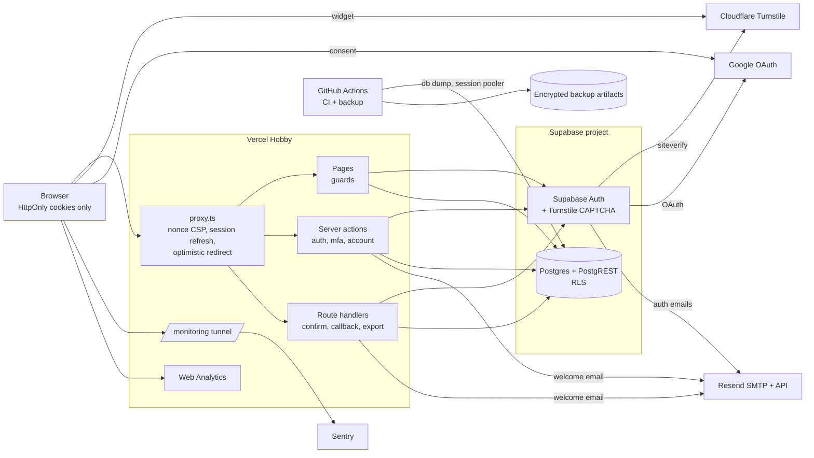
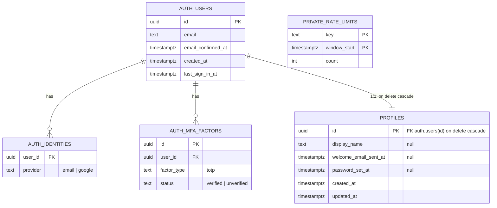

# Template: Design

Last updated: 2026-09-28 · Status: §1 and §3 approved 2026-09-26 (restructured from the RFC, system design, detailed design and API spec on 2026-09-28; no decisions changed)

## 1. Decisions

D1–D24 were approved on 2026-09-26 and are fixed; don't reopen them without asking the user (later changes: `decisions/`). Implementation detail is in BUILD.

### D1. Versions to target
**Decision:** Start on these releases, current on npm on 2026-09-26. Caret ranges with the committed lockfile; pre-1.0 packages get tilde ranges.

| Package | Version | Notes |
| --- | --- | --- |
| Node.js | 24.x LTS ("Krypton", 24.21.0) | `engines` + `.nvmrc`; Node 26 is not LTS yet |
| `next` | 16.3.6 | **`middleware.ts` is deprecated and renamed `proxy.ts` since v16.0.0**; proxy runs on the Node.js runtime and `runtime` can't be set |
| `react`, `react-dom` | 19.3.0 | |
| `@supabase/ssr` | ~0.12.7 | pre-1.0, so tilde range; peer `@supabase/supabase-js ^2.114` |
| `@supabase/supabase-js` | 2.117.2 | |
| `supabase` (CLI, devDependency) | 2.118.0 | Run via `npx supabase`, so the version is pinned per repo; needs Node ≥ 20 |
| `tailwindcss` (+ `@tailwindcss/postcss`) | 4.3.3 | CSS-first config, no `tailwind.config.js` |
| `shadcn` (CLI) | 4.21.0 | Components are copied into `src/components/ui` |
| `zod` | 4.6.5 | Zod 4 API (`z.email()`, `z.url()`) |
| `react-email` | 6.11.0 | Components and `render()` now come from `react-email`; **`@react-email/components` is deprecated on npm** |
| `resend` | 6.30.0 | Welcome email only |
| `@sentry/nextjs` | 11.0.0 | New major (released 2026-09-23). Fallback: 10.75.x with the same `dataCollection` settings if 11 breaks the build |
| `next-themes` | 0.4.6 | Has a `nonce` prop for its inline script |
| `@vercel/analytics` | 2.0.1 | |
| `server-only` | 0.0.1 | |
| `@playwright/test` | 1.63.0 | Chromium only in CI |
| `vitest` | 5.0.2 | |
| `@axe-core/playwright` (dev) | 4.13.0 | NFR-23 a11y check |
| `postgres` (dev) | 3.4.9 | Catalog queries in RLS and coverage tests (D18) |
| `sonner` | 2.0.8 | shadcn's toast component (FR-22) |
| gitleaks (binary) | 8.30.1 | Same tool as the pre-commit hook |
| Local stack (bundled by CLI 2.118) | Postgres 17.6, GoTrue v2.197.0, Mailpit v1.30.2 | |

**Why:** the PM asked for versions checked against real releases. Pinning the Supabase CLI as a devDependency means CI and every clone run the same stack (FR-44, FR-53).
**Alternatives:** Next 15 with `middleware.ts`: a deprecated path. `@react-email/components`: deprecated. t3-env for env vars: see D6.
**Consequences:** all docs say **"proxy" (`src/proxy.ts`)**, never "middleware". Sentry 11 was only 3 days old and its defaults collect personal data (D15), so its setup needs a careful first commit.

### D2. Auth check pattern
**Decision:** The **proxy** only sets the CSP nonce (D5), refreshes the session with `getClaims()` (as Supabase's Next.js guide requires) and sends an *optimistic* redirect to sign-in when a protected path has no claims. It never grants access. **Every protected page, server action and route handler** calls a guard in `src/server/auth/guards.ts`: `requireUser(options?)` asks the Auth server (`getUser()`), so a deleted user or ended session fails; it reads `aal`/`amr` from `getClaims()` and treats `aal1` plus a verified factor (from `user.factors` as returned by the Auth server, never the cookie) as needing `/auth/mfa` (pages redirect, actions and handlers refuse). `requireRecentSignIn()` adds the D9 window. Options D24.2, access levels BUILD §0.2, module F-2. Never `getSession()` on the server.
**Why:** rule 3, NFR-3. Next.js says to verify auth in each Server Function, since a matcher change can skip the proxy. `getClaims()` checks the JWT locally, so a signed-out or deleted user's token works until expiry (`jwt_expiry` 3600 s); `getUser()` closes that for one Auth round-trip per request (security over speed). Cookie `user.factors` isn't signed (FR-58).
**Alternatives:** `getClaims()` only: revoked sessions live up to an hour; MFA trusts the cookie. An access-token hook adding `mfa_enabled`: more moving parts; revisit per app if latency matters.
**Consequences:** protected pages render dynamically (D5 requires it anyway). Forgetting the guard is the main risk; D18's signed-out refusal test covers it. Added latency: DESIGN §5.

### D3. Rate limiting
**Decision:** A **Postgres fixed-window limiter** in the app's database: table `private.rate_limits` (DESIGN §3) and `public.rate_limit_hit`, `security definer`, empty `search_path`, executable **only by `service_role`**; it upserts atomically and deletes rows older than 24 h (return: D24.12). `src/server/security/rate-limit.ts` calls it via the service-role client with HMAC'd keys per IP, email and user (D24.13); the IP is from `x-forwarded-for`, which Vercel overwrites. **Fails closed.** Limits, key format and refusal codes: BUILD §0.4. A limited request always gets M-5, account or not (NFR-12).
**Supabase's own limits:** per IP, sign-up/sign-in endpoints 30 / 5 min, `/token` 150 / 5 min, verify 30 / 5 min, MFA challenge/verify 15 / min (fixed); per user one OTP, link, confirmation or reset per 60 s; with custom SMTP, emails per hour are configurable. Supabase sees **Vercel's egress IPs, not the user's**, so its per-IP limits are an app-wide ceiling. Defaults are kept: we add per-user limits; Supabase's limits and CAPTCHA (D4) guard direct callers. The hourly `email_sent` cap (F-1) keeps Supabase under Resend's daily quota. The fix for the shared-IP ceiling, `Sb-Forwarded-For` (secret key on auth calls + a dashboard setting), is not in v1 (U3).
**Why:** free, no new service, data in the backed-up database (NFR-10, NFR-21). Service role fits rule 6: no user-supplied IDs, and users must not write the table.
**Alternatives:** Upstash Redis free tier (500K commands/month, 256 MB, 1 DB): another account per app. Vercel WAF: Hobby allows **1 rule**, IP/JA4 keys, 10 min maximum window, no email key. `rate_limit_hit` for `anon`: attackers could burn someone's email budget.
**Consequences:** one extra DB round-trip per limited action; a non-user-data registry entry (D12); NFR-10 tests on local Supabase.

### D4. Turnstile on auth forms
**Decision:** **Supabase Auth's built-in CAPTCHA with provider `turnstile`** (`config.toml`, F-1). Actions pass the token as `captchaToken` and **never call siteverify**, because tokens are single-use and valid for 300 s. Per the Auth source, CAPTCHA covers `/signup`, `/recover`, `/resend`, `/magiclink`, `/otp` and password `/token` grants (not refresh, PKCE, id_token), so the re-auth form (D9) has a widget too. Zod rejects a missing token first. `verifyTurnstile()` (`src/server/security/turnstile.ts`) is for **non-auth** forms apps add later (rule 14); no Template form uses it. The widget is in-house, loading Cloudflare's script with the nonce (works with `'strict-dynamic'`, per Cloudflare). Tests use Cloudflare's dummy keys, kept in CI `env` and the README, **not** `.env.example` (the placeholder check would flag them).
**Why:** only Supabase's CAPTCHA protects endpoints callable with the publishable key; our own check would guard only our wrapper (NFR-11, FR-1/3/4/7).
**Alternatives:** own check, Supabase CAPTCHA off: bypassable. Both: impossible (single-use). `@marsidev/react-turnstile`: a dependency for ~40 lines; nonce control is easier in-house.
**Consequences:** local sign-in needs internet (local GoTrue calls siteverify). Each app's widget lists `localhost`, its `*.vercel.app` host and domain (plan limits: DESIGN §5). Supabase sends our server IP as `remoteip`: harmless as far as known, unverified.

### D5. Security headers and nonce CSP
**Decision:** The proxy makes a **nonce per request** and sets the CSP on the request (Next tags its scripts from it) and the response; the root layout passes the nonce to next-themes, Turnstile and any `<Script>`. `src/server/security/csp.ts` builds it (unit-tested; exact policy, headers, matcher: F-2): same-origin by default; scripts only nonce + `'strict-dynamic'` (Turnstile host as CSP2 fallback); `frame-ancestors 'none'`; `form-action` adds the Supabase and Google origins, since Chrome applies it to redirects after a form POST (the e2e no-violations step checks); dev adds `'unsafe-eval'`. **Styles (user, 2026-09-26):** `<style>` elements need the nonce; only inline `style=""` attributes are allowed, since Radix/shadcn set them and attributes can't carry nonces, and attribute-only styles can't use selectors (no CSS attribute-selector data theft). **Fallback** if a library's un-nonced `<style>` can't be fixed (week 1: Sonner, next/font, next-themes): allow inline styles generally, recorded in `decisions/` (a stated loosening, rule 16); scripts stay nonce-only (NFR-13). Inline styles stay low-risk: same-origin images, fonts and connections (a new host is a security change), `react/no-danger` + rule 10, no user input in styles, hex-checked brand colours (D16). Static headers (HSTS, nosniff, Referrer-Policy, Permissions-Policy, X-Frame-Options, COOP) on every path; HSTS preload is a per-app domain decision.
**Compatibility:** Sentry tunnel (D15) and Web Analytics are same-origin; next-themes has a `nonce` prop (check its styles); Turnstile uses the nonce + host fallback; no Google avatars in v1.
**Alternatives:** SRI hashes: experimental.
**Consequences:** **every page is dynamic**: no static generation, ISR or CDN cache; PPR/`cacheComponents` off (PPR doesn't work with nonces). It uses Hobby Active CPU (DESIGN §5; apps watch it). Auth responses aren't cached (BUILD §0.7; Supabase's `Set-Cookie` warning). No CSP report endpoint; e2e checks the console (NFR-13).

### D6. Server-only code, env validation, bundle scan
**Decision:** Every `src/server/**` module imports `server-only`; the service-role client (`src/server/supabase/admin.ts`) and all secrets live only there. Env vars are Zod-validated, split into pure schemas (`src/lib/env/schema.ts`), a server-only parser (`src/server/env.ts`) and a public module referencing each `NEXT_PUBLIC_*` literally (`src/lib/env/public.ts`). `next.config.ts` parses at build; errors name **variables only**, never values (FR-52). After `next build`, `scripts/check-bundle-secrets.ts` scans the client bundle and prerendered output for the **actual secret values** and secret-key patterns (list: F-2); a match fails the build (NFR-4). A deliberate bad import is recorded once (NFR-4). Names: BUILD §0.6.
**Why:** rules 5–8, NFR-4, NFR-5, FR-52. `server-only` can't be imported in `next.config.ts`, hence schema vs parser.
**Alternatives:** `@t3-oss/env-nextjs` (0.13.11): one more dependency (rule 23) for about 30 lines of Zod. A regex-only scan misses keys without a known pattern.
**Consequences:** CI needs every env var set (local values, dummy keys); new variables go in the schema and `.env.example`.

### D7. Emails
**Decision:** **Supabase sends auth emails through Resend SMTP with templates built from React Email; the app sends only the welcome email.** Templates in `src/emails/` (branded from `appConfig`, D16) are built into committed `supabase/templates/` files; CI fails if they drift (F-5). **Links use the SSR token-hash pattern** via `/auth/confirm` (`verifyOtp`: any browser, no PKCE verifier); a magic link's `next` rides in `auth_next` (BUILD §0.7), re-checked. Email logos are PNG (clients handle SVG poorly). **Hosted config** goes up with `supabase config push` (CLI source: templates, SMTP, CAPTCHA). Production SMTP sits in a `[remotes.production]` block shipped commented out (the CLI rejects placeholder project IDs; the README fills it in); **pushing without it clears production SMTP** (the CLI sends an empty host). **Welcome email (FR-30):** each verified sign-in path (`/auth/confirm`, `/auth/callback`, `signIn`) atomically claims a per-user flag; only the claimer sends; a failed send releases the claim (D24.11) and is reported, so the next sign-in retries. At most once, never before verification: accepted as FR-30's "exactly one" (PM, 2026-09-26). **Transport:** Resend SDK in production; locally and in CI, Mailpit (the CLI's catcher; `[inbucket]` is deprecated) via its HTTP API, no SMTP dependency. **Deployed throwaway app:** `onboarding@resend.dev` **only sends to the Resend account owner** (Resend docs), so the deployed e2e uses the owner's address and a `manual` mailbox where the Builder pastes links, then deletes the account (CI section); `delivered@resend.dev` can't be reached from the test sender and still counts. **3 real emails per deployed run** (4 with a manual magic-link check), within NFR-22 (DESIGN §5); CI sends 0.
**Why:** FR-29 and the brief make Resend Supabase's SMTP, ruling out the Send Email hook; building templates keeps the config file the single source (FR-26/28).
**Alternatives:** a Send Email hook to our route: contradicts FR-29, adds a signed public endpoint, sign-ups fail when the app is down. Hand-pasted templates: error-prone for metric 1. A Mailtrap-style inbox: another account.
**Consequences:** config changes need `email:build`, then `config push` (README). Preview auth links point at production `site_url`. Mailpit's send API in the CLI container is **unverified** (week 1; fallback its SMTP port).

### D8. MFA (TOTP)
**Decision:** Supabase TOTP, **free on all projects** (TOTP docs; pricing: "Basic MFA" on Free, phone MFA a $75/month add-on). Enrollment removes stale unverified factors and returns a QR (SVG data URI) and the secret; one verified factor per user. **Enforced twice:** `requireUser()` (D2), and a **restrictive RLS policy on every user-data table** using `private.mfa_satisfied()` (aal2, or no verified factor): Supabase's documented "opted-in users" rule in a `security definer` function, so `authenticated` needs no access to `auth.mfa_factors` (DESIGN §3; SQL F-1). Code attempts: BUILD §0.4, on top of Supabase's per-IP limit (D3). Disabling (FR-59) needs a recent sign-in and a fresh code (Supabase requires aal2 to unenroll). **Lost authenticator:** no documented recovery; the Builder deletes the factor under D24.29. Undocumented `/factors/recovery-codes` endpoints (Auth source, 2026-09-26): out of scope until documented.
**Why:** FR-57–59; a missed guard still can't read data.
**Alternatives:** "all users need aal2": wrong, MFA is optional. Per-policy SQL on `auth.mfa_factors`: needs a grant on `auth`. Phone MFA: paid.
**Consequences:** each new user-data table needs it (checklist, coverage test D18).

### D9. Re-authentication (FR-56)
**Decision:** "Recent" = **the newest `amr[].timestamp` in the verified JWT is ≤ 10 minutes old** (documented as when the method was used; refresh doesn't change it). Otherwise the user goes to `/auth/reauthenticate?next=<same-site path>`: users with a password (D24.1) re-enter it (`signInWithPassword` + Turnstile, a fresh session); others use Google again (a fresh OAuth round-trip); MFA users then pass `/auth/mfa`, since the new session is aal1. As defence in depth, `secure_password_change` is on (F-1): per GoTrue's source a password update on a session older than **24 h** needs a nonce, protecting direct API calls; our flow always makes a fresh session, so no nonce email or fifth template.
**Why:** the PRD leaves the mechanism to design; one rule covers password, Google and magic-link users.
**Alternatives:** `reauthenticate()` nonce: always emails a code, 24 h window. Session `iat`: changes on refresh. Password only: excludes Google-only users.
**Consequences:** Google may re-consent silently (the PRD accepts it; no forced prompt in v1). Testing: D24.30.

### D10. Email-first sign-up closes pre-account takeover (NFR-26)
*(Revised by the PM with the user, 2026-09-26; the first draft's flaw is under Alternatives.)*
**Decision: verify the email first, then set the password.** `signUp` takes **email + Turnstile only** and calls `signInWithOtp` with `shouldCreateUser: true`: a new email gets an unconfirmed user **with no password** and the sign-up confirmation email; an existing email gets a sign-in link; the page always shows M-1 (NFR-12). The link (via `/auth/confirm`, D7) verifies and signs in. A user with only an `email` identity and no password yet (D24.1) is sent to **`/auth/set-password`** by `requireUser()` (actions refuse), where `setInitialPassword` (D22 rule) sets one and `mark_password_set()` records it; Google users skip this. Automatic identity linking stays on, manual linking off: Supabase drops unconfirmed identities when linking, and they never have a password. No service-role email lookup (`auth_email_status()` dropped).
**Why:** only the inbox owner can set the password, closing the password, magic-link and Google-linking variants (NFR-26, rule 15), with one less service-role use (rule 6).
**Alternatives:** Supabase defaults: the first sign-up's password survives confirmation. Deleting unconfirmed accounts on re-sign-up (first draft): whoever signs up last sets the password the owner then confirms. pg_cron clean-up: shrinks the window only.
**Consequences:** FR-1/FR-2 wording changed (user-approved 2026-09-26), about +1–2 hrs. Only `signUp` (reachable only from the sign-up page) creates users, though `requestMagicLink` also uses `signInWithOtp`. **Week 1:** which template Supabase uses for a new `signInWithOtp` user (expected "confirm sign-up") and that the link `type` is handled. Tests: "an unconfirmed account has no usable password" is automated; Google linking is a manual test on the throwaway app (PM-accepted). **Direct `/signup` callers** (decision 0008): GoTrue's own endpoint can still pre-register an email with a password, so F-1 migration 4 clears the password when the email is confirmed through Supabase's email; the same step clears the random hash GoTrue gives new OTP users.

### D11. Magic link never creates accounts (FR-4)
**Decision:** `requestMagicLink` uses `signInWithOtp` with `shouldCreateUser: false`. Per GoTrue's source, an unknown email returns 422 `otp_disabled`. Every outcome (sent, unknown, Supabase's per-user resend rule from D3) gets the same message and status, padded per D24.10. `enable_signup` stays true for D10.
**Why:** FR-4, NFR-12.
**Consequences:** direct API callers can tell accounts apart via the 422, one Turnstile per try: a residual risk (DESIGN §4).

### D12. Data model, user-data registry, account deletion
**Decision:** One app table, `public.profiles` (FR-11), plus the limiter table (D3); fields and RLS in DESIGN §3. Profiles are created by a trigger on new auth users (Google's name, untrusted, rendered as text) and removed by cascade; users change only `display_name`. The **registry** (`src/server/data/registry.ts`) lists every app table as user data or not; the coverage test (D18) fails on a table in neither list, or a user-data table without an RLS test file, the MFA policy (D8) or a cascade path to `auth.users`. **Delete account (FR-16):** recent sign-in, typed email must match, rate limit, then the service-role client deletes the auth user by the id from `getUser()` (never input); the cascade removes every registry row; sign-out and the `account_deleted` notice (D24.31). Steps: F-11. **Hard delete**; backups keep data for their retention (D14, FR-17).
**Why:** rules 1 and 19, NFR-1/2/16: a forgotten table fails CI instead of silently missing from export.
**Alternatives:** DB-side registry: awkward from TypeScript. Row-by-row deletes: more code. User-inserted profiles: duplicates.
**Consequences:** each user-data table needs a cascade chain to `auth.users` and a registry entry in the same change.

### D13. Data export (FR-15)
**Decision:** `GET /account/export` runs `requireUser()` and the rate limit, reads each user-data registry table **with the user's own client** (RLS, no service role) and returns JSON (format, headers: F-11) without tokens, factor secrets or provider tokens. No FR-56 re-auth: aal2 via `requireUser()` is enough (PM, 2026-09-26). Failures: D24.19.
**Why:** a plain link works without JS; other sites can't read it (no CORS; `Lax` cookies).
**Alternatives:** a blob from an action: awkward. Emailed file: quota, data in email. ZIP/CSV: JSON suffices.
**Consequences:** the export test checks every registry table appears, even empty (NFR-16).

### D14. Backups and restore
**Decision:** `scripts/backup.sh` makes three `supabase db dump` passes (roles, schema, data; per the CLI source the data dump **includes `auth` data**, covering FR-33), packs them and **encrypts with `age` to a public recipient** (a repo variable); the private key stays offline with the Builder. `.github/workflows/backup.yml` runs **daily at 03:17 UTC** plus manually and uploads a GitHub Actions artifact kept **30 days**, so expiry is automatic (FR-34). The DB URL is a GitHub secret using the **session pooler** (IPv4; direct connections are IPv6-only without the add-on). It runs in each **app's** repo; the Template ships it manual-only (no hosted DB). **Restore (FR-35)** into a new project by Supabase's documented `psql` procedure, then check counts and a sign-in, and record the date (F-12). No bucket ships, so no storage objects (rule 21 once one does).
**Why:** Supabase Free has no backups; the job (about 2 min/day, ~60 min/month) fits GitHub Free (DESIGN §5); scheduled workflows are auto-disabled after 60 inactive days only in public repos; age is one small binary with no CI passphrase.
**Alternatives:** dumps in a repo: history never expires. Cloudflare R2: another account. GPG symmetric: passphrase in CI.
**Consequences:** artifact storage is shared by all the account's private repos, so CI artifacts stay small (CI section). The DB password is a GitHub secret. Dumps need a container runtime (runners have one). A dump counting as activity against pausing (D19) is **unverified**. S-2 and S-18 texts (SPEC §3.3) quote this retention period; change them with it.

### D15. Sentry
**Decision:** `@sentry/nextjs` (server, edge, browser, `onRequestError`, global error page) through a **same-origin tunnel `/monitoring`**; errors only, no tracing or Replay in v1. **Personal data off explicitly**, because Sentry 11's defaults collect user info, cookies, headers and bodies (settings: F-4). Scrub hooks (`src/lib/observability/scrub.ts`, unit-tested) drop user, cookies, headers, bodies and query strings, strip queries from URLs (they carry `token_hash` and `code`), and redact emails and `sb_`/JWT-shaped tokens. Sentry's default alert emails the single user (FR-31).
**Why:** FR-31, NFR-17, rule 20; the tunnel keeps connections same-origin and passes ad blockers.
**Alternatives:** no tunnel: CSP allows `*.ingest.sentry.io`, ad blockers drop events. Tracing: more personal data in URLs.
**Consequences:** Developer plan (verified; limits DESIGN §5). The proxy matcher excludes `/monitoring` (Sentry docs); its validation exception: D24.16.

### D16. Config file and branding flow
**Decision:** `src/config/app.ts` exports `appConfig`, Zod-validated at import by `src/config/schema.ts` (fields: DESIGN §3; colours are hex). **No URL in the file:** the server-only `getSiteUrl()` (D24.23) reads the env var, falling back to the preview URL (FR-26). Values feed a nonce'd `<style>` overriding shadcn's variables (validated hex: no CSS injection), manifest, OG image, emails (D7), legal pages and footer (F-3). Logo files in `public/brand/` are the only brand assets outside the config. A unit test greps the source for config values (FR-26).
**Why:** FR-25–28, FR-51. Hex works in email, manifests and OG images; OKLCH doesn't.
**Alternatives:** JSON config: no type checking. Tailwind tokens at build: a rebuild step duplicating `globals.css`.
**Consequences:** rebrand = config edit, two logos, `email:build`, `config push`.

### D17. API style (fixed operation names)
**Decision:** Forms use **server actions** returning `ActionResult<T>` (BUILD §0.2; `data` added by D24.21); each validates with Zod, checks auth (except signed-out auth actions) and rate-limits. **Route handlers** only for outside callers: `GET /auth/confirm`, `GET /auth/callback`, `GET /account/export`, the generated `/monitoring`, metadata routes. **DB functions** only for atomicity or privilege boundaries. Fixed names:
- `actions/auth.ts`: `signUp`, `setInitialPassword`, `signIn`, `requestMagicLink`, `requestPasswordReset`, `updatePasswordFromReset`, `signInWithGoogle`, `signOut`, `reauthenticateWithPassword`
- `actions/mfa.ts`: `startMfaEnrollment`, `confirmMfaEnrollment`, `verifyMfaSignIn`, `disableMfa`
- `actions/account.ts`: `updateDisplayName`, `changePassword`, `deleteAccount`
- DB: triggers `handle_new_user`, `set_updated_at`; `claim_welcome_email()`, `mark_password_set()` (authenticated); `rate_limit_hit(…)`, `release_welcome_email(p_user_id)` (service_role); `private.mfa_satisfied()` (internal)

Operations: BUILD features; routes §0.1; access §0.2. Every `next` goes through `safeRedirectPath()` (same-site only, NFR-8; F-2).
**Why:** progressive enhancement, built-in Origin check.
**Alternatives:** REST layer: duplicates actions, doubles the surface. Edge Functions: another runtime.
**Consequences:** action IDs are public endpoints; D18's refusal test calls every export.

### D18. Testing and CI
**Decision:** **Unit (Vitest):** schemas, `safeRedirectPath`, CSP builder, scrubber, config and env schemas, rate-limit keys, email render snapshots. **RLS/DB (Vitest `rls`, local Supabase):** confirmed users A and B on the publishable key, so tests pass through PostgREST, grants and RLS like the app; per registry table B and anon can't read, change or delete A's rows; an MFA user's aal1 session reads nothing (tiny RFC 6238 helper); catalog tests (`postgres` client): RLS everywhere (NFR-1), registry completeness, MFA policy, cascade FKs, service-role-only grants. **Signed-out refusal (NFR-3):** every action and route handler, no cookies. **E2E (Playwright):** production build, local Supabase, dummy Turnstile keys, Mailpit; the FR-39 journey plus headers (NFR-13), CSP console listener, cookie flags and empty web storage (NFR-14), axe (NFR-23), enumeration (NFR-12); a deployed mode (D7). **CI** (GitHub Actions, push and PR, cancel-in-progress, docs-only skipped; refined by decisions/0009): jobs `checks`, `secrets` (pinned, checksum-verified gitleaks CLI: free for personal repos without the action's licence question, same as the hook) and `integration`; actions SHA-pinned; **Dependabot** weekly for npm and Actions, minor/patch grouped. Steps: BUILD CI section.
**Why:** FR-37–42, NFR-1–3/13/14/23, metrics 2–3. Real users through PostgREST catch missing grants and column privileges.
**Alternatives:** pgTAP: bypasses the grant layer, second test language (apps may add it). Hosted branch DB: paid.
**Consequences:** **10–12 CI minutes per push** (estimate, unverified): about 150 pushes plus ~60 backup minutes per app per month on GitHub Free (DESIGN §5). Tests need internet for Turnstile. Adds one devDependency (`postgres`).

### D19. Deployment, migrations, rollback, free-tier pausing
**Decision:** **Vercel Hobby**; previews share the production Supabase project (U2) behind Vercel Authentication (in Hobby), with a preview wildcard in Supabase's redirect allow-list. **Migrations:** forward-only (rule 22), applied **by the Builder from their machine** (`supabase link`, `db push`) **before** promoting code that needs them; expand-then-contract so the previous deploy keeps working (NFR-19); types generated from the local DB (FR-43). **Rollback (FR-36):** Vercel Instant Rollback (Hobby: **previous deployment only**, with its **original** env vars; domain auto-assignment off until "Undo Rollback" or `vercel promote`), then fix forward; never a database rollback. **Pausing** (limits DESIGN §5): irrelevant for the throwaway app (deleted after sign-off); for apps a daily backup *may* count as activity (unverified; launch checklist). Commands: CI section.
**Why:** the Template is never deployed; rules 21–22. `db push` from GitHub needs an **account-wide** `SUPABASE_ACCESS_TOKEN`: too much reach.
**Alternatives:** Action-driven `db push`: that token risk (per-app option later). A staging project: the second free slot.
**Consequences:** the README adds `link`, `db push`, `config push` (FR-45); Hobby's non-commercial rule is per app.

### D20. Folder structure (fixed names for all docs)
**Decision:** One fixed layout (BUILD §0.1): `src/server/**` server-only, `src/lib/**` isomorphic with no secrets, route groups keeping D17's URLs. The D24 review added `vercel.json`, `scripts/check-supabase-env.ts`, `src/lib/messages.ts` and `src/app/(app)/loading.tsx`.
**Why:** the server-only boundary shows in every import path (rule 5).
**Consequences:** ESLint `no-restricted-imports` blocks `@/server/*` in `"use client"` files, catching the mistake at lint time.

### D21. Session cookies and no browser Supabase client
**Decision:** The server client sets session cookie options **explicitly** (BUILD §0.7). **No browser Supabase client in v1**: all auth and data calls go through actions and route handlers.
**Why:** NFR-14, rule 17. **`@supabase/ssr` 0.12.7 defaults to `httpOnly: false` with no `secure`** (package source), because its browser client reads the cookie. `Lax`, not Strict, so email-link and Google redirects arrive with cookies.
**Alternatives:** defaults plus a browser client: JS-readable tokens.
**Consequences:** Realtime or client queries need a deliberate decision (token passing or loosened HttpOnly), matching the same-origin CSP.

### D22. Password rule
**Decision:** At least **12** characters, at most **72 UTF-8 bytes** (bcrypt; D24.15), no character-class rules; set in Supabase (`minimum_password_length`, F-1) and mirrored in BUILD §0.5. Leaked-password protection is **Pro-only**: not in v1.
**Why:** the PRD left it to design; length over complexity is modern guidance; no paid features.
**Consequences:** the e2e password has 12+ characters. M-32 and the C-5 hint (SPEC §3) quote the minimum; change them with it.

### D23. Podman on Fedora 44
**Decision:** Support **Docker** (Engine from Docker's Fedora repo or `moby-engine`, user in `docker`) and **Podman** (Supabase-supported; user socket + `DOCKER_HOST`; commands: CI section). supabase/cli #3099 (Fedora 40, rootless Podman, closed): permission errors, worked around with `DOCKER_HOST`, disabled storage and `--ignore-health-check`. Storage is disabled in `config.toml` (F-1; unused); analytics/vector excluded as in CI.
**Why:** NFR-25, FR-44; the brief's week-1 risk.
**Consequences:** the README gets a tested Podman section after week 1; if Podman fails the suite, Docker is required (recorded in `decisions/`).

### D24. PM consistency-review resolutions (2026-09-26)
Same status as D1–D23; none loosens security or changes the user's decisions.
- **D24.1** "Has a password" = `profiles.password_set_at is not null` (not identity type), set by `mark_password_set()` (called by `setInitialPassword`, `updatePasswordFromReset`, `changePassword`; records only if a hash exists). Drives the re-auth form and settings Password section; others use password reset (FR-7).
- **D24.2** Guard options `allowPendingMfa` (`verifyMfaSignIn`, `/auth/mfa`) and `allowPendingPassword` (`setInitialPassword`, `/auth/set-password`), default false; `signOut` has no guard (a no-op when signed out); `requireRecentSignIn()` unchanged → BUILD §0.2.
- **D24.3** MFA enrollment needs a recent sign-in (a stolen session can't lock the owner out).
- **D24.4** `updatePasswordFromReset` and `changePassword` sign out other sessions.
- **D24.5** The recovery session is aal1, so reset doesn't bypass MFA: MFA users pass `/auth/mfa` before `/reset-password`.
- **D24.6** Recovery sessions detected by an `amr` `recovery` entry (week-1 check), fallback the `auth_recovery` cookie (BUILD §0.7); either counts for **15 minutes**.
- **D24.7** `/auth/confirm` types: `signup | magiclink | recovery | email` (`email` pending week 1).
- **D24.8** `next` carries through `/auth/mfa`, `/auth/set-password`, `/auth/reauthenticate` via `safeRedirectPath()`, and in the `auth_next` cookie (**1 hour**; BUILD §0.7) for magic link, Google and re-auth; a Google cancel always returns to sign-in (BUILD §0.2).
- **D24.9** Login CSRF via `/auth/confirm`: accepted; the header always shows the signed-in email (DESIGN §4).
- **D24.10** Identical messages and a **~500 ms minimum response** for `signUp`, `requestMagicLink`, `requestPasswordReset`, failed `signIn`; Supabase's per-user resend rule (D3) maps to the same message.
- **D24.11** `release_welcome_email(p_user_id)` is `service_role` only, id from `getUser()` (rule 6); `claim_welcome_email()` stays `authenticated`. Stops users resetting the flag to get another welcome email.
- **D24.12** `rate_limit_hit` returns `true` = **allowed**; unit and DB tests lock it.
- **D24.13** Rate-limit keys are **HMAC-SHA256 with a server secret** for IPs, emails and user ids (plain hashes can be guessed) → BUILD §0.4, §0.6.
- **D24.14** Extra limit rows: `startMfaEnrollment`, `signInWithGoogle`, `/auth/confirm`, `/auth/callback`; `signOut` unlimited → BUILD §0.4. Accepted: the per-email `signIn` limit can block a victim's password sign-in for one window; magic link and Google still work.
- **D24.15** Password length counted in UTF-8 bytes (`TextEncoder`) → BUILD §0.5.
- **D24.16** `/monitoring` is exempt from "Zod + rate limit" (forwards only to the DSN); quota abuse accepted (spike protection, plan cap).
- **D24.17** A Vercel Ignored Build Step skips `dependabot/*` previews, so unreviewed dependency code never runs with preview env vars (CI section); previews otherwise as U2.
- **D24.18** User-data tables live in `public`; the coverage test enforces it.
- **D24.19** `/account/export` never shows a bare error: each failure redirects (F-11; values BUILD §0.2).
- **D24.20** The privacy placeholder lists the providers (Supabase, Vercel incl. Web Analytics, Resend, Cloudflare Turnstile, Sentry, Google) and backup retention (D14). **Week 1:** which `auth` tables keep IPs/user agents after `deleteUser`; that Web Analytics sets no cookies.
- **D24.21** `ActionResult<T = void>` gains optional `data?: T` (for `startMfaEnrollment`: factor id, QR, secret, `otpauth://` URI) → BUILD §0.2.
- **D24.22** S-16 offers an `otpauth://` link beside the QR and secret.
- **D24.23** `getSiteUrl()` is server-only in `src/server/site-url.ts`.
- **D24.24** Config test: `primary`/`primaryForeground` (and the dark pair) contrast ≥ **4.5:1** (NFR-23).
- **D24.25** Email subjects are generic (no app name), so `config.toml` holds no `appConfig` copy (FR-26); sender name from the sender env var. Subjects: SPEC §3.4.
- **D24.26** Profile shows the email read-only with a contact-support `mailto:` (FR-13 deferred).
- **D24.27** `/auth/error?reason=` is a Zod enum (BUILD §0.2) choosing one of three messages; `rate_limited` shows M-5 for `/auth/confirm` or `/auth/callback` limits.
- **D24.28** New env vars (placeholders only, FR-46); `GOOGLE_CLIENT_SECRET` and `TURNSTILE_SECRET_KEY` **not on Vercel**, so a separate `supabaseConfigEnv` part → BUILD §0.6.
- **D24.29** The Builder removes a lost factor only when the request comes from, or is confirmed by, the account's own email (README, launch checklist).
- **D24.30** FR-56 test: guard unit test with an injected clock, plus a manual check; no env-controlled window.
- **D24.31** Post-redirect notices use a `?notice=` Zod enum, unknown values ignored; replaces `?account=deleted` → BUILD §0.2; texts SPEC §3.4.
- **D24.32** API-1 to API-7 are part of the user-facing message set (SPEC §3.4).

### User answers (U1–U4), 2026-09-26
- **U1. Backups:** schedule and retention as in D14; the privacy placeholder says deleted data can stay in backups that long.
- **U2. Previews:** share the production Supabase project behind Vercel Authentication; apps can add staging later.
- **U3. Supabase per-IP limits:** accepted for v1; IP forwarding (D3) is a per-app step once there's real traffic.
- **U4. Container runtime:** Podman 5.8.7 installed, no Docker: try Podman in week 1 (D23), Docker Engine only on #3099-type errors. Also missing then: Supabase CLI (npm), gitleaks, age; Node was 26, so install Node 24 LTS (D1).
- Also answered: style CSP (D5), sign-up (D10).

The RFC's risk table moved row by row: security residuals to DESIGN §4, operational and free-tier risks to DESIGN §5.

### Sources
All opened on 2026-09-26.
- npm registry `latest` versions: https://registry.npmjs.org/{next, react, @supabase/ssr, @supabase/supabase-js, supabase, tailwindcss, shadcn, zod, react-email, @react-email/components (deprecated flag), resend, @sentry/nextjs, @playwright/test, vitest, next-themes, @vercel/analytics, server-only, @axe-core/playwright, postgres, sonner, @t3-oss/env-nextjs}
- Supabase CLI latest release: https://api.github.com/repos/supabase/cli/releases/latest (v2.118.0)
- Node.js releases: https://nodejs.org/dist/index.json
- gitleaks release: https://api.github.com/repos/gitleaks/gitleaks/releases/latest; licence: https://github.com/gitleaks/gitleaks-action
- Next.js proxy (middleware renamed, Node runtime, verify auth in Server Functions): https://nextjs.org/docs/app/api-reference/file-conventions/proxy
- Next.js CSP / nonces / dynamic rendering / SRI: https://nextjs.org/docs/app/guides/content-security-policy
- Supabase SSR for Next.js (proxy, getClaims, publishable key): https://supabase.com/docs/guides/auth/server-side/nextjs
- Supabase SSR advanced guide (PKCE, caching warning): https://supabase.com/docs/guides/auth/server-side/advanced-guide
- getClaims: https://supabase.com/docs/reference/javascript/auth-getclaims
- JWT signing keys: https://supabase.com/docs/guides/auth/signing-keys
- JWT fields (amr, aal): https://supabase.com/docs/guides/auth/jwt-fields
- MFA overview + RLS policies (doc source): https://supabase.com/docs/guides/auth/auth-mfa and https://raw.githubusercontent.com/supabase/supabase/master/apps/docs/content/guides/auth/auth-mfa.mdx
- TOTP (free, enabled on all projects): https://supabase.com/docs/guides/auth/auth-mfa/totp
- Auth rate limits (+ Sb-Forwarded-For): https://supabase.com/docs/guides/auth/rate-limits
- Auth CAPTCHA: https://supabase.com/docs/guides/auth/auth-captcha
- GoTrue source (CAPTCHA routes, recovery-codes routes, secure password change 24 h, signup keeps unconfirmed user, magic link for unconfirmed, OTP create_user): https://github.com/supabase/auth, files `internal/api/{api.go,middleware.go,user.go,signup.go,magic_link.go,otp.go}` (master)
- Identity linking: https://supabase.com/docs/guides/auth/auth-identity-linking
- signInWithOtp: https://supabase.com/docs/reference/javascript/auth-signinwithotp
- Password security (leaked-password protection Pro-only): https://supabase.com/docs/guides/auth/password-security
- API keys (publishable/secret, legacy deprecated end of 2026): https://supabase.com/docs/guides/api/api-keys
- Local email templates: https://supabase.com/docs/guides/local-development/customizing-email-templates
- config push: https://supabase.com/docs/reference/cli/supabase-config-push; CLI source `apps/cli-go/pkg/config/{auth.go,config.go,templates/config.toml,templates/Dockerfile}`: https://github.com/supabase/cli (develop)
- db dump: https://supabase.com/docs/reference/cli/supabase-db-dump; CLI `pkg/migration/{dump.go,scripts/dump_data.sh}`
- Backup and restore: https://supabase.com/docs/guides/platform/migrating-within-supabase/backup-restore
- Connecting (IPv6 direct, IPv4 pooler): https://supabase.com/docs/guides/database/connecting-to-postgres
- Managing environments (setup-cli, db push secrets): https://supabase.com/docs/guides/deployment/managing-environments
- Supabase pricing (2 projects, pause after 1 week, no backups, TOTP free, phone MFA $75): https://supabase.com/pricing
- Supabase CLI getting started (Podman supported, npm install, Node ≥ 20): https://supabase.com/docs/guides/local-development/cli/getting-started
- Rootless Podman issue: https://github.com/supabase/cli/issues/3099
- `@supabase/ssr` 0.12.7 package source (`DEFAULT_COOKIE_OPTIONS`): `npm pack @supabase/ssr@0.12.7`
- React Email manual setup / render: https://react.email/docs/getting-started/manual-setup, https://react.email/docs/utilities/render
- Mailpit API routes (source): https://raw.githubusercontent.com/axllent/mailpit/develop/server/server.go
- Resend pricing (3,000/month, 100/day, 3 domains): https://resend.com/pricing
- Resend test addresses (count against quota): https://resend.com/docs/dashboard/emails/send-test-emails
- resend.dev only to own address: https://resend.com/docs/knowledge-base/403-error-resend-dev-domain
- Resend SMTP for Supabase: https://resend.com/docs/send-with-supabase-smtp
- Turnstile testing keys: https://developers.cloudflare.com/turnstile/troubleshooting/testing/
- Turnstile CSP: https://developers.cloudflare.com/turnstile/reference/content-security-policy/
- Turnstile server-side validation (300 s, single use): https://developers.cloudflare.com/turnstile/get-started/server-side-validation/
- Turnstile plans (20 widgets, 10 hostnames): https://developers.cloudflare.com/turnstile/plans/
- Upstash pricing: https://upstash.com/pricing/redis
- Vercel WAF rate limiting (Hobby: 1 rule): https://vercel.com/docs/vercel-firewall/vercel-waf/rate-limiting
- Vercel request headers (x-forwarded-for overwritten): https://vercel.com/docs/headers/request-headers
- Vercel Hobby plan (limits, non-commercial, 50k analytics events): https://vercel.com/docs/plans/hobby
- Vercel Instant Rollback: https://vercel.com/docs/instant-rollback
- Sentry pricing (Developer: 5k errors, 1 user, 30 days, email alerts): https://sentry.io/pricing/
- Sentry Next.js manual setup (tunnelRoute, proxy matcher): https://docs.sentry.io/platforms/javascript/guides/nextjs/manual-setup/
- Sentry options (`dataCollection`, v11 defaults): https://docs.sentry.io/platforms/javascript/guides/nextjs/configuration/options/
- GitHub Actions billing (Free: 2,000 min, 500 MB): https://docs.github.com/en/billing/concepts/product-billing/github-actions
- Artifact retention (default 90 days): https://docs.github.com/en/actions/how-tos/manage-workflow-runs/remove-workflow-artifacts
- Scheduled workflows disabled after 60 days (public repos): https://docs.github.com/actions/managing-workflow-runs/disabling-and-enabling-a-workflow
- Unverified (stated as such in the text): whether new projects default to asymmetric JWT keys; Mailpit send API enabled in the CLI container; whether a daily dump counts as Supabase activity; the CI minutes-per-push estimate; the effect of Supabase sending our server IP as Turnstile `remoteip`; `config push` showing a diff before applying.

## 2. Architecture

Every Supabase call runs on the server; no browser Supabase client (D21). Supabase Auth does password, magic link, Google, TOTP, linking and CAPTCHA; the app adds its limiter (D3), Zod, the re-auth window (D9), AAL checks (D2) and restrictive RLS (D8).

| Component | Responsibility | Details |
| --- | --- | --- |
| Browser | Renders pages; only HttpOnly cookies (BUILD §0.7), no tokens in JS storage; Turnstile widget, Analytics script | F-3, D21 |
| Proxy | Nonce + CSP, session refresh, optimistic redirect. **Not a security check** (rule 3) | D2, D5, F-2 |
| Pages | Render; each protected page calls its guard (BUILD §0.2) | F-3, F-6…F-11 |
| Server actions | All forms, in BUILD §0.2's order | D17, F-6…F-11 |
| Route handlers | Email-link verify, OAuth callback, export | D17, F-6, F-7, F-11 |
| Guards | Access levels, recent sign-in, recovery | D2, D9, F-2 |
| Supabase clients | User client; admin client only where BUILD §0.1 allows | D6, D21, F-2 |
| Supabase Auth | Users, identities, sessions, factors, CAPTCHA, auth emails, per-IP limits | D3, D4, D8 |
| Postgres | Tables, triggers, functions, RLS | DESIGN §3, F-1 |
| Resend | SMTP for auth emails; API for the welcome email | D7, F-5 |
| Turnstile | Bot check on CAPTCHA-covered forms | D4 |
| Sentry | Errors and email alerts via the tunnel | D15, F-4 |
| Web Analytics | Page views (FR-32) | F-4 |
| GitHub Actions | CI; backups (manual-only in the Template) | D14, D18, F-12 |
| Mailpit (local, CI) | Catches all emails; e2e reads its API | D7 |

### Data flows
Every action follows BUILD §0.2's order; errors go to `logError` and users see `toUserMessage` codes (BUILD §0.3).

- **Flow 1, sign-up (FR-1, D10):** S-5 → `signUp` → Supabase Auth checks the CAPTCHA, creates an unconfirmed user with no password (existing email: sign-in link) → E-1 via Resend SMTP → `handle_new_user` inserts `profiles` → M-1 always, padded (D24.10).
- **Flow 2, confirm → set password (FR-2):** E-1 → `GET /auth/confirm` (D24.7) → `verifyOtp` → session → Flow 3 → `safeRedirectPath(next)` → guard sends `password-unset` users to S-9 → `setInitialPassword` → `mark_password_set()` → S-12. Bad link → S-8.
- **Flow 3, welcome (FR-30, D7):** `sendWelcomeIfFirst` from `/auth/confirm`, `/auth/callback`, `signIn` → `claim_welcome_email()` → only the claimer sends E-4 (Resend API; Mailpit locally) → failure: `release_welcome_email` via admin (D24.11), `logError`; next sign-in retries.
- **Flow 4, password sign-in (FR-3):** S-4 → `signIn` → `signInWithPassword` + CAPTCHA → M-4 for any failure, padded → Flow 3 → guard (Flow 7) → S-12 or `next`.
- **Flow 5, magic link (FR-4, D11):** S-4 → `requestMagicLink` (`next` into `auth_next`) → `signInWithOtp`, no user creation → M-2 always → E-2 → `/auth/confirm` → `next`.
- **Flow 6, Google (FR-5):** `signInWithGoogle` → Google consent → `GET /auth/callback` → `exchangeCodeForSession` (PKCE) → linking only onto verified emails (D10) → Flow 3 → S-12. Cancel → S-4 (BUILD §0.2).
- **Flow 7, MFA step (FR-58):** `aal1` → guard reads factors from the Auth server → pages redirect to S-10, actions refuse (API-2) → `verifyMfaSignIn` → `aal2`. RLS independently hides rows from `aal1` MFA sessions (D8).
- **Flow 8, MFA on/off (FR-57, FR-59):** S-16 → `startMfaEnrollment` (recent, D24.3; removes stale factors) → QR, secret, URI in `ActionResult.data` (D24.21) → `confirmMfaEnrollment` → verified. Off: `disableMfa` (recent + fresh code).
- **Flow 9, re-auth (FR-56, D9):** `requireRecentSignIn()` fails → S-11 → password users (D24.1) `reauthenticateWithPassword`, others Google → MFA users S-10 → `next`.
- **Flow 10, reset (FR-7, FR-8):** S-6 → `requestPasswordReset` → M-3 always → E-3 → `/auth/confirm` → recovery session (D24.6) → S-10 first for MFA users (D24.5) → S-7 → `updatePasswordFromReset` → `mark_password_set()` → other sessions out (D24.4) → recovery cookie cleared. Google-only users add a password this way.
- **Flow 11, change password (FR-14):** S-15 (only with a password) → `changePassword` (recent) → `mark_password_set()` → other sessions out.
- **Flow 12, export (FR-15, D13):** S-17 → `GET /account/export` → guard, limit → registry tables via the user's client → JSON (F-11); failures redirect (D24.19).
- **Flow 13, delete (FR-16, D12):** S-18 → `deleteAccount` (recent + typed email) → admin `deleteUser` (id from `getUser()`) → cascade → sign-out → S-1 notice (D24.31). Backups keep data for their retention (D14).
- **Flow 14, protected request (FR-9, FR-10):** proxy refreshes an expired token → guard's `getUser()` → deleted or signed-out users fail before JWT expiry.
- **Flow 15–16, backup and restore (FR-33–35):** `backup.yml` → dump over the session pooler → `age` → artifact; restore: decrypt offline → new project → `psql` → counts, test sign-in, date recorded (D14, F-12).
- **Flow 17, deploy (D19):** `db push` → merge → CI (bundle scan) → Vercel build (env parse, D6) → promote; `config push` only with the production remote block (D7).

## 3. Data model

The only place fields are defined. BUILD F-1 implements these as migrations and never re-lists fields. The code-level entities (registry, `appConfig`, export file, backup artifact) aren't tables.

### Supabase-owned: `auth.users`, `auth.identities`, `auth.mfa_factors`
Owned by Supabase Auth (the user is "self"). The app never writes them directly, only through Auth APIs. Only the fields we rely on:
- **`auth.users`:** `id` (uuid, PK), `email`, `email_confirmed_at` (null until verified), `created_at`, `last_sign_in_at`. Also read inside definer functions: `encrypted_password` (empty or null = no password; D24.1), `raw_user_meta_data->>'full_name'` and `raw_app_meta_data->>'provider'` (untrusted; D12).
- **`auth.identities`:** `user_id` → `auth.users`, `provider` (`email` or `google`). `identity_data` and provider tokens are never exported.
- **`auth.mfa_factors`:** `id`, `user_id` → `auth.users`, `factor_type = 'totp'`, `status` (`verified` / `unverified`). `authenticated` has no access; it's read only by `private.mfa_satisfied()` and, for the guard, through `user.factors` from the Auth server (D2).

### `public.profiles` (user data)
Owner: the user (`id = auth.uid()`). Exactly one row per auth user (FR-11): created by the `handle_new_user` trigger, removed by cascade.

| Field | Type | Null | Default | Checks / notes |
| --- | --- | --- | --- | --- |
| `id` | uuid | no | – | PK; FK `auth.users(id) on delete cascade` |
| `display_name` | text | yes | null | `char_length` between 1 and 80. From Google's `full_name` at creation (trimmed to 80, else null), otherwise set by the user; rendered as text only M-36 quotes the maximum; change them together. |
| `welcome_email_sent_at` | timestamptz | yes | null | The welcome claim (D7); written only by `claim_welcome_email` / `release_welcome_email` |
| `password_set_at` | timestamptz | yes | null | **The "has a password" signal** (D24.1); written only by `mark_password_set` |
| `created_at` | timestamptz | no | `now()` | |
| `updated_at` | timestamptz | no | `now()` | Kept current by the `set_updated_at` trigger |

Indexes: only the PK.

**RLS in plain words** (RLS on):
- **Select:** a signed-in user reads only their own row.
- **Update:** a signed-in user updates only their own row, and only the `display_name` column (column privileges: `authenticated` has update on `display_name` only).
- **Insert / delete:** nobody through the API (no policies, no grants); the trigger inserts and the cascade deletes.
- **MFA (restrictive, all commands, to `authenticated`):** access only while `private.mfa_satisfied()` is true (D8). Every user-data table carries this policy.
- **`anon`:** no privileges.

### `private.rate_limits` (not user data)
Owner: the system; no relationship to users. `private` isn't exposed through PostgREST.

| Field | Type | Null | Default | Checks / notes |
| --- | --- | --- | --- | --- |
| `key` | text | no | – | Format and HMAC: BUILD §0.4 (D24.13) |
| `window_start` | timestamptz | no | – | Start of the fixed window, aligned to the epoch |
| `count` | int | no | 0 | Hits in this window |

PK `(key, window_start)`; an index on `window_start` for the clean-up (D3).
**RLS in plain words:** RLS on with **no policies** and no grants to `anon` or `authenticated`. Reachable only through `rate_limit_hit`, which only `service_role` can execute (D3).

### Registry: `USER_DATA_TABLES` / `NON_USER_DATA_TABLES`
Owner: code (`src/server/data/registry.ts`). Drives export (D13), the deletion checks and the RLS coverage test (D12).
- `USER_DATA_TABLES` entries: `{ schema: 'public', table, ownerColumn }` (schema restricted to `public`, D24.18). Today: `public.profiles`, owner column `id`.
- `NON_USER_DATA_TABLES` entries: `{ schema, table, reason }`. Today: `private.rate_limits` (its reason string: BUILD F-1).
- Every table in an app schema is in exactly one list (D12).

### `appConfig`
Owner: code (`src/config/app.ts`), validated by `src/config/schema.ts`. Not user data. Used by the layout, manifest, OG image, emails and legal pages (D16).

| Field | Type | Checks |
| --- | --- | --- |
| `name` | string | 1–60 characters |
| `shortName` | string | 1–12 characters |
| `description` | string | 1–200 characters |
| `supportEmail` | string | email |
| `brand` | `{ primary, primaryForeground, primaryDark?, primaryForegroundDark? }` | each hex `/^#[0-9a-f]{6}$/i`; each pair meets D24.24 |
| `logo` | `{ svg: '/brand/logo.svg', png: '/brand/logo.png', alt }` | files in `public/brand/` |
| `legal` | `{ entityName }` | placeholder until each app fills it in |

### Data export file
Owner: the user; one JSON file per download from the registry tables (D13). Format, fields and headers: F-11.

### Backup artifact
Owner: the Builder (the app's repo); one encrypted archive per run holding the roles, schema and data dumps of the app's Supabase DB (D14). File name and contents: F-12.

## 4. Security, threats, privacy

### 4.1 Boundaries and checks

**Trust boundaries:**
1. **Browser ↔ Vercel:** all browser input is untrusted; `x-forwarded-for` is trusted only because Vercel overwrites it (BUILD §0.4).
2. **Vercel ↔ Supabase:** the server holds the user's JWT and the secret key (admin uses: BUILD §0.1 import boundaries). Supabase re-checks JWT and RLS on every user-client query, so an action bug can't read others' rows.
3. **Internet ↔ Supabase directly:** the publishable key and project URL are public. Only Supabase's CAPTCHA, its per-IP limits (D3), RLS, grants and the MFA policy apply there; our rate limits and padding do **not**.
4. **Third parties:** Resend (email content, recipient), Cloudflare (browser signals), Google (OAuth), Sentry (scrubbed errors), Vercel (hosting, logs, analytics), GitHub (code, CI, encrypted backups, DB URL secret).

**Where each check happens:**

| Layer | Check | Home |
| --- | --- | --- |
| Proxy | Nonce, headers, session refresh, optimistic redirect only | D2, D5, F-2 |
| Page / action / route handler | Zod, guard (access level), rate limit, CAPTCHA token passed to Supabase | BUILD §0.2, §0.4, §0.5; D4 |
| Supabase Auth | CAPTCHA, per-IP limits, password rule, `secure_password_change` | D3, D4, D9, D22 |
| PostgREST + Postgres | RLS per table, column grants, restrictive MFA policy | DESIGN §3, D8 |
| DB functions | `security definer`, empty `search_path`; who may execute each | D17, D24.11; SQL in F-1 |
| CI catalog tests | RLS everywhere, registry, MFA policy, cascade, `public` schema, service-role-only grants | D12, D18, D24.18 |

Storage: no bucket ships (NFR-15; rule 18 once an app adds one).

**Per operation:** each operation's access level, CAPTCHA use and Supabase client are in its BUILD F-n contract (the "Who" line), with levels defined in BUILD §0.2 and limits in §0.4. The one admin-client (service-role) operation is `deleteAccount` (F-11, id from `getUser()`, CLAUDE.md rule 6). The two documented exceptions to "auth check + rate limit" are `signOut` (D24.2) and `/monitoring` (D24.16).

**Secrets:** names, kinds and readers are BUILD §0.6; where each lives:

| Secret | Lives in |
| --- | --- |
| `SUPABASE_SECRET_KEY`, `RATE_LIMIT_HMAC_SECRET` | `.env.local`, Vercel env |
| `RESEND_API_KEY` | `.env.local`, Vercel env; pushed into Supabase SMTP config |
| `TURNSTILE_SECRET_KEY`, `GOOGLE_CLIENT_ID`, `GOOGLE_CLIENT_SECRET` | `.env.local` on the Builder's machine; pushed into Supabase config (not on Vercel: D24.28). An app adding a `verifyTurnstile()` form sets the Turnstile secret on Vercel |
| `SENTRY_AUTH_TOKEN` | Vercel env (optional locally) |
| `SUPABASE_DB_URL` | GitHub Actions secret (app repos) |
| age private key | offline with the Builder (D14) |

Enforcement: D6, NFR-5, gitleaks (D18); a leaked key is rotated (rule 8).

**Abuse protection:** limiter (D3, D24.13), CAPTCHA (D4), Supabase limits (D3) and the `email_sent` cap (F-1) guarding the Resend quota (§5.3), padded identical responses (D24.10), email-first sign-up (D10).

### 4.2 Threat model
Assets: accounts, personal data (incl. exports, backups), the database, secrets, free-tier quotas, and the Template itself (a flaw copies into every app). STRIDE in brackets.

| ID | Asset | Threat | Impact | Stopped by | Residual |
| --- | --- | --- | --- | --- | --- |
| T1 | Accounts | Bot guesses passwords across many IPs (S) | Takeover | CAPTCHA on password grants (D4); BUILD §0.4 row `signIn`; D22; optional MFA; NFR-10, 11; rules 13, 14 | Per-email lockout of a victim's password sign-in for one window; magic link and Google still work (D24.14). No leaked-password check (D22) |
| T2 | Accounts | Pre-registers the victim's email with a known password, or links Google to it (S) | Takeover after the victim confirms | Email-first sign-up; linking only onto verified emails; a password set before confirmation is cleared on confirmation (D10, NFR-26, decision 0008) | Google-linking case tested manually only (D10) |
| T3 | Accounts | Session cookie stolen via XSS (S, I) | Takeover | Cookie flags, no browser client (D21, BUILD §0.7); nonce CSP (D5); `react/no-danger` (rule 10); NFR-7, 13, 14 | Inline style attributes allowed, plus the fallback if used (D5). A stolen access token still works against PostgREST until expiry (D2); our server rejects it. No "sign out everywhere" (SPEC §2.4) |
| T4 | Accounts | Signed-in attacker (stolen session, unlocked device) changes password, enrols or disables MFA, or deletes the account (S, E) | Lockout, loss | `requireRecentSignIn()` (D9, D24.3); typed email (D12); fresh code for disable (D8); `secure_password_change` (D9); other sessions signed out (D24.4) | Google may re-consent silently during re-auth (D9) |
| T5 | Accounts | MFA bypass: stop after the first factor and call actions or PostgREST directly (E) | MFA useless | F-2 guard reads factors from the Auth server (D2); restrictive RLS (D8); BUILD §0.4 row `verifyMfaSignIn`; recovery session passes `/auth/mfa` (D24.5) | Lost-authenticator support path is open to social engineering; mitigated by D24.29. No recovery codes (D8) |
| T6 | Accounts | Forgotten guard on a new action or page (E) | Data exposure | RLS is independent; signed-out refusal test (D18); review checklist; proxy not trusted (D2); NFR-3; rules 3, 4 | – |
| T7 | Personal data | User B reads, changes or deletes A's rows (I, T) | Breach | RLS and column grant (DESIGN §3); RLS and catalog tests (D18); NFR-1, 2 | – |
| T8 | Personal data | Enumeration: learn whether an email has an account (I) | Targeted phishing | Identical padded responses (D24.10); HMAC-keyed limits (D24.13); NFR-12; rule 15 | Direct API callers can tell accounts apart by the magic-link 422, one solved CAPTCHA per try (D11); Supabase per-IP limits apply |
| T9 | Personal data | Open redirect via `next` (S) | Credential theft | `safeRedirectPath()` and its tests (D17, F-2); NFR-8; rule 11 | – |
| T10 | Personal data | Personal data or tokens leak into Sentry, logs or error pages (I) | Breach at a third party | D15 settings and scrubber (F-4); `logError`, `toUserMessage` (BUILD §0.7, §0.3); NFR-9, 17; rules 12, 20 | – |
| T11 | Personal data | CSRF on state-changing requests (T) | Unwanted changes | Server actions (POST + Origin check, D17); the GET handlers change nothing another site can read (D13) | – |
| T12 | Personal data | Backup artifacts stolen from GitHub (I) | Full DB disclosure | `age` to a public recipient, so leaking the repo or CI can't decrypt; artifact expiry (D14); rule 21 | The DB password is a GitHub secret: a GitHub account compromise reaches the database (D14) |
| T13 | Database | Calls `rate_limit_hit` to burn someone's email budget (D) | Victim can't sign in | Executable only by `service_role` (D3) | – |
| T14 | Database | SQL injection (T, I) | Breach | Client parameterisation; no string-built SQL (review checklist); empty `search_path` on definer functions | – |
| T15 | Database | Bad migration or data corruption (T) | Data loss | Forward-only, expand-then-contract (D19); review flags edited migrations; backups and tested restore (D14); NFR-18, 19; rules 21, 22 | – |
| T16 | Secrets | Service-role key reaches the browser or git (E) | Full DB bypass | D6 (server-only, import rule, bundle scan); `.env.example` check; gitleaks; NFR-4, 5; rules 5–8 | – |
| T17 | Secrets | Malicious or typosquatted dependency (E, I) | Anything the server can do | Few packages (rule 23); lockfile; `npm audit`; Dependabot; `postinstall` review; SHA-pinned Actions and checksum-verified gitleaks (D18); no `dependabot/*` previews (D24.17); NFR-20 | Previews share the production project and env vars behind Vercel Authentication, so reviewed preview code runs against real data (U2) |
| T18 | Quotas | Bots trigger emails to burn the Resend quota (§5.3) (D) | Real users get no emails | CAPTCHA and limits (D3, D4); Supabase per-user email rule (D3); `email_sent` cap (F-1); `release_welcome_email` is `service_role` only (D24.11); NFR-10, 11, 22 | Sentry quota: anyone can post to `/monitoring`; it forwards only to the DSN, spike protection applies (D24.16) |
| T19 | Availability | Request flood; every page is dynamic and each protected request calls `getUser()` (D) | Hobby CPU limit, slow pages | Rate limits (D3); Supabase per-IP limits; per-app Vercel WAF rule (D3) | Supabase's per-IP limits act as an app-wide ceiling (§5.4 risks, U3) |
| T20 | Framing | Site framed to trick clicks (T) | Unwanted actions | `frame-ancestors`, `X-Frame-Options`, COOP (D5, F-2); NFR-13 | – |
| T21 | Repudiation | User disputes a deletion or password change (R) | Support dispute | Supabase Auth's own logs | No app audit log in v1 (accepted: not required by SPEC §2) |
| T22 | Accounts | Login CSRF: victim opens an `/auth/confirm` link for the attacker's account (S) | Victim enters data into the attacker's account | Header always shows the signed-in email (D24.9, F-3) | Accepted for v1 (D24.9) |

**Other residual notes:** Supabase sends our server IP to Turnstile as `remoteip`: believed harmless, unverified (D4).

### 4.3 Privacy
Minimisation (rule 19): only `profiles` (DESIGN §3); no avatars, phone numbers or IPs in app tables. Export and hard delete follow the registry (D12, NFR-16). Retention "account" = until account deletion, then backup retention (D14).

| Personal data (where) | Why | Who sees it | Retention | Export | Deletion |
| --- | --- | --- | --- | --- | --- |
| Email (`auth.users`; Resend as recipient) | Identity, auth emails | User; Builder (dashboard) | account | Account part (F-11) | With the auth user. Read-only in settings; change via support (D24.26) |
| Password hash (`auth.users`) | Sign-in | Nobody in plain text | account (or until changed) | No | With the auth user |
| Display name (`profiles`, maybe Google's name) | Shown in the app | User | account | Yes | Cascade |
| Providers, Google identity (`auth.identities`) | Google sign-in | User; Builder | account | Providers only, no tokens (F-11) | With the auth user |
| TOTP factor secret (`auth.mfa_factors`) | MFA | Nobody after enrolment | Until disabled or deletion | Only whether MFA is on (F-11) | With the auth user |
| Timestamps (sign-up, confirmed, last sign-in, welcome, password set) | Flows | User; Builder | account | Yes | With the user |
| HMAC'd IP, email, user id (`private.rate_limits`) | Rate limiting | Nobody; irreversible without the HMAC secret | Limiter clean-up (D3), then backups | No (non-user-data registry) | Expire |
| IPs, user agents in Supabase `auth` tables | Kept by Supabase Auth | Builder | Sessions (IP, user agent) go with the user; `auth.audit_log_entries` keeps account-activity rows (sign-up, login, deletion, …) with the email, user id and, on hosted Supabase, possibly the IP (week-1 check 12, decisions/0017) | No | Audit rows stay: no clean-up in v1 (the privacy placeholder says so); an app that must erase them decides per app (decisions/0017); in backups up to their retention |
| Session cookies, sessions | Staying signed in | User's browser | Session lifetime; ended on password change or reset (D24.4) | No | Cleared on sign-out; removed on deletion |
| Error events (Sentry) | Debugging | Builder | Plan lookback (§5.3) | No | Scrubbed (D15, NFR-17) |
| Page views (Vercel) | Traffic (FR-32) | Builder | Per Vercel (not researched) | No | Provider listed (D24.20) |
| Browser signals (Cloudflare) | Bot check | Cloudflare | Per Cloudflare (not researched) | No | Provider listed |
| Email content + recipient (Resend) | Delivery | Builder (dashboard) | Per Resend (not researched) | No | Provider listed |
| Export file | Right to data | User | User's device only; never emailed or stored | – | – |
| Backups (all DB data above) | Recovery | Builder with the offline key | D14, automatic expiry | – | Deleted accounts leave backups when those expire (FR-17 placeholder) |

**Cookies:** only functional cookies (BUILD §0.7), so no banner is designed; that Web Analytics sets no cookies is a week-1 check (D24.20).

**Legal needs** (LAUNCH-CHECKLIST "Security and privacy" items point here): placeholders per FR-17 and D24.20 (sign-off list); per app, the filled-in policy and terms, disclaimers, age limits, consent and the D24.29 rule (generic list).

## 5. Operations

### 5.1 Environments
Deployment steps: BUILD's last section; previews and rollback: D19.

| Env | Where | Supabase | Email | Turnstile |
| --- | --- | --- | --- | --- |
| Local | Builder's Fedora 44 PC | Local stack, Podman or Docker (D23) | Mailpit | Dummy keys (D4); needs internet |
| CI | GitHub Actions | Local stack, trimmed (CI section) | Mailpit; no real emails | Dummy keys |
| Preview | Vercel Preview | Production project (U2) | Resend | Real widget, preview host listed |
| Production | Vercel (Template: throwaway app only) | Hosted Free project | Resend SMTP + API | Real keys |

### 5.2 Failure modes, monitoring, backups, rollback

| Failure | Effect | Handling |
| --- | --- | --- |
| Supabase Auth down | Guards fail closed; the proxy passes requests through | Plain error page; `logError` |
| Postgres down or paused | Limiter fails closed; pages fail | Plain message; Sentry. Paused: Builder resumes it |
| Resend down or quota hit | Auth emails fail inside Supabase; welcome fails | Welcome claim released and retried (Flow 3). Auth-email failures show in Supabase logs, not Sentry |
| Turnstile down (or offline locally) | CAPTCHA forms blocked; Google still works | M-6; accepted, security over availability |
| Google down | Google sign-in and Google-only re-auth fail | S-4 with the OAuth error (BUILD §0.2) |
| Sentry down or quota used | Errors not recorded | Vercel runtime logs remain |
| Vercel down | App down | Nothing to do on Hobby |
| GitHub Actions down | A backup is skipped | Next run; manual `workflow_dispatch` |
| `config push` without the production remote block | Production SMTP cleared (D7) | README step, launch checklist, review the push diff |
| Build with missing env vars | Build fails naming the variables (FR-52) | Set them |

**Monitoring and alerts:** Sentry's default alert emails the Builder (D15); Vercel runtime logs for other detail; Supabase dashboard logs for Auth and SMTP. Weekly manual glance per app (assumption): pause state, backup runs, Actions minutes and artifact storage, Resend usage.

**Backups and restore:** D14 and F-12 (Flows 15–16). No bucket ships; an app adding one adds it (rule 21).

**Rollback:** app code by D19 (Vercel Instant Rollback, then fix forward). The database is never rolled back: a bad migration is fixed by a new one, and lost data comes from a backup (F-12).

### 5.3 Free-tier limits
The home of every service quota. All checked 2026-09-26 (URLs: DESIGN §1 Sources).

| Service (plan) | Limit | Where it bites | Source |
| --- | --- | --- | --- |
| Supabase Free | 2 active projects; pauses after 1 week of inactivity; no automatic backups | The throwaway app uses one slot; apps: pausing (§5.4), backups (D14) | Supabase pricing |
| Supabase Auth | Per-IP and per-user limits: D3. `email_sent` cap: F-1 | App-wide ceiling behind Vercel's IPs (§5.4) | Auth rate limits |
| Resend Free | 3,000 emails/month, 100/day, 3 domains; test-sender rule D7 | Deployed e2e emails (D7, NFR-22); the reason for the `email_sent` cap | Resend pricing |
| Cloudflare Turnstile Free | 20 widgets per account, 10 hostnames per widget | One widget per app; hostnames per D4 | Turnstile plans |
| Sentry Developer | 5,000 errors/month, 1 user, 30-day lookback, email alerts | Error floods, tunnel abuse (T18) | Sentry pricing |
| Vercel Hobby | Non-commercial only; 4 CPU-hrs/month Active CPU; 50k Web Analytics events; WAF rule and rollback limits: D3, D19 | Every page is dynamic (D5) | Vercel Hobby plan |
| GitHub Free (private repos) | 2,000 Actions minutes/month; 500 MB artifact storage shared by all private repos | CI per push (D18), backup minutes (D14); 30 copies of a small DB fit; CI reports kept briefly (CI section) | GitHub Actions billing |

### 5.4 Risks
Moved from the RFC. Security residuals are in §4.2 (T2, T8).

| Risk | Impact | Mitigation | Decision needed? |
| --- | --- | --- | --- |
| Supabase per-IP auth limits (D3) see Vercel egress IPs | Launch spikes throttled app-wide | Our per-user limits; `Sb-Forwarded-For` path documented (D3) | Decided: accept for v1 (U3) |
| Nonce CSP breaks Turnstile, analytics, Sentry or the Google form redirect | Blank widget or blocked sign-in; most likely to run over (SPEC §1) | CSP first in week 1 with the e2e console check; `form-action` (D5) | No |
| Sentry 11 is new and collects personal data by default | Personal data in events (NFR-17) | Explicit settings and scrubber tests; fallback version (D1, D15) | No |
| Podman + Supabase CLI (#3099) | Lost setup hours | Docker fallback documented; storage disabled (D23) | No |
| Mailpit send API may be off in the CLI container | Welcome email untestable locally | Week-1 check; fallback SMTP port + client (D7) | No |
| Deployed e2e needs a human to paste links (D7 test sender) | Metric 2's deployed run is semi-manual | `manual` mailbox adapter; emails per run: D7 | Decided by PM: counts as "passes once against the deployed throwaway app" |
| Direct-API enumeration via the magic-link 422 | See T8 | See T8 | No |
| Pre-account takeover via unconfirmed password accounts | See T2 | Email-first sign-up (D10) | Decided (user, 2026-09-26) |
| CI minutes (per-push estimate D18, shared with backups) | CI stops late in the month | Path filters, cancel-in-progress, trimmed `supabase start` (CI section) | No |
| Shared 500 MB artifact storage (§5.3) | Backups or reports fail to upload | Reports on failure only; backup retention (D14) | Decided (U1) |
| All pages dynamic (D5) on Hobby's Active CPU (§5.3) | Throttling at larger traffic | Per-app watch; Pro is a per-app decision (D19) | No |
| `config push` without the remote block clears SMTP (D7) | Auth emails silently fall back or fail | As in §5.2 | No |
| Free project pausing (§5.3) | App down until resumed | A daily backup *may* count as activity (unverified, D14); checklist item | No |
| `getUser()` on every protected request (D2) | About 50–150 ms added latency (estimate) | Accepted for security; per-app option to switch (D2 alternatives) | No |

### 5.5 How the SPEC §2.1 metrics are collected
Targets and methods: SPEC §2.1. Collection points; every result goes into the `decisions/` "v1 sign-off" entry (LAUNCH-CHECKLIST):
- **Metric 1:** the Builder's stopwatch run; start and end times and README deviations recorded there.
- **Metric 2:** GitHub Actions run history of the `integration` job (e2e) on `main`; the deployed run's Playwright report (ruling: §5.4) linked in the sign-off note.
- **Metric 3:** the catalog coverage test and the RLS suite in the `integration` job (D18).
- **Metric 4:** `npm audit` in the `checks` job, gitleaks in the `secrets` job; securityheaders.com result for the throwaway app saved in the sign-off note.
