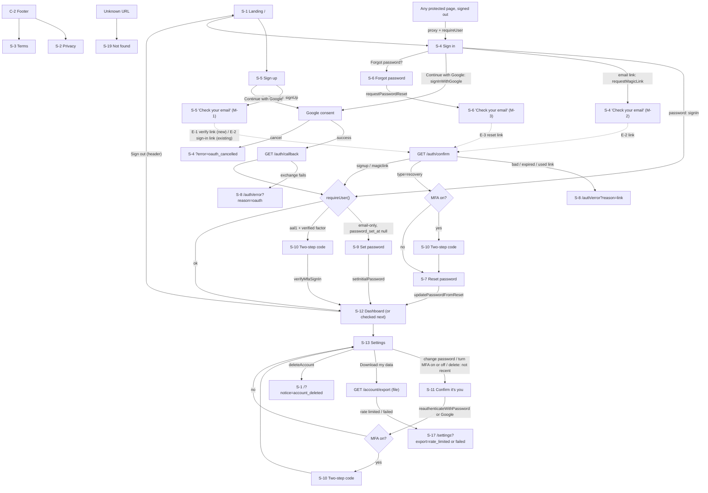

# Template: Spec

Last updated: 2026-09-28 · Mode: template · Status: §1–§3 approved 2026-09-26 (restructured from the brief, PRD and UX spec on 2026-09-28; no decisions changed)

## 1. Brief

**In one sentence:** a reusable, secure Next.js + Supabase starter that every one of the user's future web apps is created from, so accounts, security, emails, legal pages, monitoring, backups, tests and deployment are done right once.

**Research verdict:** skipped by choice, because this is internal infrastructure and not a product (RESEARCH.md).

**Problem / goal:**
- **Problem:** every new app idea would otherwise rebuild sign-in, security, emails and deployment from scratch, and a security shortcut taken under time pressure would repeat in each app.
- **Goal:** a new app starts from "Use this template" with all of the foundations working, tested and secure. Only the config file and env vars change.
- **Done when:** all four success metrics in §2.1 are met. What version 1 contains is §2.2; what it leaves out is §2.4.

**Users:**
| User | Needs to do | Account? |
| --- | --- | --- |
| Builder (the user, with Claude Code) | Create a new app from the Template, rebrand it in the config file, set env vars, run it locally, deploy it, back it up, and add app features safely by following `CLAUDE.md` | Needs accounts with the services in DESIGN D1 |
| Signed-out visitor of an app | Read the landing, privacy and terms pages; sign up or sign in; reset a forgotten password | No |
| Signed-in user of an app | Use the dashboard placeholder; change name and password; turn two-step sign-in on or off; download their data; delete their account; sign out | Yes |

**Constraints:**
- **Budget:** free tiers only. Say so before anything paid.
- **Platforms:** web, mobile-first, installable on phones as a web app.
- **Dev machine:** Fedora 44, with local Supabase in containers (Podman first, Docker as the fallback).
- **Legal and privacy:** privacy and terms pages (placeholders filled in per app); export and deletion of all user data; collect only what's needed; monitoring events scrubbed of personal data.
- **Generic:** nothing in the repo may belong to one specific app (`CLAUDE.md`, "What this repo is").
- **Never deployed itself:** the Template lives only on GitHub (private) and the user's PC, with no domain. Domain values are per-app placeholders. The deploy path is proven with a throwaway test app on `*.vercel.app`, deleted after v1 sign-off.

**Look and feel:** plain shadcn/ui defaults: neutral and clean, light and dark mode. Brand colors and the logo come from the config file, so each app restyles by changing that file rather than the components. Details: §3.6.

**Time:**
- **Capacity:** about 20 hrs/week from Mon 2026-09-28.
- **Deadline:** none fixed. Decided 2026-09-28: finish all of v1 before anything else, because every future app is built from the Template. The target date and the flag point are in ROADMAP.md.
- **Depends on / competes with:** the gift registry app (`~/Projects/Gift Registry App/Build_Plan.md`) starts from the finished Template. The sister's-page date (was Nov 15) moves after the Template, and the new date isn't set yet.
- **No cuts agreed in advance:** the roadmap's weekly check marks when the plan is late, and the user then decides whether to cut or move the date.

**Money:** not a goal. The Template stays on free tiers, and Vercel Hobby is fine because the Template isn't commercial. Each app decides on Vercel Pro once it earns money (DESIGN D19).

**Known risks:**
- **Podman + Supabase CLI** may eat setup hours in week 1 (DESIGN D23).
- **Nonce CSP** interacting with Sentry, Turnstile and the theme script is the part most likely to run over (DESIGN D5).
- **Email without a domain:** the deployed test app can only email the Resend account owner, so the deployed e2e run is semi-manual (DESIGN D7).
- **Free-tier limits:** project pausing, no Supabase backups and email quotas (DESIGN §5).

**Decisions made in the brief** (the technical decisions are DESIGN §1):
| Date | Decision | Why |
| --- | --- | --- |
| 2026-09-26 | Skip market research | Internal infrastructure, not a product |
| 2026-09-26 | No pre-agreed cuts; the roadmap flags slippage and the user decides between cutting and moving the date | User's choice |
| 2026-09-26 | Plain shadcn defaults, branded through the config file | A neutral base that's easy to rebrand per app |
| 2026-09-26 | Free tiers only; Vercel Pro is a per-app decision | The Template is non-commercial |
| 2026-09-26 | The Template is never deployed; a throwaway test app proves the deploy path | Tests the real new-app flow without a permanent deployment |
| 2026-09-26 | Metric 1's clock starts with the app's keys already made | User's choice |
| 2026-09-26 | Previously: v1 target Mon 2026-11-16 so the gift registry could start then | Superseded on 2026-09-28 (next row) |
| 2026-09-28 | Finish the whole Template first; no gift-app break after phase 3; the gift app's date moves | User's choice: every app is built from the Template |

Scope decisions (Turnstile on sign-in, MFA in, change email deferred, no contact form, Web Analytics in) are recorded where they live: §2.2 and §2.4. The user's answers U1–U4 are in DESIGN §1 (D24 note).

**Open questions:**
- [ ] Week-1 checks, results go in `decisions/` (list and owners: BUILD, "Week-1 checks")
- [ ] Whether a daily backup counts as activity for Supabase Free's pause (owner: each app, LAUNCH-CHECKLIST)
- [ ] Real CI minutes per push vs the estimate in DESIGN D18 (owner: Builder, after the first CI runs)
- [ ] The gift registry's new launch date (owner: user, once the Template's finish date is clearer)

## 2. Requirements

Security NFRs refer to `CLAUDE.md` rules 1–23 by number; the rule text isn't repeated. Users, goal and constraints: §1.

### 2.1 Success metrics
All four are required for v1 to be done (§1).

| # | Metric | Target | By | How measured |
| --- | --- | --- | --- | --- |
| 1 | **New app in under 1 hour:** time from clicking "Use this template" to a deployed throwaway app on a free `*.vercel.app` URL where sign-in works, following only the README. The clock starts with the service accounts and this app's keys already made (Supabase project, Google OAuth client, Turnstile widget, Sentry project, Resend key). | < 60 min, one real run-through | v1 sign-off (ROADMAP) | Manual stopwatch run by the Builder. Start and end times and any README deviations go in a `decisions/` entry. The test app and its Supabase project are deleted afterwards. |
| 2 | **Full e2e passes in CI:** the FR-39 journey. | Passes on every push; passes once against the deployed throwaway app | v1 sign-off (ROADMAP) | GitHub Actions run history: the e2e job is green on every push to `main` in the last week before sign-off. The deployed run's Playwright report is kept as a CI artifact or saved locally and linked in the sign-off note. The deployed run counts when its email links are pasted in by hand (the `manual` mailbox, D7). |
| 3 | **RLS tests on every table:** share of tables with user data that have an RLS test covering another user (read, change, delete) and a signed-out visitor (read, change, delete). | 100% | v1 sign-off (ROADMAP) | A CI test lists every table in the app's schema holding user data (from the database catalog) and fails if any is missing from the RLS test suite; the RLS suite itself passes in CI. |
| 4 | **Security scan clean:** `npm audit` high/critical count; gitleaks findings; securityheaders.com grade. | 0 high/critical; 0 gitleaks findings; grade A or better | v1 sign-off (ROADMAP) | `npm audit --audit-level=high` and gitleaks exit codes in CI; securityheaders.com scan of the deployed throwaway app, with the screenshot or result link saved in the sign-off note. |

### 2.2 Functional
Priority is "must" unless stated. The password rule is D22 everywhere it's mentioned.

#### Accounts
| ID | Requirement | Acceptance | Priority |
| --- | --- | --- | --- |
| FR-1 | A visitor can sign up with email and password, **verifying the email before choosing a password**. | Given a valid email and a valid Turnstile token, submitting sends a verification email and shows the same message whether or not the email already had an account (NFR-12); the account has no password yet. After verifying (FR-2), the user must choose a password meeting the password rule before reaching the dashboard. Without a valid Turnstile token the request is rejected. *(Changed 2026-09-26, D10: closes pre-account takeover.)* | must |
| FR-2 | A new user verifies their email by link. | Opening the verification link on an unverified account marks the email verified; the user lands signed in on the set-password step (FR-1), then the dashboard. An expired or used link shows a plain message and a way to request a new one. Until verified, protected pages are not reachable. | must |
| FR-3 | A user can sign in with email and password. | Given a verified account and a valid Turnstile token, correct credentials reach the dashboard (or a checked same-site `next` path, NFR-8). Wrong email and wrong password give one identical generic message (NFR-12). | must |
| FR-4 | A user can sign in with an email magic link. | Requesting a link (with a valid Turnstile token) shows the same message for any email (NFR-12). For an email with no account, nothing is sent and no account is created (sign-up happens only on the sign-up page). The link signs them in once; an expired or reused link shows a plain message. | must |
| FR-5 | A user can sign up and sign in with Google. | Completing Google consent signs them in and lands them on the dashboard; cancelling returns them to sign-in with a plain message. | must |
| FR-6 | A signed-in user can sign out. | After sign-out, session cookies are cleared and opening a protected page redirects to sign-in. | must |
| FR-7 | A user can request a password reset. | Submitting any email (with a valid Turnstile token) shows the same generic message (NFR-12); if the account exists, a reset email is sent. | must |
| FR-8 | A user can set a new password from the reset link. | Given a valid reset link, submitting a new password meeting the password rule changes it, and the old one no longer works. The link works once; expired or reused links show a plain message. | must |
| FR-9 | Protected pages are for signed-in users only. | A signed-out request to any protected page redirects to sign-in with a same-site `next` path and returns there after sign-in. The page itself also checks the user on the server (NFR-3). | must |
| FR-10 | Sessions refresh automatically. | When an active signed-in user's access token expires, their next request still works without re-entering credentials. | must |
| FR-11 | Every new user gets exactly one profile. | For each sign-up method (password, magic link, Google), exactly one profile exists for the user after the account is created, holding only what's needed (fields: DESIGN §3). | must |
| FR-56 | Sensitive account changes need a recent sign-in. *(Added after PRD review, 2026-09-26.)* | Changing password, deleting the account (and changing email, once FR-13 is built) are refused unless the user signed in (or re-confirmed) recently; the user is asked to re-confirm and then continues. Users without a password (Google-only) re-confirm by signing in again. Time window and mechanism: D9. | must |

#### Two-step sign-in (MFA)
*(Added after PRD review, 2026-09-26.)*

| ID | Requirement | Acceptance | Priority |
| --- | --- | --- | --- |
| FR-57 | A user can turn on two-step sign-in (MFA) with an authenticator app. | In settings, the user scans a QR code, enters a code to confirm, and MFA is on. Uses Supabase's built-in TOTP MFA (no SMS). | must |
| FR-58 | Users with MFA on must enter a code to finish signing in. | After the first factor (password, magic link or Google), a user with MFA on sees a code step. Until a valid code is entered, protected pages and every server operation refuse them, checked on the server and not only in the UI. A wrong code shows a plain message and is rate limited (NFR-10). | must |
| FR-59 | A user can turn MFA off. | From settings, after entering a current code (FR-56 also applies), MFA is removed and sign-in no longer asks for a code. A user who loses the authenticator can have it removed only through the documented support path (the Builder deletes the factor), since recovery codes are not in v1 (verified: D8). | must |

#### Account settings
| ID | Requirement | Acceptance | Priority |
| --- | --- | --- | --- |
| FR-12 | A user can change their display name. | After saving a valid name, settings and the dashboard show it; invalid input (empty, too long) shows a plain field error. | must |
| FR-13 | A user can change their email. | The change takes effect only after **both** the old and the new address confirm by link; until then, sign-in uses the old email. Needs a recent sign-in (FR-56). | later (deferred 2026-09-26; build only if time allows after v1) |
| FR-14 | A user can change their password. | Needs a recent sign-in (FR-56). After a successful change, the new password works and the old one doesn't. | must |
| FR-15 | A user can download their data. | The download contains the user's account details (email, sign-up date, sign-in providers) and every row they own in every table holding user data, in a machine-readable file (format: D13). It contains no other user's data and no secrets or tokens. | must |
| FR-16 | A user can delete their account. | After a recent sign-in (FR-56) and typing their email to confirm, the account and all data they own are deleted, they are signed out, and they can no longer sign in. Other users' data is unchanged. | must |

#### App shell
| ID | Requirement | Acceptance | Priority |
| --- | --- | --- | --- |
| FR-17 | Public pages: landing, privacy, terms. | Reachable signed out. Privacy and terms are linked from the footer on every page and visibly marked as placeholder text to fill in per app. The footer also has a `mailto:` link to the support email from the config file. The privacy placeholder says backups keep data for a limited time after account deletion. | must |
| FR-18 | Auth pages: sign in, sign up, forgot password, reset password, auth error. | Each works signed out; a signed-in user opening sign-in or sign-up is sent to the dashboard. | must |
| FR-19 | Signed-in pages: dashboard placeholder and settings. | Both are protected (FR-9); the dashboard shows only generic placeholder content. | must |
| FR-20 | Mobile-first layout. | Every page is usable at phone width (assumption: 360 px) with no horizontal scrolling, and at desktop width. | must |
| FR-21 | Dark mode. | Pages follow the device's light/dark setting; both themes are readable on every page. A manual toggle is optional. | must (toggle: could) |
| FR-22 | Loading states and toasts. | Every form shows a pending state and can't be submitted twice while pending; each action's success or failure shows as a toast or inline message. | must |
| FR-23 | 404 and error pages. | An unknown URL shows a 404 page; an unexpected error shows an error page. Both give a plain message and a link home (NFR-9). | must |
| FR-24 | SEO basics. | Each public page has a title and description; an Open Graph image exists; `sitemap.xml` lists public pages only; `robots.txt` exists and doesn't expose protected paths as crawl targets. | must |
| FR-25 | Installable web app. | A web app manifest and icons exist, using the name and colors from the config file; a supported phone browser offers "Add to home screen / Install". | must |

#### Config file
| ID | Requirement | Acceptance | Priority |
| --- | --- | --- | --- |
| FR-26 | One config file holds app name, description, URL, brand colors, support email and logo. The site URL comes from an env var, so preview and production deploys each get the right one. | Changing a value in the config file changes it everywhere it's shown: pages, metadata, OG image, manifest, emails, legal pages. A search of the codebase finds no hard-coded copy of these values outside the config file. | must |
| FR-27 | Domain-specific values are placeholders. | Site URL and email sending domain/from-address ship as clearly marked placeholders, and the "start a new app" checklist (FR-45) tells the Builder where to fill each one in. | must |

#### Emails
| ID | Requirement | Acceptance | Priority |
| --- | --- | --- | --- |
| FR-28 | Four email templates: welcome, verify email, magic link, password reset. (A fifth, confirm email change, comes with FR-13 later.) | Each shows the app name, logo, brand colors and support email from the config file, and renders readably in common email clients (manual check in at least one webmail and one phone mail app). | must |
| FR-29 | Supabase auth emails are sent through Resend. | With Resend set as Supabase's SMTP, verify, magic-link and reset emails arrive using the branded templates. Locally, they arrive in the local mail catcher. | must |
| FR-30 | New users get a welcome email. | Exactly one welcome email per new account, sent at the first sign-in with a verified email (for Google sign-ups, the first sign-in). | must |

#### Monitoring and analytics
| ID | Requirement | Acceptance | Priority |
| --- | --- | --- | --- |
| FR-31 | Errors are reported to Sentry. | A deliberately thrown test error on the server and in the browser each appears in Sentry, and an alert email reaches the Builder. Scrubbing: NFR-17. | must |
| FR-32 | Vercel Web Analytics is on. | Page views from the deployed throwaway app show up in the Vercel Web Analytics dashboard. No other analytics tool is included. | must |

#### Backups and rollback
| ID | Requirement | Acceptance | Priority |
| --- | --- | --- | --- |
| FR-33 | A backup script dumps the database. | Running the documented command produces a backup containing everything needed to restore users' accounts (including the auth schema) and their data. | must |
| FR-34 | Backups can run on a schedule and are kept off Supabase, for a limited time. | Docs explain how to schedule the backup and where copies go; one scheduled run has produced a backup outside Supabase; backups older than the retention period are deleted automatically. Storage location, encryption and retention: D14. | must |
| FR-35 | Restore steps are written and tested. | Following the docs, a backup is restored into a fresh Supabase project; row counts match the source and a test user can sign in. The date of the last tested restore is recorded in the docs. | must |
| FR-36 | Bad deploys can be rolled back on Vercel. | Docs describe the rollback; it has been done once on the throwaway test app, and the rolled-back app works against the current (forward-migrated) database. | must |

#### Quality and CI
| ID | Requirement | Acceptance | Priority |
| --- | --- | --- | --- |
| FR-37 | Strict TypeScript, ESLint and Prettier. | Typecheck, lint and format-check commands exist and pass with zero errors on `main`. | must |
| FR-38 | Unit tests with Vitest. | Validation schemas, the redirect check, config loading and other pure logic have passing unit tests. | must |
| FR-39 | E2E tests with Playwright for the full account journey. | Sign up → verify → sign in → reset password → delete account passes locally, in CI and once against the deployed throwaway app. | must |
| FR-40 | GitHub Actions on every push. | Every push runs lint, typecheck, unit tests, RLS tests, e2e, build, secret scan (gitleaks), the `.env.example` check and `npm audit`; any failure fails the run. | must |
| FR-41 | Dependabot is on. | Dependabot opens update PRs for npm packages and GitHub Actions. | must |
| FR-42 | Existing hooks and review skills keep working. | The pre-commit and pre-push hooks, the `.env.example` check and the `pre-commit-review` / `pre-push-review` skills still block unreviewed or unsafe changes after the app code is added (checked with one deliberately bad staged change). | must |
| FR-43 | Database types are generated from the schema. | A documented command regenerates the TypeScript types after a migration, and the app typechecks against them. | must |

#### Docs
| ID | Requirement | Acceptance | Priority |
| --- | --- | --- | --- |
| FR-44 | README: Fedora local setup. | A fresh Fedora 44 machine reaches a running app, local Supabase and passing tests by following only the README, with Docker or Podman. | must |
| FR-45 | README: "start a new app" checklist. | The checklist alone is enough to meet metric 1. | must |
| FR-46 | README: every env var explained. | Every variable in `.env.example` has a README entry: purpose, where to get it, public or secret. A check or review confirms none is missing. | must |
| FR-47 | CLAUDE.md: project structure and commands filled in. | The two placeholder sections list real paths and working commands. | must |
| FR-48 | Generic launch checklist. | The generic launch checklist (the one each app copies and tailors; separate from the Template's own v1 sign-off list) covers every operational item in this spec (backups, rollback, Sentry, env vars, legal pages, sending domain). | must |
| FR-49 | Decision log. | `decisions/` exists with a short "how to add an entry" note; decisions made during the build are recorded there. | must |

#### Builder journeys
| ID | Requirement | Acceptance | Priority |
| --- | --- | --- | --- |
| FR-50 | Create a new app from the Template. | A repo created with "Use this template" contains no Template-only leftovers besides the config file values, and the README tells the Builder to switch on the hooks. | must |
| FR-51 | Rename and rebrand via the config file only. | Changing the config file (plus env vars) is the only edit needed for the new app's name, colors, logo and support email to show everywhere (FR-26). | must |
| FR-52 | Set env vars safely. | `.env.example` lists every variable with placeholders only (NFR-5). If a required variable is missing or malformed, the app fails at start or build with a message naming the variable, never its value. | must |
| FR-53 | Run locally on Fedora. | Documented commands start and stop local Supabase, apply migrations, start the dev server, and run each test suite (FR-44). | must |
| FR-54 | Deploy a throwaway test app. | Following the README, a test app deploys to a free `*.vercel.app` URL with working sign-in (password, magic link, Google), passes e2e once, and is then deleted with its Supabase project. | must |
| FR-55 | Restore a backup. | Covered by FR-35, performed by the Builder from the docs alone. | must |

### 2.3 Non-functional
| ID | Requirement | Measure |
| --- | --- | --- |
| NFR-1 | RLS enabled with deny-by-default policies on every table, in the same migration that creates it (rule 1). | A CI catalog query finds 0 tables in app schemas with RLS off. A signed-in user querying a table with no matching policy gets 0 rows. |
| NFR-2 | RLS tests for every table with user data (rule 2). | Metric 3. |
| NFR-3 | Server-side verified auth check in every server action, route handler and protected page; each validates its own input (rules 3, 4). | A test calls every server action and route handler signed out and gets a refusal, never data. The review checklist confirms no check relies on the unverified session alone (rule 3). |
| NFR-4 | Secrets stay server-only; service-role access is used only where unavoidable, never with unchecked user IDs (rules 5, 6). | The build fails when client code imports a server-only module (checked once with a deliberate bad import). A CI scan of the built browser bundle finds no service-role key. |
| NFR-5 | Env files stay out of git; `.env.example` has placeholders only (rules 7, 8). | The `.env.example` check passes in the pre-commit hook and CI; git tracks no `.env*` file except `.env.example`. |
| NFR-6 | Every server input is validated with Zod (rule 9). | Each server action, route handler, route param and search param has a schema; unit tests show invalid input is rejected with a plain message. |
| NFR-7 | No unsanitized user HTML (rule 10). | A search finds no raw-HTML rendering of user content; review checklist item. |
| NFR-8 | Only same-site redirect targets (rule 11). | Unit tests: absolute URLs, `//host`, `/\host`, `javascript:` and encoded variants all fall back to a safe default path. |
| NFR-9 | Plain error messages to users (rule 12). | A forced server error returns a generic message with no stack trace, SQL text or internal ID; details appear in server logs / Sentry. |
| NFR-10 | Rate limits on sign-in, sign-up, password reset, magic link and public forms (rule 13). | A test exceeding the limit on each gets a plain "try again later" response and no further emails are sent. Limit values: BUILD §0.4 (D3). |
| NFR-11 | Turnstile on every auth form (sign-up, sign-in, magic link, password reset) and on any public form an app adds (rule 14). | A server call to each without a valid Turnstile token is rejected (test). |
| NFR-12 | No account enumeration (rule 15). | Tests show identical status and message for existing and non-existing emails on sign-in failure, sign-up, magic link and password reset. |
| NFR-13 | Security headers with nonce-based CSP (rule 16). | Metric 4's header grade. An automated test checks every route returns CSP (no `unsafe-inline` for scripts), HSTS, frame-ancestors, Referrer-Policy and Permissions-Policy. The browser console shows no CSP violations on the e2e journey. |
| NFR-14 | Session cookies HttpOnly, Secure, SameSite; no tokens in browser storage (rule 17). | E2E checks cookie flags on the deployed app and that browser storage holds no auth tokens after sign-in. |
| NFR-15 | Uploads rule carried forward (rule 18). | The Template ships no storage bucket; the rule stays in `CLAUDE.md` for apps. |
| NFR-16 | Data minimisation; export and deletion cover every user-data table (rule 19). | Tests for FR-15 and FR-16 fail if a table holding user data is missing from the export or not emptied for the deleted user. |
| NFR-17 | Sentry events are scrubbed of personal data and secrets (rule 20). | A test error raised during a request carrying an email, token, cookie and request body produces a Sentry event containing none of them (checked in the Sentry UI). |
| NFR-18 | Backups are kept working and restores tested (rule 21). | FR-35 done, with the last tested restore date recorded. |
| NFR-19 | Migrations only move forward; app rollback never needs a database rollback (rule 22). | The pre-commit review flags any edit to a committed migration; the FR-36 rollback test passes against the forward-migrated database. |
| NFR-20 | Few, well-maintained dependencies; scans clean (rule 23). | Metric 4's `npm audit` and gitleaks targets; Dependabot on (FR-41); each added package has a stated reason in its commit or PR. |
| NFR-21 | Free tiers only. | Every service in the README stack table is on its free plan; nothing needing a paid plan is added without the Builder's OK. |
| NFR-22 | Stay within free-tier quotas during testing. | The number of real emails a deployed e2e run sends is documented and fits Resend Free's daily limit (DESIGN §5) with room for manual testing. CI e2e sends no real emails (local mail catcher). |
| NFR-23 | Accessible forms and pages, target WCAG 2.2 AA. | An automated accessibility check reports 0 serious/critical issues on every shell page; the sign-up and sign-in flows work by keyboard only; every form field has a label and errors are announced. |
| NFR-24 | Generic: nothing app-specific. | A search finds no app-specific wording, tables or pages (e.g. "gift", "registry"), except the README's "Apps built from this template" table; the pre-commit review checks this. |
| NFR-25 | Local development works on Fedora 44 with Docker or Podman. | The FR-44 run-through succeeds; Podman-specific steps (if needed) are documented. |
| NFR-26 | No account pre-takeover through linking. | A Google sign-in is linked to an existing email/password account only if that email is verified; a test with an unverified password account and a Google sign-in on the same email shows the attacker's password can't be used to get in. Mechanism: D10. |

### 2.4 Out of scope (v1)
From the brief:
- Payments, teams/organizations, multiple languages, admin panel.
- Analytics beyond Vercel's free Web Analytics.
- A permanent deployment or custom domain for the Template itself (§1, "Never deployed itself").
- Any app-specific tables, pages, wording or features (including anything gift-registry-specific).
- Native mobile apps.
- File uploads: the Template ships no bucket (NFR-15).

Added in PRD review (2026-09-26):
- Changing email in settings (FR-13): deferred to "later, if time allows". Until then a user asks support (the footer `mailto:` link, FR-17) and the Builder changes it in Supabase.
- Sign-in providers other than Google; SMS/phone MFA (paid); MFA recovery codes.
- A "signed-in devices" list or "sign out everywhere".
- A contact/feedback form or any other public form: the footer has a `mailto:` support link instead. The public-form rules (NFR-10, NFR-11) apply once an app adds one.
- Email preferences or unsubscribe management (the Template sends only transactional emails).
- Performance budgets or load targets.
- Enforced branch protection on `main`: GitHub Free can't enforce it on private repos (needs Pro). The branch/PR workflow stays a convention backed by CI and the local hooks.

**Assumptions:** none remain open. The PRD's assumptions were all settled during planning:
- Resend's test sender delivers only to the Resend account owner: verified, D7.
- Supabase Free pausing and lack of backups, Resend Free's daily limit, Vercel Hobby's non-commercial rule: DESIGN §5 (D14, D19); Money in §1.
- Supabase CLI on Fedora with Podman or Docker: decided, D23; the remaining risk is in §1.
- Password rule D22; rate-limit values BUILD §0.4 (D3); backup schedule and retention D14; export format D13; profile fields DESIGN §3 (D12).
- Supabase TOTP MFA is free on all plans: verified, D8.

### 2.5 Traceability
Screens: §3 IDs. DESIGN: decisions (D-n), §3 data model, §4 security (T-n = threat), §5 operations; §2 = architecture only. BUILD: feature (F-n) or "CI" (BUILD's last section).

| ID | Screens | DESIGN | BUILD |
| --- | --- | --- | --- |
| FR-1 | S-5, S-9, E-1 | D4, D10, D17, D22; §3; §4 T2 | F-6 |
| FR-2 | S-9, S-8, E-1 | D10, D17; §2 | F-6 |
| FR-3 | S-4 | D4, D17; §2 | F-7 |
| FR-4 | S-4, S-8, E-2 | D4, D11, D17 | F-7 |
| FR-5 | S-4, S-5, S-8 | D17; §2 | F-7 |
| FR-6 | C-1, S-9, S-10 | D17; §4 | F-7 |
| FR-7 | S-6, E-3 | D4, D17; §2 | F-8 |
| FR-8 | S-7, S-8, E-3 | D17, D22; §2 | F-8 |
| FR-9 | S-4, S-12, S-13 | D2 (via NFR-3); §2 | F-2 |
| FR-10 | n/a (no UI) | §2 (session refresh) | F-2 |
| FR-11 | n/a (no UI) | D12, D17; §3; §4 | F-1 |
| FR-12 | S-14, S-12 | D17; §3; §4 | F-11 |
| FR-13 | deferred | D24 (item 26) | F-13 (deferred) |
| FR-14 | S-15, S-11 | D17; §2 | F-11 |
| FR-15 | S-17 | D13, D17; §4 (privacy) | F-11 |
| FR-16 | S-18, S-11, S-1 | D12, D17; §4 (privacy) | F-11 |
| FR-17 | S-1, S-2, S-3, C-2 | D12; §4 (privacy) | F-3 |
| FR-18 | S-4–S-8 | §2 | F-3; F-6–F-8 |
| FR-19 | S-12, S-13 | §2 | F-3 |
| FR-20 | all (visual style) | n/a (UI only) | F-3 |
| FR-21 | all, C-2 | n/a (UI only) | F-3 |
| FR-22 | C-3 | D1 | F-3 |
| FR-23 | S-19, S-20 | §5 (failure modes) | F-3 |
| FR-24 | S-1–S-3 | D17 | F-3 |
| FR-25 | visual style | D16, D17 | F-3 |
| FR-26 | C-1, C-2, E-1–E-4 | D6, D7, D16, D24; §3 | F-3 |
| FR-27 | n/a (no UI) | D6, D16; §3 | F-3 |
| FR-28 | E-1–E-4 | D16; §2 | F-5 |
| FR-29 | n/a (no UI) | D7; §5 (failure modes) | F-5 |
| FR-30 | E-4 | D7, D17; §2 | F-5 |
| FR-31 | n/a (no UI) | D15, D17; §5 | F-4 |
| FR-32 | n/a (no UI) | §4 (privacy) | F-4 |
| FR-33 | n/a (no UI) | D14; §5 | F-12 |
| FR-34 | n/a (no UI) | D14; §5 | F-12 |
| FR-35 | n/a (no UI) | D14; §5 | F-12 |
| FR-36 | n/a (no UI) | D19; §5 | CI |
| FR-37 | n/a (no UI) | D18 | CI |
| FR-38 | n/a (no UI) | D18 | CI |
| FR-39 | n/a (no UI) | D18; §5 (metrics) | CI |
| FR-40 | n/a (no UI) | D18; §5 (metrics) | CI |
| FR-41 | n/a (no UI) | D18; §4 T17 | CI |
| FR-42 | n/a (no UI) | D18; §4 T16 | CI |
| FR-43 | n/a (no UI) | D19 | F-1 |
| FR-44 | n/a (no UI) | D1, D23 | CI |
| FR-45 | n/a (no UI) | D19 | CI |
| FR-46 | n/a (no UI) | D24 | CI |
| FR-47 | n/a (no UI) | n/a (docs only) | CI |
| FR-48 | n/a (no UI) | §4 (residual risks); §5 | CI |
| FR-49 | n/a (no UI) | §5 | CI |
| FR-50 | n/a (no UI) | §3 (config) | CI |
| FR-51 | n/a (no UI) | D16; §3 | F-3 |
| FR-52 | n/a (no UI) | D6; §4 (secrets) | F-2 |
| FR-53 | n/a (no UI) | D1 | CI |
| FR-54 | n/a (no UI) | §5 (environments) | CI |
| FR-55 | n/a (no UI) | D14; §5 | F-12 |
| FR-56 | S-11, S-13, S-15, S-16, S-18 | D9, D13, D24; §4 T4 | F-9 |
| FR-57 | S-16 | D8, D17; §4 T4 | F-10 |
| FR-58 | S-10 | D2, D8, D17; §3; §4 T5 | F-10 |
| FR-59 | S-16, S-10 | D8, D17; §4 T4 | F-10 |
| NFR-1 | n/a (no UI) | D12, D18; §3; §4 T7 | F-1 |
| NFR-2 | n/a (no UI) | D12, D18; §4 T7 | F-1; CI |
| NFR-3 | n/a (no UI) | D2, D18; §4 T6 | F-2 |
| NFR-4 | n/a (no UI) | D6; §4 T16 | F-2 |
| NFR-5 | n/a (no UI) | D6; §4 T16 | F-2; CI |
| NFR-6 | n/a (no UI) | §4 T3 | F-2 (all F-n) |
| NFR-7 | n/a (no UI) | §4 T10 | CI (review) |
| NFR-8 | S-4, S-9, S-10, S-11 | D17; §4 T9 | F-2 |
| NFR-9 | M-7, S-8, S-20 | §4 | F-2 |
| NFR-10 | M-5 | D3, D17; §4 T1 | F-2 |
| NFR-11 | C-4, M-6 | D4; §4 T18 | F-2 |
| NFR-12 | M-1–M-7, S-4–S-6 | D3, D10, D11, D18; §4 T8 | F-6–F-8 |
| NFR-13 | n/a (no UI) | D5, D18; §4 T3, T20 | F-2 |
| NFR-14 | n/a (no UI) | D18, D21; §4 T20 | F-2 |
| NFR-15 | n/a (no UI) | §3 (no bucket) | n/a (no uploads in the Template) |
| NFR-16 | n/a (no UI) | D12, D13; §4 (privacy) | F-11 |
| NFR-17 | n/a (no UI) | D15; §4 T10 | F-4 |
| NFR-18 | n/a (no UI) | D14; §4 T15; §5 | F-12 |
| NFR-19 | n/a (no UI) | D19; §4 T15; §5 | CI |
| NFR-20 | n/a (no UI) | §4 T17 | CI |
| NFR-21 | n/a (no UI) | D3; §5 (free-tier limits) | all F-n (constraint) |
| NFR-22 | n/a (no UI) | D7; §5 (free-tier limits) | F-5; CI |
| NFR-23 | accessibility, all | D1, D18, D24 | F-3; CI |
| NFR-24 | S-1, S-12 | n/a (review rule) | CI (review) |
| NFR-25 | n/a (no UI) | D23 | CI |
| NFR-26 | S-5, S-9 | D10; §4 T2 | F-6, F-7 |

## 3. Screens

The generic shell only (scope: §2.4); change email (FR-13) has no UI. Most important: S-4 and S-5 (every user touches them), then S-13 (the only irreversible action). Each screen does one thing; errors say what to do next. Operations: D17. Access levels, guard redirects, URL parameter values: BUILD §0.2. Texts: §3.4 only.

### 3.1 Flow map

`/auth/confirm`, `/auth/callback` and `/account/export` have no screen: they redirect or download. Redirects: BUILD §0.2 (guards, page access); `next` carry: D24.8; S-10 before S-7: D24.5.

### 3.2 Shared components

**C-1 Site header**
- Logo (`appConfig.logo.svg`, `alt` = `appConfig.logo.alt`) and `appConfig.name`, linking to `/` signed out, `/dashboard` signed in.
- Signed out: "Sign in" (ghost), "Sign up" (primary); S-4/S-5 hide their own button.
- Signed in, right: account menu button **always showing the signed-in email** (ellipsis when narrow; full in the menu and accessible name), so a user signed into another account by a crafted link notices (D24.9). Menu: display name (if set) and email as a label, "Dashboard", "Settings", separator, "Sign out" (form button, `signOut` → `/`). Text only, never HTML.
- S-9, S-10, S-11: logo and name only (no menu, so the step can't be skipped).
- Sticky; `scroll-padding-top` = its height (WCAG 2.4.11).

**C-2 Site footer** (every page, FR-17)
- "© {year} {`appConfig.legal.entityName`}" · "Privacy" · "Terms" · "Contact support" (`mailto:{appConfig.supportEmail}`).
- Optional theme select (FR-21 "could"): "Theme: System / Light / Dark", default System (next-themes; browser storage, not an auth token).
- Same order and position everywhere (WCAG 3.2.6).

**C-3 Feedback** (FR-22; screens only name IDs)
- **Pending:** submit disabled, spinner, pending label (per screen); no double submit; fields stay readable; one form's pending never blocks another.
- **Field errors:** under the field, `text-destructive`, `aria-describedby`, `aria-invalid="true"`; texts from BUILD §0.5 schemas.
- **Form errors** (`ActionResult.error`): destructive `Alert` above submit, `role="alert"`. Focus → first invalid field, else the alert.
- **Toasts (Sonner):** success and arrival notices only; notices only from `?notice=` (D24.31): `account_deleted` M-26, `password_set` M-27, `password_changed` M-28, others ignored. `top-center` (clear of the keyboard), default auto-dismiss. Errors are never toast-only; they stay inline until fixed.
- **"Check your email" panels** (M-1 to M-3) replace the form; focus on the heading; plus M-8 and "Try again" (form back, email filled in, fresh C-4). The email never enters a URL (logs, Sentry: D15).
- **Loading:** skeleton (header bar, grey blocks) on protected pages (`(app)/loading.tsx`).

**C-4 Turnstile widget** (D4)
- Above submit on S-4 (active tab), S-5, S-6, S-11 (password path). Managed, `theme: auto`, normal size (300 px fits 360 px with gutters); challenges are completed in place.
- **Reset after every submit** (single-use tokens); never a reload.
- Submit stays enabled without a token; a missing or failed token returns M-6, so a widget that fails to load never leaves anyone without a message.
- JavaScript off: auth forms show M-10.

**C-5 Password field**
- Label, `type="password"`, "Show"/"Hide" toggle (`aria-pressed`, 44 px). Paste allowed.
- `autocomplete="current-password"` on S-4, S-11; `"new-password"` on S-7, S-9, S-15.
- New: hint "At least 12 characters. A short phrase is easy to remember."; errors M-32, M-33 (byte limit, so no count stated). Current: M-31, M-33.
- No "confirm password" field (§3.8).

### 3.3 Screens
"Not allowed": each route's access level (BUILD §0.2) unless stated. Titles: §3.7.

#### S-1 Landing (`/`) · FR-17, FR-24
- **Who:** anyone; each app replaces the body.
- **Shows:** C-1; hero with `appConfig.name` (h1) and `appConfig.description`; buttons; C-2. No placeholder feature grid or marketing copy.
- **Main action:** "Get started" → S-5; secondary "Sign in" → S-4; signed in, both become "Go to dashboard" → S-12.
- **States:** `?notice=account_deleted` → toast M-26. Otherwise static.

#### S-2 Privacy policy (`/privacy`) and S-3 Terms (`/terms`) · FR-17, FR-24
- **Who:** anyone. **Shows:** C-1; M-40 as a non-dismissible banner (`muted`, bordered); h1; "Last updated: {date}"; prose headings; C-2.
- **Privacy headings:** What we collect (email, display name, sign-in method, sign-in times) · Why we collect it · Services that process it (the D24.20 providers; Google only if you sign in with Google) · How long we keep it, including: "When you delete your account, your data is removed from the app right away. Backup copies are kept for up to 30 days and then deleted automatically. Supabase, which runs our accounts, keeps a security log of account activity (such as signing up, signing in and deleting your account) that can include your email and IP address; it stays after you delete your account." (U1, D14, D24.20 week-1 check 12) · Your choices: links to `/settings#your-data` and `/settings#delete-account` · Contact: `appConfig.supportEmail`.
- **Terms headings:** using the service, your account, acceptable use, ending your account, changes, contact.
- **States:** static.

#### S-4 Sign in (`/sign-in`) · FR-3, FR-4, FR-5, FR-9, FR-18
- **Who:** signed out.
- **Shows:**
  1. h1 "Sign in to {appConfig.name}".
  2. `?error=` alert (below).
  3. "Continue with Google" (outline, "G" mark, Google's branding rules, §3.8; `signInWithGoogle`).
  4. Divider "or".
  5. Tabs "Password" / "Email link" (default Password; only the active one renders C-4).
     - Password: Email (`type="email"`, `autocomplete="email"`); Password (C-5) with "Forgot password?" beside the label → S-6; C-4; "Sign in".
     - Email link: "We'll email you a link that signs you in. No password needed."; Email; C-4; "Email me a link".
  6. "New here? Create an account" → S-5 (keeps `next`).
- **Main actions:** "Sign in" (`signIn`, "Signing in…") → S-9, S-10 or `next`/S-12 · "Email me a link" (`requestMagicLink`, "Sending…") → panel M-2 · "Continue with Google" ("Opening Google…") → Google → `/auth/callback`.
- **States:** empty: **no autofocus** (the keyboard would cover Google and the tabs) · error: form M-4, M-5, M-6, M-7; fields M-29, M-30, M-31, M-33 · `?error=oauth_cancelled`: neutral (not destructive) alert M-9 · success: redirect, or panel M-2.

#### S-5 Sign up (`/sign-up`) · FR-1, FR-5, FR-18
- **Who:** signed out. Email only; password after verification (D10).
- **Shows:** h1 "Create your account"; "Continue with Google"; divider "or"; Email; "We'll email you a link to confirm it's yours. You'll choose a password next."; C-4; "Continue"; "By continuing, you agree to our Terms and Privacy Policy." (links); "Already have an account? Sign in" → S-4.
- **Main action:** "Continue" (`signUp`, "Sending…") → panel M-1.
- **States:** error: fields M-29, M-30; form M-5, M-6, M-7 (never "email taken") · success: M-1 for every kind of email.

#### S-6 Forgot password (`/forgot-password`) · FR-7, FR-18
- **Who:** anyone, signed in too (§3.8).
- **Shows:** h1 "Reset your password"; "Enter the email you sign in with and we'll send you a link to choose a new password."; Email; C-4; "Send reset link"; "Back to sign in" → S-4.
- **Main action:** "Send reset link" (`requestPasswordReset`, "Sending…") → panel M-3.
- **States:** error: fields M-29, M-30; form M-5, M-6, M-7 · success: M-3.

#### S-7 Reset password (`/reset-password`) · FR-8, FR-18
- **Who:** recovery session (`/auth/confirm?type=recovery`), after S-10 for MFA users; Google-only users can add a password here (D24.1).
- **Shows:** h1 "Choose a new password"; "For {email}"; New password (C-5); "Save new password".
- **Main action:** `updatePasswordFromReset` ("Saving…") → S-12 with `?notice=password_changed` (M-28). The old password stops working; other sessions are signed out (D24.4).
- **States:** error: C-5 field errors, API-7, M-5, M-7; no marker at submit: M-13 · not allowed (link reused, expired, or opened directly): S-8's `link` h1 and M-11, one button "Send a new reset link" → S-6.

#### S-8 Auth error (`/auth/error`) · FR-2, FR-4, FR-5, FR-8, FR-18
- **Who:** anyone; a friendly dead end for failed links and OAuth returns. Variant from `?reason=` (D24.27).
- **`rate_limited`:** h1 "Please wait a moment"; M-5; "Sign in" → S-4.
- **`link`:** h1 "That link didn't work"; M-11; buttons (stacked on mobile): "Sign in" (primary) → S-4 · "Send a new reset link" → S-6 · "Create an account" → S-5 (re-sends a verification link: FR-2's "a way to request a new one").
- **`oauth`** (a Google failure that isn't a cancel): h1 "Sign-in didn't finish"; M-12; "Back to sign in" → S-4.
- Static; no codes or Supabase text.

#### S-9 Set password (`/auth/set-password`) · FR-1, FR-2
- **Who:** signed in, email-only, no password (D10, D24.1); protected pages and actions return here until set (API-3).
- **Shows:** C-1 (minimal); "Step 2 of 2"; h1 "Choose a password"; "Your email {email} is confirmed. Choose a password to finish setting up your account."; Password (C-5, new); "Save password"; "Not you? Sign out" (form button).
- **Main action:** `setInitialPassword` ("Saving…") → `next` or S-12, with `?notice=password_set` (M-27).
- **States:** error: C-5 field errors, API-6, API-7, M-5, M-7 · success: redirect.

#### S-10 Two-step code (`/auth/mfa`) · FR-58
- **Who:** aal1 with a verified TOTP factor (after any first factor, a reset link or re-auth).
- **Shows:** C-1 (minimal); h1 "Enter your code"; "Open your authenticator app and enter the 6-digit code for {appConfig.name}."; one input "6-digit code" (`inputmode="numeric"`, `autocomplete="one-time-code"`, `maxlength=6`, digits, paste allowed; not six boxes); "Verify"; "Lost your authenticator app? Contact support at {supportEmail}." (mailto); "Sign out" (form button).
- **Main action:** `verifyMfaSignIn` ("Checking…") → `next` or S-12.
- **States:** empty: **autofocus** (one job) · error: field M-34; form M-14 (field then cleared and focused), M-5, M-7 · success: redirect.

#### S-11 Confirm it's you (`/auth/reauthenticate?next=…`) · FR-56
- **Who:** signed in, before a password change, two-step on/off (D24.3) or deletion (window: D9).
- **Shows:** h1 "Confirm it's you"; "For your security, sign in again before making this change."; then
  - has a password (D24.1): email as text; Password (C-5, current); C-4; "Confirm"; "Forgot password?" → S-6;
  - Google-only: "Continue with Google"; "You'll be sent to Google and straight back.";
  - "Cancel" → S-13.
- **Main action:** `reauthenticateWithPassword` ("Checking…") or `signInWithGoogle` → S-10 if MFA is on → `next` (fallback `/settings`).
- **States:** error: M-19 (signed in, so no enumeration concern), M-5, M-6, M-7; fields M-31, M-33 · success: the section the user came from shows its form.

#### S-12 Dashboard (`/dashboard`) · FR-19, FR-12
- **Who:** signed in; each app replaces the body; no main action (Settings via the menu).
- **Shows:** C-1 with menu; h1 "Welcome, {display_name}" or "Welcome"; card "This is your dashboard. Your app's main screen goes here." (NFR-24); if no name, link "Add your name in Settings" → `/settings#profile`; C-2. `display_name` (maybe Google's, D12) is always text.
- **States:** empty: no-name variant · loading: C-3 · error: S-20.

#### S-13 Settings page shell (`/settings`) · FR-19
- **Layout** (signed in; five sections): mobile: h1 "Settings", a wrapping row of in-page links (Profile · Password · Two-step sign-in · Your data · Delete account), stacked cards. ≥ `md`: sticky left nav, cards in `max-w-3xl`. Each card: h2 and its own form.
- Section anchors (headings below) are for the nav only, never part of `next`.
- **Recent sign-in gate** (S-15, S-16 on and off, S-18): at render, newest `amr` time vs D9. Not recent → M-20 and "Confirm it's you" → `/auth/reauthenticate?next=/settings`; else the form. UX only: actions still run `requireRecentSignIn()`; if the window lapses mid-form, the action sends the user to S-11 to redo the change.
- **States:** loading: C-3.

#### S-14 Settings › Profile (`#profile`) · FR-12
- **Shows:** email as text (no edit), then "To change your email, contact support." ("contact support" = `mailto:{appConfig.supportEmail}`, D24.26). "Display name" input prefilled, `autocomplete="name"`, helper "Shown on your dashboard."; "Save".
- **Main action:** `updateDisplayName` ("Saving…") → toast M-21; menu and dashboard update.
- **States:** empty: blank field · error: fields M-35, M-36, M-37; M-5, M-7.

#### S-15 Settings › Password (`#password`) · FR-14, FR-56
- **Only if the user has a password** (D24.1); otherwise no section or nav link (add one via S-6 → S-7).
- **Shows:** the gate, then New password (C-5, new), "Change password". No current-password field (D9).
- **Main action:** `changePassword` ("Saving…") → toast M-22 (D24.4); field clears.
- **States:** error: C-5 field errors, API-7, M-23, M-5, M-7.

#### S-16 Settings › Two-step sign-in (`#two-step`) · FR-57, FR-59, FR-56
- **Off:** "Two-step sign-in is off. Turn it on to enter a code from an authenticator app each time you sign in." Gate (D24.3), then "Set up two-step sign-in" (`startMfaEnrollment`, "Preparing…").
- **Setting up** (inline, not a modal):
  1. "1. Scan this QR code with an authenticator app." QR (SVG data URI, D8), ~180 px, white box (scans in dark mode), `alt="QR code for setting up two-step sign-in"`.
  2. Beside it: link-styled "Open in authenticator app" (the `otpauth://` URI, D24.21, D24.22).
  3. "Can't scan it? Enter this key instead:" secret in monospace, grouped in fours, "Copy" (toast M-18).
  4. "2. Enter the 6-digit code the app shows." Code field as S-10.
  5. Warning: "If you lose your authenticator app, you'll need to contact support to get back into your account."
  6. "Turn on" (`confirmMfaEnrollment`, "Checking…"); "Cancel" hides setup (unfinished factor removed next time, D8).
- **On:** "Two-step sign-in is on. You'll enter a code from your authenticator app when you sign in." "Turn off two-step sign-in" (outline) → gate if needed → code field "Enter a current code to turn it off" and destructive "Turn off" (`disableMfa`, "Turning off…").
- **States:** error: field M-34; M-14, API-5, M-15 (can't start), M-5, M-7; window lapsed mid-setup → S-11, setup restarts · success: toast M-16 / M-17, card switches.

#### S-17 Settings › Your data (`#your-data`) · FR-15
- **Shows:** "Download a copy of your account details and everything saved in {appConfig.name}, as a JSON file."; button-styled plain `<a href>` "Download my data" → `GET /account/export` (no JS needed, no prefetch).
- **Main action:** native download (file: D13; no loading state); the page stays.
- **States:** error (D24.19): redirect to `/settings?export=`; inline alert `rate_limited` M-5, `failed` M-25; scrolls to `#your-data`.

#### S-18 Settings › Delete account (`#delete-account`) · FR-16, FR-56
- **Shows:** destructive border, h2 "Delete account"; "This permanently deletes your account and everything in it. It can't be undone. Backup copies are deleted automatically within 30 days." "Want a copy first? Download your data." (→ `#your-data`). Gate, then "Type your email to confirm: {email}" input (`autocomplete="off"`, paste allowed); destructive "Delete my account", enabled on a case-insensitive match (convenience; the server re-checks, D12).
- **Main action:** `deleteAccount` ("Deleting…") → signed out → S-1 `?notice=account_deleted`. Typing the email is the confirmation (no dialog).
- **States:** error: fields M-24, M-29, M-30; M-5, M-7.

#### S-19 Not found (`not-found.tsx`) · FR-23
- C-1; h1 "Page not found"; M-38; "Go home" → `/`; C-2. HTTP 404.

#### S-20 Error (`error.tsx`, `global-error.tsx`) · FR-23
- `error.tsx`: h1 "Something went wrong"; M-39 ("contact support" = mailto); "Try again" (`retry()`, Next 16.3's recommended prop over `reset()`), "Go home" → `/`. Never a stack trace, message, digest or Sentry id (details: Sentry, D15, and logs).
- `global-error.tsx`: the same in its own minimal `<html>` (no header: the layout failed).

### 3.4 Message catalogue
**The only home of user-facing text.** `{email}`: the typed address, normalised (BUILD §0.5), as text; `{name}`: `appConfig.name`. Headings, labels, captions: §3.3.

**NFR-12 contract.** `signUp`, `requestMagicLink`, `requestPasswordReset` and a failed `signIn` return the same text, `ActionResult` shape and HTTP status after the D24.10 minimum time, whatever Supabase answered; **bold** IDs are byte-identical for existing, non-existing, unconfirmed and Google-only emails. Supabase text is never shown.

| Supabase outcome | `signUp` | `requestMagicLink` | `requestPasswordReset` | `signIn` |
| --- | --- | --- | --- | --- |
| Sent / success | M-1 | M-2 | M-3 | redirect |
| Email has no account (incl. 422 `otp_disabled`, D11) | M-1 (account created) | M-2 | M-3 | M-4 |
| Existing, confirmed, unconfirmed or Google-only account | M-1 | M-2 | M-3 | M-4 if no or wrong password |
| Supabase's per-user resend rule (D3) or email-sending limit | M-1 | M-2 | M-3 | n/a |
| Our limiter (D3), per IP or per email | M-5 | M-5 | M-5 | M-5 |
| CAPTCHA token missing or rejected | M-6 | M-6 | M-6 | M-6 |
| Invalid email format (Zod, before any call) | field error | field error | field error | field error |
| Anything else (network, 5xx, limiter error: fails closed) | M-7 | M-7 | M-7 | M-7 |

M-5 and M-6 never depend on the account (hashed keys for any email; CAPTCHA before lookup). Supabase's per-IP limits (Vercel's IPs, D3) map to M-5.

**Sign-in, sign-up and links**
- **M-1** (S-5 panel, heading "Check your email"): "We've sent a link to {email}. Open it to continue. If you already have an account, the link signs you in instead."
- **M-2** (S-4 panel, heading "Check your email"): "If there's an account for {email}, we've sent it a sign-in link. The link works once."
- **M-3** (S-6 panel, heading "Check your email"): "If there's an account for {email}, we've sent it a link to reset your password. The link works once."
- **M-4** (any `signIn` failure: unknown email, wrong password, unconfirmed, no password yet, Google-only): "Wrong email or password. Try again, or reset your password." ("reset your password" links to `/forgot-password`)
- **M-5** (any rate limit; S-8 and S-17 `rate_limited`): "Too many attempts. Please try again in a few minutes."
- **M-6** (Turnstile token missing or rejected): "The security check didn't work. Please try again."
- M-7 (any unexpected error, NFR-9): "Something went wrong. Please try again."
- M-8 (under M-1 to M-3): "Didn't get it? Check your spam folder, or try again in a minute."
- M-9 (S-4 `?error=oauth_cancelled`): "Google sign-in was cancelled. You can try again or use another way to sign in."
- M-10 (auth forms, JavaScript off): "Please turn on JavaScript to continue."
- M-11 (S-8 `link`; S-7 not allowed): "This link has expired or has already been used. Links from our emails work once."
- M-12 (S-8 `oauth`): "Something went wrong while signing in with Google. Please try again."
- M-13 (`updatePasswordFromReset` without a recovery marker, 0004 P4): "This link has expired or has already been used."

**Guards and edge cases** (D24.32)
- API-1 (an action with no verified user): "Your session has ended. Please sign in again."
- API-2 (aal1 session of an MFA user): "Enter the code from your authenticator app to continue."
- API-3 (password not set yet): "Choose a password to finish setting up your account."
- API-4 (any Zod failure; details per field): "Please check the fields below."
- API-5 (S-16 set-up with a verified factor): "Two-step sign-in is already on."
- API-6 (S-9 when a password is set): "Your password is already set."
- API-7 (Supabase `same_password`, field error on `password`): "Choose a password you haven't used for this account."

**Two-step sign-in**
- M-14 (wrong or foreign code: `verifyMfaSignIn`, `confirmMfaEnrollment`, `disableMfa`): "That code didn't work. Check the app and try the newest code."
- M-15 (`startMfaEnrollment` can't start; an M-7 variant): "Couldn't start setup. Please try again."
- M-16 (toast, `confirmMfaEnrollment`): "Two-step sign-in is on."
- M-17 (toast, `disableMfa`): "Two-step sign-in is off."
- M-18 (toast, S-16 Copy): "Key copied."

**Account and settings**
- M-19 (`reauthenticateWithPassword` failure): "That password isn't right. Try again."
- M-20 (S-13 gate): "For your security, confirm it's you before changing this."
- M-21 (toast, `updateDisplayName`): "Name saved."
- M-22 (toast, `changePassword`): "Password changed. You've been signed out on your other devices."
- M-23 (`changePassword` with no password): "You sign in with Google, so there's no password to change."
- M-24 (`deleteAccount` mismatch, field error on `email`): "That doesn't match your email address."
- M-25 (S-17 `?export=failed`): "We couldn't prepare your download. Please try again."

**Arrival notices** (`?notice=`)
- M-26 (`account_deleted`, on `/`): "Your account has been deleted."
- M-27 (`password_set`): "You're all set."
- M-28 (`password_changed`): "Password changed."

**Field errors** (BUILD §0.5)
- M-29 (email empty): "Enter your email address."
- M-30 (email invalid or too long): "Enter a valid email address."
- M-31 (current password empty): "Enter your password."
- M-32 (new password under D22's minimum): "Use at least 12 characters."
- M-33 (password over D22's byte maximum, 0004 P5): "That password is too long. Use a shorter one."
- M-34 (code not 6 digits): "Enter the 6-digit code."
- M-35 (name empty after trimming): "Enter a name."
- M-36 (name over the DESIGN §3 maximum): "Use 80 characters or fewer."
- M-37 (name has control characters): *proposed* "Remove line breaks and tabs from your name."

**Pages**
- M-38 (S-19): "We couldn't find that page. It may have moved, or the link may be wrong."
- M-39 (S-20): "Please try again. If it keeps happening, contact support."
- M-40 (S-2, S-3 banner): "Placeholder text. Replace this page before launch."
- M-41 (S-9, when Supabase asks to re-authenticate an older session): "For your security, set your password with a reset link instead: use \"Forgot password\" on the sign-in page."

**Emails** (FR-28). Layout: logo PNG, `{name}`, primary button, plain URL below it, `supportEmail` footer; no expiry times. Subjects have no app name, so `config.toml` holds no `appConfig` copy (D24.25, FR-26); the name arrives via the `EMAIL_FROM` sender name and the body.

| ID | Template | Subject | Heading | Body and button |
| --- | --- | --- | --- | --- |
| E-1 | verify (`confirmation`) | Confirm your email | Confirm your email | "Confirm this address to finish creating your {name} account. You'll choose a password next." Button "Confirm email". "If you didn't ask for this, you can ignore this email." |
| E-2 | magic link | Your sign-in link | Sign in to {name} | "Use this button to sign in. It works once." Button "Sign in". "If you didn't ask for this, you can ignore this email." (Also sign-up with an existing email, D10.) |
| E-3 | reset (`recovery`) | Reset your password | Reset your password | "Choose a new password for your account." Button "Reset password". "If you didn't ask for this, your password hasn't changed and you can ignore this email." |
| E-4 | welcome (app-sent) | Welcome | Welcome to {name} | "Your account is ready." Button "Go to your dashboard" → `{site}/dashboard`. "Questions? Reply to {supportEmail}." |

Which template a new `signInWithOtp` user gets: week-1 check (D10); the copy fits either.

**Error code (BUILD §0.3) → message.** M-1…M-7 and API-1…API-7 are their own codes; the other §0.3 codes are in the next table.
| Code | Message |
| --- | --- |
| guard `signed_out` · `mfa_required` · `password_required` | API-1 · API-2 · API-3 |
| Supabase `captcha_failed` · `same_password` · `weak_password` | M-6 · API-7 · M-32 |
| reset without recovery marker | M-13 |
| `?notice=` `account_deleted` · `password_set` · `password_changed` | M-26 · M-27 · M-28 |
| `?reason=` `link` · `oauth` · `rate_limited` | M-11 · M-12 · M-5 |
| `?error=oauth_cancelled` | M-9 |
| `?export=` `rate_limited` · `failed` | M-5 · M-25 |

### 3.5 Wireframes (mobile, 360 px)
```
S-4 Sign in                         S-5 Sign up → M-1 panel
┌──────────────────────────────┐    ┌──────────────────────────────┐
│ [logo] AppName     [Sign up] │    │ [logo] AppName     [Sign in] │
├──────────────────────────────┤    ├──────────────────────────────┤
│ Sign in to AppName           │    │ Create your account          │
│ ┌──────────────────────────┐ │    │ ┌──────────────────────────┐ │
│ │ G  Continue with Google  │ │    │ │ G  Continue with Google  │ │
│ └──────────────────────────┘ │    │ └──────────────────────────┘ │
│ ─────────── or ───────────── │    │ ─────────── or ───────────── │
│ [ Password ][ Email link ]   │    │ Email                        │
│ Email                        │    │ [__________________________] │
│ [__________________________] │    │ We'll email you a link...    │
│ Password     Forgot password?│    │ ┌ Turnstile ──────────────┐  │
│ [______________________][Show]   │ └─────────────────────────┘  │
│ ┌ Turnstile ──────────────┐  │    │ [        Continue         ] │
│ └─────────────────────────┘  │    │ By continuing you agree to   │
│ ! M-4 alert                  │    │ Terms and Privacy Policy.    │
│ [         Sign in          ] │    │ Already have an account?     │
│ New here? Create an account  │    │ Sign in                      │
├──────────────────────────────┤    ├───────── after submit ───────┤
│ © Entity · Privacy · Terms · │    │ ✉ Check your email           │
│ Contact support · Theme ▾    │    │ M-1 text                     │
└──────────────────────────────┘    │ M-8 text                     │
                                    │ [ Try again ]                │
                                    └──────────────────────────────┘

S-10 Two-step code                  S-11 Confirm it's you
┌──────────────────────────────┐    ┌──────────────────────────────┐
│ [logo] AppName               │    │ [logo] AppName               │
├──────────────────────────────┤    ├──────────────────────────────┤
│ Enter your code              │    │ Confirm it's you             │
│ Open your authenticator app  │    │ For your security, sign in   │
│ and enter the 6-digit code   │    │ again before making this     │
│ for AppName.                 │    │ change.                      │
│ 6-digit code                 │    │ Signed in as a@b.com         │
│ [ _ _ _ _ _ _              ] │    │ Password                     │
│ [          Verify          ] │    │ [______________________][Show]
│ Lost your authenticator app? │    │ ┌ Turnstile ──────────────┐  │
│ Contact support.             │    │ └─────────────────────────┘  │
│ Sign out                     │    │ [         Confirm          ] │
└──────────────────────────────┘    │ Forgot password?   Cancel    │
                                    │ (Google-only: [G Continue    │
                                    │  with Google] instead)       │
                                    └──────────────────────────────┘

S-13 Settings (mobile, scrolled)
┌──────────────────────────────┐
│ [logo] AppName [a@b.com ▾]   │
├──────────────────────────────┤
│ Settings                     │
│ Profile · Password · Two-step│
│ sign-in · Your data · Delete │
│ ┌ Profile ─────────────────┐ │
│ │ Email  a@b.com           │ │
│ │ To change your email,    │ │
│ │ contact support.         │ │
│ │ Display name             │ │
│ │ [Ella_______________]    │ │
│ │ [ Save ]                 │ │
│ └──────────────────────────┘ │
│ ┌ Password ────────────────┐ │
│ │ M-20 gate text           │ │
│ │ [ Confirm it's you ]     │ │
│ └──────────────────────────┘ │
│ ┌ Two-step sign-in ────────┐ │
│ │ Two-step sign-in is off. │ │
│ │ [ Confirm it's you ]     │ │
│ │ (then: Set up two-step   │ │
│ │  sign-in)                │ │
│ └──────────────────────────┘ │
│ ┌ Your data ───────────────┐ │
│ │ Download a copy... JSON  │ │
│ │ [ Download my data ]     │ │
│ └──────────────────────────┘ │
│ ┌ Delete account ─── (red) ┐ │
│ │ This permanently deletes │ │
│ │ ... can't be undone.     │ │
│ │ Type your email to       │ │
│ │ confirm: a@b.com         │ │
│ │ [________________]       │ │
│ │ [ Delete my account ]    │ │
│ └──────────────────────────┘ │
└──────────────────────────────┘
```

### 3.6 Visual style
shadcn/ui defaults (§1), neutral base, light and dark; only brand tokens change per app, from `appConfig.brand` via the root layout's nonce'd `<style>` (D16).

| Token | Value | Use |
| --- | --- | --- |
| `--background`, `--foreground` | shadcn neutral (light, `.dark`) | page |
| `--card`, `--card-foreground` | default | settings cards, auth card |
| `--muted`, `--muted-foreground` | default | helper text, placeholder banner |
| `--border`, `--input`, `--ring` | default | fields, focus ring |
| `--primary` | `brand.primary` (dark: `primaryDark` if set) | primary buttons, links, email button, `theme_color` |
| `--primary-foreground` | `brand.primaryForeground` (dark: `primaryForegroundDark` if set) | text on primary |
| `--destructive` | default | delete card, destructive buttons, errors |
| `--radius` | default | all shapes |

- **Feel:** calm, neutral, uncluttered; one brand-color primary action per screen, the rest outline or ghost. Brand pairs: D24.24.
- **Type:** system font stack (§3.8; apps may add one via `next/font` after the D5 style check). Body 16 px (`text-base`; stops iOS zoom). h1 `text-2xl font-semibold`, card h2 `text-lg font-semibold`, helper `text-sm text-muted-foreground`.
- **Spacing:** gutter 16 px (`px-4`), 24 px from `sm`. Auth screens (S-4 to S-11): centred `max-w-sm` column; on mobile no card border and full-width buttons; a card from `sm`. Settings `max-w-3xl`; `space-y-6` between cards, `space-y-4` in forms. No horizontal scroll at 360 px (FR-20); long emails wrap (`break-all` on the email only).
- **Icons:** `lucide-react`; Google "G" a local SVG (`img-src 'self'`).
- **Install (FR-25):** the browser's own prompt; name and colors from the manifest.

**Patterns to reject** (whole app; screens don't repeat it): `.claude/quality-checklist.md`, "UI: avoid the AI look". Plus, from §1 and the choices above: styling beyond shadcn defaults and brand tokens; feature grids or marketing copy on S-1; font files; a custom install banner; modals for MFA setup; six-box code inputs; "confirm password" or "retype email" fields; confirm dialogs on delete; toast-only errors; more than one primary button per screen.

### 3.7 Accessibility (NFR-23, WCAG 2.2 AA)
- **Contrast:** text 4.5:1, large text and UI parts 3:1, both themes; brand colors: D24.24.
- **Targets:** buttons and inputs ≥ 44 px tall on touch (`size="lg"`/`h-11` on auth screens); every target ≥ 24×24 px (2.5.8), incl. Show, Copy, footer links.
- **Keyboard:** DOM order; "Skip to content" first; Radix menu and tabs; focus rings always visible (`--ring`), never under the header (2.4.11).
- **Labels and errors:** a visible `<label>` per field (never placeholder-only); errors in text, not color alone; focus per C-3; toasts via Sonner's live region.
- **Accessible authentication (3.3.8):** paste in every password and code field; `autocomplete` for password managers and OS code autofill; no retype fields, except S-18's email confirmation (not a sign-in step).
- **Turnstile:** rarely challenges; Cloudflare's accessible mode; M-6 always gives text.
- **Titles, language:** `<html lang="en">`; titles "{Page} · {appConfig.name}" (FR-24); one h1, then h2s in order.
- **Motion, theme:** `prefers-reduced-motion` (no spin, no toast slide); `prefers-color-scheme` (FR-21).
- **Testing:** `@axe-core/playwright` per shell page (0 serious/critical); keyboard-only S-4 and S-5; one Orca pass over sign-up, sign-in and delete account before v1 sign-off (§3.8).

### 3.8 Assumptions (UX choices, not requirements)
- Sign-out lands on `/`, no toast (the header change is the feedback).
- No "confirm password": Show and password managers catch typos; a mistyped password can be reset.
- One code input; system fonts (nothing for the CSP, no bytes).
- Signed-in users may open S-6 (BUILD §0.2 follows this).
- The footer theme select is cheap but optional (FR-21 "could").
- Google's current button branding guidelines are checked when building.
- The screen-reader pass is manual, not a §2 measure.
